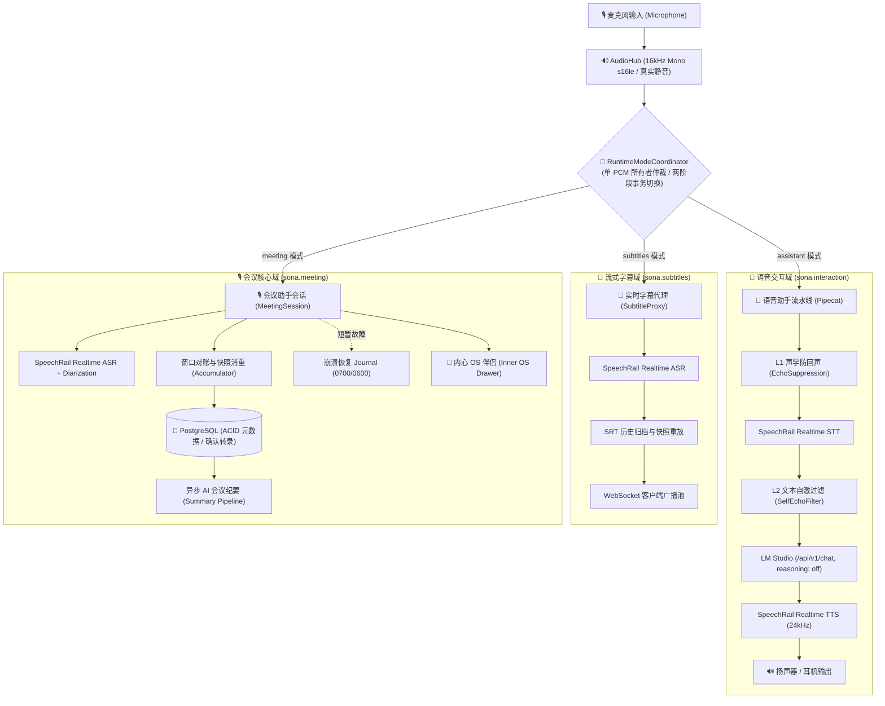

# Sona (sona)

<p align="center">
  
</p>

<p align="center">
  <strong>全本地、端到端、低延迟的实时语音交互 + 智能会议助手 + 实时语音字幕系统</strong>
</p>

<p align="center">
  <em>专为 Apple Silicon / macOS 打造 • 中文优先 • 100% 离线隐私安全 • 整洁架构</em>
</p>

<p align="center">
  <a href="https://www.python.org/downloads/"></a>
  <a href="https://developer.apple.com/macos/"></a>
  <a href="LICENSE"></a>
  <a href="https://github.com/astral-sh/ruff"></a>
  <a href="https://mypy.readthedocs.io/"></a>
  <a href="tests/"></a>
  <a href="ui/"></a>
  <a href="CONTRIBUTING.md"></a>
</p>

<p align="center">
  <a href="#-核心特性">✨ 核心特性</a> •
  <a href="#️-系统架构与数据流">🏗️ 系统架构</a> •
  <a href="#-软硬件要求">💻 软硬件要求</a> •
  <a href="#-5-分钟快速上手">🚀 快速上手</a> •
  <a href="#️-sona-控制台使用指南">🖥️ 控制台指南</a> •
  <a href="#️-核心配置项与环境变量">⚙️ 配置说明</a> •
  <a href="#️-质量门禁与工程规范">🛡️ 质量门禁</a> •
  <a href="#-深入技术文档">📖 文档索引</a>
</p>

---

> 💡 **语源寓意**：`Sona` 源自拉丁语动词 *sonāre*（名词格/祈使语态，意为「**发出声音、回响、共鸣**」），象征着声音在人与机器之间的自然流转与智慧共振。

---

## 🌟 核心特性

### 🤖 全双工实时语音助手 (Voice Assistant)
- **毫秒级极速流式交互**：集成 SpeechRail OpenAI Realtime 流式 ASR + 本地大语言模型（LM Studio 原生 `/api/v1/chat`）+ SpeechRail 24kHz Realtime TTS，告别死板的单向对讲机体验。
- **坚固的双层声学防回声死循环防线**：
  - **L1** `EchoSuppressionProcessor`：外放播报期间自动抑制收音；打断时启用动态峰值包络与快慢 EMA 自适应能量门限（`gain=2.5`）。
  - **L2** `BotTextRecorder` + `SelfEchoFilter`：计算用户转写与近期机器人播报内容的相似度（$\ge 0.7$ 或子串覆盖即吞帧），彻底阻断外放环境下的“自我回复死循环”。
- **灵活双工模式**：支持「🔊 外放保护」（播报时自动抑麦，防误触）与「🎧 耳机全双工」（随时自然插话打断 Barge-in）。
- **长会话上下文智能滚动压缩 (ADR-003)**：基于 LM Studio 原生 Token 计数平滑压缩历史对话，在保证关键事实记忆的同时实现无感长聊。

### 🎙️ 智能会议助手 (Meeting Assistant)
- **实时说话人分离与动态重命名**：无缝对接 SpeechRail diarization profile（Sortformer），会议期间实时呈现匿名发言人标签；支持会后/会中随时重命名发言人。
- **PostgreSQL ACID 可靠持久化**：全量确认转录记录与元数据入库存储，**绝不在数据库或磁盘落地原始音频**，充分保护隐私；内置 `0700/0600` 权限的崩溃恢复 Journal。
- **异步 AI 结构化纪要**：会议结束自动执行 EOF 优雅冲刷，后台调度本地 LLM 异步生成包含「议题大纲、核心讨论、关键决策、待办事项 (Action Items)」的高质量纪要。
- **一键导出**：支持一键导出结构化 Markdown 会议纪要与带说话人时间戳的精确 SRT 字幕文件。

### 🧠 会中内心 OS 伴侣 (Inner OS)
- **会中私密智能外脑**：按下 `Cmd + K` 呼出侧边抽屉，实时获取局势研判、观点核查、反驳建议与回应草稿。
- **会后即焚原则**：底牌与会中分析默认驻留在浏览器内存中，会议结束自动销毁，严防商业与个人机密外泄。

### 📝 实时流式字幕 (Live Subtitles)
- **低延迟流式上屏**：窗口式流式识别呈现，支持 PCM 活跃快照重连重放机制，断线不丢字。
- **独立运行与无缝联动**：切换至字幕页面时系统自动挂起语音交互链路，独占麦克风保证转录纯净度。

### 🔒 100% 离线与隐私保护 (Privacy-First)
- **零云端依赖**：无需联网、不消耗任何第三方 API Token、零外部数据遥测，全链路音频、文本与模型权重 100% 留在 Apple Silicon 本地。

---

## 🏗️ 系统架构与数据流

Sona 严格遵循 **Clean Architecture（整洁架构）**，采用 **单音频源独占采集 + 有界扇出 + 两阶段状态机模式仲裁** 的系统设计：



### 代码包分层结构 (Clean Architecture)

```text
src/sona/
├── asr/                 # 【领域层】ASR 领域契约、窗口模型与结果呈现 (contracts, models, presenters)
├── subtitles/           # 【领域层】实时字幕与流式转录核心业务 (proxy, archive, sessions, clients)
├── meeting/             # 【领域层】会议状态机、窗口对账、PostgreSQL 持久化、内心 OS
│   ├── summary/         #   └── 模块化 AI 纪要流水线 (errors, prompt_builder, chunker, gateway, service)
│   └── runtime_mode.py  #   └── 运行时模式协调器 (RuntimeModeCoordinator)
├── config/              # 【配置层】高内聚领域强类型配置 (audio, interaction, subtitles, meeting, ui, lm_studio)
├── speechrail/          # 【基础设施层】SpeechRail 公共协议客户端与适配器 (transcriber, stt_processor, tts, transport)
├── interaction/         # 【应用层】语音助手 Pipecat 管道、双层防回声、上下文滚动压缩与执行器
├── audio/               # 【基础设施层】AudioHub 麦克风独占采集、有界 Sink 扇出与硬件设备探测
└── ui/                  # 【接入层】Sona Web 控制台、模式协调器绑定、FastAPI 路由与控制 WebSocket
```

---

## 💻 软硬件要求

| 维度 | 规格与推荐配置 | 说明 |
|---|---|---|
| **硬件平台** | **Apple Silicon Mac**（M1 / M2 / M3 / M4 / M5） | 深度优化 Metal / MPS 推理加速 |
| **统一内存 (RAM)** | 推荐 **32GB 及以上**；16GB/24GB 亦可运行小模型 | 语音交互与会议纪要可共用同一模型，无需两套大模型常驻 |
| **操作系统** | **macOS 14.0+**（Sonoma 或 Sequoia） | 物理输出采集 Helper 要求 macOS 14.2+ |
| **Python 版本** | **`Python >=3.12,<3.13`**（严格锁定 3.12） | 保证 PyAudio、Torch 与 Pipecat 原生兼容性 |
| **依赖管理工具** | [`uv`](https://docs.astral.sh/uv/)（极速 Rust 编写的 Python 依赖管理工具） | 严禁直接使用全局 pip 混用污染环境 |
| **数据库** | **PostgreSQL 14+** | 用于会议助手持久化存储（不存音频，仅存结构化数据） |
| **前端工具** | **Node.js 18+ & npm** | 用于构建 React 19 + TypeScript + Vite 7 前端控制台 |
| **本地 LLM 服务** | [LM Studio](https://lmstudio.ai/) 0.3+（开启本地 Server `localhost:1234`） | 推荐模型：`qwen/qwen3.6-35b-a3b` 或 `qwen2.5-7b/14b` |
| **ASR/TTS 引擎** | [SpeechRail](https://github.com/hrygo/SpeechRail)（端口 `8201`） | 负责 Qwen3-ASR / Diarization / Qwen3-TTS 物理推理 |

---

## 🚀 5 分钟快速上手

### 步骤 1：克隆仓库与安装全量依赖

```bash
# 1. 克隆代码仓库
git clone https://github.com/your-username/sona.git
cd sona

# 2. 一键安装 Python 全量依赖 (包含 interaction 与 dev 组)
uv sync --all-extras

# 3. 安装前端依赖并构建生产静态资源
cd ui && npm install && npm run build && cd ..
```

### 步骤 2：初始化运行数据与环境

```bash
# 下载 NLTK punkt_tab 分词数据 (TTS 断句必需)
bash scripts/install-nltk-data.sh
```

> ⚠️ **启动前依赖检查**：
> 1. 确保独立 **SpeechRail** 服务已启动，且 `curl http://127.0.0.1:8201/health` 返回 `200 OK`；
> 2. 如需多人会议分人，确保 SpeechRail 已配置 Diarization 模型（如 Sortformer）。

### 步骤 3：初始化 PostgreSQL 数据库

```bash
# 初始化 sona 专用数据库角色与独立 schema (默认 DSN 为 postgresql:///knowledge)
psql knowledge -f scripts/bootstrap-meeting-db.sql
```

### 步骤 4：配置并启动 LM Studio

1. 打开 **LM Studio**，下载并加载推荐模型（例如 `qwen/qwen3.6-35b-a3b`）；
2. 启动 Local Server，监听 `127.0.0.1:1234`；
3. **重要提示**：确保关闭深度思考模式（`reasoning: "off"`），以获得毫秒级首字吐词延迟。

### 步骤 5：启动 Sona 服务

```bash
# 推荐：一键启动完整控制台与服务 (默认绑定 127.0.0.1)
scripts/run-all.sh

# 支持局域网或内网设备访问模式
SONA_BIND_HOST=lan scripts/run-all.sh
```

### 步骤 6：打开控制台

在浏览器中访问：👉 **`http://127.0.0.1:8100`**

---

## 🖥️ Sona 控制台使用指南

Sona 提供了现代化响应式设计、支持深浅双色无障碍高对比度（WCAG 2.1 AA/AAA）的交互界面：

### 1. 🤖 语音助手工作区 (`⌘ + 1`)
- **自然对话**：对着麦克风说话，Silero VAD 自动检测静音端点，流式大模型即刻作答并驱动 SpeechRail 进行 24kHz 高品质声音合成。
- **打断 (Barge-in)**：在佩戴耳机时切至「🎧 耳机双工」，说话即可自然打断机器人播报。
- **音色与人设定制**：控制栏支持请求级切换音色预设（`default` / `warm` / `bright` / `calm`）与多重预设角色。

### 2. 🎙️ 会议助手工作区 (`⌘ + 2`)
- **一键录制**：点击「开始会议」，系统无缝暂停语音助手链路，独占麦克风进行流式转录。
- **发言人实时识别**：动态呈现匿名发言人（如 `Speaker 1`、`Speaker 2`），支持在面板中点击发言人直接自定义姓名。
- **EOF 优雅冲刷**：点击「结束会议」，系统发送 commit EOF 信号，等待最后一片音频转录闭合后再封存数据。
- **Markdown 纪要生成**：后台自动执行分块摘要与全篇归纳，自动提炼出「会议议题、讨论核心、达成决议、待办清单」。

### 3. 🧠 会中内心 OS (`⌘ + K`)
- **专属决策参谋**：在会议界面任意时刻按下快捷键呼出侧边抽屉。
- **实时研判与草稿**：基于最近对话流，快速点击「局势研判」、「事实核查」或「回应草稿」，获取针对性的发言对策。
- **会后即焚保护**：所有研判卡片均驻留在瞬态内存中，会议结束后自动清理。

### 4. 📝 实时流式字幕 (`⌘ + 3`)
- **无感全屏跟读**：纯净全屏展示，支持声学波形动态跳动、实时自动滚屏与暂停定位。
- **断线自愈与导出**：内置重连 PCM 快照重放机制，支持一键下载标准 `.srt` 字幕。

### 5. ⌨️ 全局快捷键清单

| 快捷键 | 功能描述 |
|---|---|
| `⌘ + 1` / `Ctrl + 1` | 切换至 **语音助手** 视图 |
| `⌘ + 2` / `Ctrl + 2` | 切换至 **会议助手** 视图 |
| `⌘ + 3` / `Ctrl + 3` | 切换至 **实时字幕** 视图 |
| `⌘ + K` / `Ctrl + K` | 在会议助手中呼出 / 收起 **内心 OS 伴侣面板** |
| `?` | 弹出全局快捷键帮助浮层 |
| `Esc` | 在历史记录回溯中快速返回当前主录制视图 |

---

## ⚙️ 核心配置项与环境变量

系统基于模块化 `pydantic-settings` 管理配置，支持在 `.env` 中覆写：

| 领域分类 | 环境变量 | 默认值 | 说明 |
|---|---|---|---|
| **网络绑定** | `SONA_BIND_HOST` | `127.0.0.1` | 服务绑定模式：`127.0.0.1` (仅本机) / `lan` (局域网) / `0.0.0.0` |
| **Web 界面** | `SONA_UI_PORT` | `8100` | Sona Web 控制台监听端口 |
| **SpeechRail** | `SONA_SUBTITLE_SPEECHRAIL_URL` | `ws://127.0.0.1:8201/v1/realtime` | 字幕与会议 ASR 使用的 WebSocket 地址 |
| | `SONA_INTERACTION_SPEECHRAIL_REALTIME_URL` | `ws://127.0.0.1:8201/v1/realtime` | 语音助手 ASR/TTS 使用的 WebSocket 地址 |
| | `SONA_INTERACTION_TTS_VOICE` | `default` | 默认合成音色预设 (`default` / `warm` / `bright` / `calm`) |
| | `SONA_INTERACTION_SPEECHRAIL_API_KEY` | 空 | SpeechRail 鉴权密钥 (如有) |
| **LM Studio** | `SONA_INTERACTION_LLM_BASE_URL` | `http://localhost:1234/v1` | LM Studio 服务根地址 |
| | `SONA_INTERACTION_LLM_MODEL` | `local/kat-coder-2.5` | 交互助手与会议纪要模型名称 |
| | `SONA_INTERACTION_LLM_API_KEY` | `lm-studio` | LM Studio 授权密钥 |
| **会议持久化** | `SONA_MEETING_DATABASE_URL` | `postgresql://sona_app@/knowledge`| PostgreSQL 数据库连接 DSN |
| | `SONA_MEETING_SCHEMA` | `sona` | 会议表所在 Schema |
| **音频与双工** | `SONA_INTERACTION_DUPLEX_MODE` | `speaker_focus` | 默认双工模式 (`speaker_focus` 外放保护 / `headphone_duplex` 耳机双工) |
| | `SONA_INTERACTION_INPUT_DEVICE_NAME` | 空 (系统默认) | 指定麦克风物理硬件名称或名称片段 |

---

## 🛡️ 质量门禁与工程规范

Sona 坚持高标准的自动化工程测试规范，提交代码或发布前，**必须保证以下五重质量门禁全部通过**：

```bash
# 1. 运行全量后端单元测试与集成测试 (硬性覆盖率门禁: fail_under >= 80%)
SONA_TEST_DATABASE_URL=postgresql:///knowledge uv run pytest tests/

# 2. Python Strict 模式静态类型检查 (100 个核心模块 0 错误)
uv run mypy src/

# 3. Python 代码风格与 Lint 检查
uv run ruff check src/ tests/

# 4. 前端单元与组件渲染测试
cd ui && npm test -- --run

# 5. 前端 TypeScript 类型检查与生产构建
cd ui && npm run build
```

---

## ❓ 常见问题排查 (FAQ)

<details>
<summary><b>Q1: 为什么要求 LM Studio 必须关闭推理 (reasoning: "off")？</b></summary>

在全双工实时语音交互场景中，大模型的思考过程（`<think>...</think>`）会导致首字延迟（TTFT）延长 2~5 秒以上，使对话失去即时感。Sona 封装了 LM Studio 原生 `/api/v1/chat` 端点，强制锁定 `reasoning: "off"`，实现毫秒级的极速首字输出。
</details>

<details>
<summary><b>Q2: 麦克风无法收音或提示 Permission Denied 怎么处理？</b></summary>

请打开 macOS 的 **「系统设置」➔「隐私与安全性」➔「麦克风」**，确认当前运行 Sona 的终端（Terminal、iTerm2、VS Code 等）已获得麦克风访问权限。
</details>

<details>
<summary><b>Q3: 如何在无界面的轻量终端环境 (Headless) 下运行？</b></summary>

Sona 提供了专门的命令行交互入口。在停止 `sona-ui` 后执行：
```bash
uv run sona-interact
```
两者通过跨进程独占文件锁自动互斥，确保麦克风资源安全。
</details>

<details>
<summary><b>Q4: 离线断网环境下是否能完全正常运行？</b></summary>

可以。Sona 严格贯彻离线优先设计（`allow_model_downloads=False`）。所有的 ASR、Diarization 与 TTS 运行时模型快照均由 SpeechRail 独立管理，LM Studio 模型存放于本地，无需任何公网通信。
</details>

---

## 📑 深入技术文档

深入阅读完整的技术方案、时序图与架构设计决策：

- 🧭 [**Sona 文档中心总览**](docs/README.md)
- 🏗️ [**系统总体架构与详细设计方案**](docs/architecture/系统总体架构与详细设计方案.md)
- 📐 [**Sona 核心架构重构方案与实施路径**](docs/architecture/Sona-核心架构重构方案与实施路径.md)
- 📖 [实时语音交互与字幕-方案与最佳实践](docs/architecture/实时语音交互与字幕-方案与最佳实践.md)
- 📖 [声学防回声与全双工交互设计方案](docs/architecture/声学防回声与全双工交互设计方案.md)
- 📖 [会议助手后端运行与前后端联调手册](docs/manuals/会议助手后端运行与前后端联调.md)
- 📖 [SpeechRail Realtime v2 语音转文字对接手册](docs/manuals/SpeechRail-Realtime-v2-语音转文字开发对接手册.md)
- 📝 [架构决策记录 (ADR-001 ~ ADR-012)](docs/decisions/)
- 🤝 [**贡献指南 (Contributing Guide)**](CONTRIBUTING.md)

---

## 📄 开源许可证

本项目遵循 [MIT License](LICENSE) 开源许可证。
