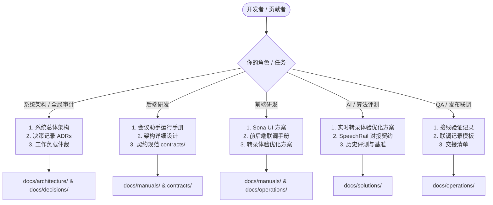

# 📚 Sona 文档中心

> 💡 **语源寓意**：`Sona` 源自拉丁语 *sonāre*（意为「**发出声音、回响、共鸣**」）。  
> 欢迎来到 **Sona** 技术文档中心。本项目是一套面向 Apple Silicon 硬件定制的全本地离线、超低延迟实时语音交互（Voice Assistant）、结构化会议助手（Meeting Assistant，含 SpeechRail diarization / PostgreSQL 持久化 / 异步 AI 纪要 / 崩溃恢复 Journal）与实时语音字幕（Live Subtitles）系统。

## 当前实现基线（2026-09-01）

以下规则优先于历史方案、评测记录和早期实现说明：

- ASR 与 TTS 的模型、profile、进程和健康状态均由独立 SpeechRail 服务管理，默认地址为 `127.0.0.1:8201`。
- `sona` 只通过 SpeechRail **OpenAI Realtime (`/v1/realtime`) / REST** 客户端消费能力：字幕与会议使用 ASR OpenAI Realtime，语音助手使用 SpeechRail STT/TTS 与 LM Studio；仓库内不再运行本地 ASR/TTS worker、WhisperLiveKit 或旧 TTS bridge。
- `scripts/run-all.sh` 只启动 `sona-ui`；SpeechRail 必须单独启动并准备所需 snapshot/profile。Realtime 当前为不可透明恢复的会话，断线后由应用创建新会话并执行 source epoch/窗口对账。
- 会议分人使用 SpeechRail diarization 的匿名 speaker group，应用侧仅负责平滑、会议作用域 remap 和持久化映射；本仓库不再运行本地 CAM++/AHC 声纹运行时。
- “当前已实现”与“外部 SpeechRail 部署/模型的真实端到端验收”分开记录；未完成外部服务验收的内容不得写成已验证基线。

---

## 🚦 文档生命周期状态对照表（Status Legend）

为了清晰标识每篇文档的权威性与工程效力，本项目所有技术文档均在 YAML Frontmatter 中显式声明 `status`：

| 状态徽标 | 状态代码 (`status`) | 适用场景与定义 | 权威效力 |
|---|---|---|---|
| 🟢 **Active** | `active` | 核心系统架构、接口对接手册、当前生效的专项设计 | **权威基线**：当前系统正在运行和遵循的唯一事实源 |
| 🔵 **Accepted** | `accepted` | 架构决策记录 (ADRs) | **决策定稿**：团队已正式评审并批准采纳的技术决议 |
| 🟣 **Implemented** | `implemented` | 故障排障方案、已完成上线的规格设计与研发执行计划 | **已落地**：方案在代码库中已完全实现并验证通过 |
| 🟡 **Completed** | `completed` | 科学评测报告、联调验证记录、交接清单 | **已完成**：测试/评测/验收动作已结束，结论已归档 |
| ⚪ **Template** | `template` | 联调记录模板、报告模板 | **通用模板**：供后续发布/联调流程复用的标准模板 |
| 📦 **Archived** | `archived` | 历史预检数据集、探索性实验记录、早期演进文档 | **历史归档**：供技术溯源参考，不作为当前执行基线 |
| 🟠 **Draft / Review** | `draft` / `under_review` | 方案初稿、跨团队评审签署中的草案 | **非正式**：尚处于评审讨论阶段，尚未进入主线 |

---

## 🗺️ 文档目录结构分层体系

```text
docs/
├── README.md                              # 🧭 本文档：文档中心总览与索引导航矩阵
│
├── architecture/                          # 🏗️ 系统总体架构与核心子系统设计
│   ├── 系统总体架构与详细设计方案.md       # 系统总体逻辑/物理架构、时序流与模块规范 (v2.2)
│   ├── Sona-核心架构重构方案与实施路径.md   # 核心架构治理、纪要解耦、包治理与实施路线图 (v1.0)
│   ├── 全链路语音交互与会议助手-技术方案与实施方案.md # 全链路端到端总体方案、前沿调研与实施路线图
│   ├── 实时语音交互与字幕-方案与最佳实践.md # 实时语音交互/字幕架构与单 PCM owner 仲裁契约
│   └── 声学防回声与全双工交互设计方案.md   # 已落地后端 L1/L2 防回声与外放免提全双工边界
│
├── solutions/                             # 💡 专项技术方案与深度设计
│   ├── 会议模式多说话人精准识别与声纹聚类技术方案.md # 历史本地声纹方案（已归档）；当前实现见 SpeechRail diarization
│   ├── 会议助手实时转录体验优化方案.md     # 确认/修订/暂存状态分层、段落聚合与阅读视图优化
│   └── Fun-ASR与现有ASR后端科学对比测试方案.md # SpeechRail 迁移前的 ASR 序贯盲测历史报告 (v1.3)
│
├── manuals/                               # 📖 开发对接与运行手册
│   ├── SpeechRail-Realtime-v2-语音转文字开发对接手册.md # SpeechRail Realtime v2 对接手册（已归档；当前基线为 OpenAI `/v1/realtime`）
│   ├── Qwen3-ASR-实时语音转文字开发对接手册.md # 历史兼容入口（已归档）
│   ├── 会议助手后端运行与前后端联调.md     # PostgreSQL环境准备、后端启动与前后端联调规范
│   ├── Sona-UI-设计方案.md        # 前端控制台架构设计、组件状态机与交互契约
│   └── 物理输出音频采集验收手册.md         # Helper 自动化门禁、人工 capture 与设备矩阵验收
│
├── operations/                            # 📋 协作交接、联调记录与排障分析
│   ├── 会议助手前后端分离式开发准备方案.md # 契约优先前后端分离路线与开发准备方案
│   ├── 会议助手前后端分离工作交接清单.md   # C0/B1/D1/F1/Q1 五类工作包交接清单与验收基准
│   ├── 前后端接线验证记录-2026-08-26.md    # 2026-08-26 前后端联调接线验证记录
│   ├── 联调记录模板.md                    # 标准前后端联调验收记录模板
│   ├── SpeechRail-OpenAI标准协议功能需求交割单.md # sona→SpeechRail 的 OpenAI 标准协议功能需求交割单
│   └── 语音交互打断后推理挂起故障排查与修复方案.md # Barge-in 打断导致 LM Studio 挂起故障排障与修复
│
├── decisions/                             # 📝 架构决策记录 (ADR-001 ~ ADR-012)
│   ├── 0001-single-owner-interaction-runtime.md
│   ├── 0002-lm-studio-stateful-chat-context.md
│   ├── 0003-lm-studio-context-compaction.md
│   ├── 0004-asr-sequential-evaluation.md
│   ├── 0005-server-side-runtime-workload-arbitration.md
│   ├── 0006-contract-first-meeting-assistant-separation.md
│   ├── 0007-bounded-meeting-summary-generation.md
│   ├── 0008-speaker-diarization-and-voiceprint-clustering.md
│   ├── 0009-shared-local-inference-platform.md
│   ├── 0010-physical-output-audio-capture.md
│   ├── 0011-speechrail-only-asr.md
│   └── 0012-speechrail-realtime-tts.md
│
└── superpowers/                           # ⚡ 历史执行计划与规格 (Plans & Specs 归档)
    ├── plans/                             # 研发执行计划 (14 份，含当前草案与历史归档)
    └── specs/                             # 设计规格 (12 份，含当前评审稿与历史归档)
```

---

## 🧭 按角色快速导航路径



---

## 📑 全量文档索引矩阵

### 标题规范

文档的一级标题和 Frontmatter `title` 使用稳定的规范名称，不混入日期、版本号、生命周期状态或“重构版”“优化版”“历史文件名”等过程标签。日期、版本和状态应分别放入 Frontmatter、正文元数据或文件名；只有验收记录、基准报告等本身以版本或日期区分的记录型文档，才在标题中保留必要的识别信息。

### 1. 系统总体架构与核心子系统 (`docs/architecture/`)

| 文档名称 | 状态 | 类型 | 版本 | 核心内容与设计要点 |
|---|---|---|---|---|
| [系统总体架构与详细设计方案](architecture/系统总体架构与详细设计方案.md) | 🟢 `active` | `architecture` | `v2.2` | **权威总体架构**：SpeechRail ASR/TTS 拓扑、分层架构、交互/字幕/会议/控制端到端时序与详细设计规范 |
| [Sona 核心架构重构方案与实施路径](architecture/Sona-核心架构重构方案与实施路径.md) | 🟢 `active` | `architecture` | `v1.0.0` | **架构重构规范**：核心架构治理、纪要解耦、包治理与三阶段渐进式重构实施路线图 |
| [全链路语音交互与会议助手-技术方案与实施方案](architecture/全链路语音交互与会议助手-技术方案与实施方案.md) | 🟢 `active` | `architecture` | `v1.0.0` | **完整技术方案与实施路径**：SpeechRail 边界、断句/分人/对账、前沿调研、ROI 与阶段落地 |
| [实时语音交互与字幕-方案与最佳实践](architecture/实时语音交互与字幕-方案与最佳实践.md) | 🟢 `active` | `architecture` | `v2.1` | SpeechRail OpenAI Realtime `/v1/realtime` 语音交互与字幕技术方案、单 PCM owner 仲裁契约及验收边界 |
| [声学防回声与全双工交互设计方案](architecture/声学防回声与全双工交互设计方案.md) | 🟣 `implemented` | `architecture` | `v1.1` | 后端 L1/L2 防回声与 SubtitleProxy 音频门控；UI 融合仍标注为后续设计项 |

### 2. 专项技术方案与深度设计 (`docs/solutions/`)

| 文档名称 | 状态 | 类型 | 版本 | 核心内容与设计要点 |
|---|---|---|---|---|
| [会议模式多说话人精准识别与声纹聚类技术方案](solutions/会议模式多说话人精准识别与声纹聚类技术方案.md) | 📦 `archived` | `domain_solution` | `v1.0` | 历史本地 CAM++/AHC 方案；当前实现为 SpeechRail diarization + 平滑/remap，详见总体架构与 ADR-0011 |
| [会议助手实时转录体验优化方案](solutions/会议助手实时转录体验优化方案.md) | 🟢 `active` | `domain_solution` | `v1.0` | 实时 ASR 状态分层、段落聚合、断线乱序状态一致性与阅读体验优化 |
| [Fun-ASR与现有ASR后端科学对比测试方案](solutions/Fun-ASR与现有ASR后端科学对比测试方案.md) | 🟡 `completed` | `benchmark_report` | `v1.3` | SpeechRail 迁移前的 Qwen3-ASR / Fun-ASR / SenseVoiceSmall 序贯盲测历史报告（Core 已触发 futility） |

### 3. 开发对接与运行手册 (`docs/manuals/`)

| 文档名称 | 状态 | 类型 | 版本 | 核心内容与设计要点 |
|---|---|---|---|---|
| [SpeechRail Realtime v2 语音转文字开发对接手册](manuals/SpeechRail-Realtime-v2-语音转文字开发对接手册.md) | 📦 `archived` | `manual` | `v2.0` | **历史**：SpeechRail Realtime v2 对接手册；已被 OpenAI `/v1/realtime` 基线取代，当前基线见[功能需求交割单](operations/SpeechRail-OpenAI标准协议功能需求交割单.md) |
| [会议助手后端运行与前后端联调手册](manuals/会议助手后端运行与前后端联调.md) | 🟢 `active` | `manual` | `v1.1` | SpeechRail 独立依赖、会议运行手册、PostgreSQL 数据库准备、接口定义与前后端联调规范 |
| [Sona UI 设计方案](manuals/Sona-UI-设计方案.md) | 🟢 `active` | `guide` | `v1.1` | 前端控制台架构设计、SpeechRail 事件展示、单源麦克风控制面、组件状态机与交互契约 |
| [Sona 会议助手『内心 OS』前端 UI/UX 设计方案](manuals/Sona-会议助手-内心OS-UI-UX-设计方案.md) | 🟢 `active` | `specification` | `v1.0` | **内心 OS 专属设计方案**：私密副驾驶信息架构、事实/判断/草稿三层卡片、证据定位与状态机 |
| [物理输出音频采集验收手册](manuals/物理输出音频采集验收手册.md) | 🟠 `under_review` | `manual` | `v1.0` | 物理输出 Helper 自动化门禁、显式 30 秒 capture、隐私边界与全设备矩阵 |

### 4. 协作交接、联调记录与排障 (`docs/operations/`)

| 文档名称 | 状态 | 类型 | 版本 | 核心内容与设计要点 |
|---|---|---|---|---|
| [会议助手前后端分离式开发准备方案](operations/会议助手前后端分离式开发准备方案.md) | 🟡 `completed` | `technical_spec` | `v1.1` | 契约优先前后端分离路线、SpeechRail 适配边界、接口版本化与团队开发边界 |
| [会议助手前后端分离工作交接清单](operations/会议助手前后端分离工作交接清单.md) | 🟡 `completed` | `guide` | `v1.1` | C0/B1/D1/F1/Q1 五类工作包交接资料、SpeechRail 依赖边界、验收物与交接清单 |
| [前后端接线验证记录 (2026-08-26)](operations/前后端接线验证记录-2026-08-26.md) | 🟡 `completed` | `test_record` | `v1.0` | 会议助手前后端分离接线联调验证记录、测试结果矩阵与验收结论 |
| [会议助手前后端分离联调记录模板](operations/联调记录模板.md) | ⚪ `template` | `template` | `v1.0` | 每次契约/后端/前端版本发布前执行联调验收的标准记录模板 |
| [SpeechRail-OpenAI标准协议功能需求交割单](operations/SpeechRail-OpenAI标准协议功能需求交割单.md) | ✅ `completed` | `technical_spec` | `v1.0` | **sona → SpeechRail 交割单**：OpenAI 兼容实时协议已覆盖流式 ASR 分人/TTS/取消/EOF，`/v2/realtime` 已移除 |
| [语音交互打断后推理挂起故障排查与修复方案](operations/语音交互打断后推理挂起故障排查与修复方案.md) | 🟣 `implemented` | `postmortem` | `v1.1` | SpeechRail 迁移前发生的 Barge-in 故障记录；EchoState、取消与状态机修复仍适用于当前链路 |
| [语音助手 TTS 爆音排查与验收手册](operations/语音助手-TTS-爆音排查与验收.md) | 🟢 `active` | `manual` | `v1.0` | 语音助手 CoreAudio overload 与长播报爆音排查、设备原生采样率/40ms 显式缓冲验收规范与回退机制 |

### 5. 架构决策记录 (`docs/decisions/`)

| ADR 编号 | 决策标题 | 状态 | 日期 | 核心决策要点 |
|---|---|---|---|---|
| [ADR-001](decisions/0001-single-owner-interaction-runtime.md) | 交互管道采用单一所有者运行时 | 🔵 `accepted` | 2026-08-20 | `sona-ui` 为交互管道唯一所有者，`sona-interact` 为互斥 headless 替代入口 |
| [ADR-002](decisions/0002-lm-studio-stateful-chat-context.md) | LM Studio 交互上下文采用原生有状态会话链 | 🔵 `accepted` | 2026-08-21 | 废弃 OpenAI 兼容端点，改用原生 `/api/v1/chat` + `reasoning: "off"` |
| [ADR-003](decisions/0003-lm-studio-context-compaction.md) | LM Studio 长会话采用结构化记忆预热与原子换链 | 🔵 `accepted` | 2026-08-21 | 基于输入 token 与 TTFT 动态监控，结构化摘要预热新链并原子换链 |
| [ADR-004](decisions/0004-asr-sequential-evaluation.md) | ASR 选型采用两阶段序贯盲测与 Finalist-Only 验收 | 🔵 `accepted` | 2026-08-24 | SpeechRail 迁移前的评测流程决策；当前运行时选型以 ADR-0011 为准 |
| [ADR-005](decisions/0005-server-side-runtime-workload-arbitration.md) | 服务端状态机统一仲裁语音推理工作负载 | 🔵 `accepted` | 2026-08-25 | `RuntimeModeCoordinator` 四模式状态机与单 PCM 所有者仲裁 |
| [ADR-006](decisions/0006-contract-first-meeting-assistant-separation.md) | 以契约优先支持会议助手前后端团队分离 | 🔵 `accepted` | 2026-08-26 | 单仓架构下以 `contracts/` 目录为唯一事实源，分离生产与消费 |
| [ADR-007](decisions/0007-bounded-meeting-summary-generation.md) | AI 会议纪要采用有界分段生成与服务端事件收敛 | 🔵 `accepted` | 2026-08-26 | 建立多层超时、字符熔断与 `output_limit` 边界，防止无限生成 |
| [ADR-008](decisions/0008-speaker-diarization-and-voiceprint-clustering.md) | 会议模式多说话人精准识别与声纹聚类 | 🔵 `accepted` | 2026-08-27 | 历史本地 CAM++/AHC 方案；当前运行时由 ADR-0011 的 SpeechRail diarization 路径替代 |
| [ADR-009](decisions/0009-shared-local-inference-platform.md) | LM Studio 原生协议与本地推理准入采用跨业务公共层 | 🔵 `accepted` | 2026-08-27 | 统一 SSE 语义、配置所有权、优先级调度和 Inner OS 边界 |
| [ADR-010](decisions/0010-physical-output-audio-capture.md) | 本地物理输出音频采用设备绑定的 Core Audio Tap 原生采集 | 🔵 `accepted` | 2026-08-31 | 原生 Helper、设备级作用域、双源混音与单 PCM 推理所有者 |
| [ADR-011](decisions/0011-speechrail-only-asr.md) | ASR 运行时统一由 SpeechRail 提供 | 🔵 `accepted` | 2026-08-31 | 移除本地 ASR worker/WhisperLiveKit；字幕、会议与交互统一使用 SpeechRail OpenAI Realtime `/v1/realtime` |
| [ADR-012](decisions/0012-speechrail-realtime-tts.md) | TTS 运行时统一由 SpeechRail 提供 | 🔵 `accepted` | 2026-09-01 | 移除旧 TTS bridge 与本地 TTS 运行时，应用负责播放、取消和回声状态协调 |

### 6. 历史计划与设计规格归档 (`docs/superpowers/`)

| 目录 | 数量 | 状态 | 说明 |
|---|---|---|---|
| [superpowers/plans/](superpowers/plans/) | 执行计划集合 | 🟠 `draft` / 🟣 `implemented` | 当前研发计划与历史功能迭代任务清单；P0 见[音频源基础设施实施计划](superpowers/plans/2026-08-31-audio-source-foundation.md)，当前进入[P1 物理输出 Helper 实施计划](superpowers/plans/2026-08-31-physical-output-helper.md) |
| [superpowers/specs/](superpowers/specs/) | 12 份设计规格 | 🟠 `under_review` / 🟣 `implemented` | 当前评审规格与历史技术整改设计及验证标准；新增[本地物理输出设备音频采集设计](superpowers/specs/2026-08-31-physical-output-audio-capture-design.md) |

物理输出采集当前处于 P1 原生 Helper 阶段：IPC v1 契约位于
[`contracts/audio-capture/v1/`](../contracts/audio-capture/v1/)，`.app` 构建与无权限静态/枚举检查入口为
`scripts/build-audio-capture-helper.sh` 和 `scripts/test-audio-capture-helper.sh`。该阶段不增加页面来源选择，
也不改变会议、字幕和 PostgreSQL 数据边界；产品仍使用麦克风作为唯一业务输入。

---

## 📋 文档撰写与元数据最佳实践规范

新增或修改文档时，请务必在文档第一行声明规范的 YAML Frontmatter：

```yaml
---
title: "文档中文标题"
description: "文档一句话核心功能与摘要说明"
status: active | draft | under_review | accepted | implemented | completed | template | archived
type: architecture | domain_solution | technical_spec | manual | guide | decision_record | benchmark_report | test_record | postmortem | template | execution_plan
category: architecture | meeting | interaction | subtitles | asr | tts | frontend | quality_assurance
version: "1.0.0"        # 语义化版本（若适用）
date: 2026-08-27        # 创建日期
last_updated: 2026-08-27# 最后维护日期
author: "Voice Realtime Core Team"
owners:
  - "sona-core"
tags:
  - sona
  - keyword1
scope:
  - "sona.module"
related_documents:
  - "docs/architecture/系统总体架构与详细设计方案.md"
contracts:              # 若涉及前后端或外部通信协议
  - "contracts/meeting-assistant/v1/"
---
```
