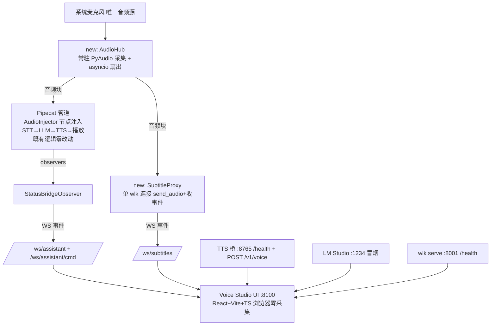

# Voice Studio — UI 设计方案（定稿 v3，2026-08-18）

> 一体化 Web 控制台，整合两大模块：**语音助手**（Pipecat 交互管道）与**实时字幕**（WhisperLiveKit）。
> 本方案已调研定稿（wlk 官方 UI 生态 / Pipecat 1.7 observer API / 前端框架选型），三点关键决策全部拍板：
> 前端 **React + Vite + TS**、音频采集 **系统级单源扇出（AudioHub）**、控制面 **扩展集（含人格编辑 + 音色切换）**。

---

## 1. 背景与目标

当前两个模块均为纯终端运行、无可视化界面：

| 模块 | 现状 | UI 缺口 |
|---|---|---|
| 语音助手 | Pipecat 管道（STT→LLM→TTS，终端日志） | 无对话视图、无 VAD/思考/说话状态、无控制面 |
| 实时字幕 | `wlk serve`(8001) + `SubtitleStream` 事件（仅打印） | 无浏览器展示、无 SRT 导出 |

目标：一套单页控制台（Voice Studio），一页内同时呈现两大模块的实时状态，并提供会话控制。

## 2. 现状资产盘点（可复用）

| 资产 | 位置 | 复用方式 |
|---|---|---|
| 字幕事件模型 | `subtitles/events.py`（partial/confirmed/config/error） | SubtitleProxy 直接复用 `SubtitleStream` |
| TTS 桥健康检查 | `tts_bridge` `GET /health` | 服务灯 |
| LM Studio | :1234 | 服务灯（冒烟请求） |
| wlk 官方字幕 UI | `wlk serve` `GET /`（vanilla JS，说话人着色/重连/主题） | 渲染**语义**移植到 React 组件（不照抄代码） |
| Pipecat 管道 | 已调优（VAD 参数/句子流/ttfs） | 零改动，仅换音频注入方式 |

## 3. 关键决策与调研依据

### 3.1 音频采集：系统级单源扇出（AudioHub）【已拍板】

- 单一系统麦克风 → `AudioHub`（常驻 PyAudio 采集，16k/16bit/mono）→ asyncio 队列扇出
- **浏览器零采集**：页面仅展示 + 控制；关闭浏览器服务照常运行，支持多端查看
- Pipecat 侧：`LocalAudioTransport` 设 `audio_in_enabled=False`，管道首节点新增 `AudioInjector(FrameProcessor)` 从 AudioHub 队列取块推 `InputAudioRawFrame`（帧格式与原采集一致，VAD/回声/转写逻辑零改动；既有调优全部保留）
- wlk 侧：`SubtitleProxy` 单连接（`send_audio` + 收转写事件）multi-cast 浏览器
- 未来扩展点：录音 wav、音量计、唤醒检测均从 AudioHub 单点接入

### 3.2 字幕前端：复用官方语义，不重造轮子

调研结论：wlk 官方 UI 功能完整（speaker 着色、partial 就地刷新、指数退避重连、AudioWorklet PCM、亮/暗/系统主题）。缺口：无 SRT 导出、无多会话、UX 独立不成套。→ React 组件移植其**渲染语义**。参考项目：`SubAI`(React)、`transcription-app`(Svelte)、`captionninja`(OBS overlay)。

### 3.3 助手状态桥：自定义 `BaseObserver`（官方推荐，零侵入）

Pipecat 1.7.0 核实：

- ❌ `PipelineParams.enable_tracing` 不存在；tracing 是 OpenTelemetry（APM 用，不适合驱动 UI）
- ❌ 无 `on_before_push_frame` / `on_frame_received` 钩子
- ✅ `BaseObserver.on_push_frame(data: FramePushed)` 捕获**所有帧 source→destination 流**（含 `TranscriptionFrame / LLMTextFrame / TTSAudioFrame / UserStartedSpeakingFrame / BotStartedSpeakingFrame / InterruptionFrame`）
- ✅ 注册：`PipelineWorker(pipeline, observers=[StatusBridgeObserver(ws_clients)])`，`WorkerObserver` 异步队列分发，**不阻塞管道**
- ✅ 官方样板 `examples/observability/observability-observer.py`

### 3.4 前端框架：React + Vite + TS【已拍板】

对比结论：本项目（本地单机、单页双模块、WS 实时流驱动）React 与 Vue 功能等价，决定性因素是维护者熟悉度——已确认选 React。字幕类参考项目（SubAI）同为 React。

## 4. 架构定稿



## 5. WS 数据协议

### `/ws/assistant`（状态桥推送）

```jsonc
{"type":"vad","state":"user_speaking|user_silence","t":17.42.47.5}
{"type":"stt","state":"interim|final","text":"…"}
{"type":"llm","state":"streaming|final","text":"增量","turn_id":3}
{"type":"tts","state":"synthesizing|started|stopped","sentence":"…"}
{"type":"interruption","state":"detected","t":…}
{"type":"system","state":"pipeline_started|pipeline_stopped"}
```

### `/ws/subtitles`（wlk full-state 代理转发）

```jsonc
{"lines":[{"speaker":1,"text":"已确认","start":"0:00:03","end":"0:00:06"}],
 "buffer_transcription":"暂态…","buffer_diarization":"","remaining_time":1.2}
```

### `/ws/assistant/cmd`（浏览器 → 服务）

```jsonc
{"cmd":"clear_context"}   // queue_frame(LLMMessagesUpdateFrame 重置为 [system])
{"cmd":"stop_session"}    // 复用 WorkerRunner.end()
{"cmd":"restart"}         // 服务 spawn vr-interact 子进程
{"cmd":"set_persona","prompt":"…"}   // 清空+下发新 system prompt
{"cmd":"set_voice","voice":"…"}      // TTS 桥 POST /v1/voice 热切换
```

## 6. 前端设计（React + Vite + TS）

```
App.tsx
├─ <StatusBar/>            // 轮询: wlk /health、TTS桥 /health、LM Studio、AudioHub
├─ <AssistantPanel/>
│   ├─ <StateLights/>      // 聆听/思考/说话 三态 + 波形(canvas rAF)
│   ├─ <TranscriptView/>   // 气泡流: interim就地更新→final落定
│   └─ <Controls/>         // 开始/停止/清空 · 人格编辑器(dialog) · 音色下拉
└─ <SubtitlePanel/>
    ├─ <SubtitleStream/>   // 移植 wk 官方语义: lines(confirmed)+buffer(partial), speaker 着色
    └─ <SubtitleToolbar/>  // 语言切换 / 导出 SRT / 复制 / 延迟指示
```

- `useEventSocket()`：统一 WS 生命周期（断线重连指数退避，移植官方语义）
- `useAssistantStore` / `useSubtitleStore`：zustand
- 主题：亮/暗/系统（与 wlk 官方 UI 同架构）

## 7. 控制面（扩展集）

| 命令 | 实现 | 备注 |
|---|---|---|
| 开始 / 停止 | `ControlBridge` → spawn / `WorkerRunner.end()` | 复用现有超时机制 |
| 清空上下文 | `queue_frame(LLMMessagesUpdateFrame)` | **M3 验证**：需兼容自定义 `LmStudioNativeLLMService`；失败则退回"重启会话" |
| 人格编辑 | UI → ControlBridge → 清空 + 下发新 system prompt | 扩展集 |
| 音色切换 | UI → `POST /v1/voice`（VoiceDesign profile 热切换） | TTS 桥自研可改 |

## 8. 里程碑

| 里程碑 | 交付 | 预估 |
|---|---|---|
| **M1 骨架** | `voice_realtime.ui` FastAPI + `ui/` React(Vite+TS) 工程 + 三服务健康灯 + 静态托管 | 2h |
| **M2 字幕** | `AudioHub`(采集+扇出) + `SubtitleProxy`(推流+收事件) + 字幕组件 + SRT 导出 | 3h |
| **M3 助手** | `AudioInjector` 入管道 + `StatusBridgeObserver` + 对话气泡/状态灯/波形 + 基础控制 | 4h |
| **M4 控制扩展** | 人格编辑器 + TTS 桥 `/v1/voice` + 音色下拉 + 主题 + 联动(助手说话→字幕高亮) | 3h |
| **M5 实测** | 双模块同时运行、断连恢复、打断、长时间会话 | 2h |

## 9. 新增 / 改动模块

```
new: src/voice_realtime/ui/{server.py, assistant_bridge.py, subtitle_proxy.py, control.py}
new: src/voice_realtime/audio/{hub.py, audio_injector.py}
mod: src/voice_realtime/interaction/pipeline.py     # input 停用 + AudioInjector 挂入
mod: src/voice_realtime/config.py                   # UI/Audio 配置组
mod: src/voice_realtime/tts_bridge/{server,engine}.py  # /v1/voice 端点
new: ui/                                            # React+Vite+TS（独立包，可挂到 FastAPI 静态目录）
new: tests/test_ui*\.py, tests/test_audio*.py
```

## 10. 风险与验证点

| 风险 | 缓解 / 验证 |
|---|---|
| `LLMMessagesUpdateFrame` 对自定义 LLM 服务兼容性 | M3 首个验证点；失败退回"清空=重启会话" |
| 高频帧推 WS 拥塞 | observer 侧节流（TTSAudioFrame 仅计数），浏览器 rAF 批量渲染 |
| AudioInjector 注入帧的时序/背压 | asyncio.Queue 有界队列 + 丢弃策略；M2/M5 实测 |
| wlk 官方 UI（:8001）与 Voice Studio（:8100）并存混淆 | 官方页保持不动，Voice Studio 内不引用官方页 |
| macOS 同设备多路采集兼容性 | AudioHub 首验：与 Pipecat 采集并存无报错 |