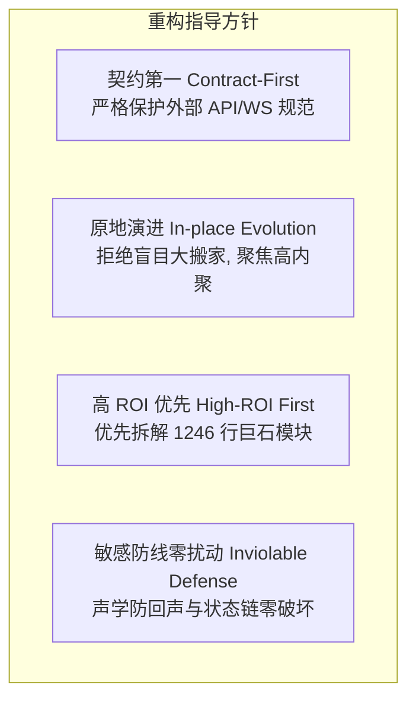
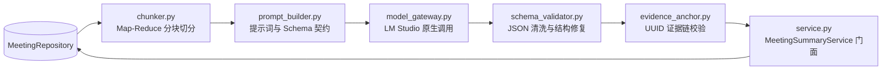
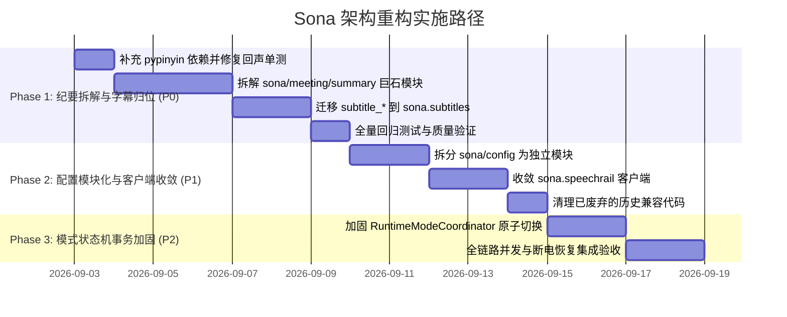

# Sona 核心架构重构方案与实施路径

> **系统定位**：全本地离线实时语音交互（Voice Assistant）+ 会议助手（Meeting Assistant，含说话人分离、PostgreSQL 持久化、异步 AI 纪要、崩溃恢复 journal）+ 实时语音字幕（Live Subtitles）+ 会中内心 OS 伴侣（Inner OS 私密局势研判与发言对策）。  
> **文档性质**：核心架构治理、模块解耦设计与实施路线图规范。  
> **制定时间**：2026-09-02 | **版本**：v1.0.0

---

## 📑 目录

- [一、 重构背景与动因](#一-重构背景与动因)
- [二、 架构设计原则与审查纠偏](#二-架构设计原则与审查纠偏)
- [三、 目标架构与包结构治理](#三-目标架构与包结构治理)
- [四、 核心子系统重构设计细案](#四-核心子系统重构设计细案)
  - [4.1 会议 AI 纪要引擎解耦 (`sona.meeting.summary`)](#41-会议-ai-纪要引擎解耦-sonameetingsummary)
  - [4.2 字幕子系统职责归位 (`sona.subtitles`)](#42-字幕子系统职责归位-sonasubtitles)
  - [4.3 配置层模块化与解耦 (`sona.config`)](#43-配置层模块化与解耦-sonaconfig)
  - [4.4 基础设施客户端收敛 (`sona.speechrail`)](#44-基础设施客户端收敛-sonaspeechrail)
  - [4.5 运行时模式切换事务化 (`RuntimeModeCoordinator`)](#45-运行时模式切换事务化-runtimemodecoordinator)
- [五、 不可动摇的声学与模型防线](#五-不可动摇的声学与模型防线)
- [六、 实施路线图与阶段规划](#六-实施路线图与阶段规划)
- [七、 质量门禁与验收标准](#七-质量门禁与验收标准)

---

## 一、 重构背景与动因

Sona 系统经历了重要的架构解耦演进：
1. **底层 ASR/TTS 模型运行时完全移交外部独立服务 SpeechRail**（Port: `8201`，OpenAI Realtime `/v1/realtime` / REST 协议）；
2. **LLM 推理统一收敛至外部本地引擎 LM Studio**（Port: `1234`，原生 `/api/v1/chat` + `reasoning: "off"`）；
3. **Sona 自身完全聚焦于应用层业务编排**：语音交互、实时字幕、会议助手与内心 OS 伴侣。

在此演进过程中，代码库累积了若干结构性技术债务：
- **上帝模块（God Module）**：`sona/meeting/summary.py`（1246 行）单文件堆叠了 Prompt 模版、Map-Reduce 切分、LM Studio SSE 解析、JSON Schema 修复、证据 UUID 锚定、Markdown 渲染与并发调度等 7+ 项正交职责，单测与维护成本极高。
- **命名空间倒置与空包**：`sona.subtitles` 长期为空包，而字幕代理（`subtitle_proxy.py`）、归档（`subtitle_archive.py`）等核心业务逻辑却散落在 `sona.ui` 接入层。
- **配置大单体**：`src/sona/config.py` 近 700 行，混合了所有子系统配置，且包含跨子系统双向同步的副作用校验。
- **双重客户端抽象**：`sona.asr.adapters` 与 `sona.speechrail` 职责界限重叠，存在两套与 SpeechRail 交互的抽象层。

---

## 二、 架构设计原则与审查纠偏

在重构方案审查中，明确了以下四项设计原则与纠偏红线：



### 1. 契约稳定性（否决端点合并）
- **纠偏**：否决将 `/ws/subtitles`、`/ws/assistant`、`/ws/v1/meetings`、`/ws/v1/control` 合并为单一 `/ws/v1/stream` 的提议。
- **理由**：`contracts/meeting-assistant/v1/asyncapi.yaml` 与前端各独立模块已深度绑定既有契约。对外端点与协议规范严格保持不变，后端仅做内部广播与事件管道的聚合。

### 2. 控制爆炸半径（否决顶层目录推翻）
- **纠偏**：否决全局重构为 `core/`、`features/`、`infra/` 顶层目录的大搬家方案。
- **理由**：该改动影响 87+ 源码文件与 61+ 单测文件的导入路径，严重破坏 Git 历史追踪并极易引发并发冲突。采用**原地领域治理**，维持现有顶层包不变。

---

## 三、 目标架构与包结构治理

重构后的模块职责清晰，依赖呈单向流动：

```text
src/sona/
├── config/                     # [P1 重构] 模块化配置层 (Facade 模式向下兼容)
│   ├── __init__.py             # 导出 Settings 与 get_settings()
│   ├── audio.py                # 麦克风与物理采集配置
│   ├── interaction.py          # 交互管道与防回声配置
│   ├── subtitles.py            # 字幕与转录配置
│   ├── meeting.py              # 会议、PostgreSQL 与 Inner OS 配置
│   └── lm_studio.py            # LM Studio 端点与调度配置
│
├── audio/                      # 音频基础设施 (独占采集 / 硬件感知 / 真实静音)
│   ├── hub.py                  # AudioHub 单源麦克风采集
│   ├── router.py               # 音频流分发与有界队列
│   ├── frame.py / levels.py    # 帧结构与电平计算
│   └── output_source.py        # 物理输出捕获 IPC
│
├── speechrail/                 # [P1 重构] 统一 SpeechRail 客户端
│   ├── transport.py            # WebSocket 传输层 (OpenAI Realtime 契约)
│   ├── transcription_events.py # ASR 事件模型
│   └── tts.py                  # 流式 TTS 客户端
│
├── asr/                        # ASR 领域契约与模型定义
│   ├── contracts.py            # 稳定领域端口 (StreamingTranscriber, ASREvent)
│   ├── models.py               # ASRWindow 等领域对象
│   └── presenters.py           # 转录文本格式化呈现
│
├── subtitles/                  # [P0 重构] 实时字幕核心领域 (从 sona.ui 迁回)
│   ├── proxy.py                # SubtitleProxy (PCM 重连快照与优雅停机)
│   ├── sessions.py             # 字幕会话管理
│   ├── archive.py              # SRT 文件写入与滚动归档
│   └── clients.py              # 字幕 WebSocket 客户端广播池
│
├── interaction/                # 语音交互子系统 (Pipecat 编排 / 双层防回声)
│   ├── pipeline.py             # 处理器链装配
│   ├── echo.py                 # L1 能量抑制 + L2 文本自回声过滤
│   ├── reasoning.py            # LM Studio 原生对话链
│   ├── context_memory.py       # ADR-003 上下文结构化滚动压缩
│   ├── tts.py                  # SpeechRail TTS 语音服务
│   └── runner.py / session.py  # 交互会话与 Headless CLI
│
├── meeting/                    # 结构化会议助手 (状态机 / 对账 / 存储 / Inner OS)
│   ├── session.py              # MeetingSession 状态机编排
│   ├── runtime_mode.py         # RuntimeModeCoordinator 模式互斥协调
│   ├── repository.py           # PostgreSQL 仓储与事务对账
│   ├── diarization_smoother.py # 说话人时序平滑与匿名 group 映射
│   ├── finalization.py         # EOF 冲刷与 session.completed 等待
│   ├── recovery.py             # 0600 本地 JSONL 崩溃容灾
│   ├── api.py / events.py      # REST 路由与 WebSocket 事件广播
│   ├── inner_os/               # 会中内心 OS 伴侣
│   └── summary/                # [P0 重构] 拆解后的 AI 纪要子系统
│       ├── __init__.py         # 导出 MeetingSummaryService (兼容现有签名)
│       ├── service.py          # 纪要任务生命周期与调度门面
│       ├── chunker.py          # Map-Reduce 窗口分块算法
│       ├── prompt_builder.py   # 提示词装配与 JSON Schema 注入
│       ├── model_gateway.py    # LM Studio 原生 /api/v1/chat 流式客户端
│       ├── schema_validator.py # 紧凑 JSON 解析与单次容错修复
│       └── evidence_anchor.py  # 原文段落 UUID 强校验与幻觉过滤
│
├── ui/                         # 接入层网关 (FastAPI / 静态资源)
│   ├── server.py               # FastAPI 组合根与 lifespan
│   ├── runtime.py              # UIRuntime 组件生命周期门面
│   ├── http_routes.py          # HTTP 控制路由
│   ├── websocket_routes.py     # WebSocket 路由
│   └── control.py / protocol.py# 控制协议网关 (request_id ack)
│
├── inference/                  # 本地算力调度
│   └── scheduler.py            # LocalInferenceScheduler 单槽位优先级调度
└── lm_studio.py                # LM Studio 基础数据结构与连接工具
```

---

## 四、 核心子系统重构设计细案

### 4.1 会议 AI 纪要引擎解耦 (`sona.meeting.summary`)

将 1246 行的大单体拆解为高内聚、职责单一的独立组件：



- **`chunker.py`（纯算法层）**：根据 `summary_chunk_max_duration_ms` 与 `summary_chunk_overlap_segments` 切分转录段落，纯确定性逻辑，可实现 100% 独立单测覆盖。
- **`prompt_builder.py`**：注入紧凑 JSON Schema 契约（`v4-map-domain-10240`），处理 map 阶段与 reduce 阶段的不同提示词指导。
- **`model_gateway.py`**：封装 LM Studio 原生 `/api/v1/chat` + `reasoning: "off"`，接入 `LocalInferenceScheduler`（优先级 `WorkloadKind.SUMMARY(100)`）。
- **`schema_validator.py`**：剥离 Markdown 代码块包裹（` ```json `），解析字段并执行单次防御性修复。
- **`evidence_anchor.py`**：严格核对模型输出的 `evidence_segment_ids` 是否真实存在于本次会议转录，剔除幻觉 UUID。

---

### 4.2 字幕子系统职责归位 (`sona.subtitles`)

- 将 `sona.ui.subtitle_proxy.py` 等迁移至 `sona.subtitles`；
- `SubtitleProxy` 作为流式转录消费者，继续保持断线重连期间对 PCM 快照的重放能力；
- `sona.ui` 仅作为 WebSocket 连接接入网关，通过订阅 `sona.subtitles` 广播事件向前端推送数据。

---

### 4.3 配置层模块化与解耦 (`sona.config`)

- 拆解为 `sona/config/` 包，各子系统维护独立的 Pydantic Settings：
  - `AudioSettings`
  - `InteractionSettings`
  - `SubtitleSettings`
  - `MeetingSettings`
  - `UISettings`
  - `LMStudioSettings`
- 顶层 `Settings` 聚合上述对象；提供向后兼容的属性代理与 `get_settings()` 单例；
- 彻底移除对已过期的历史 bridge 兼容校验代码。

---

### 4.4 基础设施客户端收敛 (`sona.speechrail`)

- 将 `sona.asr.adapters` 的具体网络通信与事件解析收敛至 `sona.speechrail`；
- `sona.asr.contracts` 仅保留厂商无关的领域 Protocol 与 Dataclass；
- 统一输出 `SpeechRailStreamingTranscriber` 与 `SpeechRailTTSService` 供业务层调用。

---

### 4.5 运行时模式切换事务化 (`RuntimeModeCoordinator`)

加固 `assistant`、`subtitles`、`meeting`、`idle` 模式切换的状态机原子性：
1. **Prepare**：预检目标依赖（PostgreSQL 连接、SpeechRail 状态）；
2. **Switch**：瞬间切换 `AudioRouter` 独占分发队列，未激活组件接收 `None` 或停止消费；
3. **Teardown**：旧模式优雅收尾（发送 commit EOF、持久化对账、释放锁）。

---

## 五、 不可动摇的声学与模型防线

重构全生命周期中，以下五条核心防线**绝对禁止修改或回退**：

1. **双层防回声死循环防线**：
   - **L1** `EchoSuppressionProcessor`：TTS 输出期物理闭麦或自适应能量门限（`echo_barge_in_gain=2.5`）；
   - **L2** `BotTextRecorder` + `SelfEchoFilter`：文本相似度 $\ge 0.7$ 或子串覆盖时直接吞帧。
2. **LM Studio 原生状态链**：
   - 严格使用原生 `/api/v1/chat` + `reasoning: "off"` + `previous_response_id`；
   - 禁止改回 OpenAI 兼容接口或注入 extra_body。
3. **ADR-003 上下文滚动压缩**：
   - 软/硬/目标阈值（16384/32768/8192 tokens）受控预热换链；断链先自愈后重试。
4. **会议事务对账与 EOF 优雅冲刷**：
   - 结束会议时通过 SpeechRail Realtime 发送 `input_audio_buffer.commit` 并等待 `session.completed` 终结转录。
5. **零音频落地与存储安全**：
   - 数据库与磁盘绝对不存储原始音频；
   - 故障恢复 Journal 目录 `0700`、文件 `0600`。

---

## 六、 实施路线图与阶段规划



---

## 七、 质量门禁与验收标准

重构过程中的每次提交均须通过以下五重质量门禁：

```bash
# 1. 依赖同步 (确保含 interaction 与 dev 组)
uv sync --all-extras

# 2. 后端单元与集成测试 (覆盖率门禁 fail_under=80)
SONA_TEST_DATABASE_URL=postgresql:///knowledge uv run pytest tests/

# 3. Python 严格类型检查 (仅校验 src/)
uv run mypy src/

# 4. 代码风格与规范 Lint
uv run ruff check src/ tests/

# 5. 前端测试与生产构建
cd ui && npm test -- --run && npm run build
```
