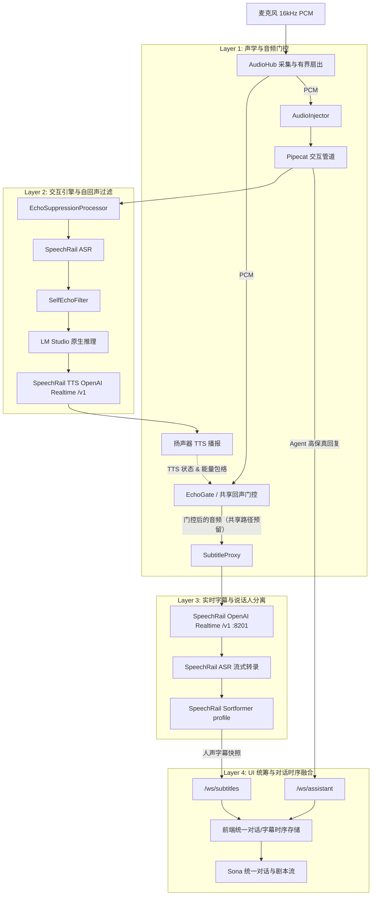

# 声学防回声与全双工交互设计方案

> **状态**：后端 L1/L2 与 SubtitleProxy 音频门控已落地；UI 剧本流融合仍为后续设计项
> **日期**：2026-09-01
> **目标**：在不佩戴耳机（纯外放免提）、不降低唤醒灵敏度、不损失即时打断（Barge-in）的前提下，持续阻断 Agent 外放语音进入交互上下文，并明确区分当前已实现的音频门控与尚未实现的 UI 融合。

> **当前运行边界**：`RuntimeModeCoordinator` 保证 assistant、subtitles、meeting 只有一个 PCM owner。assistant 模式不会把麦克风 PCM 推给 SubtitleProxy；meeting/subtitles 模式则挂起交互助手。SpeechRail 负责 ASR/TTS，应用侧负责 owner、回声状态、取消和文本边界。

---

## 1. 问题背景与根本原因

### 1.1 现状与痛点
以下是迁移前“助手与字幕同时消费 PCM”时的历史问题链；当前运行时通过 PCM owner 互斥先行隔离：
1. 用户说出问题（如 *“这是什么鬼东西”*），系统识别并生成 Agent 回复（*“听起来你对这个有点不满意...”*）。
2. Agent 回复由 Mac 内置扬声器外放播出。
3. 麦克风硬件拾取了扬声器发出的声音（物理声学回声）。
4. **语音助手链路（Pipecat）** 通过 `EchoSuppressionProcessor` 与 `SelfEchoFilter` 防止 Agent 回复自己；
5. 旧的并行字幕链路若直接消费原始 PCM，无法区分真人与扬声器外放，可能把外放声音交给 SpeechRail ASR。
6. 当前 `RuntimeModeCoordinator` 已通过单一 PCM owner 使该并行路径不再成为正常运行态；UI 统一剧本流仍需单独实现与验收。

---

## 2. 总体架构与多层协同防线

---

## 3. 分层详细设计

### 3.1 Layer 1: 全局回声状态共享与字幕音频智能门控
- **共享 `EchoState` 状态机**：
  将原本封闭在 Pipecat 内部的 `EchoState` 暴露至会话与 UI 运行时（`UIRuntime`），支持精确感知：
  - `bot_speaking`（TTS 是否正在生成与播放）；
  - `is_suppressing(now, hangover_secs)`（含尾部混响消除挂起窗口，默认 0.4s）。
- **Subtitle 音频门控（`_push_subtitle_audio`）**：
  - assistant 模式下优先按 PCM owner 拒绝向 SubtitleProxy 推流；若共享路径需要判断，使用共享
    `EchoState` 与自适应峰值包络/EMA 能量门限阻断普通外放漏音；
  - 显式允许 barge-in 时，真人能量连续达到门限才放行；默认 `speaker_focus` 仍为物理静音保护；
  - meeting 模式下交互助手已挂起，会议 capture 直通 SpeechRail，避免误用交互回声门控导致会议漏字。

### 3.2 Layer 2: 交互文本自回声清洗（兜底双保险）
- `BotTextRecorder` 将近端 Agent 播报文本写入共享 `EchoTextBuffer`；
- `SelfEchoFilter` 只在交互 Pipecat 文本路径判断用户转写与近 `10s` 播报文本的相似度（`>= 0.7` 或子串），命中后吞掉该文本，不送入 LLM 上下文；
- SubtitleProxy 当前只负责 SpeechRail 音频会话、快照和重连，不在 confirmed 文本到达后把人声重分类为 Agent；UI 统一剧本流属于未完成的 Layer 4 设计。

### 3.3 Layer 3: 前端 UI/UX 统筹与场景化重构
#### 3.3.1 语音助手面板（AssistantPanel）：沉浸式人机双向对话流
- **双向气泡时间线**：
  - 👤 **我（User）**：右侧对话气泡，展示麦克风转录的用户发言，支持 Partial 动态波纹；
  - 🤖 **助手（Agent）**：左侧卡片，展示 LLM 高保真流式文本，TTS 播报时伴随律动波形；
- **打断（Barge-in）可视化**：
  - Agent 发声期间底部麦克风显示脉冲水波纹，提示“可直接说话打断”；
  - 检测到插话时，Agent 气泡打上 `[已打断]` 徽标，无缝衔接用户新气泡；
- **免提自适应**：
  - 顶栏状态指示自适应声学防线（🔊 智能外放防回声 / 🎧 耳机全双工），消除用户选择心智负担。

#### 3.3.2 实时字幕面板（SubtitleStream）：人机剧本流（Script View）
- 移除底部孤立的 Agent 补充块；
- 将 SpeechRail 识别的人声（`👤 说话人 X`）与 Agent 高保真回复（`🤖 AI 助手`）按物理时间戳融合为统一的剧本时间线；
- 支持大字号（A/A+/A++）、提词器光学镜像模式与一键导出（SRT / Markdown / TXT / JSON）。

#### 3.3.3 会议助手面板（MeetingPanel）：双态工作台
- 录制态：聚焦参会人声纹流，支持实时点击说话人重命名；
- 纪要态：左侧结构化 AI 纪要（核心决议、Action Items），右侧原文证据链检索对照。

---

## 4. 落地步骤与验证规划

1. **后端门控接入（已完成）**：
   - `InteractionSession` / `pipeline.py` 使用共享 `EchoState`、`EchoSuppressionProcessor` 与 `SelfEchoFilter`；
   - `UIRuntime` 已实现 `_push_subtitle_audio` 的 PCM owner 与回声状态门控。
2. **前端时序与呈现优化（待完成）**：
   - 重塑 `AssistantPanel` 统一对话流组件与状态动效；
   - 优化 `SubtitleStream` 时序合并与剧本流渲染；
   - 优化顶栏状态感知指示。
3. **质量门禁全绿验证**：
   - `pytest`（含回声门控单元测试）、`mypy` strict、`ruff`；
   - 前端 Vitest 与 `npm run build`。
