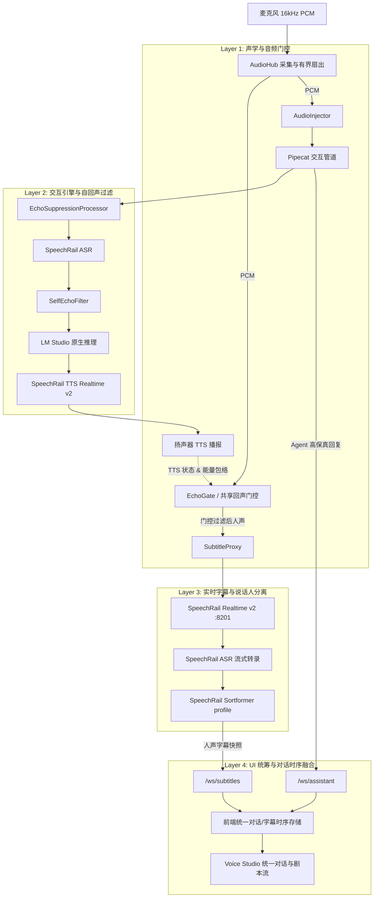

# 声学防回声与全双工交互设计方案

> **状态**：定稿待执行  
> **日期**：2026-08-21  
> **目标**：在不佩戴耳机（纯外放免提）、不降低唤醒灵敏度、不损失即时打断（Barge-in）的前提下，从声学抑制、状态共享、文本对账与 UI 呈现四层彻底根除 Agent 外放语音被误转录为现场发言人的问题，打造原生级免提人机语音交互与实时字幕体验。

---

## 1. 问题背景与根本原因

### 1.1 现状与痛点
在开启外放且同时运行「语音助手」与「实时字幕/会议」服务时：
1. 用户说出问题（如 *“这是什么鬼东西”*），系统识别并生成 Agent 回复（*“听起来你对这个有点不满意...”*）。
2. Agent 回复由 Mac 内置扬声器外放播出。
3. 麦克风硬件拾取了扬声器发出的声音（物理声学回声）。
4. **语音助手链路（Pipecat）** 内置了 `EchoSuppressionProcessor` 与 `SelfEchoFilter`，因此 Agent 不会死循环回复自己；
5. **实时字幕链路（SpeechRail Realtime v2）** 从 `AudioHub` 接收原始麦克风 PCM，无法区分声音来自现场真人还是扬声器外放，导致外放声音被 SpeechRail ASR 转录，并被 Sortformer profile 聚类为 `说话人 1` / `说话人 2`。
6. 前端字幕界面将 Agent 的外放声音展示为人声发言，造成用户心智混淆与记录污染。

---

## 2. 总体架构与多层协同防线

---

## 3. 分层详细设计

### 3.1 Layer 1: 全局回声状态共享与字幕音频智能门控
- **共享 `EchoState` 状态机**：
  将原本封闭在 Pipecat 内部的 `EchoState` 暴露至会话与 UI 运行时（`UIRuntime`），支持精确感知：
  - `bot_speaking`（TTS 是否正在生成与播放）；
  - `is_suppressing(now, hangover_secs)`（含尾部混响消除挂起窗口，默认 0.4s）。
- **Subtitle 音频智能门控（`_push_subtitle_audio`）**：
  - 当处于 `RuntimeMode.ASSISTANT` 且 Agent 正在发声时：
    - 计算麦克风输入帧的 16-bit PCM RMS 能量；
    - 对比自适应扬声器声学包络（`peak_envelope`）；
    - 若能量未突破插话阈值（普通外放漏音），**阻断向 `SubtitleProxy` 推流**；
    - 若检测到真人插话（RMS 突破包络并连续达到门限帧），**毫秒级放行音频**，同时触发打断。
  - 当处于 `RuntimeMode.MEETING` 模式时：语音助手挂起，门控直通，确保会议转录完整不漏字。

### 3.2 Layer 2: 文本指纹对账与自回声清洗（兜底双保险）
- 在 `SubtitleProxy` 与前端数据流层：
  - 维护近端 Agent 播报文本缓存（`EchoTextBuffer`）；
  - 当 SpeechRail 的 confirmed 文本到达时，若命中 Agent 播报时间窗口且文本相似度 $\ge 0.7$ 或为其子串：
    - 自动识别并纠偏为 `🤖 Agent` 角色，或从人声列表中剔除，杜绝“乱码人声”。

### 3.3 Layer 3: 前端 UI/UX 统筹与场景化重构
#### 3.3.1 语音助手面板（AssistantPanel）：沉浸式人机双向对话流
- **双向气泡时间线**：
  - 👤 **我（User）**：右侧对话气泡，展示麦克风转录的用户发言，支持 Partial 动态波纹；
  - 🤖 **助手（Agent）**：左侧卡片，展示 LLM 高保真流式文本，TTS 播报时伴随律动波形；
- **打断（Barge-in）可视化**：
  - Agent 发声期间底部麦克风显示脉冲水波纹，提示“可直接说话打断”；
  - 检测到插话时，Agent 气泡打上 `[已打断]` 徽标，无缝衔接用户新气泡；
- **免提自适应**：
  - 顶栏状态指示自适应声学防线（🔊 智能外放防回声 / 🎧 耳机全双工），消除用户选择心智负担。

#### 3.3.2 实时字幕面板（SubtitleStream）：人机剧本流（Script View）
- 移除底部孤立的 Agent 补充块；
- 将 SpeechRail 识别的人声（`👤 说话人 X`）与 Agent 高保真回复（`🤖 AI 助手`）按物理时间戳融合为统一的剧本时间线；
- 支持大字号（A/A+/A++）、提词器光学镜像模式与一键导出（SRT / Markdown / TXT / JSON）。

#### 3.3.3 会议助手面板（MeetingPanel）：双态工作台
- 录制态：聚焦参会人声纹流，支持实时点击说话人重命名；
- 纪要态：左侧结构化 AI 纪要（核心决议、Action Items），右侧原文证据链检索对照。

---

## 4. 落地步骤与验证规划

1. **后端门控接入**：
   - 改造 `InteractionSession` / `pipeline.py`，支持共享 `EchoState`；
   - 在 `UIRuntime` 中实现 `_push_subtitle_audio` 智能门控。
2. **前端时序与呈现优化**：
   - 重塑 `AssistantPanel` 统一对话流组件与状态动效；
   - 优化 `SubtitleStream` 时序合并与剧本流渲染；
   - 优化顶栏状态感知指示。
3. **质量门禁全绿验证**：
   - `pytest`（含回声门控单元测试）、`mypy` strict、`ruff`；
   - 前端 Vitest 与 `npm run build`。
