# sona 系统总体架构与详细设计方案

> **系统定位**：全本地离线、超低延迟实时语音交互（Voice Assistant）+ 结构化会议助手（Meeting Assistant，含 SpeechRail diarization / PostgreSQL 持久化 / 异步 AI 纪要 / 崩溃恢复 Journal）+ 实时语音字幕（Live Subtitles）。
> **运行环境**：Apple Silicon / macOS / Python 3.12 锁定 / Localhost Loopback；SpeechRail 的模型运行后端由其服务配置决定。
> **文档性质**：系统总体架构方案与模块详细设计规范（面向工程实现与架构审计；外部 SpeechRail 的部署验收另行记录）。
> **更新时间**：2026-09-01 | **版本**：v2.2-SpeechRail

## 当前实现基线（2026-09-01）

- SpeechRail 是 ASR/TTS 的唯一运行时：字幕与会议使用 `SpeechRailStreamingTranscriber`，语音助手使用 `SpeechRailConversationSTTProcessor` 与 `SpeechRailTTSService`；应用侧不加载或启动本地 ASR/TTS worker。
- 会议分人由 SpeechRail 的 diarization profile 输出匿名 speaker group，应用侧只做 `DiarizationSmoother`、会议作用域 group remap 与 PostgreSQL 映射持久化；本仓库不再运行本地 CAM++/AHC 声纹链路。
- `/v1/realtime` 会话不可透明恢复。`SubtitleProxy` 重连或会议重新建连时创建新会话并递增 source epoch，再由窗口对账避免重复与丢字；不能把重连描述为服务端续传。
- `scripts/run-all.sh` 只启动 `sona-ui`。SpeechRail（默认 `ws://127.0.0.1:8201/v1/realtime`）与 LM Studio（默认 `http://127.0.0.1:1234`）属于独立依赖，模型 snapshot/profile 由所属服务管理。

---

## 📑 架构目录

- [第一部分：系统宏观架构与整体设计](#第一部分系统宏观架构与整体设计)
  - [1.1 系统定位与核心设计目标](#11-系统定位与核心设计目标)
  - [1.2 核心架构原则](#12-核心架构原则)
  - [1.3 系统总体逻辑分层架构](#13-系统总体逻辑分层架构)
  - [1.4 物理拓扑与服务运行矩阵](#14-物理拓扑与服务运行矩阵)
  - [1.5 运行时模式状态机（RuntimeModeCoordinator）](#15-运行时模式状态机runtimemodecoordinator)
- [第二部分：核心子系统详细设计](#第二部分核心子系统详细设计)
  - [2. 音频采集与统一扇出子系统（AudioHub）](#2-音频采集与统一扇出子系统audiohub)
  - [3. 实时语音交互子系统（Voice Interaction Pipeline）](#3-实时语音交互子系统voice-interaction-pipeline)
    - [3.1 处理器链编排与时序](#31-处理器链编排与时序)
    - [3.2 双层防回声死循环防御体系](#32-双层防回声死循环防御体系)
    - [3.3 LM Studio 原生对话链与 ADR-003 滚动压缩](#33-lm-studio-原生对话链与-adr-003-滚动压缩)
    - [3.4 SpeechRail TTS 接入与流式播报断句优化](#34-speechrail-tts-接入与流式播报断句优化)
  - [4. 实时字幕与说话人分离子系统（Live Subtitles & Diarization）](#4-实时字幕与说话人分离子系统live-subtitles--diarization)
    - [4.1 字幕服务架构与模型集成](#41-字幕服务架构与模型集成)
    - [4.2 SubtitleProxy 快照对齐与自动重连](#42-subtitleproxy-快照对齐与自动重连)
  - [5. 结构化会议助手子系统（Meeting Assistant Engine）](#5-结构化会议助手子系统meeting-assistant-engine)
    - [5.1 会议端到端全生命周期时序](#51-会议端到端全生命周期时序)
    - [5.2 窗口事务对账算法（Window Reconciliation）](#52-窗口事务对账算法window-reconciliation)
    - [5.3 故障容灾恢复日志（RecoveryJournal）](#53-故障容灾恢复日志recoveryjournal)
    - [5.4 结构化 AI 纪要生成与证据 UUID 锚定](#54-结构化-ai-纪要生成与证据-uuid-锚定)
  - [6. 控制平面、通信协议与状态契约（Control Plane & Protocols）](#6-控制平面通信协议与状态契约control-plane--protocols)
    - [6.1 严格控制协议网关（`/ws/v1/control` 与 `/ws/assistant/cmd`）](#61-严格控制协议网关wsv1control-与-wsassistantcmd)
    - [6.2 会议事件广播协议（`/ws/v1/meetings`）](#62-会议事件广播协议wsv1meetings)
    - [6.3 协议契约全景表](#63-协议契约全景表)
  - [7. 前端控制台架构设计（Sona UI）](#7-前端控制台架构设计sona-ui)
- [第三部分：系统横切与工程保障](#第三部分系统横切与工程保障)
  - [8. 容灾降级与边界隔离矩阵](#8-容灾降级与边界隔离矩阵)
  - [9. 核心数据模型与存储规范](#9-核心数据模型与存储规范)
  - [10. 性能基准与质量门禁](#10-性能基准与质量门禁)

---

# 第一部分：系统宏观架构与整体设计

## 1.1 系统定位与核心设计目标

`sona` 是专为 Apple Silicon 硬件定制的全本地、低延迟实时语音与会议智能系统。系统在保证**零数据出域（完全离线）**的前提下，融合了三个维度的核心能力：
1. **极速人机交互（Voice Assistant）**：提供类似真人通话的全双工实时语音交互，具备智能打断（Barge-in）与双层声学防回声机制；当前端到端延迟需结合 SpeechRail、LM Studio 与设备重新验收。
2. **专业会议助手（Meeting Assistant）**：支持 SpeechRail diarization profile 输出的多说话人分离、实时窗口增量事务对账、PostgreSQL 结构化持久化、断电故障恢复 Journal，以及会议结束后的异步结构化纪要提取（基于本地大模型，带精确原文片段 UUID 锚定）。
3. **实时语音字幕（Live Subtitles）**：低资源占用流式转录，快照签名去重，自动生成带说话人标识的实时字幕流与 SRT 文件。

---

## 1.2 核心架构原则

| 原则 | 架构实现与设计考量 |
|---|---|
| **单源采集与有界扇出** | 麦克风硬件由 [`AudioHub`](../../src/sona/audio/hub.py) 独占捕获，通过内存有界队列广播至交互与字幕链路；支持真实物理静音（零音频吞吐）。 |
| **运行时模式与 PCM 单 owner** | [`RuntimeModeCoordinator`](../../src/sona/meeting/runtime_mode.py) 统一协调 `assistant`、`subtitles`、`meeting`、`idle` 四种模式，并稳定映射到 `PCMOwner.assistant/subtitles/meeting/none`。模型服务进程可以常驻预热，但任意稳定时刻只允许一个 workload 接收 PCM。 |
| **本地优先与离线封闭** | `sona` 不拥有 ASR/TTS 模型；SpeechRail 负责其本地 snapshot、离线加载与 Fail-Fast，应用侧只通过 loopback `/v1/realtime` 消费能力，杜绝隐式联网与 SSRF 风险。 |
| **数据边界与无音频存储** | PostgreSQL 是会议元数据、转录文本、发言人映射与 AI 纪要的**唯一事实源**；数据库与本地磁盘**绝对不存储用户原始音频数据**；会议模式不写入 `current.srt`。 |
| **LM 原生状态链与精准推理** | LLM 交互与纪要生成只能调用 LM Studio 原生 `/api/v1/chat` 接口，显式传入 `reasoning: "off"`；通过原生 `previous_response_id` 维护角色上下文，按 ADR-003 执行上下文结构化滚动压缩。 |
| **双层声学防回声防线** | 单机同麦同箱环境下，L1 声学能量门限（`EchoSuppressionProcessor`）与 L2 文本相似度过滤（`SelfEchoFilter`）级联防护，确保免提外放不自激、真人插话毫秒级穿透。 |

---

## 1.3 系统总体逻辑分层架构

系统逻辑架构划分为 6 个核心层级，自底向上实现音频信号到智能决策的完整闭环：

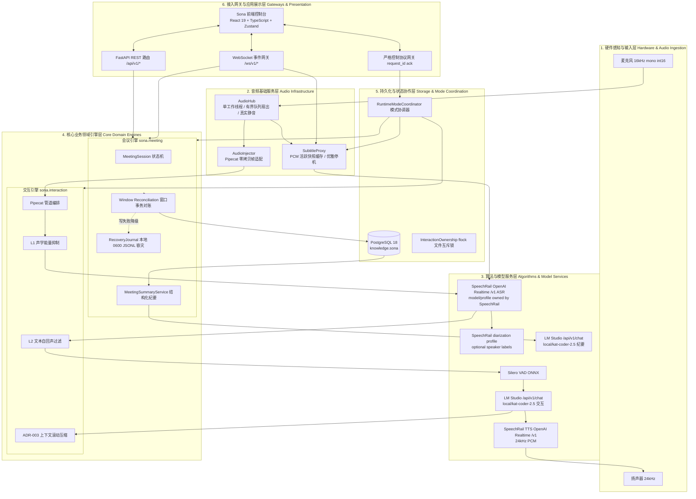

---

## 1.4 物理拓扑与服务运行矩阵

系统由 **3 个独立运行进程单元** 与 **PostgreSQL 数据库** 协同构成。所有服务默认监听 `127.0.0.1` 本地回环网络：

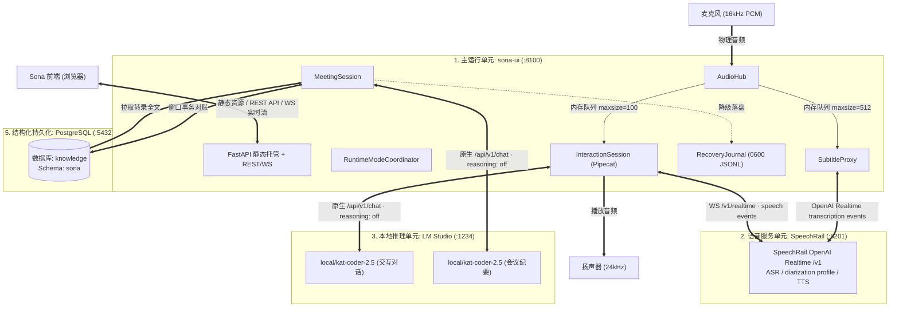

### 进程与端口运行矩阵

| 运行单元 | 默认端口 | 进程入口 / 命令 | 进程模型与生命周期 | 核心通信协议与数据格式 |
|---|---|---|---|---|
| **Sona 核心宿主 (`sona-ui`)** | `8100` | [`sona.ui.server`](../../src/sona/ui/server.py) | Python 3.12 异步主进程，包含 AudioHub、InteractionSession、MeetingSession、FastAPI | HTTP REST (`/api/v1/*`, `/api/services`, `/api/runtime`, `/v1/voices`, `/v1/audio/speech`)<br>WS 控制 (`/ws/v1/control`, `/ws/assistant/cmd`)<br>WS 实时会议 (`/ws/v1/meetings`)<br>WS 字幕流 (`/ws/subtitles`)<br>WS 助手状态 (`/ws/assistant`) |
| **SpeechRail ASR/TTS** | `8201` | 外部 [`SpeechRail`](../../../SpeechRail/src/speechrail/app.py) 服务 | 独立服务负责 ASR/TTS 模型生命周期、队列、diarization profile、preset 与取消；sona 只持有客户端适配器 | OpenAI Realtime `/v1` transcription/speech events<br>REST `/v1/audio/speech`、`/v1/voices` 用于试听/目录 |
| **本地推理引擎 (LM Studio)** | `1234` | LM Studio 宿主应用 | 独立 Native 运行环境，加载 Qwen3.6-35B-A3B 与 Qwen3.8-27B | HTTP POST `/api/v1/chat` (SSE 流式)<br>`reasoning: "off"` 锁定 |
| **PostgreSQL 数据库** | `5432` | `postgres` 守护进程 | 独立数据库服务，DSN: `postgresql:///knowledge`，Schema: `sona` | psycopg3 异步连接池 (`psycopg_pool.AsyncConnectionPool`)，严格事务隔离 |

---

## 1.5 运行时模式状态机（RuntimeModeCoordinator）

为了杜绝应用自身同时运行多条重型 PCM 推理链路，系统由
[`RuntimeModeCoordinator`](../../src/sona/meeting/runtime_mode.py) 统筹运行模式切换。
SpeechRail 和 LM Studio 等服务进程可以常驻；常驻只表示进程和模型可用，不表示其
workload 已获得麦克风数据。

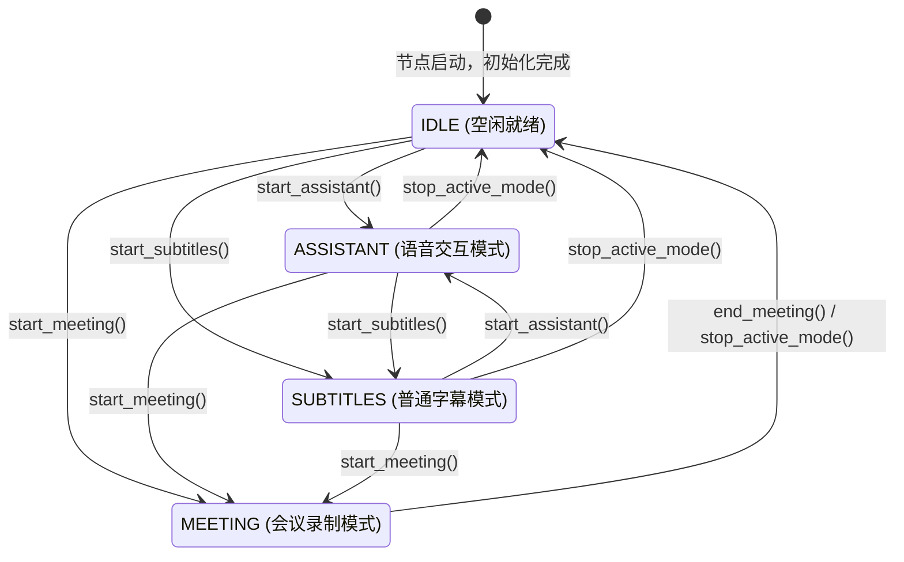

### 运行时模式与会议录制状态机映射

四种稳定模式与 PCM owner 固定对应，`mode` 与 `pcm_owner` 不允许自由组合：

| `RuntimeMode` | `PCMOwner` | PCM 流向与稳定态约束 |
|---|---|---|
| `assistant` | `assistant` | 只允许交互链路消费 PCM；普通字幕代理保持 paused。 |
| `subtitles` | `subtitles` | 只允许普通字幕捕获消费 PCM；交互链路已静默。 |
| `meeting` | `meeting` | 只允许会议捕获消费 PCM；交互与普通字幕 workload 不接收 PCM。 |
| `idle` | `none` | 所有推理 workload 都不接收 PCM；服务进程仍可常驻。 |

模式切换是两阶段事务：

1. **Prepare**：先建立目标 workload 并等待 ready；prepared target 不接收 PCM。目标准备失败时只
   abort target，来源保持原模式与 owner。
2. **Barrier / source quiesce**：目标 ready 后立即把 owner 设为 `none`，在 AudioHub sink 边界关闭
   两条 PCM 门，并 drain/静默来源。屏障是内部瞬态，不广播为稳定状态。
3. **Commit**：同步激活目标，原子提交新的 `mode`、`pcm_owner` 与递增的 `runtime_revision`，随后只
   广播一次完整稳定快照；会议的 `recording` 事件晚于该模式提交。

来源静默或提交后的步骤失败时，协调器优先恢复来源并广播一次恢复后的稳定快照；若来源也无法恢复，
则尽力停止全部 workload，提交并广播 `idle/none`。用户命令在同一把锁下串行且不互相抢占。只有
shutdown 可以取消在途转换；取消时 abort prepared target、尽力停止全部 workload，并以单次稳定
广播收敛到 `idle/none`。

在 `MEETING` 模式下，底层 `MeetingRecord.status` 经历以下细粒度状态转移：
1. **`recording`**：会议正在录制中，实时进行窗口对账与转录入库；
2. **`finalizing`**：调用 `end_meeting()` 时，向 SpeechRail 发送 `input_audio_buffer.commit` 作为 EOF，等待服务端冲刷完毕（默认超时 `finalization_timeout_secs = 30.0s`）；
3. **`completed`**：收到 `session.completed` 并完成收尾冲刷，会议标记为已完成，并自动向 `meeting_minutes` 插入 `queued` 状态的 AI 纪要任务；
4. **`interrupted`**：若冲刷超时（超过 30.0s）或发生不可恢复的捕获异常，会议标记为已中断并记录 `interruption_reason`（如 `finalization_timeout`）。

```text
┌─────────────────┬─────────────────────────────────────────────────────────────────────────────┐
│ 运行状态        │ 资源调度与音频流向行为约束                                                  │
├─────────────────┼─────────────────────────────────────────────────────────────────────────────┤
│ IDLE            │ AudioHub 与服务进程可保持运行；owner=none，所有推理链路不接收 PCM。        │
│ ASSISTANT       │ owner=assistant；仅 AudioInjector 接收 PCM，启用 L1/L2 防回声链路。         │
│ SUBTITLES       │ owner=subtitles；仅普通字幕捕获接收 PCM，confirmed 可写普通字幕 SRT。       │
│ MEETING         │ owner=meeting；仅会议捕获接收 PCM，开启分人和 PostgreSQL 对账，不写普通 SRT。│
│ FINALIZING      │ 向 SpeechRail 发送 `input_audio_buffer.commit`；等待 `session.completed`；   │
│ (录制收尾)      │ 冲刷最后一块转录并封存会议记录为 completed 状态；触发后台异步 AI 纪要任务。 │
│ INTERRUPTED     │ 会议被异常中断或冲刷超时；标记状态为 interrupted；保存现有转录与 Journal。  │
└─────────────────┴─────────────────────────────────────────────────────────────────────────────┘
```

会议完成、异常中止或 finalization 超时后均进入 `idle/none`；系统不会自动恢复普通字幕或语音助手。

---

# 第二部分：核心子系统详细设计

## 2. 音频采集与统一扇出子系统（AudioHub）

[`AudioHub`](../../src/sona/audio/hub.py) 是系统的单一硬件音频采集源，负责以恒定帧长与采样率捕获麦克风信号，并通过有界队列无阻塞分发。

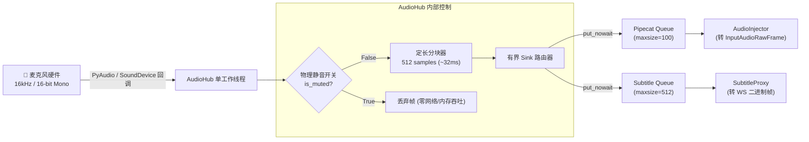

### 核心机制与参数设计

1. **真实物理静音（True Mute）**：
   - 当调用 `set_muted(True)` 时，工作线程在读取音频后立即就地丢弃，不再向任何下游 `Queue` 发送数据，彻底阻断下游 VAD 计算与网络吞吐。
2. **零拷贝有界分发与背压（Backpressure）**：
   - AudioHub 每个 sink 都使用有界队列；sink 满时丢弃最老块、保留最新块，并累计
     `dropped_chunks`。`sink_diagnostics()` 只暴露 `queued_chunks` 与 `dropped_chunks`，不暴露 PCM。
   - 交互入口的 UIRuntime queue 采用不同策略：队列满时保留已经排队的块、拒绝新块，并累计
     interaction drop。两种 drop 计数语义不能混用。
3. **双重 PCM 门禁**：
   - `_enqueue_audio()` 只在 `PCMOwner.assistant` 时接收；`_push_subtitle_audio()` 只在
     `PCMOwner.subtitles/meeting` 时接收；`none` 时两路均拒绝。
   - owner 切换为 `none` 时立即阻断新 PCM 并 drain 交互队列；麦克风静音和 TTS 回声门仍优先生效。
4. **参数基准规范**：
   - 采样率：`16,000 Hz`
   - 采样格式：`Signed 16-bit PCM (int16)`
   - 声道数：`1 (Mono)`
   - 帧大小：`512 samples`（对应时间片 $\Delta t = 32\text{ms}$，每帧数据量 `1024 字节`）

---

## 3. 实时语音交互子系统（Voice Interaction Pipeline）

实时语音交互子系统基于 Pipecat 1.7 框架构建，负责语音识别（STT）、智能断句（VAD）、大模型决策（LLM）与语音合成（TTS）的全双工串联。

### 3.1 处理器链编排与时序

根据 [`sona.interaction.pipeline`](../../src/sona/interaction/pipeline.py)，完整的处理管道流向如下：

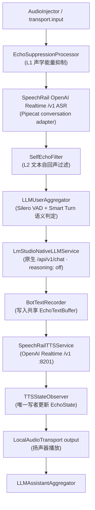

---

### 3.2 双层防回声死循环防御体系

在单机同麦同箱（免提外放）环境下，扬声器播放的声音会不可避免地被麦克风重新拾取。系统设计了**声学域与内容域级联的双层防线**：

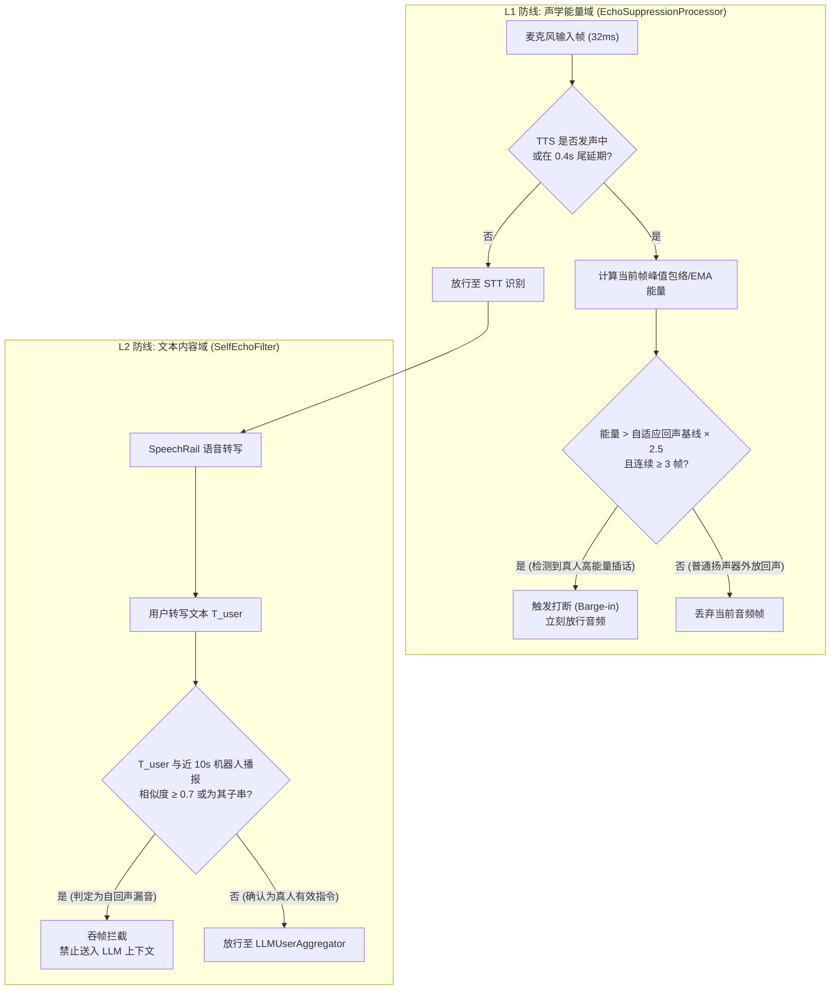

- **L1 `EchoSuppressionProcessor`**：
  - 扬声器播放时（`bot_speaking=True`）以及播放停止后的 `echo_tail_hangover_secs`（默认 `0.4s`）尾延期间，默认丢弃输入音频；
  - 默认 `speaker_focus` 模式在 TTS 播报及尾延期间物理丢弃输入；仅在显式允许 barge-in 时，使用自适应峰值包络/EMA 能量门限，连续 `3` 帧超过约 `2.5` 倍阈值才放行真人插话。
- **L2 `SelfEchoFilter`**：
  - 维护 `EchoTextBuffer`（记录近 `10s` 内助手播报的文本）；
  - 当用户转写文本与缓存文本的字符相似度 $\ge 0.7$ 或为其长子串时，直接吞除该文本帧，杜绝“助手自我对话”的死循环。

---

### 3.3 LM Studio 原生对话链与 ADR-003 滚动压缩

为了保证 Qwen 系列模型在本地推理时首字延迟达到最优（关闭无谓的 Reasoning 推理），系统遵循 **ADR-002 / ADR-003** 契约：

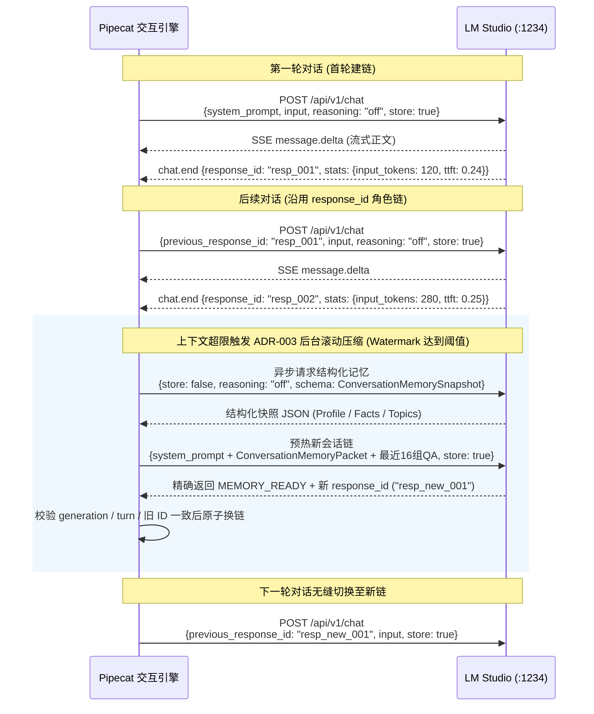

- **原生接口唯一性**：严禁调用 OpenAI 兼容端点 `/v1/chat/completions`（无法关闭 reasoning）；
- **滚动压缩参数水位**：Soft Token 水位 `16,384`，Hard Token 水位 `32,768`，Target 水位 `8,192`；保留最近 16 组问答（32 turns），换链全过程对用户零感知。

---

### 3.4 SpeechRail TTS 接入与流式播报断句优化

交互管道通过 [`SpeechRailTTSService`](../../src/sona/interaction/tts.py)
和 [`SpeechRailOpenAITransport`](../../src/sona/speechrail/transport.py) 接入独立
SpeechRail。公共模型 ID 固定为 `speechrail/qwen3-tts`，sona 不加载 TTS
权重，也不负责 TTS 进程生命周期：

1. **服务端生命周期与并发门控（Server-owned Runtime）**：
   - SpeechRail 负责模型快照、worker、队列、取消和 24kHz PCM 输出；sona
     只负责按会话创建客户端、将 PCM 映射为 Pipecat 帧，并把取消传播为 `response.cancel`。
2. **NLTK `punkt_tab` 级联流式分句**：
   - 交互管道利用 [`nltk_data.py`](../../src/sona/interaction/nltk_data.py) 将 LLM 返回的流式 Token 按标点切分为短句，首句生成即送入 TTS；首字发音延迟需结合当前 SpeechRail 部署重新验收。
3. **动态音色控制**：
   - 只允许 SpeechRail 登记的 `default` / `warm` / `bright` / `calm` preset；应用运行时
     通过 Pipecat `TTSUpdateSettingsFrame` 更新当前会话，REST `/v1/voices` 仅用于目录与试听。

---

## 4. 实时字幕与说话人分离子系统（Live Subtitles & Diarization）

实时字幕子系统由 `sona-ui` 内的 `SubtitleProxy` 通过 SpeechRail OpenAI Realtime `/v1`（端口 `8201`）提供服务；ASR 与可选 diarization profile 的模型生命周期均由 SpeechRail 管理。

### 4.1 字幕服务架构与模型集成

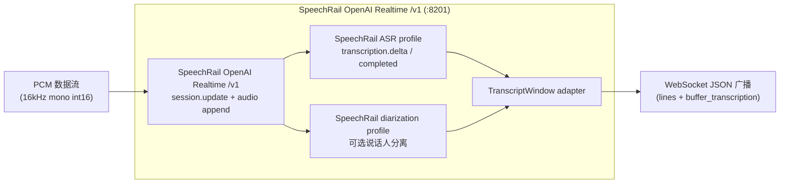

---

### 4.2 SubtitleProxy 快照对齐与自动重连

UI 主进程内的 [`SubtitleProxy`](../../src/sona/ui/subtitle_proxy.py) 是字幕服务与上层业务的唯一网关：

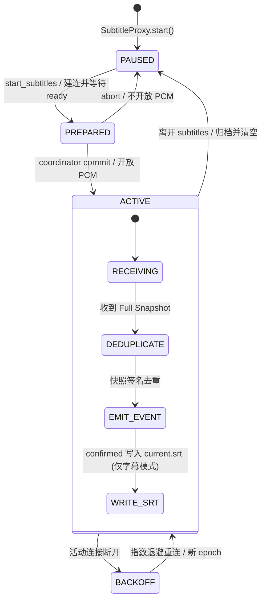

- **启动语义**：`SubtitleProxy.start()` 只初始化代理和输出目录，状态为 paused；它不激活普通字幕、
  不建立永久普通字幕连接。普通字幕必须由控制命令 `start_subtitles` 经 coordinator prepare/commit。
- **签名去重机制**：基于 `(speaker_key, start_ms, end_ms, text)` 计算签名，杜绝重复渲染；
- **连接 epoch 与 SRT**：每次普通字幕激活或活动模式重连都递增 epoch。每个 epoch 的 confirmed
  最多归档一次；关闭 epoch 时在同目录临时写空文件并原子替换 `current.srt`，同时清除旧快照，
  因而新客户端不会收到上一 epoch 的快照。无 confirmed 的 epoch 不产生归档。
- **会议隔离**：会议使用独立 capture/EOF 生命周期，永不写普通字幕 `current.srt` 或普通字幕归档；
  结束会议后不自动恢复普通字幕 supervisor。

---

## 5. 结构化会议助手子系统（Meeting Assistant Engine）

会议助手是系统的核心业务模块，负责将混乱的多人实时语音转化为结构化、强一致、可追溯的会议资产。

### 5.1 会议端到端全生命周期时序

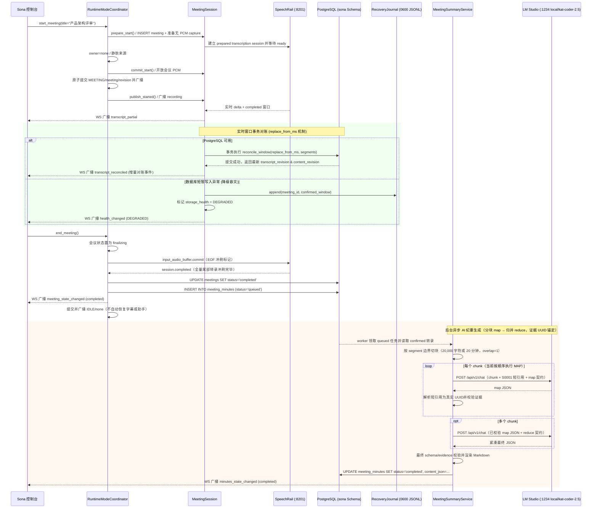

---

### 5.2 窗口事务对账算法（Window Reconciliation）

由于流式 ASR 的右侧上下文修正特性，已识别的语句可能会被重写。系统在 [`MeetingRepository`](../../src/sona/meeting/repository.py) 中实现了确定性的 `replace_from_ms` 窗口对账算法：

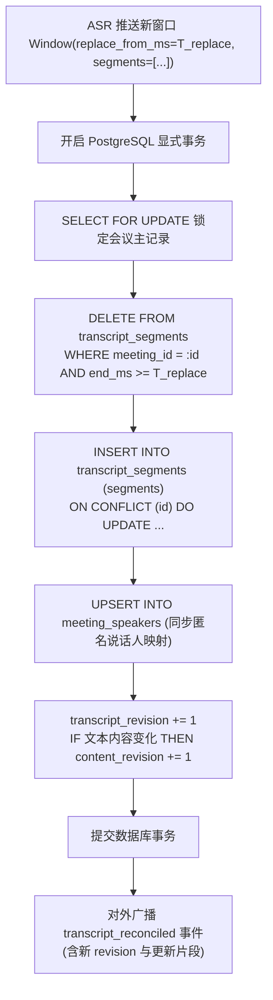

- **双版本号机制**：
  - `transcript_revision`：每次对账无论内容是否变化均单调递增；
  - `content_revision`：仅当文本内容产生实质性修改时递增，前端据此进行高效差量渲染。

---

### 5.3 故障容灾恢复日志（RecoveryJournal）

在 PostgreSQL 数据库发生网络抖动或临时不可写时，[`RecoveryJournal`](../../src/sona/meeting/recovery.py) 启动本地降级存储，确保数据零丢失：

```text
PostgreSQL 正常 ───► 直接写入数据库
       │
       ▼ (写入异常)
RecoveryJournal ──► 写入本地磁盘: runtime/meetings/recovery/{meeting_id}.jsonl
                    (文件权限 0600 / 目录权限 0700 / 仅存 Confirmed 文本 / fsync)
       │
       ▼ (数据库恢复)
Journal Replay ──► 读取 JSONL 记录 ──► 批量回放至 PostgreSQL ──► 验证通过后安全删除文件
```

---

### 5.4 结构化 AI 纪要生成与证据 UUID 锚定

[`MeetingSummaryService`](../../src/sona/meeting/summary.py) 在会议结束后调用 `local/kat-coder-2.5` 模型生成结构化纪要。为了确保纪要内容的严谨性与防幻觉，输出必须遵循严格的 JSON Schema 契约（`contracts/meeting-assistant/v1/schemas/minutes-content.schema.json`），并为每个事实点锚定转录片段的 UUID。

长会议采用两阶段 Map/Reduce。领域契约描述可持久化结果的容量；模型侧再为 map 和最终 reduce/repair 提供
不同的集合上限。这样 map 不会因为单个分块暂时有较多独立事实而过早丢弃内容，reduce 仍能把最终纪要压缩到
适合展示和落库的规模：

```text
confirmed segments
        │
        ├─ 未越过阈值 ─► 单次 MAP ─► 解析短引用/校验证据 ─► MinutesResult
        │
        └─ 越过阈值
             │
             ▼
       segment 边界切块（20,000 字符或 20 分钟，overlap=1）
             │
       ┌─────┼─────┐
       ▼     ▼     ▼
     MAP-1 MAP-2  MAP-N       每块独立使用 S0001… 短证据编号
       └─────┴─────┘
             │
       应用解析短编号 → 真实 segment UUID，并校验引用归属
             │
             ▼
       REDUCE：只接收已验证的 map JSON，去重并生成全局纪要
             │
             ▼
       最终契约/evidence 校验 ─► Markdown + PostgreSQL
```

| 阶段 | 目标 | 集合上限（topics / decisions / action_items / risks / open_questions / highlights） | 预算 |
|---|---|---|---|
| MAP | 分块内抽取事实，保留独立内容 | `12 / 12 / 12 / 8 / 8 / 12`（领域容量） | `2048` tokens |
| REDUCE | 跨块去重、合并证据、生成全局概览 | `8 / 8 / 8 / 4 / 4 / 6`（最终模型容量） | `10240` tokens |
| REPAIR | 只修复对应阶段的 JSON 结构，不新增事实 | 使用失败阶段的契约 | 每阶段最多一次 |

短引用只在所属 map 分块内有效；应用完成映射后，reduce 输入不再包含全量原始转录。短会议没有 reduce，
但仍执行一次 map 并转换为最终 `MinutesResult`。

```json
{
  "overview": "会议围绕 sona 架构方案与运行模式互斥展开，确认了离线封闭与双层防回声策略。",
  "topics": [
    {
      "title": "技术架构与模式互斥评审",
      "summary": "讨论并确认了 RuntimeModeCoordinator 协调语音助手与会议助手的生命周期。",
      "evidence_segment_ids": [
        "a1b2c3d4-e5f6-7a8b-9c0d-1e2f3a4b5c6d",
        "f7e8d9c0-b1a2-3f4e-5d6c-7b8a9f0e1d2c"
      ]
    }
  ],
  "decisions": [
    {
      "content": "进入会议模式时主动挂起 Pipecat 对话链路，独占麦克风转录流。",
      "evidence_segment_ids": [
        "a1b2c3d4-e5f6-7a8b-9c0d-1e2f3a4b5c6d"
      ]
    }
  ],
  "action_items": [
    {
      "task": "完成 RecoveryJournal 故障回放单元测试",
      "owner": "研发团队",
      "due_date": "2026-08-25",
      "evidence_segment_ids": [
        "c3d4e5f6-a7b8-9c0d-1e2f-3a4b5c6d7e8f"
      ]
    }
  ],
  "risks": [
    {
      "content": "若 PostgreSQL 持续不可写且日志回放积压过大，需监控磁盘空间。",
      "evidence_segment_ids": [
        "f7e8d9c0-b1a2-3f4e-5d6c-7b8a9f0e1d2c"
      ]
    }
  ],
  "open_questions": [],
  "highlights": [
    {
      "content": "PostgreSQL 作为会议元数据与转录文本的唯一事实源，严格不持久化任何音频。",
      "evidence_segment_ids": [
        "a1b2c3d4-e5f6-7a8b-9c0d-1e2f3a4b5c6d"
      ]
    }
  ]
}
```

---

## 6. 控制平面、通信协议与状态契约（Control Plane & Protocols）

### 6.1 严格控制协议网关（`/ws/v1/control` 与 `/ws/assistant/cmd`）

系统所有控制指令均通过 WebSocket 严格控制网关交互，遵循以下核心准则：
1. **Loopback Origin 鉴权**：只允许配置的 `allowed_origins`（如 `http://127.0.0.1:8100`）发起的握手请求；
2. **`request_id` 强制闭环**：每个命令必须携带 `request_id`，服务端处理完成后原样回传 Ack 与命令名称；
3. **持续权威广播**：`/ws/v1/control` 与 `/ws/assistant/cmd` 都在连接期持续接收
   `runtime_state` 完整快照，而不是只在握手时接收一次；latest-only 队列让慢客户端最终拿到最高 revision。
4. **Ack 与广播分流**：命令 ack 只发送给提交该请求的连接；`runtime_state` 广播发送给所有控制连接。
   两者没有固定先后顺序，客户端必须按 `request_id`/`event` 分类，并以最高 `runtime_revision` 的
   ownership 字段对账。
5. **断线不取消命令**：服务端一旦接受命令，发起连接随后断开也不会取消转换；命令继续执行并通过
   其他控制连接的广播或 `GET /api/runtime` 暴露最终稳定状态。

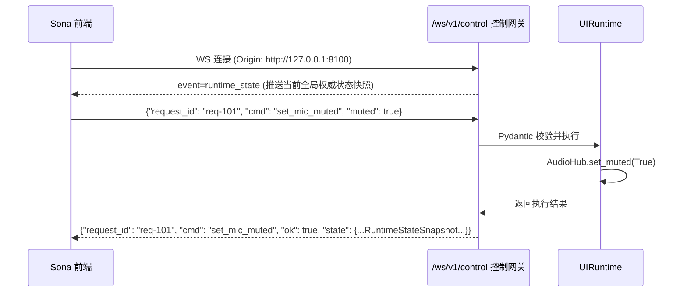

模式命令包括 `start_assistant`、`start_subtitles`、`start_meeting`、`end_meeting` 和
`stop_active_mode`。`runtime_revision` 只排序模式 ownership（`mode`、`pcm_owner`、
`active_meeting_id` 及模式驱动 Tab）；persona、mic、pipeline 和会议转录继续使用既有更新语义。

### 6.2 会议事件广播协议（`/ws/v1/meetings`）

会议事件通道通过有界队列向前端订阅者广播，所有事件遵循统一 V1 封套：
```json
{
  "contract_version": "1",
  "type": "transcript_reconciled",
  "event_id": "9b1deb4d-3b7d-4bad-9bdd-2b0d7b3dcb6d",
  "meeting_id": "a1b2c3d4-e5f6-7a8b-9c0d-1e2f3a4b5c6d",
  "occurred_at": "2026-08-23T15:00:00.000Z",
  "payload": { ... }
}
```

- **Durable 事件**：`meeting_state_changed`, `transcript_reconciled`, `speaker_updated`, `minutes_state_changed`, `health_changed`, `transcription_gap`, `resync_required`。
- **Ephemeral 事件**：`transcript_partial`（实时易失 partial 识别字流）。

---

### 6.3 协议契约全景表

| 协议路由 / 接口 | 类型 | 核心作用 | 数据载荷 / 契约文件 |
|---|---|---|---|
| `GET /api/runtime` | HTTP REST | 控制端 ownership 对账 | 返回含 `mode/pcm_owner/runtime_revision` 的权威快照 |
| `GET /api/v1/runtime` | HTTP REST | 获取全局运行时状态快照 | 返回 `RuntimeStateSnapshot` |
| `GET /api/v1/meetings` | HTTP REST | 查询会议历史列表 | 支持 `cursor` 游标分页与 `status` 过滤 |
| `GET /api/v1/meetings/{id}` | HTTP REST | 获取单场会议详情 | 返回会议元数据与发言人列表 |
| `GET /api/v1/meetings/{id}/transcript` | HTTP REST | 获取单场会议完整转录 | 返回 `segments` 数组与版本号 |
| `PATCH /api/v1/meetings/{id}` | HTTP REST | 修改会议标题 | 请求体 `{"title": "..."}` |
| `PATCH /api/v1/meetings/{id}/speakers/{speaker_key}` | HTTP REST | 更新发言人自定义名称 | 请求体 `{"display_name": "..."}` |
| `POST /api/v1/meetings/{id}/minutes` | HTTP REST | 触发生成/重试 AI 纪要 | 支持 `Idempotency-Key` 请求头 |
| `GET /api/v1/meetings/{id}/minutes/{version}` | HTTP REST | 获取指定版本 AI 纪要 | 返回 `MinutesRecord` |
| `GET /api/v1/meetings/{id}/export` | HTTP REST | 导出会议记录 | `?format=markdown` 或 `?format=json` |
| `DELETE /api/v1/meetings/{id}` | HTTP REST | 删除单场会议数据 | 级联删除转录与纪要 (204 No Content) |
| `GET /api/services` | HTTP REST | 进程健康与 workload 原始诊断 | `services[]` 保留 HTTP `status`；SpeechRail workload additive 字段见下文；顶层 `diagnostics` 固定五键 |
| `GET /v1/voices` | HTTP REST | 代理 TTS 音色列表 | 返回可用音色 profiles |
| `POST /v1/audio/speech` | HTTP REST | SpeechRail TTS 试听/回放代理 | OpenAI 兼容接口，响应 24kHz 音频流；交互播放使用 `/v1/realtime` |
| `WS /ws/v1/control` | WebSocket JSON | 严格控制指令网关 | [`protocol.py`](../../src/sona/ui/protocol.py) 契约定义 |
| `WS /ws/assistant/cmd` | WebSocket JSON | 助手控制兼容通道 | [`protocol.py`](../../src/sona/ui/protocol.py) 契约定义 |
| `WS /ws/v1/meetings` | WebSocket JSON | 会议实时转录与状态流 | [`events.py`](../../src/sona/meeting/events.py) 事件广播 |
| `WS /ws/subtitles` | WebSocket JSON | 只读字幕事件订阅 | 仅 `subtitles/meeting` 合法；非法或存续期失去资格均关闭 `4409`，reason=`字幕模式未激活` |
| `WS /ws/assistant` | WebSocket JSON | 交互助手流式事件 | 助手转录与机器人发音状态流 |
| `POST /api/v1/chat` | HTTP SSE | LM Studio 原生推理 | 原生 `message.delta` 与 `chat.end` 事件 |

---

`/ws/subtitles` 不接受控制语义：建连不会抢占模式，也不会隐式停止助手。`subtitles → meeting` 时已建立
订阅仍可继续读取会议字幕；进入 `assistant` 或 `idle` 时，非法新连接和失去资格的存量连接都使用固定
关闭码 `4409` 与固定原因“字幕模式未激活”。

`GET /api/services` 中 SpeechRail workload 条目新增以下 additive 字段，旧客户端可以忽略：

| 字段 | 含义 |
|---|---|
| `workload` | 当前字幕 workload 状态，例如 `paused/starting/ready/degraded/error`。 |
| `ws_state` | 应用到 SpeechRail `/v1/realtime` 的 WebSocket 原始连接状态。 |
| `reconnect_count` | 当前进程生命周期内的重连累计次数。 |
| `last_event_age_ms` | 活动 workload 最近事件年龄；没有可用事件时为 `null`。 |

HTTP `status` 只表示服务进程探活结果，不被 `workload` 或 `ws_state` 覆盖。长时间静音只会让
`last_event_age_ms` 增长，不足以把 ready workload 判为 degraded。顶层 `diagnostics` 固定包含
`audio_hub`、`interaction`、`subtitles`、`tts`、`last_transition` 五个键；其中 TTS 原始源块诊断包括
`first_chunk_ms`、`chunk_count`、`max_source_chunk_gap_ms`、`median_source_chunk_gap_ms` 和
`source_chunk_gaps_over_200ms`。这些数据只描述应用自身状态、drop、gap 和 source chunk gap，不扫描
游戏或其他进程，也不自动做资源归因。

---

## 7. 前端控制台架构设计（Sona UI）

前端基于 **React 19 + TypeScript + Vite + Zustand** 构建，采用模块化组件树与单向数据流：

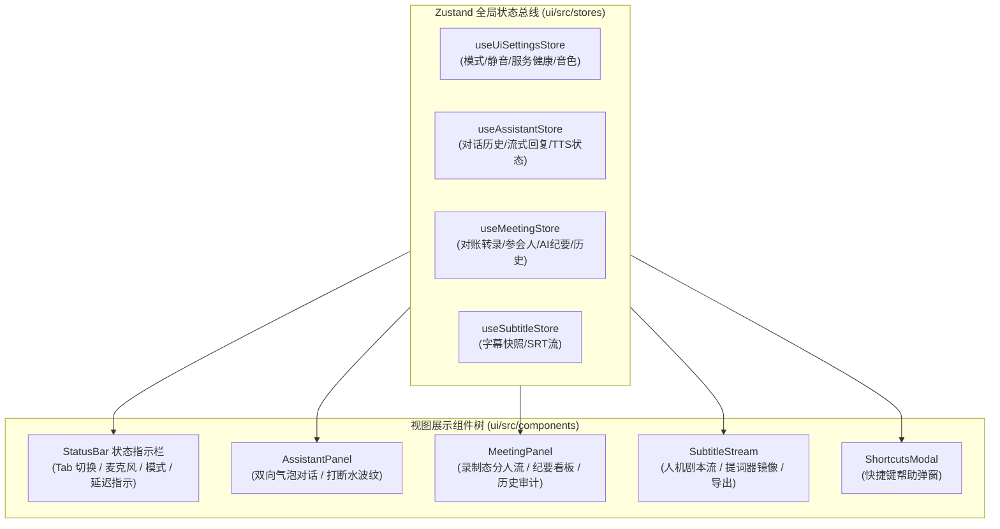

---

# 第三部分：系统横切与工程保障

## 8. 容灾降级与边界隔离矩阵

```text
┌────────────────────────┬──────────────────────────────────┬──────────────────────────────────────────────────┐
│ 故障场景               │ 熔断与降级行为                   │ 恢复策略与数据一致性保障                         │
├────────────────────────┼──────────────────────────────────┼──────────────────────────────────────────────────┤
│ PostgreSQL 启动前不可写 │ 禁止开启新会议；报错 storage_unavailable│ 提示用户检查数据库连接；语音助手交互功能不受影响 │
├────────────────────────┼──────────────────────────────────┼──────────────────────────────────────────────────┤
│ 会议中数据库短暂断开   │ 激活 RecoveryJournal (0600 JSONL) │ 数据库恢复后自动执行幂等回放，回放成功后删除日志 │
├────────────────────────┼──────────────────────────────────┼──────────────────────────────────────────────────┤
│ SpeechRail Realtime 异常断线│ SubtitleProxy 触发指数退避自动重连│ 重连后重放 PCM 活跃快照，补齐断线期转录，不丢字  │
├────────────────────────┼──────────────────────────────────┼──────────────────────────────────────────────────┤
│ 会议结束 EOF 冲刷超时  │ 8.0s 超时后标记 interrupted/timeout│ 封存已对账的所有 confirmed 片段，生成部分纪要    │
├────────────────────────┼──────────────────────────────────┼──────────────────────────────────────────────────┤
│ LM Studio 链断裂/异常  │ 捕获异常，阻断空链静默降级       │ 自动使用近期已验证的历史摘要预热新种子链并重试   │
└────────────────────────┴──────────────────────────────────┴──────────────────────────────────────────────────┘
```

---

## 9. 核心数据模型与存储规范

### PostgreSQL 关系模式 (`sona` Schema)

```sql
-- 1. 会议元数据主表
CREATE TABLE IF NOT EXISTS sona.meetings (
    id uuid PRIMARY KEY,
    title text NOT NULL CHECK (char_length(title) BETWEEN 1 AND 200),
    status text NOT NULL CHECK (status IN (
        'recording', 'finalizing', 'completed', 'interrupted', 'storage_error'
    )),
    language text NOT NULL CHECK (char_length(language) BETWEEN 1 AND 32),
    audio_source text NOT NULL CHECK (audio_source = 'microphone'),
    started_at timestamptz NOT NULL,
    ended_at timestamptz,
    transcript_revision bigint NOT NULL DEFAULT 0 CHECK (transcript_revision >= 0),
    content_revision bigint NOT NULL DEFAULT 0 CHECK (content_revision >= 0),
    interruption_reason text CHECK (interruption_reason IS NULL OR char_length(interruption_reason) <= 128),
    metadata jsonb NOT NULL DEFAULT '{}'::jsonb,
    created_at timestamptz NOT NULL DEFAULT now(),
    updated_at timestamptz NOT NULL DEFAULT now()
);

-- 2. 说话人自定义名称映射表
CREATE TABLE IF NOT EXISTS sona.meeting_speakers (
    meeting_id uuid NOT NULL REFERENCES sona.meetings(id) ON DELETE CASCADE,
    speaker_key text NOT NULL CHECK (char_length(speaker_key) BETWEEN 1 AND 200),
    source_epoch integer NOT NULL CHECK (source_epoch >= 0),
    raw_speaker text NOT NULL CHECK (char_length(raw_speaker) BETWEEN 1 AND 200),
    default_label text NOT NULL CHECK (char_length(default_label) BETWEEN 1 AND 200),
    display_name text NOT NULL CHECK (char_length(display_name) BETWEEN 1 AND 200),
    created_at timestamptz NOT NULL DEFAULT now(),
    updated_at timestamptz NOT NULL DEFAULT now(),
    PRIMARY KEY (meeting_id, speaker_key)
);

-- 3. 确认转录片段表 (唯一事实源，绝对无音频列)
CREATE TABLE IF NOT EXISTS sona.transcript_segments (
    id uuid PRIMARY KEY,
    meeting_id uuid NOT NULL REFERENCES sona.meetings(id) ON DELETE CASCADE,
    segment_order integer NOT NULL CHECK (segment_order >= 0),
    source_epoch integer NOT NULL CHECK (source_epoch >= 0),
    speaker_key text NOT NULL CHECK (char_length(speaker_key) BETWEEN 1 AND 200),
    start_ms bigint NOT NULL CHECK (start_ms >= 0),
    end_ms bigint NOT NULL CHECK (end_ms >= start_ms),
    text text NOT NULL CHECK (char_length(btrim(text)) > 0),
    translation text,
    detected_language text,
    created_at timestamptz NOT NULL DEFAULT now(),
    updated_at timestamptz NOT NULL DEFAULT now()
);

-- 4. 结构化 AI 纪要版本表 (含证据 UUID 关联与租约控制)
CREATE TABLE IF NOT EXISTS sona.meeting_minutes (
    id uuid PRIMARY KEY,
    meeting_id uuid NOT NULL REFERENCES sona.meetings(id) ON DELETE CASCADE,
    version integer NOT NULL CHECK (version >= 1),
    status text NOT NULL CHECK (status IN ('queued', 'generating', 'completed', 'failed')),
    source_content_revision bigint NOT NULL CHECK (source_content_revision >= 0),
    model text NOT NULL DEFAULT '',
    prompt_version text NOT NULL DEFAULT 'v1',
    idempotency_key text,
    content_json jsonb,
    content_markdown text,
    raw_output text,
    error_code text,
    error_message text,
    lease_until timestamptz,
    attempts integer NOT NULL DEFAULT 0 CHECK (attempts >= 0),
    created_at timestamptz NOT NULL DEFAULT now(),
    generated_at timestamptz,
    updated_at timestamptz NOT NULL DEFAULT now(),
    UNIQUE (meeting_id, version),
    UNIQUE (meeting_id, id),
    UNIQUE (meeting_id, idempotency_key)
);

-- 5. 会议事件流水审计表
CREATE TABLE IF NOT EXISTS sona.meeting_events (
    id uuid PRIMARY KEY,
    meeting_id uuid NOT NULL REFERENCES sona.meetings(id) ON DELETE CASCADE,
    event_type text NOT NULL CHECK (char_length(event_type) BETWEEN 1 AND 128),
    payload jsonb NOT NULL DEFAULT '{}'::jsonb,
    occurred_at timestamptz NOT NULL DEFAULT now()
);

-- 6. 高性能索引配置
CREATE INDEX IF NOT EXISTS meetings_created_at_idx
    ON sona.meetings (created_at DESC, id DESC);
CREATE INDEX IF NOT EXISTS transcript_segments_meeting_order_idx
    ON sona.transcript_segments (meeting_id, segment_order);
CREATE INDEX IF NOT EXISTS transcript_segments_meeting_start_idx
    ON sona.transcript_segments (meeting_id, start_ms);
CREATE INDEX IF NOT EXISTS transcript_segments_speaker_start_idx
    ON sona.transcript_segments (meeting_id, speaker_key, start_ms);
CREATE INDEX IF NOT EXISTS meeting_minutes_queue_idx
    ON sona.meeting_minutes (status, lease_until, created_at);
CREATE INDEX IF NOT EXISTS meeting_events_meeting_time_idx
    ON sona.meeting_events (meeting_id, occurred_at);
```

---

## 10. 性能基准与质量门禁

### 性能指标记录（需按当前 SpeechRail 部署重新验收）

表中 LM/应用链路数值来自历史记录，不能作为当前 SpeechRail ASR/TTS 的已验证承诺；外部服务的
实时率、首包延迟、profile 和资源占用应以同一部署版本的验收记录为准。

```text
┌───────────────────────────────────────────────┬───────────────────────────────┐
│ 关键性能指标 (KPI)                            │ 实测基准数据 (Benchmark)       │
├───────────────────────────────────────────────┼───────────────────────────────┤
│ SpeechRail ASR 实时率 (RTF)                  │ 按 SpeechRail profile 运行记录 │
│ LM Studio (Qwen3.6-35B-A3B) 首字时间 (TTFT)   │ 历史记录：0.24s ~ 0.26s       │
│ LM Studio 生成吞吐速率 (Throughput)           │ 历史记录：97 ~ 113 tokens/sec │
│ SpeechRail TTS 首包音频延迟 (TTFB)             │ 待当前部署验收                 │
│ 语音交互端到端整体延迟 (End-to-End Latency)    │ 待当前部署验收                 │
│ 窗口对账事务处理延迟 (Reconciliation Latency) │ 历史记录：< 15ms               │
└───────────────────────────────────────────────┴───────────────────────────────┘
```

### 严格代码质量门禁

下列结果是 2026-08-26 发布候选分支的历史记录，发生在 SpeechRail 迁移前；它们不代表当前
SpeechRail 服务的真实端到端验收结果。后续若有代码或外部服务变更，仍须重新运行完整门禁。

```bash
# 1. 后端单元与集成测试（分支覆盖率门槛 80%，实测 1165 passed）
SONA_TEST_DATABASE_URL=postgresql:///knowledge uv run pytest tests/

# 2. Python 严格类型检查（strict，87 source files 全绿）
uv run mypy src/

# 3. Python 代码规范与 Lint
uv run ruff check src/ tests/

# 4. 前端单元测试（17 test files, 133 passed）
cd ui && npm test -- --run

# 5. 前端类型检查与构建（tsc + vite build 零错误）
cd ui && npm run build
```

### 历史发布前 localhost / LAN 真实验收（2026-08-26，SpeechRail 迁移前）

本轮在同一台笔记本分别使用 localhost 与 `run-all.sh` 输出的实际 LAN IP 执行。每轮只记录最高
`runtime_revision`、`mode`、`pcm_owner` 与诊断计数，不记录音频、完整转写、凭据或实际终端历史。

```bash
# localhost 轮次
scripts/run-all.sh
curl --fail --silent http://127.0.0.1:8100/api/runtime | python3 -m json.tool
curl --fail --silent http://127.0.0.1:8100/api/services | python3 -m json.tool

# 停止上一轮全部子进程后，执行 LAN 轮次
SONA_BIND_HOST=lan scripts/run-all.sh
# 在同一台笔记本上，将示例地址替换为 run-all.sh 输出的实际 LAN IP
SONA_LAN_IP=192.0.2.10
curl --fail --silent "http://${SONA_LAN_IP}:8100/api/runtime" | python3 -m json.tool
curl --fail --silent "http://${SONA_LAN_IP}:8100/api/services" | python3 -m json.tool
```

localhost 与 LAN 各执行一次：`assistant → subtitles → assistant`、`assistant → meeting → idle`、
`subtitles → meeting → idle`、双浏览器相反命令、旧 WLK 未 ready、活动字幕断线重连和外部高负载观察。
预期所有客户端最终收敛到相同最高 revision，稳定态没有双 PCM owner；会议结束不自动恢复 workload；
新字幕 epoch 不覆盖旧 SRT；`/api/services` 只显示原始 drop/gap/source chunk gap，不给出游戏或资源归因。
还需检查 runtime 输出目录和 PostgreSQL：没有音频持久化，prepared meeting abort 记录保留为
`interrupted/mode_switch_aborted`。LAN 轮次在同一台笔记本使用 `run-all.sh` 输出的实际 LAN IP 访问
`8100`，不可用 localhost 代替；若未来有第二设备，可作为可选扩展验证，但不是发布门禁。

本次 localhost 状态按 `assistant/assistant@1 → subtitles/subtitles@2 → assistant/assistant@3 →
meeting/meeting@4 → idle/none@5` 收敛；LAN 最终一轮按 `assistant/assistant@5 →
subtitles/subtitles@6 → assistant/assistant@7` 收敛。双控制连接收到相同最高 revision，字幕非法建连和
存续期撤销均为 `4409`。localhost/LAN TTS 首块分别为 `287.8ms`、`271.5ms`，最大源块间隔分别为
`45.3ms`、`44.7ms`，两轮 `source_chunk_gaps_over_200ms=0`。

故障演练中，旧 WLK 未 ready 时字幕和会议切换均保持 `assistant/assistant@1`；prepared meeting 保留为
`interrupted/mode_switch_aborted`。活动字幕从 `ready/connected` 进入 `degraded/backoff`，控制面继续
可用；旧 WLK 恢复后以 `reconnect_count=5` 回到 `ready/connected`。`subtitles → meeting` 保持现有只读
字幕连接，`meeting → idle` 再关闭 `4409`；并发相反命令最终收敛到单一
`assistant/assistant@7`。runtime 目录未发现音频制品。

### 同版发布与整体回退

- 前端、后端、控制协议和字幕 WS 资格规则必须作为同一版本发布；禁止只发布或只回退其中一层。
- 2026-08-26 仲裁变更没有数据库 migration、模型 ID 或端口变化。`/api/services` 新字段均为 additive，旧客户端可以
  忽略；prepared meeting abort 产生的 interrupted 记录是审计数据，回退时不得删除。
- 2026-09-01 SpeechRail 迁移改变了 ASR/TTS 服务边界与连接契约，但不改变会议数据库 schema；当前外部
  SpeechRail 的部署、模型/profile 就绪和真实音频闭环必须单独验收，不能沿用上面的历史 WLK 指标。
- 回退步骤：记录发布前完整前后端 commit SHA；停止 `run-all.sh` 及其全部子进程；将整个工作树切回
  该 SHA；重新同步后端依赖并构建同一 SHA 的前端，再启动并验证 assistant 基础链路：

  ```bash
  RELEASE_BEFORE_SHA=0123456789abcdef0123456789abcdef01234567
  git switch --detach "$RELEASE_BEFORE_SHA"
  uv sync --all-extras
  cd ui && npm ci && npm run build && cd ..
  scripts/run-all.sh
  ```

  示例 SHA 必须替换为发布前记录值；不要混用新版前端与旧版后端。
- 回退风险：进行中的会议会在停机时成为 `interrupted`；旧版不会提供 `subtitles` ownership 与新增诊断，
  已打开页面必须刷新并重新连接。保留 PostgreSQL 会议数据和 recovery journal，禁止为“清状态”删除记录。
