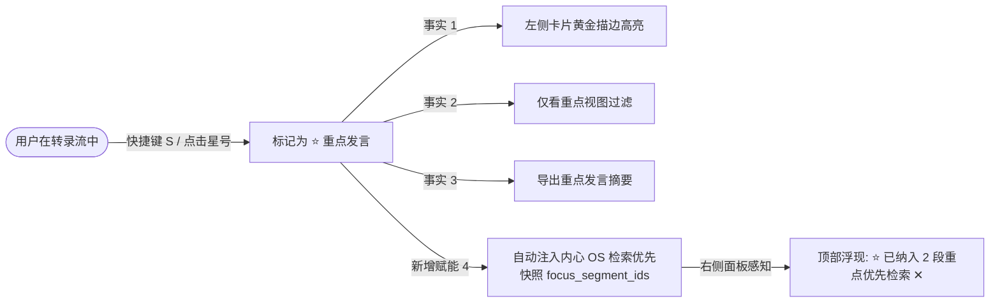
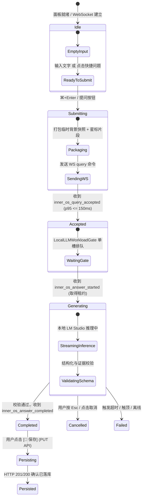

# Voice Studio 会议助手『内心 OS』前端 UI/UX 设计方案

> **设计版本**：V2.0.0  
> **设计重点**：架构复核、适应性布局与内心 OS 交互  
> **关联技术规范**：`docs/superpowers/specs/2026-08-27-meeting-inner-os-design.md`  
> **关联实施计划**：`docs/superpowers/plans/2026-08-27-meeting-inner-os-p0-p1.md`  
> **核心设计定位**：**私密 · 证据 · 弹性 · 专注 · 10秒即时价值**

---

## 1. 现有会议模式 UI/UX 盘点与深度复核诊断

在引入“内心 OS”（私密实时副驾驶）前，会议模式（Meeting Assistant）已具备成熟的录制与管理体系。为确保系统不因新增副驾驶面板而导致界面拥挤、层级混乱或认知过载，我们对现有 5 大视图与交互流进行了全景审查：

### 1.1 现有视图资产盘点

```text
┌───────────────────────────────────────────────────────────────────────────────────────┐
│ Voice Studio 会议模式视图体系                                                         │
├───────────────────┬───────────────────────────────────┬───────────────────────────────┤
│ 模块 / 视图       │ 现有承担功能                      │ 现有布局形式                  │
├───────────────────┼───────────────────────────────────┼───────────────────────────────┤
│ 1. 历史会议边栏   │ 会议列表、搜索、状态筛选、置顶卡片│ 固定常驻左侧 (280px ~ 320px)  │
│ 2. 闲置准备视图   │ 标题填写、人数设置、健康就绪检查  │ 单栏居中卡片                  │
│ 3. 实时录制工作台 │ 转录流(时序/阅读)、波形、标星、VU │ 主工作区 + 单行超宽工具栏     │
│ 4. 封存冲刷视图   │ EOF 等待、冲刷进度、防误触        │ 居中等待态                    │
│ 5. 历史详情视图   │ 转录流、AI结构化纪要、导出分享    │ 可拖拽 Split 双栏 (48% : 52%) │
└───────────────────┴───────────────────────────────────┴───────────────────────────────┘
```

### 1.2 关键痛点与交互冲突诊断 (Pain Points & Bottlenecks)

1. **🔴 痛点一：历史侧边栏常驻占用空间 (280px Screen Real Estate Waste)**
   - **现状**：`MeetingHistorySidebar` 占据固定 `280px ~ 320px` 宽度，无论在会议录制中还是在查看双栏详情时都强制显示。
   - **冲突**：当引入内心 OS 面板（需要 `360px ~ 420px` 宽度）后，桌面端演变为“三栏结构”（`左侧边栏 280px + 转录区 540px + 内心OS 380px = 1200px+`）。在 13/14 寸 MacBook（1280px ~ 1440px 视口或分屏半屏）下，转录卡片被极度压缩，段落频繁折行，阅读体验急剧恶化。
   - **结论**：**历史侧边栏必须支持可收起折叠（Collapsible）**，录制时支持沉浸聚焦模式。

2. **🔴 痛点二：录制工具栏信息密度过载 (Toolbar Overcrowding)**
   - **现状**：`MeetingRecordingView` 顶部单行内塞入了 **9 个控件**（计时器、VU 电平条、已确认数/发言人数/校准态字样、时序/阅读切换器、标记重点按钮、仅看重点筛选器、结束会议按钮）。
   - **冲突**：若再在顶部增加“内心 OS 展开/收起”、“私密状态”与“麦克风快捷控制”，工具栏在 `< 1300px` 宽度下必然发生组件换行或截断。
   - **结论**：**必须重构工具栏为逻辑三簇体系（状态簇 / 视图簇 / 副驾驶与控制簇）**，并支持响应式动态折叠。

3. **🔴 痛点三：历史详情页缺乏对“问答档案”的容纳空间 (Detail View Scalability)**
   - **现状**：`MeetingDetailView` 现为双栏（左转录 + 右 AI 纪要）。
   - **冲突**：会中保存的内心 OS 问答也是关键会议资产。若在详情页强行增加第三栏将不可用；若完全隐藏则违背了“会中即时、会后回溯”的连续性。
   - **结论**：**右侧面板升级为分段选项卡（Segmented Tabs: 📋 AI 纪要 | 🔒 内心 OS 问答档案 | 📝 Markdown）**，保持优雅双栏，无缝切换。

4. **🔴 痛点四：证据溯源交互缺少统一视觉退火标准 (Scattered Evidence Anchoring)**
   - **现状**：AI 纪要中点击决策/议题的证据段时，仅简单设置高亮类名。
   - **冲突**：内心 OS 答案同样有大量 `[S0001]` 证据胶囊。若两套证据跳转动画、高亮色调、退火清除机制不统一，用户会产生认知混乱。
   - **结论**：**抽象统一的证据定位微交互协议**（平滑滚动居中 + 来源语义脉冲 + 3 秒自动退火）。

5. **🔴 痛点五：重点发言星标 (⭐) 的孤岛化 (Isolated Star Asset)**
   - **现状**：转录流的标星功能仅用于本地高亮与导出过滤，未参与模型计算。
   - **机遇**：内心 OS 可原生消费 `focus_segment_ids`。将星标发言作为内心 OS 的“检索加权信号”，使会中的关键标记产生即时 AI 价值。

---

## 2. 适应性优化方案 (Adaptive UX Optimizations)

基于上述复核诊断，我们提出 5 项针对现有 UI/UX 的适应性升级方案：

### 2.1 优化 1：历史侧边栏智能收起折叠体系 (Collapsible History Sidebar)

```text
【展开态 (Expanded: 280px)】               【收起态 (Collapsed: 0px / 极简悬浮)】
+-------------------------+               +---+-----------------------------------------+
| 📁 历史会议    [◧ 收起] |               | ◨ | 🔴 00:14:32  已确认 42 段  [⏱️ 时序 | 📖 阅读] |
| ----------------------- |   快捷键      | 历| --------------------------------------- |
| 🎙️ 当前会议 (录制中)   |  <kbd>⌘+B</kbd> | 史|                                         |
| 🔴 00:14:32 42段转录   | <============>| 悬|              实时转录主工作区            |
| ----------------------- |               | 浮|           (享有充裕的 65% 视口宽度)       |
| 🔍 搜索历史会议...     |               | 条|                                         |
| [全部] [录制中] [已完成]|               |   |                                         |
| 2026-08-27 网关架构评审 |               |   |                                         |
| 2026-08-26 需求澄清会   |               |   |                                         |
+-------------------------+               +---+-----------------------------------------+
```

#### 设计规范：
- **触发入口**：
  1. 侧边栏头部右上角增加 `[◧ 收起边栏]` 按钮；
  2. 收起后在主工作区左上角浮现极简毛玻璃图标 `[◨ 展开历史 (⌘+B)]`；
  3. 支持全局快捷键 <kbd>⌘</kbd> + <kbd>B</kbd> (Mac) / <kbd>Ctrl</kbd> + <kbd>B</kbd> (Win)；
- **智能自适应行为**：
  - **进入录制模式时**：系统自动触发平滑收起动画（过渡时间 `0.25s`），释放 280px 宽度给转录与内心 OS；用户仍可随时按 `⌘+B` 展开；
  - **退出录制 / 浏览历史时**：自动恢复用户先前的展开/收起偏好；
- **后台录制微型指示**：侧边栏收起后，如果后台有会议正在录制，浮动栏保留微型呼吸胶囊（`🔴 00:14:32`），保证会话不丢失。

---

### 2.2 优化 2：录制中顶部工具栏三簇解耦重构 (Recording Toolbar Re-clustering)

将原先拥挤的 9 个控件重排为**三簇响应式架构**：

```text
+---------------------------------------------------------------------------------------------------------+
| [左簇: 状态与声学]                [中簇: 视图模式与重点]                  [右簇: 副驾驶与主控]                  |
| ◨ 🔴 00:14:32 [||||] 42段·3人    [ ⏱️ 时序 | 📖 阅读 ]  ⭐ 重点(4) [仅看]   [🔒 内心OS ▾] [🎤 静音] [⏹️ 结束会议] |
+---------------------------------------------------------------------------------------------------------+
```

#### 三簇职责清晰化：
1. **左簇【状态与声学】**：
   - 包含边栏折叠 Trigger `[◨]`、录制红点 + 计时器 `00:14:32`、微型 VU 电平表 `[||||]`、紧凑状态文字（`42段 · 3人`）；
   - 超窄视口（`< 1100px`）自动省略文字，保留计时与电平图标。
2. **中簇【视图模式与重点】**：
   - `[⏱️ 时序视图 | 📖 阅读视图]` 胶囊切换器；
   - `⭐ 重点 (4)` 计数与 `[仅看重点]` 切换开关；
3. **右簇【副驾驶与主控】**：
   - **【🔒 内心 OS】切换开关**：带活动小圆点（生成中紫光呼吸），支持快捷键 <kbd>⌘</kbd> + <kbd>K</kbd>；
   - **【🎤 静音 (M)】**：独立高对比度静音切换；
   - **【⏹️ 结束会议】**：危险操作独立防误触红底按钮。

---

### 2.3 优化 3：历史会议详情页三合一分段选项卡 (Unified Detail Tabs)

在 `MeetingDetailView` 中，左侧继续保留完整的转录浏览器与证据定位锚点，右侧升级为**多维分析控制台**：

```text
+---------------------------------------------------------------------------------------------------------+
| Top Bar: 2026-08-27 网关架构评审会   [📅 08/27 14:00] [⏱️ 45分] [🎙️ 84段]   [ 📥 导出记录 ▾ ]   [ 🗑️ 删除 ] |
+----------------------------------------------------+----------------------------------------------------+
| 📜 会议转录流 (Transcript Viewer)                  | 右侧多维面板 (Analysis Console)                    |
|                                                    | +------------------------------------------------+ |
| [👤 李工 00:01:20]                                 | | [✨ AI 结构化纪要]  [🔒 内心 OS 档案 (3)]  [📝 MD] | |
| 关于这次架构迁移，网关层必须在周五前完成验收...     | +------------------------------------------------+ |
|                                                    | 共有 3 条会中保存的私密问答记录:                   |
| [👤 张总 00:01:45]                                 | ┌────────────────────────────────────────────────┐ |
| ⭐ 数据库读写延迟不超过 15ms。                      | │ 🙋 Q: 刚才张总对网关延时有什么要求？           │ |
| (✨ 此时正处于高亮呼吸状态...)                      | │ 🟢 证据有效 · 引用 2 段转录                    │ |
|                                                    | │ 📋 事实: 灰度期延迟必须 < 15ms [📎 S0002 ↗]    │ |
| [👤 王工 00:02:10]                                 | │ ✍️ 草稿: “张总，已确认延迟指标...” [复制]     │ |
| 好的，我们会增加 Redis 旁路缓存...                  | │ ⏱️ 保存于 14:28:12                     [🗑️] │ |
|                                                    | └────────────────────────────────────────────────┘ |
+----------------------------------------------------+----------------------------------------------------+
```

#### 优势：
- 避免在详情页增加第三栏导致界面破碎；
- 无论是查看正式的 AI 会议纪要，还是翻阅会中自己提问的私密草稿与依据，均可在右侧一键无缝切换。

---

### 2.4 优化 4：全流程统一证据溯源与退火动效协议 (Unified Evidence Anchoring Protocol)

```text
           [ 点击 AI 纪要证据 ]                          [ 点击 内心 OS 证据 ]
                    │                                             │
                    └──────────────────────┬──────────────────────┘
                                           │
                                           ▼
                    ┌─────────────────────────────────────────────┐
                    │ 1. 计算目标 segment DOM 坐标                │
                    │ 2. 执行 smooth 居中平滑滚动                 │
                    │ 3. 注入动态语义光效 (翡翠绿 / 紫罗兰微光)   │
                    │ 4. 启动 3 秒 CSS Keyframes 呼吸动效         │
                    │ 5. 3 秒后平滑过渡清除 (退火)，保持界面清爽  │
                    └─────────────────────────────────────────────┘
```

#### 动效 CSS 规范：
```css
@keyframes evidence-pulse-inneros {
  0% { box-shadow: 0 0 0 0 rgba(139, 92, 246, 0.6); border-left-color: #8b5cf6; }
  50% { box-shadow: 0 0 18px 4px rgba(139, 92, 246, 0.35); border-left-color: #a78bfa; }
  100% { box-shadow: 0 0 0 0 rgba(139, 92, 246, 0); }
}

.segment-card.is-evidence-target-inneros {
  animation: evidence-pulse-inneros 3s cubic-bezier(0.4, 0, 0.2, 1) forwards;
}
```

---

### 2.5 优化 5：星标重点资产流动与内心 OS 上下文联动 (Star Asset Synergy)



- **双向独立原则**：星标属于转录事实元数据；内心 OS 仅将其作为只读加权信号。用户若在内心 OS 点击 `[✕ 解除]`，仅取消本次提问加权，不破坏转录流已有的星标记录。

---

## 3. 全局工作区弹性信息架构与线框设计

### 3.1 会议录制工作台（历史边栏收起 + 内心 OS 展开）

这是会中最核心、最高频的沉浸生产力形态：

```text
+---------------------------------------------------------------------------------------------------------+
| ◨ 🔴 00:14:32 [||||] 42段·3人    [ ⏱️ 时序 | 📖 阅读 ]  ⭐ 重点(4) [仅看]   [🔒 内心OS ▾] [🎤 静音] [⏹️ 结束会议] |
+--------------------------------------------------------------------+------------------------------------+
|                                                                    | 🔒 内心 OS · 仅你可见      [⛶ 展开|收起] |
|                                                                    +------------------------------------+
|                                                                    | 📝 本次临时目标/背景 (仅内存) [版本 v2] ▾ |
|                       左侧：实时转录流                             +------------------------------------+
|                     (Live Transcript Area)                         | 🎯 检索加权: ⭐ 4 段重点发言 [✕ 解除]   |
|                 (占视口 62%，阅读视线开阔)                          | 快捷提问:                           |
|                                                                    | [⚡ 回顾刚才结论] [🤝 明确承诺] [📝 帮我草拟] |
|  [👤 李工 00:01:20]                                                 +------------------------------------+
|  关于这次架构迁移，网关层必须在周五前完成验收并部署到预发环境。       | 💬 问答流 (Interaction Stream)     |
|                                                                    | ┌────────────────────────────────┐ |
|  [👤 张总 00:01:45]                                                 | │ Q: 刚才张总对网关延时有什么要求？│ |
|  ⭐ 同意，但必须确保灰度期间数据库读写延迟不超过 15ms。 (已星标)    | ├────────────────────────────────┤ |
|                                                                    | │ 📋 事实依据 (Facts)            │ |
|  [👤 王工 00:02:10]                                                 | │ • 灰度期数据库读写延迟 < 15ms  │ |
|  好的，我们会增加 Redis 旁路缓存，并在压测报告中单独列出该指标。      | │   [📎 S0002 · 张总 00:01:45 ↗] │ |
|                                                                    | ├────────────────────────────────┤ |
|  [✍️ 实时识别中...]                                                 | │ 🧠 模型判断 (Judgements)       │ |
|  我们正在准备明天的压测方案...                                      | │ • 需在压测报告中单列监控指标   │ |
|                                                                    | │   [低不确定性] 原因: 会议已明确│ |
|                                                                    | ├────────────────────────────────┤ |
|                                                                    | │ ✍️ 建议回应草稿 (Draft)        │ |
|                                                                    | │ “张总，已确认要求延迟 <15ms...”│ |
|                                                                    | │ [📋 复制草稿]                   │ |
|                                                                    | ├────────────────────────────────┤ |
|                                                                    | │ ⏱️ 1.2s · [💾 保存] [🔄 重提]  │ |
|                                                                    | └────────────────────────────────┘ |
|                                                                    +------------------------------------+
|                                                                    | 📥 输入问题... (⌘+Enter 发送) [取消] |
|                                                                    | [ 意图: 混合 ▾ ]               [提问 ➔] |
+--------------------------------------------------------------------+------------------------------------+
```

### 3.2 会议录制工作台（内心 OS 折叠态）

当用户不需要副驾驶时，内心 OS 可完全折叠为右侧边缘极简条，转录流独占 100% 视口宽度：

```text
+---------------------------------------------------------------------------------------------------------+
| ◨ 🔴 00:14:32 [||||] 42段·3人    [ ⏱️ 时序 | 📖 阅读 ]  ⭐ 重点(4) [仅看]   [🔒 开启内心OS (⌘+K)] [🎤] [⏹️ 结束]  |
+---------------------------------------------------------------------------------------------------------+
|                                                                                                         |
|                                       全景实时转录流 (100% 宽度)                                         |
|                                                                                                         |
|  [👤 李工 00:01:20]                                                                                      |
|  关于这次架构迁移，网关层必须在周五前完成验收并部署到预发环境。                                            |
|                                                                                                         |
|  [👤 张总 00:01:45]                                                                                      |
|  ⭐ 同意，但必须确保灰度期间数据库读写延迟不超过 15ms。                                                  |
|                                                                                                         |
+---------------------------------------------------------------------------------------------------------+
```

---

## 4. 核心组件交互设计与线框图

### 4.1 答案呈现卡片：`InnerOSAnswerCard`

```text
+=======================================================================+
| 🙋 Q: 刚才关于网关延迟的结论和后续待办是什么？                         |
| <span class="badge-intent">意图: 事实回顾 (Fact)</span>  <span class="time-tag">14:28:10 (耗时 1.8s)</span>  |
+-----------------------------------------------------------------------+
|                                                                       |
| 📋 已确认事实 (Facts)                                                 |
| --------------------------------------------------------------------- |
| • 数据库读写延迟在灰度阶段必须保持在 15ms 以内。                      |
|   [ 📎 S0002 · 张总 00:01:45 ↗ ]                                     |
|                                                                       |
| • 王工团队负责在压测报告中单列 Redis 缓存与网关延迟指标。             |
|   [ 📎 S0003 · 王工 00:02:10 ↗ ]                                     |
|                                                                       |
| --------------------------------------------------------------------- |
| 🧠 模型推断与风险 (Judgements)                                         |
| --------------------------------------------------------------------- |
| • 预发验证与全量上线之间的时间窗口较为紧迫，存在压测不充分风险。      |
|   <span class="badge-uncertainty medium">中度不确定性</span> 依据: [📎 S0001 ↗]  |
|   <span class="uncertainty-reason">成因: 会议中尚未明确压力测试的具体执行工期</span> |
|                                                                       |
| --------------------------------------------------------------------- |
| ✍️ 发言回应草稿 (Draft)                                               |
| ┌───────────────────────────────────────────────────────────────────┐ |
| │ “关于 15ms 延迟指标，我们已在压测计划中增加专项目标。建议周四下午  │ |
| │ 安排专项用例评审，以确保周五按时交付预发。”                       │ |
| └───────────────────────────────────────────────────────────────────┘ |
| [ 📋 复制发言草稿 ]  <span class="copy-hint">（仅供参考，请由您自行决定是否说出）</span> |
|                                                                       |
| --------------------------------------------------------------------- |
| ⚠️ 局限性说明 (Limitations)                                           |
| --------------------------------------------------------------------- |
| ℹ️ 检索上下文已包含前 42 段转录（未发生裁剪）                          |
|                                                                       |
+-----------------------------------------------------------------------+
| 底部操作条 (Action Bar):                                              |
| [ 💾 保存到会议记录 ]   [ 📋 复制全部答案 ]   [ 🔄 重新提问 ]   [ 🗑️ 丢弃 ] |
+=======================================================================+
```

### 4.2 会毕暂存托盘：`InnerOSUnsavedTray`

```text
+---------------------------------------------------------------------------------------------------------+
| ⚠️ 本次会议有 2 条临时问答尚未保存  (服务端缓存剩余有效期: 28分30秒)                   [💾 全部保存]  [✕ 忽略] |
| ------------------------------------------------------------------------------------------------------- |
| • Q: 刚才关于网关延迟的结论和后续待办是什么？   [已完成 · 2条事实 / 1条草稿]              [ 💾 保存本条 ] [ 查看 ▾ ] |
| • Q: 张总对灰度上线是否有明确反对意见？       [已完成 · 1条事实]                        [ 💾 保存本条 ] [ 查看 ▾ ] |
+---------------------------------------------------------------------------------------------------------+
```

---

## 5. 组件状态机与生命周期交互矩阵



### 状态反馈矩阵

| 状态 | 状态指示器 | 视觉动效与反馈 | 允许的用户交互 |
|---|---|---|---|
| **`idle`** | 🟢 `已就绪` | 快捷提问按钮高亮，输入框可键入 | 编辑临时背景、点击快捷问题、勾选重点加权 |
| **`accepted`** | 🟡 `排队中` | 脉冲动效，文案：“正在调配本地推理资源...” | 点击 `[⏹️ 取消]` 或按 `Esc` |
| **`generating`** | 🟣 `思考中` | 紫罗兰微光骨架屏 (Shimmer)，实时计时 `⏱️ 2.4s` | 点击 `[⏹️ 取消]` 或按 `Esc` |
| **`completed`** | 🟢 `生成完毕` | 展开三层卡片，`[S0001]` 胶囊可点击 | 复制草稿、定位证据、点击保存、重新提问 |
| **`persisted`** | 🔒 `已归档` | 保存按钮变为绿色对勾 `✓ 已保存到会议档案` | 复制文本、查看证据、单条删除 |
| **`failed`** | 🔴 `生成遇到问题` | 友好错误提示卡（如“模型服务超时”），提供一键重试 | 点击 `[🔄 重新尝试]` |

---

## 6. 视觉规范与 Design Tokens

内心 OS 采用 **Voice Studio Design System** 的玻璃拟态体系，引入专属**私密紫罗兰 (`#8b5cf6`)**：

```css
:root, [data-theme="dark"] {
  /* 主题色：私密紫罗兰 (Electric Violet) */
  --mod-inneros-accent: #8b5cf6;
  --mod-inneros-accent-hover: #7c3aed;
  --mod-inneros-accent-subtle: rgba(139, 92, 246, 0.14);
  --mod-inneros-glow: rgba(139, 92, 246, 0.28);
  --mod-inneros-card-bg: rgba(24, 18, 43, 0.75);

  /* 事实依据：翡翠绿 */
  --inneros-fact-accent: #34d399;
  --inneros-fact-bg: rgba(52, 211, 153, 0.12);

  /* 判断推测三档色 */
  --inneros-judgement-low: #22d3ee;        /* 低不确定性：青蓝 */
  --inneros-judgement-medium: #fbbf24;     /* 中不确定性：琥珀金 */
  --inneros-judgement-high: #f87171;       /* 高不确定性：珊瑚红 */

  /* 草稿底色 */
  --inneros-draft-bg: rgba(30, 41, 59, 0.85);
}
```

---

## 7. 全局键盘流与快捷键矩阵 (Keybindings)

| 快捷键 | 上下文 | 动作说明 |
|---|---|---|
| <kbd>⌘</kbd> + <kbd>B</kbd> / <kbd>Ctrl</kbd> + <kbd>B</kbd> | 全局任意状态 | **展开 / 收起历史会议侧边栏 (释放 280px)** |
| <kbd>⌘</kbd> + <kbd>K</kbd> / <kbd>Ctrl</kbd> + <kbd>K</kbd> | 录制视图 | **展开 / 折叠右侧内心 OS 面板并聚焦输入框** |
| <kbd>⌘</kbd> + <kbd>Enter</kbd> / <kbd>Ctrl</kbd> + <kbd>Enter</kbd> | 输入框聚焦 | **提交当前问题与临时背景快照** |
| <kbd>Esc</kbd> | 生成中 (`generating`) | **立即取消活动问答并中断本地推理** |
| <kbd>Esc</kbd> | 临时背景展开态 | **收起临时背景抽屉** |
| <kbd>Esc</kbd> | 历史详情浏览状态 | **返回正在录制的实时会议工作台** |
| <kbd>S</kbd> (无聚焦时) | 录制视图 | **标记/取消当前片段或最新发言为重点（⭐ 联动加权）** |
| <kbd>M</kbd> (无聚焦时) | 录制视图 | **切换麦克风静音** |

---

## 8. 前端工程结构与落地清单 (Frontend Implementation Mapping)

按照实施计划 [2026-08-27-meeting-inner-os-p0-p1.md](file:///Users/hrygo/Documents/voice-realtime/docs/superpowers/plans/2026-08-27-meeting-inner-os-p0-p1.md) Task 12 与 Task 13，前端实现完全隔离在专属 Feature 目录下：

```text
ui/src/features/innerOS/
├── contracts.ts                 # 严格契约类型与运行时安全校验
├── api.ts                       # REST API 客户端 (PUT save / GET history / DELETE)
├── innerOSStore.ts              # Zustand 局部状态 (仅内存，不接入 persist)
├── useInnerOSSocket.ts          # 私有 WebSocket 连接管理与状态机
├── metrics.ts                   # 无内容无敏感信息的本地聚合 North Star 指标计算
├── InnerOSPanel.tsx             # 主入口容器组件 (Header + Context + Stream + Input)
├── InnerOSAnswerCard.tsx        # 结构化回答卡片 (Facts / Judgements / Draft / Limits)
├── InnerOSEphemeralContext.tsx  # 临时目标/议程/背景输入抽屉组件
├── InnerOSQuickPills.tsx        # 快捷提问胶囊与重点加权指示器
├── InnerOSEvidenceItem.tsx      # 证据胶囊条目与滚动锚点触发器
├── InnerOSUnsavedTray.tsx       # 会毕 30min TTL 暂存托盘组件
├── InnerOSHistoryTab.tsx        # MeetingDetailView 历史问答归档面板
├── InnerOSPanel.css             # 遵循 Design System 的玻璃拟态样式表
└── index.ts                     # 模块统一导出
```

---

## 9. 适应性设计验收清单 (UX Verification Checklist)

- [ ] **边栏折叠流程度**：按 `⌘+B` 或点击折叠按钮，历史边栏平滑收起/展开，过渡时间 $\le 250\text{ms}$，无闪烁与布局跳变。
- [ ] **录制工具栏自适应**：在 1024px ~ 1920px 视口下，三簇式工具栏均不发生文字换行或按钮溢出。
- [ ] **内心 OS 面板弹性**：在侧边栏折叠时，内心 OS 面板保持 380px，主转录流自适应填满剩余空间（约 65%）。
- [ ] **证据溯源统一性**：无论从 AI 纪要还是内心 OS 点击证据，目标发言均能平滑居中并触发 3 秒光效退火。
- [ ] **详情页选项卡切换**：`[✨ AI 纪要]` 与 `[🔒 内心 OS 档案]` 切换自如，已保存问答状态（🟢/🟡/🔴）准确渲染。
- [ ] **即焚性与单机安全性**：局域网访问时 fail-closed 提示，临时背景刷新后 100% 清空。
