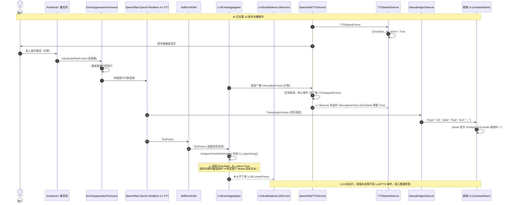

# 语音交互打断后推理挂起故障排查与修复方案

> **状态**：排查完成，已修复落地  
> **日期**：2026-09-01（历史故障：2026-08-25）
> **影响范围**：Sona 语音交互助手（`sona-ui` / `sona-interact`）、Pipecat 交互管道、SpeechRail STT/TTS、回声抑制状态机、LM Studio 原生会话链

> 本文的故障发生在 SpeechRail 迁移前，原始链路名称保留在复盘中用于溯源；当前 TTS 已由
> `SpeechRailTTSService` 提供，ASR 已由 SpeechRail OpenAI Realtime `/v1/realtime` 提供。以下 EchoState 复位、取消
> 传播、有限超时和上下文恢复原则仍是当前交互链的有效防线。

---

## 1. 问题背景与现象复盘

### 1.1 故障现象
在 Sona 交互面板（耳机打断模式或外放模式）中，当 AI 助手正在进行流式语音播报（例如第 10 轮播报长句子：*“今天天气真不错，阳光暖暖的，微风轻轻吹过，让人心情特别好。”*）时，用户发声打断（插话 / Barge-in）：
1. 顶部状态栏步骤停滞在 **`2. LM Studio 推理`**；
2. 右上角常驻 **`🧠 思考`** 徽标；
3. 声学波形处于持续动态律动；
4. 聊天流中不再输出 AI 新回复内容，扬声器无声，系统进入死锁/挂起状态（直到 15 秒前端看门狗超时强制重置为 `idle`）。

### 1.2 状态时序流转



---

## 2. 深入根因剖析（Root Causes）

### 2.1 历史根因一：`TTSStateObserver` 漏监听打断帧，导致 `EchoState` 永久挂死在抑制态（已修复）
- **核心文件**：[`src/sona/interaction/pipeline.py`](../../src/sona/interaction/pipeline.py)
- **机制**：
  1. AI 播报开始时，`TTSStateObserver` 收到 `TTSStartedFrame`，将 `_echo_state._tts_active` 设为 `True`；
  2. 用户打断时，Pipecat 管道在上下游广播 `InterruptionFrame`，`TTSService` 立即取消生成并清空队列，**但不会发送 `TTSStoppedFrame` 或 `BotStoppedSpeakingFrame`**；
  3. `TTSStateObserver` **仅监听了 `TTSStartedFrame` / `TTSStoppedFrame` / `BotStartedSpeakingFrame` / `BotStoppedSpeakingFrame`**，未对 `InterruptionFrame`、`CancelFrame` 或 `ErrorFrame` 作出响应；
  4. 这导致 `_echo_state._tts_active` 与 `_echo_state.bot_speaking` 永久保持在 `True`，`_echo_state.is_suppressing()` 永久返回 `True`；
  5. 插话识别完成后，`HangoverUserMuteStrategy`（挂在 `pair.user()` 内）调用 `is_suppressing()` 返回 `True`，**判定用户处于静音窗口，直接吞掉打断文本帧**；
  6. `LLMUserAggregator` 不再下发 `LLMContextFrame`，LLM 未被激活，也不产生 `LLMFullResponseEndFrame`，前端在收到 `stt: final` 进入 `thinking` 状态后陷入死等。

---

### 2.2 历史根因二：`SelfEchoFilter` 语义防线在状态未复位时误杀插话文本（已修复）
- **核心文件**：[`src/sona/interaction/pipeline.py`](../../src/sona/interaction/pipeline.py)
- **机制**：
  - `SelfEchoFilter` 的生效前提同样是 `_echo_state.is_suppressing() == True`；
  - 打断前播报的长句已写入 `EchoTextBuffer`；
  - 若用户插话语句中包含了与机器人前文相似的词汇或短语（或被 ASR 识别为近音词），在 `_echo_state` 处于抑制残留态时，`SelfEchoFilter` 会在 `stt` 之后直接丢弃 `TextFrame`；
  - `StatusBridgeObserver` 在 STT 层捕获了该文本并通知 UI 上屏且转入思考态，但下游 LLM 因被 Drop 无法被唤醒。

---

### 2.3 历史根因三：LM Studio 原生会话链断裂与非交替历史恢复异常（已修复）
- **核心文件**：[`src/sona/interaction/reasoning.py`](../../src/sona/interaction/reasoning.py)、[`context_memory.py`](../../src/sona/interaction/context_memory.py)
- **机制**：
  1. 如果打断发生时 LLM 仍在流式输出中，HTTP 流被 `asyncio.CancelledError` 取消，Python 端的 `_previous_response_id` 维持旧值，但 LM Studio 端已持久化了未完成的 session；
  2. 下一轮重新恢复上下文（`_recover_invalid_chain`）时，由于被打断的一轮缺少 assistant 文本，Pipecat 的 `context.messages` 出现连续两条 user 消息（`[system, user_n, user_{n+1}]`）；
  3. `normalize_completed_turns` 要求严格的 `user-assistant` 轮流交替，检测到异常角色历史直接抛出 `ValueError("conversation roles must alternate user and assistant")`，导致上下文恢复彻底失败抛错；
  4. 此外，`LmStudioNativeLLMService` 创建的 HTTP 客户端配置了 `read=None`（无读超时）。若 LM Studio 服务端因并发锁或后台压缩任务排队，客户端将无限期阻塞。

---

## 3. 日志排查特征对照表

在排查打断卡住问题时，可在终端运行日志中核对以下关键日志事件：

| 阶段 | 正常日志 | 异常/卡死日志 | 诊断结论 |
|---|---|---|---|
| **声学打断** | `echo-suppress: 检测到真人插话（能量门控），放行音频` | 缺失该日志且麦克风被 Drop | 未达到能量门限，音频在物理层被抑制 |
| **打断状态流转** | 管道广播 `InterruptionFrame` ➔ `TTSStateObserver` 重置 `EchoState` | 仅下发打断帧，无 `EchoState.reset()`，无 `TTS 生成结束` | 🔴 **根因一**：状态机未解除闭麦 |
| **STT 转写** | `TranscriptionFrame(text='...')` | 正常产出文本 | STT 工作正常 |
| **自回声过滤** | 正常放行 `TextFrame` | `self-echo: 丢弃与机器人近端播报相似的用户转写 ...` | 🔴 **根因二**：插话被语义层误杀 |
| **LLM 激活** | `POST /api/v1/chat` 发起流式推理 | **无任何 LLM 请求发出** | 🔴 用户输入在 Aggregator 内被静音吞掉 |
| **上下文恢复** | 正常预热链或延续 `previous_response_id` | `ValueError: conversation roles must alternate user and assistant` 或 `上下文恢复失败` | 🔴 **根因三**：角色交替校验异常崩溃 |

---

## 4. 修复与优化方案

### 4.1 已落地修复 1：`TTSStateObserver` 接入打断帧监听（高优先级）
在 `TTSStateObserver.process_frame` 中增加对 `InterruptionFrame`、`CancelFrame`、`ErrorFrame` 的处理：
```python
# src/sona/interaction/pipeline.py
class TTSStateObserver(FrameProcessor):
    async def process_frame(self, frame: Frame, direction: FrameDirection) -> None:
        await super().process_frame(frame, direction)
        if isinstance(frame, TTSStartedFrame):
            self._echo_state.on_tts_started()
        elif isinstance(frame, BotStartedSpeakingFrame):
            self._echo_state.on_bot_speaking_started()
        elif isinstance(frame, TTSStoppedFrame):
            self._echo_state.on_tts_stopped()
        elif isinstance(frame, BotStoppedSpeakingFrame):
            self._echo_state.on_bot_speaking_stopped()
        elif isinstance(frame, (InterruptionFrame, CancelFrame, ErrorFrame)):
            # 遇到打断或取消，强制复位 EchoState，立即解除物理闭麦与静音策略
            self._echo_state.reset()

        await self.push_frame(frame, direction)
```

### 4.2 已落地修复 2：`SelfEchoFilter` 增加打断感知与缓冲区安全窗口
在 `SelfEchoFilter` 中监听 `InterruptionFrame`，在打断发生时重置内部抑制状态或将近期匹配敏感度降低，避免真人打断文本被误拦截。

### 4.3 已落地修复 3：`normalize_completed_turns` 增强容错（防御性编程）
允许 `normalize_completed_turns` 兼容处理因打断导致的连续 `user` 消息（自动合并相邻 `user` 文本或以最新一条为准），防止打断重试时抛出未捕获的 `ValueError`。

### 4.4 已落地修复 4：LM Studio 原生请求增加读超时熔断
在 `LmStudioNativeLLMService` 中避免 `read=None` 的无界等待，配置合理的流式 TTFT 超时（例如 15 秒），并在超时时触发会话链原子重置。
