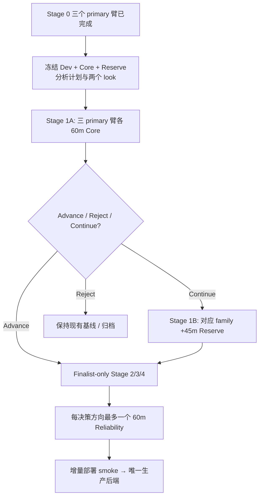
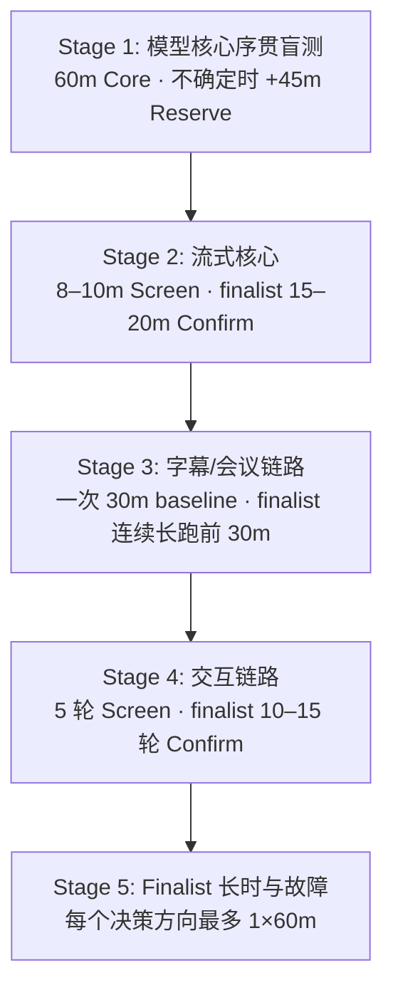
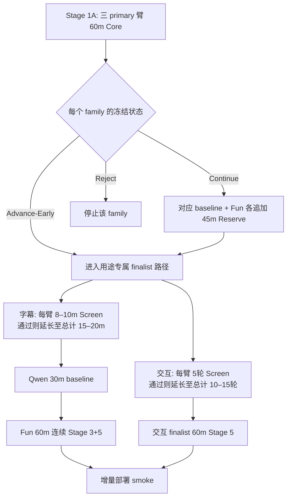

# Fun-ASR 与现有 ASR 后端科学对比测试方案

> **环境基准**：Apple M5 Max / 128GB 统一内存 / macOS 26.6.2 / Python 3.12.14 / PyTorch 2.13.0 (MPS)
> **核心决策**：(1) 字幕/会议 ASR 选型 (`Qwen3-ASR` vs `Fun-ASR-Nano`)；(2) 交互 STT 选型 (`SenseVoiceSmall` vs `Fun-ASR-Nano`)
> **方案版本**：v1.3（`60 min Core + 45 min Reserve` 序贯盲测；允许明确降级的公共运营代理证据）
> **状态**：**历史评测已完成（2026-08-25）；Fun-ASR 两个 family 均触发 futility，Reserve 不启封；该结果不代表当前 SpeechRail 部署验收**

> ⚠️ **当前边界（2026-09-01）**：本文记录的是 SpeechRail 迁移前的本地模型/WS 实验。当前代码不再
> 运行本文中的 WLK、SenseVoice、Fun-ASR 或本地 Qwen3-ASR worker；当前 ASR/TTS 运行时与真实服务验收
> 以 [ADR-0011](../decisions/0011-speechrail-only-asr.md)、[SpeechRail OpenAI Realtime 交割单](../operations/SpeechRail-OpenAI标准协议功能需求交割单.md)
> 和当前代码为准。

> **v1.2 修订摘要**：v1.1 的 105 分钟完整 Blind Set 保留为最大证据集，但拆为预冻结的 60 分钟
> Core 与 45 分钟 Reserve，只在两个固定 look 做决策；完整 Public 移出选型关键路径；三个 primary
> 实验臂已完成统一 Stage 0；Stage 2/4 先 screen、finalist 再 confirm；Stage 3 候选的前 30 分钟与 60 分钟
> reliability 长跑共用同一连续会话；Stage 5 只由每个决策方向的最终候选执行；生产收敛不重复已有
> Stage 3/4/5 主测量。决策理由见 [ADR-004](../decisions/0004-asr-sequential-evaluation.md)。

> **v1.3 执行摘要**：由于本机没有已授权的私有目标域录音，采用 AISHELL-4 Test + ASCEND 构建
> `public-operational-proxy-v2-20260825`。它满足预冻结、互斥 cluster、盲推理、显式开盲和程序化决策
> 契约，但证据类别明确为 `public-operational-proxy`，不冒充目标域。三臂 Core 严格串行完成后，
> Fun-ASR 相对 Qwen 与 SenseVoice 的条件功效分别约为 `3.8e-12` 与 `7.1e-6`，均低于 0.20；程序化
> 结论为 `futility_rejected=true`，同时因完整设计功效不足而降级为 `Experimental / No decision`。
> 因此停止 Reserve 与 Stage 2–5，不替换现有后端。

---

## 📑 方案目录

1. [目的与决策对象](#1-目的与决策对象)
   - 1.1 [当前落地状态（2026-08-25）](#11-当前落地状态2026-08-25)
   - 1.2 [本机执行顺序修订（2026-08-24）](#12-本机执行顺序修订2026-08-24)
   - 1.3 [选型后的收敛与清理原则](#13-选型后的收敛与清理原则)
2. [已知事实、假设与待检验项](#2-已知事实假设与待检验项)
   - 2.1 [当前实测与源码事实（2026-08-24）](#21-当前实测与源码事实2026-08-24)
   - 2.2 [候选事实](#22-候选事实)
   - 2.3 [预注册假设](#23-预注册假设)
3. [实验臂与可行性门禁](#3-实验臂与可行性门禁)
   - 3.1 [字幕/会议实验臂](#31-字幕会议实验臂)
   - 3.2 [排除臂](#32-排除臂)
   - 3.3 [Stage 0 可行性门禁](#33-stage-0-可行性门禁)
   - 3.4 [Stage 0 初步探测记录（2026-08-24 22:21-22:23 CST）](#34-stage-0-初步探测记录2026-08-24-2221-2223-cst)
   - 3.5 [Stage 0 runner 门禁结果（2026-08-24 22:47-22:48 CST）](#35-stage-0-runner-门禁结果2026-08-24-2247-2248-cst)
   - 3.6 [Stage 0 v1.2 三模型统一门禁结果（2026-08-25）](#36-stage-0-v12-三模型统一门禁结果2026-08-25)
4. [语料设计（轻量化与正交多标签）](#4-语料设计轻量化与正交多标签)
   - 4.1 [精简三层语料体系](#41-精简三层语料体系)
   - 4.2 [目标域序贯正交配额（60 min Core + 45 min Reserve）](#42-目标域序贯正交配额60-min-core--45-min-reserve)
   - 4.3 [标注协议](#43-标注协议)
   - 4.4 [归一化规则](#44-归一化规则)
   - 4.5 [数据冻结与防泄漏](#45-数据冻结与防泄漏)
5. [实验控制](#5-实验控制)
   - 5.1 [共同输入](#51-共同输入)
   - 5.2 [运行环境控制与高效采样](#52-运行环境控制与高效采样)
   - 5.3 [因子隔离](#53-因子隔离)
6. [指标定义](#6-指标定义)
   - 6.1 [准确率主指标](#61-准确率主指标)
   - 6.2 [关键词与语义敏感指标](#62-关键词与语义敏感指标)
   - 6.3 [流式指标](#63-流式指标)
   - 6.4 [分人与时间轴指标](#64-分人与时间轴指标)
   - 6.5 [性能与资源](#65-性能与资源)
   - 6.6 [可靠性与数据完整性](#66-可靠性与数据完整性)
7. [统计分析计划](#7-统计分析计划)
   - 7.1 [分析单位](#71-分析单位)
   - 7.2 [置信区间与检验](#72-置信区间与检验)
   - 7.3 [样本量与检验功效（Power 校验）](#73-样本量与检验功效power-校验)
   - 7.4 [最小实际意义](#74-最小实际意义)
8. [执行矩阵与耗时预算](#8-执行矩阵与耗时预算)
   - 8.1 [Stage 1：模型核心序贯盲测](#81-stage-1模型核心序贯盲测)
   - 8.2 [Stage 2：流式 Screen 与 Confirm](#82-stage-2流式-screen-与-confirm)
   - 8.3 [Stage 3：字幕/会议系统链路](#83-stage-3字幕会议系统链路)
   - 8.4 [Stage 4：交互助手 Screen 与 Confirm](#84-stage-4交互助手-screen-与-confirm)
   - 8.5 [Stage 5：Finalist 长时稳定性与故障注入](#85-stage-5finalist-长时稳定性与故障注入)
9. [结果数据契约](#9-结果数据契约)
   - 9.1 [`manifest.json`](#91-manifestjson)
   - 9.2 [`hypotheses.jsonl`](#92-hypothesesjsonl)
   - 9.3 [`events.jsonl`](#93-eventsjsonl)
   - 9.4 [汇总产物](#94-汇总产物)
   - 9.5 [Runner 命令契约](#95-runner-命令契约)
10. [判定规则](#10-判定规则)
    - 10.1 [硬门禁](#101-硬门禁)
    - 10.2 [晋级分类](#102-晋级分类)
11. [执行顺序与停止规则](#11-执行顺序与停止规则)
12. [验收清单](#12-验收清单)
13. [外部依据](#13-外部依据)

---

## 1. 目的与决策对象

本方案不是一次演示性跑分，而是用于回答两个独立生产决策：

1. **字幕/会议决策**：Fun-ASR-Nano 是否应替换当前 `Qwen3-ASR-1.7B + qwen3-streaming + Sortformer`。
2. **交互助手决策**：Fun-ASR-Nano 是否应替换当前 `SenseVoiceSmall + Pipecat FunASRSTTService(CPU)`。

> [!IMPORTANT]
> **决策原则**：两个决策分别给结论，不把不同目标、协议和延迟预算合并成一个“总冠军”。质量优先于内存节省，但实时性、数据完整性、离线边界与长期稳定性是硬门禁。

本方案复用 [`ASR 后端可插拔架构评估与前置设计`](../superpowers/specs/2026-08-24-asr-backend-pluggability-design.md) 及其 [实施计划](../superpowers/plans/2026-08-24-asr-backend-pluggability.md) 已经完成的统一契约、adapter、registry 与 benchmark runner。生产环境冷切换不再是科学对比的前置条件：模型候选必须先在独立 runner 中证明可行且值得晋级。最终只部署胜出的单一后端，不建设生产运行时切换事务。

---

### 1.1 历史落地状态（2026-08-25）

- **统一契约与接入边界**：ASR 契约、WLK 适配器、profile/registry、字幕注入边界和交互 STT factory 已合入 `main`。
- **可复现实验 Runner**：已在 `feature/asr-benchmark-runner` 分支实现 `run`、`score`、`compare`，并完成
  Stage 2–5 的统一执行、封存、证据校验与 CLI 边界：
  - 固定 16kHz mono s16le、20ms chunk 回放。
  - 原始 vendor 事件分离记录、逐样本失败保留、1 秒资源采样。
  - 分层等权 macro CER 计算与 10,000 次配对 cluster bootstrap。
  - `run-stage` 只接受项目外冻结 request，由 `run_stage()` 独占主机资源锁；`decide-stage` 只从封存
    制品生成决策。生产 registry 暂不注册 synthetic 或未完成验收的真实 executor。
- **严密指纹核验与安全边界**：Runner 自动核验干净 git checkout、代码 commit、语料 manifest SHA-256、模型文件 SHA-256、音频 SHA-256/长度、相对路径与归一化版本；输出目录权限为 `0700`，逐字稿和事件文件权限为 `0600`，严格不复制音频 payload。
- **WebSocket 适配器就绪**：`FunASRNanoWSAdapter`、`funasr-nano-ws` 判别 profile、用途能力门禁和 benchmark runner 接线已在当前分支实现；mock 协议测试覆盖握手、partial/final、STOP 幂等、错误、断线与非法时间戳。
- **PyTorch 适配器就绪**：`FunASRNanoPyTorchAdapter`、`funasr-nano-pytorch` profile 与 benchmark CLI 接线已在当前分支实现。engine 在一次 run 中只加载一次模型，样本 adapter 只缓冲内存 PCM；原生离线 profile 强制 `--mode offline`，禁止误报为流式实验。
- **模型缓存迁移与完整性验证**：
  - Fun-ASR-Nano-2512 已迁移至项目外的 ModelScope cache。`modelscope scan-cache` 能正确识别该 `FunAudioLLM/Fun-ASR-Nano-2512@master` 快照（21 个文件，约 2.0 GiB）；20 个非隐藏远端文件已通过 `modelscope cache verify`。校验器虽报告 `.gitattributes` 缺失，但文件实测存在，系工具对隐藏文件覆盖差异，快照完整性确认无误。
  - 当前 Qwen3-ASR 1.7B 已迁移至 ModelScope cache，Sortformer 已迁移至 Hugging Face cache 的固定 revision；项目 `runtime/` 不再包含模型文件或兼容 symlink。
  - 上游完整性核验失败的非默认 Qwen3-ASR 0.6B ModelScope 旧快照已删除，不作为实验臂或回退来源。
- **阶段门禁状态**：三个 primary 离线实验臂已完成 Stage 0；Public Operational Proxy v2 的 Core
  三臂、评分、10,000 次 cluster bootstrap、三项非劣门禁和程序化决策均已完成。Fun-ASR 在两个
  family 均触发 futility；Reserve、Stage 2–5 与生产切换均未执行。
- **证据边界**：本轮是协议上 formal、数据域上 public operational proxy 的证据。它足以停止当前
  Fun-ASR 候选的追加投入，但不足以宣称目标域正式劣势或删除现有生产基线。

> [!NOTE]
> Runner 的 `--mode offline` 只表示“不等待 wall-clock 的 PCM 回放时序”：
> - 对 WS profile，它仍只是流式 adapter 的快速回放；
> - 对 `funasr-nano-pytorch`，PCM 在内存中合并后才调用一次模型原生离线推理，可用于 Stage 1 模型核心实验。
> 两类结果必须使用不同 backend ID，不得混为同一实验臂。

---

### 1.2 本机执行顺序修订（2026-08-24）

原实施计划先建设生产冷切换，再做候选验证；当前决策和本机环境表明这既无必要，也会引入无效前置工作：

1. `UIRuntime` 只连接外部 ASR WebSocket，不拥有 WhisperLiveKit / Fun-ASR 服务进程，无法真实执行“停止旧模型进程 → 启动候选 → 失败回滚”。
2. 固定官方 Fun-ASR WebSocket 服务使用 vLLM/CUDA，本机 Apple Silicon 不具备运行条件。
3. 科学 runner 已能独立冻结输入、记录事件和比较指标，无需经过生产控制 WebSocket。

因此按本机条件采用以下递进执行顺序：



测试期间保留多个 adapter / 实验 profile 是为了公平复现，不代表生产系统需要动态切换。官方 vLLM WS 保留为协议参考并标记本机 `infeasible`，不再阻塞 PyTorch 实验臂。

---

### 1.3 选型后的收敛与清理原则

- **唯一默认后端**：生产配置只保留一个默认 ASR 后端，不暴露热切换、冷切换或用户选择入口。
- **彻底清理落选项**：胜出方案完成真实试运行和验收后，删除落选模型权重、专用服务启动项及只为其生产接入存在的代码；共用 benchmark 契约、聚合报告和不含敏感逐字稿的失败证据继续保留，用于复核结论。
- **可复现决策报告**：删除前生成最终决策报告，记录模型 revision、配置、指标、失败原因和制品 SHA-256。删除模型 bytes 不影响复现实验身份；将来如需复核，按固定来源和 hash 重新取得。
- **时序安全边界**：清理动作只在最终结论明确且生产验收完成后执行，不在 Stage 0/1 探测期间提前删除仍需比较的基线。

---

## 2. 已知事实、假设与待检验项

### 2.1 历史实测与源码事实（2026-08-24）

- **硬件环境**：Apple M5 Max、128GB 统一内存、macOS 26.6.2。
- **软件基础**：Python 3.12.14；PyTorch 2.13.0；MPS `built/available` 均为 `true`。
- **当前字幕/会议默认**：`Qwen3-ASR-1.7B`、MPS、windowed、2.0s chunk、12.0s 左上下文、640ms 右上下文、hold-back 6、stable iterations 2、Sortformer 最多 4 人。
- **当前交互助手 STT**：`SenseVoiceSmall`、CPU、ITN 开启、`ttfs_p99_latency=0.5`。
- **代码命名边界**：当前 WLK `backend="funasr"` 指向 SenseVoiceSmall，不代表 Fun-ASR-Nano。
- **协议差异**：Fun-ASR 官方实时 WebSocket 与当前 WLK `/asr` 协议不同。
- **官方 WS 约束**：固定 commit 的官方 `serve_realtime_ws.py` 使用 vLLM；本机没有 vLLM，且 Apple Silicon 不满足其 CUDA/Ampere 前提。因此官方 WS 仅完成客户端协议兼容，不进入本机排名。若后续实现 PyTorch 本机 WS 服务，必须作为不同 runtime 实验臂登记，不能沿用官方 vLLM 身份。

---

### 2.2 候选事实

- **模型规模与语种**：Fun-ASR-Nano-2512 是约 800M 参数的中文/英文/日文及中文方言口音模型；31 语言能力属于独立的 Fun-ASR-MLT-Nano-2512，不得混称。
- **部署路径**：官方提供 PyTorch/FunASR、实时 WebSocket、vLLM 与 llama.cpp/GGUF 路径；不同运行时必须作为不同实验臂。
- **说话人分离**：官方 speaker diarization 由外部 CAM++ 组合提供，不是 Nano checkpoint 原生输出。
- **时间戳争议**：开源 checkpoint 的字符/词时间戳存在公开争议，因此时间戳能力必须本机独立验证；不能用 VAD 分段边界冒充词级时间戳。

---

### 2.3 预注册假设

在首次查看完整测试集结果前冻结以下假设：

- **H1（质量优势）**：Fun-ASR-Nano 在中文目标域的 macro CER 显著低于当前 Qwen3 字幕基线。
- **H2（领域优势）**：Fun-ASR-Nano 对人名、缩写、数字和领域词的 recall 高于当前基线。
- **H3（实时性非劣）**：Fun-ASR-Nano 在 Apple Silicon 上可达到实时要求，且 P95 confirmed 延迟不劣于基线容限。
- **H4（稳定性非劣）**：Fun-ASR-Nano 不增加静音幻觉、尾段截断、重连丢字或长会话资源漂移。
- **H5（分人兼容非劣）**：在固定 Sortformer 时，ASR 替换不会使 speaker-attributed CER 或 DER 超出非劣界值。

> [!WARNING]
> H1/H2 是质量优势假设；H3-H5 是非劣与安全假设。任何硬门禁失败均覆盖平均准确率优势。

---

## 3. 实验臂与可行性门禁

### 3.1 字幕/会议实验臂

| 实验臂 ID | 模型与运行时 | 设备 | 角色 | 排名资格 |
|:---|:---|:---:|:---|:---|
| `Q3-WLK-MPS` | Qwen3-ASR-1.7B / WLK qwen3-streaming | MPS | 字幕/会议当前基线 | **Stage 1 必选** |
| `SV-WLK-CPU` | SenseVoiceSmall / WLK LocalAgreement | CPU | 交互当前基线 | **Stage 1 必选；不进入字幕 Stage 2/3** |
| `FA-PT-MPS` | Fun-ASR-Nano-2512 / PyTorch-FunASR | MPS | 两个决策共享候选 | **Stage 1 必选；一次输出复用** |
| `FA-PT-CPU` | Fun-ASR-Nano-2512 / PyTorch-FunASR | CPU | 兼容对照 | **Stage 0-only；仅 MPS 不可行时升级** |
| `FA-WS-vLLM-CUDA` | Fun-ASR 固定官方实时 WS / vLLM | CUDA | 协议参考 | **本机排除 (Infeasible)** |
| `FA-WS-PT-MPS` | 待实现的 PyTorch 本机 WS 服务 | MPS | 字幕流式候选 | **仅 Stage 1 finalist 建设** |
| `FA-GGUF-Q5` | Fun-ASR-Nano GGUF Q5 / llama.cpp | CPU | 探索路径 | **v1.2 deferred，不进入选型关键路径** |
| `FA-GGUF-Q8` | Fun-ASR-Nano GGUF Q8 / llama.cpp | CPU | 探索路径 | **v1.2 deferred，不进入选型关键路径** |

`FA-PT-MPS` 失败时不得静默落到 CPU；必须把该臂标记为 `infeasible`，再决定是否把已完成 Stage 0 的
`FA-PT-CPU` 升级为正式实验臂。MPS 可行时 CPU 不跑 Core/Reserve。每个模型制品记录来源、revision、
SHA-256、文件清单和运行时识别结果。GGUF 在 v1.2 不下载、不实现、不运行；将来另立实验才按来源规则处理。

模型制品不得放在 Git 工作树内。当前本机使用 ModelScope cache 的标准 repo/snapshot 布局；每台执行主机通过 `modelscope scan-cache` 定位实际绝对路径，并把该路径写入本地、不入库的 `profile.json`。`FunASRNanoWSProfile` 拒绝相对 `model_dir`，防止候选模型重新落回 `runtime/`。

当前快照的关键文件 SHA-256（2026-08-24 迁移前后复核一致）：

| 相对路径 | SHA-256 哈希值 |
|:---|:---|
| `model.pt` | `81fec8616083c69377f3ceef36aba3655660ee0ca69a5d4a1e9810cd340ca499` |
| `config.yaml` | `daed38ea6484f5650fb32cbd9069b9aa13880acaf2bcb1f0bf4be2712837917c` |
| `configuration.json` | `b64a3a55d35bcbe2cf4d31f2d3ef25a423d3ba2ebff203298c27fa055f3c7612` |
| `multilingual.tiktoken` | `747979631e813193436aabcff7c1c235d37de8097b71c563ec8b63b7a515c718` |

> [!NOTE]
> 正式 manifest 仍须列出所有影响推理的文件，不能只复制上述关键文件摘要。

---

### 3.2 排除臂

- **Fun-ASR 7.7B**：未开放可复现实验权重，不参与。
- **Fun-ASR vLLM**：本机无 CUDA/Ampere，不参与 Apple Silicon 排名。
- **CAM++ Diarization**：主实验固定 Sortformer，避免同时改变 ASR 与分人；CAM++ 可另立后续因子实验。
- **云端 API**：违反全本地/离线目标，不参与。

---

### 3.3 Stage 0 可行性门禁

每个候选先用 10 个公开或自有短样本完成以下门禁检查：

> [!IMPORTANT]
> v1.2 最终为排除修复后身份差异，统一重跑 Qwen MPS、SenseVoice CPU 与 Fun-ASR MPS；Fun-ASR CPU
> 仍复用历史 10 样本设备兼容证据。Stage 0 是三模型、四实验臂的可行性证据汇总，不是质量比较。

1. **离线加载与网络隔离**：从项目外已校验 snapshot 本地离线加载，网络禁用时不尝试下载。
2. **禁止静默 Fallback**：`FA-PT-MPS` 必须显式使用 MPS 并检查 profiler/log；任何 CPU fallback 都判该臂 `infeasible`，不得把 fallback 结果记为 MPS。
3. **独立对照执行**：MPS 无论成功与否都独立运行 `FA-PT-CPU`，两者使用不同 manifest 和 run ID。
4. **统一采样格式**：16kHz mono s16le 输入正确，非 16kHz 输入由统一预处理器转换一次。
5. **多语种合法性**：普通话、英文、静音各能得到结构合法结果。
6. **流式状态机**：流式臂能完成 `ready → partial/confirmed → final`，EOF 不死锁；本机暂不要求官方 vLLM WS。
7. **时间戳单调合法**：结果无 NaN、负时间戳、时间倒退或超出音频长度。
8. **资源释放**：进程退出后统一内存和文件描述符释放；仅流式服务臂检查端口释放。

门禁失败的臂保留错误、环境和日志证据，状态记为 `infeasible`，不进入统计排名，也不以零分填充。

---

### 3.4 Stage 0 初步探测记录（2026-08-24 22:21-22:23 CST）

以下结果来自模型自带 `zh.mp3`、`en.mp3`、`ja.mp3` 和临时生成的 3 秒 16kHz mono s16le 静音，只证明本机运行时可行；模型自带样例不具备独立准确率证据，且当前 4 条样本尚未满足 10 条 Stage 0 门禁。

| 设备 | 真实参数 Device | 加载时间 | zh RTF | en RTF | ja RTF | 静音结果 | 进程峰值 RSS |
|:---|:---|---:|---:|---:|---:|:---|---:|
| **MPS** | 全部 `mps:0` | 8.728s | 0.0818 | 0.1404 | 0.0713 | 仅空白 | 约 6.91 GiB |
| **CPU** (4 threads) | 全部 `cpu` | 8.376s | 0.1870 | 0.2868 | 0.3437 | 仅空白 | 约 6.91 GiB |

- **执行环境与一致性**：MPS 进程设置 `PYTORCH_ENABLE_MPS_FALLBACK=0`，并在推理前检查所有参数 device；MPS/CPU 都使用项目外同一 snapshot、FunASR 1.4.2、PyTorch 2.13.0 和关闭更新/联网的环境。三种语言的文本在两设备间一致；静音文本经主归一化后为空。未加热词时中文样例把“开放”识别为“开饭”，加入“开放时间”热词后可纠正，因此热词实验必须与无 context 主实验分开登记。
- **Warm-up 效应**：单独的首次 MPS generate 曾为 3.101s，后续同进程样例明显更快，说明存在显著 warm-up 效应；上表仅是一次功能探测，不用于宣称设备性能优劣。正式 Stage 1 仍按 §5.2 分离冷启动与 warm 重复、轮换顺序并报告置信区间。
- **Adapter 接线验证**：新增 adapter 的真实 MPS 接线复测已完成：5616ms raw PCM 按 20ms chunk 输入后产生 `ready → final`，最终文本为“开放时间早上九点至下午五点。”，整段人工边界为 5616ms，全部模型参数仍在 `mps:0`，且未写临时音频。首次实现曾因 FunASR 1.4.2 的 `FunASRNano.generate_chatml` 实际只接受 `str`/`torch.Tensor` 而拒绝文档所称可用的裸 ndarray；现已在 engine 边界显式把内存 float32 ndarray 转为 tensor，并加入 vendor 行为回归测试。

---

### 3.5 Stage 0 runner 门禁结果（2026-08-24 22:47-22:48 CST）

在 commit `379ad7e6124db46f549504422b7e60dc3b9a6bb6` 上，以项目外 `~/.cache/sona/benchmarks/asr/stage0-funasr-20260824/` 作为语料、manifest 和产物根目录，完成独立 MPS/CPU run。语料共 10 条：模型自带中/英/日公开样例 3 条、本机 macOS voice 合成中英短句 6 条、纯静音 1 条。它们只用于功能门禁，不能进入正式模型准确率排名。

| 门禁指标 | `FA-PT-MPS` (MPS) | `FA-PT-CPU` (CPU) |
|:---|---:|---:|
| **完成 / 失败样本数** | **10 / 0** | **10 / 0** |
| **静音 Normalized Text** | 空（通过） | 空（通过） |
| **9 条可计分样本配对 CER 差** | 0 | 基线 |
| **首条（含模型加载）Wall Time** | 11.568s | 12.859s |
| **Warm RTF P50（后 9 条）** | **0.0618** | **0.5924** |
| **Warm RTF P95（后 9 条）** | **0.0825** | **0.7561** |
| **Warm Wall Time P50** | **262ms** | **2623ms** |
| **Warm Wall Time P95** | **421ms** | **2930ms** |

- **设备与权限审计**：MPS run 设置 `PYTORCH_ENABLE_MPS_FALLBACK=0`，engine 强制检查模型参数全部位于 `mps:0`；两个 run 都关闭 hub 更新和网络访问，模型只加载一次，输出目录及所有逐字稿/事件文件权限分别为 `0700` 和 `0600`。
- **一致性与置信区间**：MPS/CPU 的 9 条可计分输出逐字一致，10,000 次配对 bootstrap 的 CER 差 CI 为 `[0, 0]`；静音不进入 CER 分母。
- **门禁结论**：本轮 CER 只反映门禁语料：模型自带样例存在来源偏倚，本机合成数字句又受到 ITN 表达差异影响，不得引用 `macro CER=0.0699` 作为模型质量结论。Stage 0 的唯一结论是 `FA-PT-MPS` 与 `FA-PT-CPU` 均为 `feasible`；MPS 在本轮 warm RTF 上明显更快，因此作为 Stage 1 主要 Fun-ASR 实验臂，CPU 保留为设备对照，不因此删除当前 Qwen3/SenseVoice 基线。

### 3.6 Stage 0 v1.2 三模型统一门禁结果（2026-08-25）

在 commit `75e7c48532328b82d534343e7950d246f32b0942` 上，以同一 10 条 PCM、20ms 分块、逐样本语言、
120s final timeout 和相同盲测/显式评分协议，严格串行完成 Qwen3-ASR MPS、SenseVoice CPU 与
Fun-ASR MPS。三个 primary 臂均为 10/10 完成、0 失败，状态均为 `feasible`；Fun-ASR CPU 继续只保留
历史 Stage 0 兼容证据。

| 门禁指标 | Qwen3-ASR MPS | SenseVoice CPU | Fun-ASR MPS |
|:---|---:|---:|---:|
| 完成 / 失败样本数 | 10 / 0 | 10 / 0 | 10 / 0 |
| 首条冷启动 wall | 3.747s | 3.351s | 10.850s |
| Warm RTF P50 | 0.0619 | 0.1080 | 0.0573 |
| Warm RTF P95 | 0.0783 | 0.1481 | 0.0710 |
| Warm wall P50 | 266ms | 478ms | 242ms |
| Warm wall P95 | 422ms | 505ms | 388ms |
| 峰值 RSS | 不可比（隔离子进程未采样） | 3.11 GiB | 6.92 GiB |

- **统计边界**：Warm 指标从原始运行顺序排除第一条计算；首条 wall 同时包含模型加载、首次编译和推理，不能当作纯加载时间。Stage 0 的 Qwen 旧产物只覆盖父进程；runner 已在 Stage 1 前增加隔离子进程树 RSS 采样，后续结果不得复用旧 RSS。
- **已修复故障**：修复 Qwen venv 解释器入口被错误解析、SenseVoice 不完整旧 snapshot 被误选，以及 Fun-ASR MPS 超时后残留推理与下一样本重叠导致的 SIGSEGV。失败 run 单独保留，未混入最终结果。
- **门禁结论**：三个 primary 臂均可进入独立 blind 质量比较；本轮 gate-only CER 仍受模型自带/合成样例偏倚，严禁作为选型依据。完整聚合证据见 [`docs/benchmarks/asr/stage0-v12-20260825/report.md`](../benchmarks/asr/stage0-v12-20260825/report.md)。

---

## 4. 语料设计（轻量化与正交多标签）

### 4.1 精简三层语料体系

为兼顾科学检验严密性与工程落地高 ROI，避免过度设计导致的 1× 回放与双盲标注时间爆炸，语料规模按 **高密度、高信息量、多标签正交复用** 原则精简：

| 语料分层 | 用途 | 推荐精简规模 | 说明 |
|:---|:---|---:|:---|
| **Public Reproducibility** | 与公开研究可对照 | $\approx 1 \sim 2\text{ 小时}$ | 版本、许可和 checksum 先冻结；完整运行延后到最终 baseline + winner，不阻塞选型 |
| **Formal Evidence Set** | 候选筛选；目标域数据才可支持生产选型 | **$60\text{ min Core} + 45\text{ min Reserve}$** | 目标域优先；缺失时允许明确标记的公共运营代理，两个 look 均须在开封前冻结 |
| **Reliability Set** | 最终候选长会与故障注入 | **$1 \times 60\text{min}$** | 每个决策方向只由一个 finalist 执行；会议候选与 Stage 3 共用同一连续会话 |

> [!IMPORTANT]
> 公开集和目标域集分别报告，不用公开集均值掩盖本项目回退。完整 Public 仅作为最终可复现附录，
> 不参与 Stage 1 早停。涉及真实会议时需取得授权、脱敏并将语料保存在项目目录外；项目只保存
> 不可逆样本 ID、元数据和 SHA-256，不保存音频副本。

截至 2026-08-25，已获取并校验 AliMeeting Eval、ASCEND、HI-MIA-CW 与 AISHELL-4 Test，原始制品
均位于项目外；来源、许可、SHA-256、speaker/session 实测与预分配见
[`source-inventory.md`](../benchmarks/asr/corpus-v12-20260825/source-inventory.md)。Public Proxy v1 继续作为
runner 校准历史；Public Operational Proxy v2 使用 AISHELL-4 Test + ASCEND，在缺少私有目标域数据时
承担候选筛选。后者虽然绑定 `formal` analysis plan，仍必须以 `evidence_class=public-operational-proxy`
报告，不能据此产生生产 `Promote`。

公共代理执行集 `public-proxy-v1-20260825` 已完成三臂串行 Core 回放：Qwen、SenseVoice、Fun-ASR
均为 1,185/1,185、0 失败；macro CER 分别为 10.11%、13.69%、13.34%。Fun-ASR 相对 Qwen 的
配对 cluster-bootstrap CER 差为 +3.23pp，95% CI [+2.31pp, +3.85pp]；相对 SenseVoice 为
-0.36pp，95% CI [-1.60pp, +0.63pp]。完整结果与污染边界见
[`public-proxy-v1-20260825/report.md`](../benchmarks/asr/public-proxy-v1-20260825/report.md)。Proxy Reserve
保持封存。该结果不触发 Stage 1 的 `Advance/Continue/Reject`，也不与 §4.2 的 v2 序贯证据合并。

Public Operational Proxy v2 随后按 v1.3 规则完成 Core：Qwen、SenseVoice、Fun-ASR 均为
802/802、0 失败；宏平均 CER 分别为 11.47%、13.90%、14.39%，RTF P95 分别为 0.173、0.352、
0.092。Fun-ASR 的 57 条负样本非空率为 15.79%，低于 Qwen 的 100% 与 SenseVoice 的 33.33%，
因此三项已可测非劣门禁通过；但两个质量 family 都触发 futility。完整聚合结果见
[`public-operational-proxy-v2-20260825/report.md`](../benchmarks/asr/public-operational-proxy-v2-20260825/report.md)。

---

### 4.2 v1.3 公共运营代理序贯配额（60 min Core + 45 min Reserve）

在没有私有目标域数据的前提下，v1.3 保留 v1.2 的序贯统计结构，但把场景压缩为公开语料可可靠
支持的四层。全部样本在任何模型输出产生前不可变地分配到 `blind-core` 与 `blind-reserve`；Reserve
不是按模型错误挑出的困难集。两个 look 的 session、speaker、content group 与 analysis cluster
交集均为空。

| 主层场景分类 | Core 时长 | Reserve 时长 | 最大总时长 | 来源与作用 |
|:---|---:|---:|---:|:---|
| **多人会议** | 42 min | 31.5 min | 73.5 min | AISHELL-4 Test；自然会议、多人和远场代理 |
| **普英混说** | 9 min | 6.75 min | 15.75 min | ASCEND；普通话-英语 code-switch |
| **清晰语音** | 6 min | 4.5 min | 10.5 min | ASCEND；近讲/较清晰对照 |
| **真实非语音间隙** | 3 min | 2.25 min | 5.25 min | AISHELL-4 标注间隙；只计幻觉，不进入 CER |
| **合计** | **60 min / 802 样本** | **45 min / 541 样本** | **105 min / 1,343 样本** | Core/Reserve 各 14 个独立 analysis cluster |

Core 使用 10 个 AISHELL-4 session 与 ASCEND train，含 14 个 session、72 个 speaker；Reserve 使用
其余 10 个 AISHELL-4 session 与 ASCEND validation，含 14 个 session、57 个 speaker。两段 manifest
SHA-256 分别为 `21bced1787d7924805d3e2729ab19a4281367abcba3c67316db69902b32cafcb` 与
`5c4b26908abfb787442be67d64bcbb6a0342b21605bcf55ff9a32cf12f8e2d32`。本轮在 Core 提前停止，
只能声明完成 60 分钟 look；Reserve reference 仍为 `000`，不得声称完成 105 分钟证据。

---

### 4.3 标注协议

1. **独立双盲与裁决**：两名标注员独立转写；差异由第三人裁决。标注员看不到模型输出（105 分钟语料双人标注约需 10~15 人工工时，极具工程可行性）。
2. **多视图标注存储**：保存 `reference_raw` 与 `reference_normalized`；raw 保留大小写、标点和口语现象，normalized 使用版本化规则。
3. **指标公平计算**：中文按 Unicode 汉字/数字/拉丁 token 规则计算 CER；英文使用固定 tokenizer 计算 WER；code-switch 同时报 CER、WER 与混合 token error rate，禁止只挑单一指标。
4. **结构化实体计分**：数字、日期、货币、百分比同时做 verbatim 和 ITN 评分。
5. **说话人匿名时间戳**：Speaker reference 以时间区间和匿名 speaker ID 标注；无法判断的重叠段显式标为 uncertain。
6. **领域词元数据绑定**：每个领域词记录规范形式、允许变体、出现次数和是否提供给热词/context。
7. **一致性前置验证**：先运行 5 分钟分层 `label-calibration-pilot`；normalized CER 差异超过
   1.0 个绝对百分点时扩展至 15 分钟并修订规范。完整 Core 与 Reserve reference 必须在首次 Core
   模型输出可见前全部冻结；不得看完 Core 后再标 Reserve。

Public Operational Proxy v2 不伪造本地双标：AISHELL-4/ASCEND 的发布方 reference 以
`publisher_verified` 状态进入 preflight，文本规范化只删除发布方控制标记并对 reference/hypothesis
对称应用。这一例外只适用于 `evidence_class=public-operational-proxy`；若将来执行私有目标域选型，
仍必须满足上述本地双盲、裁决和授权要求。

---

### 4.4 归一化规则

归一化实现必须版本化并对 reference/hypothesis 对称应用：

- **基础归一化**：Unicode NFKC、拉丁字母小写、全半角统一、移除不承载语义的标点和空白。
- **敏感性隔离**：繁简转换、数字文本化、口语词删除均不进入主 normalized CER，避免隐藏实际语义差异；它们只作为单独敏感性分析。
- **停用词白名单**：英文缩写、否定词、人名和单位不得被停用词规则删除。
- **多视图报告**：每次报告同时保留 raw、主 normalized 和 ITN 三个视图。

---

### 4.5 数据冻结与防泄漏

- **集间隔离**：`dev` 集用于参数选择，`blind` 集只在配置冻结后运行一次正式评估。
- **两段同时冻结**：`blind-core`、`blind-reserve` 的音频、reference、cluster、样本顺序与 hash 必须在
  Core 运行前同时封存；Core/Reserve 是一次序贯盲测的两个部分，不是两次可重新调参的实验。
- **热词防透传**：热词表仅来自部署时可获得的会议元数据或预声明词典，不从 blind reference 反向生成。
- **不可变 Manifest**：语料 manifest 固定 `corpus_version`、license/consent、sample SHA-256、duration、speaker、scenario、language、noise、overlap 和 reference revision。
- **版本分流原则**：任何人工查看 blind 输出后的配置修改都创建新 experiment family，不覆盖原结果。

---

## 5. 实验控制

### 5.1 共同输入

- **标准音频流**：统一预处理为 16kHz、mono、signed 16-bit little-endian PCM；保留原始文件 hash。
- **边界隔离**：模型核心实验使用相同的人工边界或同一 VAD 边界，隔离识别器本体质量。
- **链路因子隔离**：系统实验使用各生产 pipeline，但 VAD/diarization 作为明确因子记录。
- **真实时钟回放**：流式实验按固定 20ms PCM 帧、1× wall-clock 回放；禁止一次性快速发送后声称实时延迟。
- **输入序列对称**：每个后端接收完全相同的 chunk 序列、chunk 时间表和 hotword/context 信息。

---

### 5.2 运行环境控制与高效采样

1. **电源与负载锁定**：接通电源，固定系统电源模式（高功率模式）；关闭无关高负载任务。
2. **冷热分离与高效重复**：
   - 准确率评估（Greedy 确定性解码）只需完整运行 1 次，输出确定性文本；
   - 性能评估只在预冻结短 `perf-block` 上按 Latin square 运行 3 次（第 1 次 cold、第 2–3 次 warm），
     不把完整 Core/Reserve 重复三次。
3. **温控熔断重跑**：轮次间记录温度/频率可用指标；出现 thermal throttling 时整 block 作废重跑，不删改单个差结果。
4. **随机性边界**：主实验固定 deterministic greedy 与单一 seed；禁止额外 seed sweep。随机采样只能
   另立探索实验，不进入主结论或主时间预算。
5. **参数全量冻结**：记录并冻结线程数、device、dtype、量化、VAD、context、chunk/window、beam 和 decoder 参数。

---

### 5.3 因子隔离

按以下标准五阶段顺序执行，禁止直接用端到端结果推断模型本体优劣：



---

## 6. 指标定义

### 6.1 准确率主指标

令 substitution、deletion、insertion 分别为 $S$、$D$、$I$，reference token 总数为 $N$：

$$\text{CER/WER} = \frac{S + D + I}{N}$$

- **Primary Endpoint A**：目标域 6 个有语音主层的 normalized CER macro-average（各层等权重平均）。
- **Primary Endpoint B**：多人自然会议层的 speaker-attributed CER（SA-CER）。
- **辅助与全局指标**：同时报告全局 micro CER，防止 macro 指标隐藏大样本总错误，也防止 micro 指标被清晰普通话支配。
- **错误分解**：分别报告 S/D/I；空 reference 样本只进入 hallucination 指标，不进入 CER 分母。

---

### 6.2 关键词与语义敏感指标

$$\text{Hotword Precision} = \frac{\text{TP}}{\text{TP} + \text{FP}}, \quad \text{Hotword Recall} = \frac{\text{TP}}{\text{TP} + \text{FN}}, \quad F_1 = \frac{2 \cdot \text{Precision} \cdot \text{Recall}}{\text{Precision} + \text{Recall}}$$

- **特定实体指标**：人名准确率、缩写准确率、数字 exact match、ITN exact match、语言混淆率。
- **严重语义错误率**：预先定义为否定词、数字、姓名、行动项主体或时间被改变。

---

### 6.3 流式指标

- $\text{TTFP}$（Time to First Partial）：首个非空 partial 到达时间 $-$ 首个语音帧发送时间。
- $\text{TTFC}$（Time to First Confirmed）：首个 confirmed 到达时间 $-$ 首个语音帧发送时间。
- $\text{commit\_latency}(w)$：词 $w$ 首次进入不再回滚的 confirmed 时间 $-$ reference word end time。
- $\text{finalization\_latency}$：EOF/STOP 发送到 final/ready 到达。
- $\text{revision\_burden}$：相邻 partial 的 Levenshtein edit 总量 $/$ final 字符数。
- $\text{rollback\_rate}$：曾显示但未出现在 final 的字符数 $/$ 曾显示字符数。
- $\text{deadline\_miss\_rate}$：处理时间超过对应音频推进预算（20ms）的 chunk 比例。
- **统计分位数**：所有延迟报告 median、P90、P95、P99、max 和 95% bootstrap CI。

> [!CAUTION]
> 如果某后端没有可靠 word timestamp，$\text{commit\_latency}(w)$ 标为 `unsupported`，同时仍报告可观测的 TTFP、TTFC 和 finalization latency；严禁使用 segment/VAD 边界冒充词结束时间。

---

### 6.4 分人与时间轴指标

$$\text{DER} = \frac{\text{Missed Speech} + \text{False Alarm} + \text{Speaker Confusion}}{\text{Reference Speaker Time}}$$

- **JER**：逐 speaker Jaccard error 的平均。
- **SA-CER**：将 speaker attribution 纳入 token 对齐后的 CER。
- **Speaker Flip Rate**：confirmed 窗口修订中已出现 segment 的 speaker key 改变比例。
- **时间戳 MAE / P95**：仅对通过可靠性门禁的原生或强制对齐时间戳计分。

> [!NOTE]
> 主比较固定 Sortformer。若 ASR 文本/标点影响分人边界，DER/SA-CER 的变化作为系统效应保留，但不得宣传为模型原生 diarization 能力。

---

### 6.5 性能与资源

$$\text{RTF} = \frac{\text{ASR Wall Time}}{\text{Audio Duration}}, \quad \text{RTF}_x = \frac{1}{\text{RTF}}$$

- **耗时与吞吐**：冷/热模型加载时间、首段峰值延迟、稳态吞吐。
- **系统资源占用**：进程 CPU%、GPU/MPS 可用率、peak RSS、统一内存占用、磁盘读取速率、能耗与温控状态。
- **长时稳定性**：60 分钟连续运行的内存斜率（MB/hour）和音频队列高水位。
- **异常事件**：丢帧数、队列溢出数、WebSocket 重连次数、gap 时长、未捕获异常与重启次数。

---

### 6.6 可靠性与数据完整性

- **静音幻觉**：负样本每小时非空字符数、非空 segment 数和严重幻觉数。
- **SenseVoice No-Speech 记账**：非空静音若经官方 `rich_transcription_postprocess()` 产生 `❓`，不得在
  adapter 中静默删除；保留为 vendor/统一 hypothesis，并计入静音 hallucination。空 reference 样本
  仍不进入 CER 分母，避免用归一化掩盖虚警。
- **EOF 完整率**：reference 尾部最后 1 秒内容被 final 保留的会话比例。
- **Confirmed 单调性**：同 epoch 已确认内容被删除或时间倒退的次数。
- **重连覆盖率**：注入断线前后，除明确 gap 外的音频是否全部有唯一归属。
  `SubtitleProxy` 已使用 canonical 输入游标记录 backoff 期间实际收到但未送入 ASR 的区间；新 epoch
  从 gap 结束位置开始，无丢音时不再产生零长度 gap。正式 Stage 3/5 仍须用固定 fault cursor 实测。
- **Exactly-Once 持久化**：重复 full snapshot/重连/EOF 后 PostgreSQL 无重复 segment。
- **隐私与存储安全**：项目运行目录和数据库中绝对不存在音频 payload；journal 仅含允许的 confirmed 文本操作。

---

## 7. 统计分析计划

### 7.1 分析单位

- **准确率**：以冻结 `content_group_id`（缺失时 `session_id`）为配对和 bootstrap cluster；同源
  near/far、同一会议和同一内容组不得拆为独立样本，严禁按字符或短切片伪增样本量。
- **性能**：以“录音 $\times$ 重复轮次”为单位，冷启动和 warm run 分开统计。
- **分层评估**：方言/口音层至少逐组报告样本数和 CI；样本不足时标记探索性，不做总体推广。

---

### 7.2 置信区间与检验

1. **Cluster Bootstrap**：对候选与基线的配对 CER 差、SA-CER 差和延迟差做 10,000 次全局
   Bayesian cluster-weight bootstrap；同一 cluster 的权重跨 scenario 共享，再对 scenario macro 等权
   汇总，避免同源 near/far 被拆成独立重采样单元。常规描述报告 95% CI，序贯停止另用 §7.4 的
   99%/96% decision CI。
2. **多重比较校正**：主假设按字幕/会议和交互两个 family 分开；family 内多候选比较使用 Holm 校正。
3. **效应量并列报告**：同时报绝对差、相对变化和置信区间；严禁只报 p-value。
4. **单双侧检验方向**：预先固定方向：准确率做 superiority；延迟、DER、幻觉和可靠性做 non-inferiority。
5. **失败样本全保留**：缺失或失败运行不删除，报告失败率；只有可证明与模型无关的基础设施故障才允许整 block 重跑。
6. **两 look 错误率控制**：采用当前 runner 可直接实现的保守 alpha spending：Core look 使用
   $\alpha_1=0.01$，Reserve 后 final look 使用 $\alpha_2=0.04$，由 union bound 保证两次 look 的
   总体错误率不超过 0.05。每个决策 family 在每个 look 内对固定候选集合执行 Holm 校正；superiority
   使用双侧检验，non-inferiority 使用方向预注册的单侧检验与对应 $1-\alpha_k$ 单侧置信界。
7. **分析计划冻结**：盲测开封前生成 `analysis-plan.json`，冻结两个 manifest hash、主指标、归一化、
   cluster、候选集合、$\alpha_1/\alpha_2$、MDE、conditional power 阈值、过滤规则和 bootstrap seed。

---

### 7.3 样本量与检验功效（Power 校验）

105 分钟 Formal Evidence Set 是**最大设计信息量**，不是未经 pilot 验证即可宣称充分的既成事实；
只有已授权目标域数据才能把候选筛选升级为生产选型证据：
- **效应量假设**：预注册最小相关效应为 **相对 CER 改善 $\ge 5\%$**（如从基线 7.0% 降至 6.65%）。
- **功效模拟验证**：在 blind 开封前，用 dev/pilot 的 session 级方差对 Core 和完整 105 分钟分别做
  10,000 次模拟；完整设计目标为 $\text{power}>0.85$、双侧 family-wise $\alpha\le0.05$。
- **信息比例**：Core 的计划信息比例按时长近似为 $60/105=0.5714$，实际分析同时报告 cluster 数和
  估计方差，不能假设分钟数与统计信息严格线性。
- **证据降级**：如 pilot 显示完整 105 分钟仍不足以检出 5% 相对改善，不扩大开封后的语料；结论
  降级为 `Experimental / No decision`，不得把预计 power 写成实测 power。

v1.3 在开盲前以 v1 公共代理 bootstrap 方差作保守输入，完成 10,000 次模拟：Core power=`0.0656`，
完整 105 分钟 power=`0.3095`，模拟 family-wise alpha=`0.024`。因此本轮从一开始就不具备确认 5%
相对改善的充分功效；该事实已冻结到 `analysis-plan.json`，不能在看到 Core 结果后改阈值。Core 实测
条件功效进一步降至会议族约 `3.8e-12`、交互族约 `7.1e-6`，两者均触发 futility。

---

### 7.4 最小实际意义

统计显著但改善过小不自动晋级。采用以下预注册效果阈值：

- **Primary Macro CER**：$\delta_{MDE}=0.05\times CER_{baseline,pilot}$ 在 blind 开封前冻结；Core
  需 Holm-adjusted superiority 通过且 99% cluster-bootstrap CI 上界 $<-\delta_{MDE}$，final look
  需 Holm-adjusted superiority 通过且 96% CI 上界 $<-\delta_{MDE}$。普通 CI 是单比较效果区间，
  正式 family 决策以 Holm-adjusted p-value 为准。
- **多人会议 SA-CER**：不劣于基线 1.0 个绝对百分点；若希望替换默认后端，目标为相对改善至少 5%。
- **热词 Recall**：不低于基线 2 个百分点；若主张热词优势，需提高至少 5 个百分点。
- **P95 Commit Latency**：不高于基线 $1.10\times$，且绝对不超过 3.0 秒。
- **P99 Finalization Latency**：不超过项目 8 秒超时预算的 80%，即 $\le 6.4\text{ 秒}$。
- **静音幻觉**：不高于基线，且严重幻觉必须为 0。
- **DER**：固定 Sortformer 时不劣于基线 1.0 个绝对百分点。

Core look 只允许冻结程序生成以下状态，不允许人工逐样本查看后决定：

- `Reject-Hard`：任一硬门禁失败，立即停止该臂。
- `Advance-Early`：该 family 只剩一个可晋级候选，且 Core 的 Holm-adjusted superiority、99% CI、
  所有已可测 non-inferiority 门禁均通过；它只代表进入 Stage 2，不是生产 `Promote`。
- `Reject-Futility`：预注册 conditional power $<0.20$，或 99% CI 已明确无法达到 MDE；这是
  non-binding futility，不宣称正式劣势。
- `Continue`：其余情况追加 Reserve。

如果同一 family 有多个仍可能成为赢家的候选，必须让这些候选全部完成 Reserve，禁止拿 60 分钟结果
与另一个候选的 105 分钟结果直接排名。Final look 使用 Core + Reserve 全部配对 cluster 重算：通过
质量和非劣门禁者进入 `Finalist / Reliability Pending`；正式劣势或硬失败为 `Reject`；仍不确定为
`Experimental / No decision`。

> [!NOTE]
> 阈值可在 pilot 后基于测量分辨率调整一次，但必须在 blind set 开封前冻结并留下 revision 记录。

---

## 8. 执行矩阵与耗时预算

v1.2 不再用“单臂 90–120 分钟”代替全实验预算，而是按筛选、finalist、winner 三种状态计时。
Stage 1 的 60/45 分钟是音频覆盖，不是 wall-clock；离线墙钟按每臂实际 RTF 与模型加载时间计算。
所有模型、服务、链路和全量测试仍严格串行。

| 阶段 | 所有可行臂 / Screen | Finalist / Winner 追加 | 时间压缩规则 |
|:---|---:|---:|:---|
| Stage 0 | Qwen MPS、Sense CPU、Fun MPS 已完成统一门禁 | Fun CPU 复用既有 10 样本证据 | 三个 primary 臂均已判定 `feasible` |
| Stage 1A | 60m Core，按各臂 RTF | — | Fun MPS 输出同时服务两个决策；Fun CPU 不进入正式排名 |
| Stage 1B | 仅 `Continue` family 追加 45m | — | 只在预注册 final look 开封 Reserve |
| Stage 2 | 每臂先跑 8–10m Screen | 通过后原 run 延长至总计 15–20m | baseline 与 finalist 使用同一冻结 block |
| Stage 3 | baseline 一次 30m | candidate 60m 的前 30m | 前 5m 是同一会话 preflight，不另跑 15m |
| Stage 4 | 每臂先跑 5 轮 Screen | 通过后原 session 延长至总计 10–15 轮 | baseline 与 finalist 使用同一冻结话术 |
| Stage 5 | 不对所有晋级臂长跑 | 每个决策方向最多一个 finalist 运行 1×60m | 会议 candidate 与 Stage 3 共用同一 60m 连续会话 |
| 生产收敛 | 3–5 轮增量 smoke | 配置身份变化才重跑受影响链路 | 不重复 Stage 3/4/5 和固定 30 轮 |

Stage 2–5 每次物理运行都必须由项目外的冻结 request 驱动，并使用同一主机级 lock/quarantine 边界。
`run-stage` 不在 CLI 外层重复加锁，`run_stage()` 是唯一 lock owner；任一时刻只允许一个模型、服务或
Stage executor 占用实验资源。正式 request 只有在 Stage 1 已产生对应 family 的唯一 finalist 且真实
executor 已注册后才可运行；synthetic 只用于测试，不能生成 formal 证据。

当前实测 warm P50 RTF 为 Qwen $0.0619$、SenseVoice $0.1080$、Fun-ASR MPS $0.0573$。仅 Stage 1
blind 的机器预算为：

$$T_{Core}=60(0.0619+0.1080+0.0573)\approx13.6\text{ min}$$

$$T_{Full}=105(0.0619+0.1080+0.0573)\approx23.9\text{ min}$$

相较原先以 Qwen RTF=1 的排程假设，Core 与完整回放分别减少约 60 与 105 分钟。加上 Stage 2–5、
锁/进程切换和温控恢复，当前估算 Core 早决策路径约 4.4–5.1 小时，Reserve 全开路径约 4.5–5.3 小时；
其中实时链路与可靠性长跑已成为机器墙钟主体。这些仍是排程估算，不是质量或实时性能结论。完整
reference 仍须在 Core 前冻结，10–15 人工工时不因离线回放加速而自动减少。

v1.3 Core 的实际离线 RTF P50/P95 为：Qwen `0.098/0.173`、SenseVoice `0.135/0.352`、Fun-ASR
`0.059/0.092`。三臂严格串行推理约在 18 分钟内完成；Core 决策触发 futility 后，省去三臂 Reserve
约 135 音频分钟及全部 finalist-only 实时链路/长跑。这里的“省时”来自预注册停止规则，不是删减失败
样本或事后挑选子集。



---

### 8.1 Stage 1：模型核心序贯盲测

Stage 1 只运行三个 primary 臂：Qwen MPS、SenseVoice CPU、Fun-ASR MPS。Fun-ASR CPU 的既有结果只
作为设备兼容性证据；MPS 可行时不进入正式 blind。三个臂先依次完成同一 60 分钟 Core，再由冻结
程序分别对字幕/会议 family（Fun vs Qwen）和交互 family（Fun vs SenseVoice）输出
`Advance-Early / Reject / Continue`。先对 `Continue` family 的 Qwen 和/或 SenseVoice baseline
依次追加 45 分钟；只要任一 family 为 `Continue`，Fun Reserve 统一运行一次并复用于两个统计视图。

主比较固定无 context/hotword 的 primary 配置。统一 context 与生产 context 只在 dev 和 finalist
短子集验证，不重复完整 blind。完整 1–2 小时 Public 延后到最终 baseline + winner，标记为公开
可复现附录，不参与 Stage 1 停止。

- **无 context / hotword**：测基础模型本体质量。
- **统一可表达 context**：只在 dev/finalist 子集测公平部署能力；不支持者标记 `unsupported`。
- **生产 context**：只对 finalist 测真实收益，不得替代基础比较。

**输出物**：`raw/normalized hypothesis`、`CER/WER`、`S/D/I`、实体和语义错误、每段耗时与系统资源。

**v1.3 实际状态**：三臂 Core 已完成且无失败。两族候选均 `futility_rejected=true`，没有任何
`Continue` 或 `Advance-Early` family；因此不运行 Reserve，也不注册 Stage 2–5 finalist executor。
当前 Qwen（会议/字幕）与 SenseVoice（交互）继续保持既有默认身份，Fun-ASR 仅保留 benchmark 证据与
模型快照，等待未来模型 revision 或已授权目标域新实验，不进入生产链。

---

### 8.2 Stage 2：流式 Screen 与 Confirm

只对字幕/会议 family 的 baseline 与 `Finalist / Reliability Pending` 候选运行。每臂预先冻结一条
15–20 分钟 1× block，前 8–10 分钟是 Screen window；明显违反延迟、EOF、状态机或资源硬门禁者
立即停止该臂。通过时不重启模型，继续同一 block 到总计 15–20 分钟。baseline 与 candidate 都完成
Confirm，形成同 schedule 的正式延迟对比；全程固定 20ms PCM 帧。

- 0.5s / 1s / 2s 短句尾段。
- 连续 30 秒自然语音。
- 频繁停顿、快速轮换、code-switch。
- 15 秒 partial window 边界附近的长句。
- EOF 在最后一个音节后立即发送。

**输出物**：TTFP、TTFC、commit/finalization latency、revision burden、rollback 和 deadline misses。

---

### 8.3 Stage 3：字幕/会议系统链路

固定 `AudioHub`、PCM fan-out、Sortformer、PostgreSQL、会议对账和 SRT 规则。Qwen baseline 只运行
一次 30 分钟无故障主会议。候选直接进入一条 60 分钟连续会话：前 5 分钟是 preflight，前 30 分钟
同时构成 Stage 3 主会议，后 30 分钟继续运行并注入 Stage 5 故障。preflight 或前 30 分钟硬失败时
立即停止，不再消耗余下时间；不再单独运行旧计划的 15 分钟冒烟。

1. 普通字幕浏览器订阅。
2. 模式切换：`assistant → meeting → idle → assistant`。
3. 会议持续录制：30 分钟真实会议。
4. 边界处理：EOF 正常、EOF 超时、WebSocket 断线、服务进程崩溃/重启。
5. 高负载应对：慢客户端、音频队列接近高水位、重连 epoch。
6. Journal 降级：journal 临时降级与回放；只验证 confirmed 文本，不保存音频。

---

### 8.4 Stage 4：交互助手 Screen 与 Confirm

只有交互 family 的 SenseVoice baseline 与候选进入。固定 LLM、TTS、Silero VAD、
`silence_secs=0.45` 和回声双防线。每臂预先冻结 10–15 轮相同话术，前 5 轮是 Screen：短指令、
长问句、数字/人名、TTS 播报结束后外放下一轮输入、插话/自回声各至少覆盖一次。通过时保持当前
身份并继续到总计 10–15 轮；baseline 与 candidate 都完成 Confirm。Confirm 同时作为受控交互试运行，
不在生产收敛阶段重复。

- 用户停说到 final transcript、LLM 首 token 和 TTS 首音频的分段延迟。
- 插话成功率、误打断率、机器人自响应率。
- 外放模式 TTS 状态结束、echo tail hangover 与下一轮输入恢复时序。

> [!WARNING]
> 任何删除或绕过双层回声防线的配置均不具备比较资格。

---

### 8.5 Stage 5：Finalist 长时稳定性与故障注入

- **状态门槛**：Stage 1–4 只能产生 `Finalist / Reliability Pending`；每个决策方向只选一个 finalist
  进入 60 分钟，完成后才能成为生产 `Promote`。
- **会议链路**：候选的 1×60 分钟与 Stage 3 共用，前 30 分钟主会议、后 30 分钟继续稳定性与故障；
  整体仍是不中断的 60 分钟连续运行。
- **交互链路**：只有交互 finalist 另跑 1×60 分钟；若候选未赢得该用途则不运行。
- **故障注入**：在固定音频 cursor 注入 3 次网络断开、1 次 ASR 子进程崩溃、1 次 finalization delay。
- **指标审计**：检查内存斜率（MB/hour）、文件描述符、后台 task、端口、队列、gap、重复持久化和恢复后字幕。
- **未长跑候选**：标记 `deferred/not_run`，不能错误写成 `Promote` 或 `Reject`。
- **Promote 制品门禁**：固定使用 §10.1 八个 hard-gate key，禁止调用方自造 gate 名称；必须记录实际
  连续 `3_600_000 ms`、`3 disconnect + 1 asr_crash + 1 finalization_delay` 的执行计数、Stage 1–4
  report chain、artifact index/metrics/fault-execution hash，并确认每个方向唯一 finalist。缺一项均不能
  构造 `Promote`。

---

## 9. 结果数据契约

### 9.1 `manifest.json`

```json
{
  "schema_version": "1.0",
  "run_id": "20260824T120000Z-Q3-WLK-MPS-blind-r2",
  "git_commit": "<40-hex>",
  "corpus_manifest_sha256": "<64-hex>",
  "reference_manifest_sha256": "<64-hex>",
  "candidate_id": "qwen",
  "profile_sha256": "<64-hex>",
  "analysis_plan_sha256": "<64-hex>",
  "analysis_split": "core",
  "backend_id": "wlk-qwen3-streaming",
  "model_id": "Qwen/Qwen3-ASR-1.7B",
  "model_revision": "<immutable revision>",
  "model_files_sha256": {
    "config.json": "<64-hex>"
  },
  "runtime": {
    "name": "WhisperLiveKit",
    "revision": "<40-hex>"
  },
  "device": "mps",
  "dtype": "<measured value>",
  "parameters": {},
  "environment": {
    "host": "Apple M5 Max",
    "memory_bytes": 137438953472,
    "macos": "26.6.2",
    "python": "3.12.14",
    "torch": "2.13.0"
  },
  "started_at": "<UTC RFC3339>",
  "status": "completed"
}
```

> [!NOTE]
> 尖括号是 schema 示例中的运行时值，不是允许省略的字段；runner 必须在写入时填入真实值。

---

### 9.2 盲推理与开盲评分产物

`hypotheses.jsonl` 是运行阶段的不可变盲输出，类型上不存在 reference、CER 或 S/D/I/N 字段；每行仅
包含 `sample_id`、`scenario`、`hypothesis_raw` / `hypothesis_normalized`、`language`、`duration_ms`、
性能字段与 `error_status`。runner 只接受不含 reference 的 `CorpusInputManifest`，不会接收 reference
路径，也不会在运行结束时自动评分。

只有显式执行 `score --references ...` 开盲后，才另写 `scored-hypotheses.jsonl`；原始
`hypotheses.jsonl` 不覆盖。评分记录至少包含以下字段：
- `sample_id`：样本唯一标识符
- `scenario`：语料场景标签
- `reference_raw` / `reference_normalized`：原始与规范化标注参考文本
- `hypothesis_raw` / `hypothesis_normalized`：原始与规范化模型转写假设
- `language`：语种标注
- `duration_ms`：样本时长（毫秒）
- `S` / `D` / `I` / `N`：替换、删除、插入数与总 token 数
- `error_status`：执行状态或错误标识

---

### 9.3 `events.jsonl`

每行记录流式事件明细，至少包含以下字段：
- `sample_id`：样本唯一标识符
- `audio_cursor_ms`：音频输入推进游标（毫秒）
- `arrival_monotonic_ms`：事件到达单调时钟（毫秒）
- `event_kind`：事件类型（如 partial / confirmed / final）
- `text`：转写文本
- `is_final`：是否为终止事件
- `source_epoch`：重连时序代数
- `segments`：分段明细
- `backend_id`：后端标识符

> [!NOTE]
> 原始 vendor payload 写入单独受限文件，展示前做长度限制和字段脱敏。

---

### 9.4 汇总产物

```text
<external-root>/sona/asr/<corpus-version>/runs/<run_id>/
├── manifest.json              # 运行元数据、环境与 SHA-256 指纹
├── hypotheses.jsonl           # 不含 reference/CER 的不可变盲转写
├── scored-hypotheses.jsonl    # 显式开盲后另写；运行阶段不存在
├── scored-summary.json        # 显式开盲后的聚合指标，不覆盖运行摘要
├── events.jsonl               # 标准化流式事件流
├── vendor-events.jsonl        # 原始 vendor 事件（脱敏）
├── resources.csv              # 每音频秒资源行；子进程树 RSS 按墙钟 5s 采样并在结束前强制采样
├── failures.jsonl             # 失败与异常样本堆栈
└── summary.json               # 本次 run 聚合指标摘要

<external-root>/asr-benchmark/stage-runs/<run_id>/
├── manifest.json              # 物理 Stage 身份；Stage 3/5 复用时 covered_stages=[3,5]
├── state.json                 # terminal 状态、canonical cursor 与 stop reason
├── events.jsonl               # 生命周期与 cursor 事件
├── resources.csv              # 资源观测
├── failures.jsonl             # 失败证据；失败 run 不删除
├── metrics.json               # 完整物理 run 指标与 monotonic wall elapsed
├── fault-execution.jsonl      # Stage 5 固定故障的计划、尝试、应用和恢复状态
├── checkpoints/stage3.json    # 组合 run 在 30 分钟处的不可变 checkpoint
├── metrics-stage3.json        # 只覆盖 0..1,800,000ms 的 Stage 3 slice
├── summary.json               # 运行摘要
└── artifact-index.json        # 最后写入的 SHA-256/size 封存索引

<external-root>/asr-benchmark/stage-decisions/
├── <stage>-<family>-<candidate>-request.json
└── <stage>-<family>-<candidate>-report.json

docs/benchmarks/asr/<experiment-family>/
├── summary.csv                # 横向对比汇总表
├── report.md                  # 最终决策报告与分析
└── plots/                     # 指标对比图与延迟分布图
```

> [!IMPORTANT]
> 所有原始运行、评分、comparison、decision 与 analysis plan 均保存到项目外；入库报告只包含聚合数据、
> 失败样本匿名 ID 和可复现元数据，严格不含音频或敏感逐字稿。

`analysis-plan.json` 至少增加：`evidence_tier=formal`、`core_manifest_sha256`、
`reserve_manifest_sha256`、`preflight_report_sha256`、`candidate_profile_sha256`、
`preflight_metadata_sha256`、`power_simulation_sha256`、pilot cluster variance、Core/Final power、模拟 FWER、
`core_duration_ms`、`reserve_duration_ms`、显式 Core/Reserve `analysis_cluster_ids`、sample-order hash、
主终点、归一化与过滤规则、
`look_alpha=[0.01,0.04]`、`conditional_power_futility=0.20`、两个 bootstrap seed、固定 Holm family
与 `allowed_stopping_states=[core,reserve,completed]`。实际 `stopped_at` 写入每次 look 的独立决策报告，
不回写已冻结的 analysis plan。Core/Reserve hypotheses 分目录保存，final 分析使用两段的并集，不得覆盖
Core 产物。

---

### 9.5 Runner 命令契约

正式运行前，`manifest.json`、不含 reference 的 `corpus.json`、独立 reference manifest、
`analysis-plan.json` 和 `profile.json` 必须在 blind set 开封前冻结。语料与模型均位于项目目录外；
runner 会拒绝解析后仍落在 Git 工作树内的 `model_dir`。清单只使用相对于各自根目录的文件路径。
每份 run manifest 必须显式保存 analysis plan 中的 `candidate_id` 与对应 `profile_sha256`；`run` 会对
实际传入的 profile 重新哈希，并通过 `analysis_plan_sha256 + analysis_split` 绑定 Core/Reserve，拒绝身份
漂移。正式 `compare` 还会逐 split 核验 run manifest 的 corpus、
reference、candidate、profile 与完成状态，并把 run manifest 和 scored hypotheses 的 SHA-256 写入
不可覆盖 comparison，防止把其他实验臂或事后改写的评分产物冒充正式结果。
正式冻结必须同时提供原始 preflight metadata、已物化 PCM 根目录和 dev/pilot 10,000 次 power simulation：
程序重新核验 metadata/power hash、PCM 实际字节长度与 SHA-256，以及 session/speaker/content/cluster 的
Core/Reserve 隔离。`metadata_ready` 本身不再足以冻结 formal plan。

Stage 2–5 的 request、run 目录、gate evidence、上游报告、finalist selection 和 decision 输出同样必须
位于项目外。request 只允许路径和阶段身份字段，且其中的 `repository_root` 必须与 CLI
`--repo-root` 解析到同一目录；duration、fault count、gate map 和 `unique_finalist` 不能由调用者传入。
`run-stage` 通过显式 `StageExecutorRegistry` 查找 executor，不做动态发现，也不回退 synthetic；未知
executor 稳定返回 exit 2，且不会创建 run 目录。`run_stage()` 在一个排他锁生命周期内完成输入复核、
Screen→Confirm 连续执行、失败保留、资源释放审计与封存；存在 quarantine marker 时禁止开始下一 run。

组合会议候选只执行一次 `stage=5, covered_stages=[3,5]` 的连续 60 分钟物理 run。30 分钟 checkpoint
只在完整物理 run 终止并写入 `artifact-index.json` 后用于生成 Stage 3 report；Stage 5 report 再复用
同一 manifest/index，避免重复墙钟和循环 hash。Stage 1–4 上游报告必须按顺序绑定 SHA-256，Stage 5
还必须核验唯一 finalist、八项固定 hard gate、实际 3,600,000ms、物理单调时钟不短于 60 分钟及五个
固定故障的完整恢复证据。

截至 2026-08-25，`preflight-corpus`、`prepare-corpus` 与正式 `freeze-analysis` 已实现：metadata-only
预检不读取音频或逐字稿，只核验匿名 token、授权/脱敏/reference review 状态、配额、跨 look 隔离和
reference 制品状态。目标域证据仍严格要求本地双人标注与裁决；公共运营代理允许发布方 reference 的
`publisher_verified`，但报告必须携带 `evidence_class=public-operational-proxy`。WAV/FLAC 只经固定
`ffmpeg` argv 转换一次为 16 kHz mono s16le，记录 source/PCM SHA-256
与实际时长，且 source/output root 均必须在项目外；Core/Reserve 输入清单不含参考，两份 reference
manifest 同时以 mode `000` 封存。`freeze-analysis` 仅在两份 reference 均已封存、preflight 为
`metadata_ready`、reference 与 input 的 split/version/hash/sample set 全部一致、显式 cluster 与时长
匹配、所有候选 profile hash 完整时，才原子写入不可覆盖的 `formal` analysis plan。mode `000` 是本机
流程门禁，不等价于跨账户加密；正式执行仍须保持 runner 账户无 reference 访问能力，并只由显式
scorer 开盲。

#### Profile 配置示例

**1. Fun-ASR WebSocket Profile (`funasr-nano-ws`)**：
`model_dir` 必须替换为执行机 `modelscope scan-cache` 返回的项目外绝对 snapshot 路径：

```json
{
  "kind": "funasr-nano-ws",
  "model_dir": "/absolute/path/outside/repository/FunAudioLLM--Fun-ASR-Nano-2512/snapshots/master",
  "language": "中文",
  "language_source": "corpus",
  "host": "127.0.0.1",
  "port": 10095,
  "hotwords": [],
  "connect_timeout_secs": 5.0,
  "final_timeout_secs": 10.0
}
```

**2. 原生 PyTorch 离线 Profile (`funasr-nano-pytorch`)**：
无端口 profile，显式指定运行设备：

```json
{
  "kind": "funasr-nano-pytorch",
  "model_dir": "/absolute/path/outside/repository/FunAudioLLM--Fun-ASR-Nano-2512/snapshots/master",
  "language": "中文",
  "device": "mps",
  "hotwords": [],
  "itn": true,
  "ncpu": 4
}
```

> [!NOTE]
> 该 profile 必须使用 `--mode offline`；`language_source="corpus"` 表示逐条使用已冻结
> `CorpusSample.language`，避免混合语料被同一个固定语言提示污染。`zh-en`、`en-zh` 与 `mixed`
> 统一解析为各后端原生 auto-detect：Qwen 传 `None`、SenseVoice 传 `auto`、Fun-ASR 不注入语言提示；
> 禁止把字符串 `auto` 写进 Fun-ASR 提示词。若设为 `profile`，则所有样本使用 profile 的
> `language`。该策略也必须与 manifest 的 `parameters.language_source` 一致。MPS 与 CPU 分别冻结
> 独立 profile、manifest 和 run ID。

#### CLI 执行命令

```bash
SONA_ASR_EXTERNAL_ROOT=/path/to/external/sona/asr/<corpus-version>
ASR_BENCH_ROOT=/path/to/external/asr-benchmark

# 0. 不读取音频的目标域 metadata 预检
uv run vr-asr-benchmark preflight-corpus \
  --metadata "$SONA_ASR_EXTERNAL_ROOT/preflight/blind-preflight.json" \
  --output-report "$SONA_ASR_EXTERNAL_ROOT/preflight/preflight-report.json" \
  --repo-root .

# 0.1 Core/Reserve 与 reference 同时封存后，冻结正式分析计划
uv run vr-asr-benchmark freeze-analysis \
  --design manifests/analysis-design.json \
  --core-manifest "$SONA_ASR_EXTERNAL_ROOT/blind-core.json" \
  --reserve-manifest "$SONA_ASR_EXTERNAL_ROOT/blind-reserve.json" \
  --core-references "$SONA_ASR_EXTERNAL_ROOT/sealed/blind-core.references.json" \
  --reserve-references "$SONA_ASR_EXTERNAL_ROOT/sealed/blind-reserve.references.json" \
  --preflight-metadata "$SONA_ASR_EXTERNAL_ROOT/preflight/blind-preflight.json" \
  --preflight-report "$SONA_ASR_EXTERNAL_ROOT/preflight/preflight-report.json" \
  --corpus-root "$SONA_ASR_EXTERNAL_ROOT" \
  --power-simulation "$SONA_ASR_EXTERNAL_ROOT/pilot/power-simulation.json" \
  --profile qwen=manifests/qwen.profile.json \
  --profile sense=manifests/sense.profile.json \
  --profile fun=manifests/fun.profile.json \
  --output "$SONA_ASR_EXTERNAL_ROOT/analysis-plan.json"

# 1. 运行基准评测
uv run vr-asr-benchmark run \
  --manifest manifests/run.json \
  --corpus "$SONA_ASR_EXTERNAL_ROOT/blind-core.json" \
  --corpus-root "$SONA_ASR_EXTERNAL_ROOT" \
  --profile manifests/profile.json \
  --analysis-plan "$SONA_ASR_EXTERNAL_ROOT/analysis-plan.json" \
  --repo-root . \
  --output-dir "$SONA_ASR_EXTERNAL_ROOT/runs/<run_id>" \
  --mode realtime-1x

# 2. 生成计分统计
uv run vr-asr-benchmark score \
  --run-dir "$SONA_ASR_EXTERNAL_ROOT/runs/<run_id>" \
  --references "$SONA_ASR_EXTERNAL_ROOT/sealed/<split>.references.json"

# 3. 配对横向对比与 Bootstrap 检验
uv run vr-asr-benchmark compare \
  --baseline "$SONA_ASR_EXTERNAL_ROOT/runs/<baseline-run-id>" \
  --candidate "$SONA_ASR_EXTERNAL_ROOT/runs/<candidate-run-id>" \
  --corpus "$SONA_ASR_EXTERNAL_ROOT/blind-core.json" \
  --analysis-plan "$SONA_ASR_EXTERNAL_ROOT/analysis-plan.json" \
  --output "$SONA_ASR_EXTERNAL_ROOT/comparisons/<comparison-id>.json" \
  --bootstrap-iterations 10000 \
  --seed <analysis-plan-core-seed>

# 4. Final look 必须合并 Core+Reserve，禁止只比较 Reserve
uv run vr-asr-benchmark compare \
  --baseline "$SONA_ASR_EXTERNAL_ROOT/runs/<baseline-core-run-id>" \
  --additional-baseline "$SONA_ASR_EXTERNAL_ROOT/runs/<baseline-reserve-run-id>" \
  --candidate "$SONA_ASR_EXTERNAL_ROOT/runs/<candidate-core-run-id>" \
  --additional-candidate "$SONA_ASR_EXTERNAL_ROOT/runs/<candidate-reserve-run-id>" \
  --corpus "$SONA_ASR_EXTERNAL_ROOT/blind-core.json" \
  --additional-corpus "$SONA_ASR_EXTERNAL_ROOT/blind-reserve.json" \
  --analysis-plan "$SONA_ASR_EXTERNAL_ROOT/analysis-plan.json" \
  --output "$SONA_ASR_EXTERNAL_ROOT/comparisons/<final-comparison-id>.json"

# 5. 汇齐每个 family 的质量比较与预注册非劣门禁后，程序化决策
uv run vr-asr-benchmark decide \
  --analysis-plan "$SONA_ASR_EXTERNAL_ROOT/analysis-plan.json" \
  --look core \
  --evidence "$SONA_ASR_EXTERNAL_ROOT/comparisons/core-family-evidence.json" \
  --comparison "$SONA_ASR_EXTERNAL_ROOT/comparisons/<meeting-comparison-id>.json" \
  --comparison "$SONA_ASR_EXTERNAL_ROOT/comparisons/<interaction-comparison-id>.json" \
  --gate-metrics "$SONA_ASR_EXTERNAL_ROOT/comparisons/<meeting-gates-id>.json" \
  --gate-metrics "$SONA_ASR_EXTERNAL_ROOT/comparisons/<interaction-gates-id>.json" \
  --gate-source <opaque-artifact-name>="$SONA_ASR_EXTERNAL_ROOT/<metrics-artifact>" \
  --output "$SONA_ASR_EXTERNAL_ROOT/comparisons/core-decision.json"

# 6. Stage 1 唯一 finalist 与真实 executor 均已就绪后，串行执行冻结的 Stage 2–5 request
uv run vr-asr-benchmark run-stage \
  --request "$ASR_BENCH_ROOT/stage-requests/stage2-meeting-qwen.json" \
  --repo-root .

# 7. 物理 run 已封存、gate/upstream/selection 证据齐全后生成阶段决策
uv run vr-asr-benchmark decide-stage \
  --request "$ASR_BENCH_ROOT/stage-decisions/meeting-fun-stage5-request.json" \
  --repo-root .
```

> [!CAUTION]
> `run` 拒绝覆盖已有产物；任一样本失败仍写入 `failures.jsonl` 和带显式 `error_status` 的 `hypotheses.jsonl`，不删除失败样本，也不把 `unsupported`、`missing` 或 `infeasible` 填成 0。
> `compare` 默认要求 `--corpus` 并使用显式 `analysis_cluster_id` 做 cluster bootstrap；只有同时绑定
> hash 匹配的 `--analysis-plan` 才标记为 `formal`，否则标记为 `cluster_calibration`。只有明确传入
> `--exploratory-sample-bootstrap` 才允许 sample-level 重采样，输出标记为 `exploratory`。后两者均不得
> 进入 Stage 1 晋级决策。
> Formal compare 自动使用 analysis plan 的 Core 99% / Final 96% CI、10,000 次 bootstrap 和对应 seed，
> 同时输出 cluster sign-flip 双侧 p-value、bootstrap standard error 与 Core conditional power；显式参数
> 不匹配时拒绝运行。`decide` 的 evidence 还必须包含固定 family/baseline/candidate、完整配对数、当前
> look cluster 集、每条 comparison 的 SHA-256 和所有预注册 non-inferiority gate 状态；`--comparison`
> 必须逐条提供对应的 formal comparison，程序会重新核验 plan/look/identity/统计字段/hash。报告不可覆盖且
> 权限为 `0600`。
> 非劣门禁不得只在 evidence 内手填：每条 evidence 还必须通过 `--gate-metrics` 绑定独立结构化门禁制品，
> 该制品记录其 source artifact hashes；程序重新核验 plan/look/family/candidate、gate 状态、hard failures
> 与 SHA-256。所有被引用的源指标还必须通过 `--gate-source name=path` 提供，名称集合和实际文件 hash
> 必须与门禁制品完全一致。
> run、score、compare 与 decide 的敏感输入/输出必须位于项目外；comparison 不写绝对路径，只保存 opaque
> run ID。所有 JSON 结果原子写入、拒绝覆盖并设为 `0600`。
> `run-stage` 与 `decide-stage` 也拒绝项目内 request/产物和 repository boundary 漂移；Stage run 目录为
> `0700`、文件为 `0600`。未封存、被篡改、含额外文件、hash/size 不符或使用 experimental/synthetic
> 证据的 run 均不能产生 `Promote`。当前生产 registry 在真实 executor 完成独立验收前保持空表，因此
> 示例命令此时会对未知 executor fail-closed，而不会加载模型或占用服务。

---

## 10. 判定规则

### 10.1 硬门禁

任一项失败即不能成为默认后端：

1. **离线与网络安全**：默认离线加载失败或发生未授权联网。
2. **长时稳定与无泄漏**：60 分钟内崩溃、死锁、无界内存增长或不可恢复资源泄漏。
3. **时序与提交正确性**：EOF 尾段截断、finalization 超时率高于基线，或正常样本存在 confirmed 回退。
4. **零静音幻觉**：静音严重幻觉不为 0。
5. **重连数据完整**：重连后出现未声明 gap 的丢音、重复 segment 或错误时间轴。
6. **存储与隐私隔离**：会议音频被写入磁盘/数据库，或 journal 权限和内容边界回退。
7. **交互声学安全**：交互测试中出现机器人自响应，或为候选删除回声双防线。
8. **制品可追溯性**：模型、运行时、设备或量化身份不能通过 manifest 追溯。

---

### 10.2 晋级分类

| 晋级结论 | 满足条件 | 后续动作 |
|:---|:---|:---|
| **Promote** | Stage 5 已完成；全部硬门禁通过；主 CER 显著优于基线；其他主指标满足非劣界值 | 完成增量部署 smoke 后设为唯一默认后端 |
| **Finalist / Reliability Pending** | Stage 1–4 质量、流式或交互门禁通过，但尚未完成本用途 60 分钟长跑 | 每个决策方向只选一个进入 Stage 5；不得先设为生产默认 |
| **Specialized** | 特定层显著更好，但总体或延迟未达默认门槛 | 不进入当前生产主链；仅在另立需求和实验后考虑独立用途 |
| **Experimental** | CI 跨越阈值或样本量不足，但无安全失败 | 扩充语料继续检验，不改变生产默认后端 |
| **Reject** | 任一硬门禁失败，或质量/延迟明确越过劣界 | 保持现有基线并归档失败证据 |
| **Infeasible** | 本机运行时/设备无法正确执行 | 不进入排名，不宣称质量优劣 |

> [!IMPORTANT]
> **独立判定**：字幕/会议与交互助手分别分类。Fun-ASR 可以在会议中 Promote，而在交互中因延迟 Reject；这是科学合理的独立结论。

---

## 11. 执行顺序与停止规则

1. **Stage 0 已完成**：Qwen3 MPS、SenseVoice CPU 与 Fun-ASR MPS 已按统一协议串行通过功能门禁。
2. **语料已外置并冻结**：Dev 为 99 条合成专项样本；Public Operational Proxy v2 的 Core/Reserve
   分别为 60/45 分钟，所有 session、speaker、content group 与 cluster 跨 look 互斥。
3. **分析计划已预冻结**：`analysis-plan.json` 在任何 Core 输出可见前绑定语料、reference、profile、
   MDE、alpha、bootstrap seed 与功效模拟；SHA-256 为
   `43dd4888d5d505a7b1f670b475db8e4985116ba9e921e698678311fc87eb8dda`。
4. **Stage 1A Core 已完成**：在同一主机级资源锁下按 Qwen → SenseVoice → Fun-ASR 严格串行运行；
   每臂 802/802 完成、0 失败，没有模型或服务并发。
5. **Core 已统一开盲与复封**：三臂全部推理结束后才把 Core reference 从 `000` 显式打开为 `0600`
   评分；完成后 Core 与 Reserve reference 均恢复为 `000`。
6. **程序化决策已完成**：会议与交互 family 的 `futility_rejected` 均为 `true`，三项已可测
   non-inferiority gate 均通过；因预注册完整设计功效不足，状态统一降级为
   `Experimental / No decision`，不宣称正式劣势。
7. **Stage 1B 停止**：没有 `Continue` family，Reserve 不运行、不启封；停止原因来自 Core 固定 look，
   不是人工查看单条错误后的临时决定。
8. **Stage 2–5 不启动**：没有 finalist，继续建设/运行流式、会议、交互与 60 分钟可靠性 executor
   不再具有当前实验价值，也避免额外资源竞争。
9. **后续系统动作**：保持 Qwen 与 SenseVoice 当前默认后端；不执行生产切换或模型删除。只有出现新的
   Fun-ASR revision、显著不同的解码方案，或取得已授权目标域 blind 时，才建立新的 experiment family。

> [!WARNING]
> **提前停止规则**：除 Stage 0/硬门禁外，Stage 1 只允许在 Core=60 分钟与 Final=105 分钟两个固定
> look 做程序化判断；删除 v1.1 的任意“30% blind”人工判断。提前停止仅允许在以下情况触发：
> - 硬件/运行时不可行；
> - 隐私违规；
> - 连续三次确定性崩溃；
> - Core 达到 `Reject-Hard`、`Advance-Early` 或预注册 conditional power $<0.20$ 的
>   `Reject-Futility` 边界。
> 提前停止原因必须完整写入 manifest。

---

## 12. 验收清单

- [x] 每个实验臂的模型、运行时和设备身份可验证。
- [x] 同一 block 的音频 bytes、切块和发送时间表一致。
- [x] Core/Reserve reference、cluster、manifest 与停止边界在任何 Core 输出可见前同时冻结。
- [x] 只在 60/105 分钟两个固定 look 决策，Core 提前停止没有被误报为完整 105 分钟证据。
- [x] 原始与 normalized 指标并列，S/D/I 可追溯。
- [x] macro、micro、分层、失败率和 decision CI 均完整报告。
- [x] `unsupported` 与 `infeasible` 状态不被错误填成 0；57 条负样本未进入 CER 分母。
- [ ] Sortformer 在主比较中固定（本轮为模型核心离线阶段，未进入 diarization 系统实验）。
- [ ] EOF、重连、长会、静音和隐私硬门禁均严格执行。
- [ ] Stage 2–5 request、run、gate、upstream、selection 与 decision 均在项目外且身份 hash 可闭环。
- [ ] `state.json` 为 terminal，`artifact-index.json` 最后封存并覆盖全部必需制品；失败 run 仍保留证据。
- [ ] Stage 3/5 候选只有一个 60 分钟 session，Stage 3 checkpoint/slice 与 Stage 5 使用同一 manifest。
- [x] 主机排他锁覆盖完整 Core run 生命周期；无并发模型或服务。
- [x] Core formal run 不使用 synthetic；合成 Dev 明确排除在 blind 之外。
- [x] 字幕/会议与交互助手分别做独立决策。
- [x] 报告包含负面结果、负样本与证据降级，不只展示平均值。

---

## 13. 外部依据

- [AISHELL-4 Test（OpenSLR SLR111）](https://www.openslr.org/111/)
- [AISHELL-4 官方仓库](https://github.com/felixfuyihui/AISHELL-4)
- [ASCEND 固定数据源](https://huggingface.co/datasets/CAiRE/ASCEND)
- [QwenAudio/Fun-ASR 固定 commit](https://github.com/QwenAudio/Fun-ASR/tree/53a56d80667320b44a7dd779f5bf8c024b6c30a8)
- [Fun-ASR 官方实时 WebSocket 服务 (`serve_realtime_ws.py`)](https://github.com/QwenAudio/Fun-ASR/blob/53a56d80667320b44a7dd779f5bf8c024b6c30a8/serve_realtime_ws.py)
- [Fun-ASR vLLM 指南](https://github.com/QwenAudio/Fun-ASR/blob/53a56d80667320b44a7dd779f5bf8c024b6c30a8/docs/vllm_guide.md)
- [Fun-ASR-Nano-2512 模型卡](https://huggingface.co/FunAudioLLM/Fun-ASR-Nano-2512)
- [FunAudio-ASR Technical Report (arXiv:2509.12508)](https://arxiv.org/abs/2509.12508)
- [开源 checkpoint 时间戳问题 Issue #106](https://github.com/QwenAudio/Fun-ASR/issues/106)
- [FDA Adaptive Design Clinical Trials Guidance（预注册 group-sequential 与总体错误率控制）](https://www.fda.gov/media/78495/download)
- [Reboussin et al., Lan-DeMets Spending Function Computation](https://doi.org/10.1016/S0197-2456(00)00057-X)

> [!NOTE]
> 官方报告与模型卡仅用于形成候选假设，不作为本机选型结论；最终结论只来自上述冻结语料、统一 runner 和本机重复实验。
