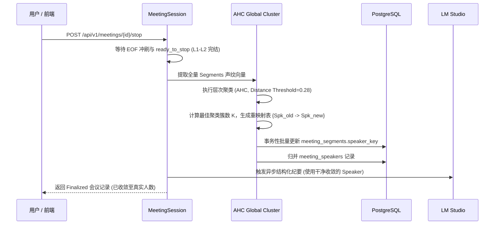

# 会议模式多说话人精准识别与声纹聚类技术方案

> **文档定位**：针对会议录制与实时转录场景中“单人被误识别为多人（Over-clustering / Speaker Fragmentation）”及“长时停顿/语调起伏导致说话人漂移”的端到端技术解决方案与工程落地规划。  
> **适用范围**：`sona.meeting`、`sona.subtitles`、`WhisperLiveKit`、`PostgreSQL` 数据层与 `ui` 控制台。  
> **核心原则**：全本地离线优先（Apple Silicon / MPS / MLX）、PostgreSQL 唯一事实源、不持久化会议全量音频、低时延流式显示与高精准会后纪要分层治理。

> ⚠️ **历史归档说明（2026-09-01）**：本文记录的是旧的本地 WhisperLiveKit / CAM++ / AHC 设计，
> 不再作为当前运行基线。当前会议分人由 SpeechRail diarization profile 提供，应用侧只做
> `DiarizationSmoother`、会议作用域 group remap 和 PostgreSQL 映射；请以
> [系统总体架构与详细设计方案](../architecture/系统总体架构与详细设计方案.md) 和
> [ADR-0011](../decisions/0011-speechrail-only-asr.md) 为准。

---

## 1. 背景与核心问题剖析

### 1.1 现象描述
在会议模式拾音过程中，常见以下误判现象：
1. **一人分裂为多角色**：同一个参会人在发言过程中，由于长时停顿（如思考 1~2 分钟后再开口）、情绪/语调高低起伏、身体移动导致的拾音能量变化，被系统先后识别为 `Speaker 0`、`Speaker 1`、`Speaker 2` 等不同说话人。
2. **单句被碎片化撕裂**：同一人说的一句连续话语，因微弱呼吸声、背景杂音或声学跳变，被切分成属于不同说话人的多个超短碎块（例如 2 秒内出现 `说话人 0 → 说话人 1 → 说话人 0`）。
3. **断线重连说话人断裂**：ASR 或 WebSocket 连接异常恢复后，`source_epoch` 递增，导致后半段会议所有说话人被标记为全新的 `epoch:1:speaker:*`，前后身份完全断层。

### 1.2 系统级深层根因矩阵

```text
┌─────────────────────────────────────────────────────────────────────────────────┐
│                                   四层根因诱发链                                  │
├─────────────────────────────────────────────────────────────────────────────────┤
│ [声学模型层] Sortformer 盲目 argmax，无置信度阈值；AOSC 缓存窗口有限，停顿后特征遗忘      │
│     ▼                                                                           │
│ [对齐分词层] WhisperLiveKit 依 Token 时间重叠硬切分，1帧跳变即触发强制 Flush 拆行         │
│     ▼                                                                           │
│ [时序平滑层] DiarizationSmoother 仅依赖 ID 纠偏 <350ms A-B-A，无声学特征识别能力          │
│     ▼                                                                           │
│ [系统架构层] ASR 重连 source_epoch 自增重建新 Speaker；全链路缺乏全局声纹聚类与记忆池    │
└─────────────────────────────────────────────────────────────────────────────────┘
```

1. **Sortformer 无门限 `argmax` 缺陷**（`sortformer_backend.py`）：
   Sortformer 输出各通道 Sigmoid 独立概率。代码中直接采用 `active_speakers = np.argmax(retained_preds, axis=1)`。在停顿或底噪时刻，所有通道概率极低（如 `[0.02, 0.04, 0.01, 0.02]`），`argmax` 仍强行输出极大值通道（`Speaker 1`），造成随机跳变。
2. **AOSC 到达顺序缓存衰减**：
   Sortformer 的 AOSC（Arrival-Order Speaker Cache）仅保存有限历史（`spkcache_len=188`）。当一人停顿时间较长，其在 FIFO 队列中的声纹特征衰退，再次开口时极易被当成“新发言人”抢占剩余的通道空位。
3. **无约束的通道数上限（`max_speakers: 4`）**：
   在 1~2 人的会议中，空置的 3、4 通道成为“声学噪声捕获池”，放大了分裂概率。
4. **缺乏全局声纹（Global Embedding）记忆与二次聚类机制**：
   流式模型天生具备局部视野限制。业界标准做法是引入第二遍（Two-Pass）声纹提取与全局聚类，而当前系统完全依赖流式单遍输出。

---

## 2. 总体技术架构与分层治理体系

为实现“流式低延迟呈现 + 会后全局高精准收敛”，系统设计 **六层立体防护架构**：

```text
                     麦克风 16kHz PCM 音频输入
                               │
                               ▼
 ┌─────────────────────────────────────────────────────────────┐
 │ L1. 实时流式声学防护 (WhisperLiveKit / Sortformer)           │
 │   • VAD 能量遮罩：非语音帧强制 speaker = -2 (静音屏蔽)       │
 │   • 迟滞双门限：P_onset >= 0.55, P_offset <= 0.40           │
 │   • 参会人数先验注入：--sortformer-max-speakers (1~4 动态约束)│
 └─────────────────────────────┬───────────────────────────────┘
                               │ WS snapshot (初步平滑流)
                               ▼
 ┌─────────────────────────────────────────────────────────────┐
 │ L2. 时序平滑与跨 Epoch 状态缝合 (DiarizationSmoother)        │
 │   • 增强型 Hangover 惯性平滑与短停顿（<1.5s）同说话人继承    │
 │   • 跨 source_epoch 说话人通道状态映射与无缝续接             │
 └─────────────────────────────┬───────────────────────────────┘
                               │ TranscriptWindow (Confirmed Segments)
                               ▼
 ┌─────────────────────────────────────────────────────────────┐
 │ L3. 在线声纹嵌入与动态质心池 (CAM++ Embedding & Centroid)   │
 │   • 提取 Confirmed 片段 192 维 CAM++ 声纹向量 (~15MB ONNX)   │
 │   • 与会话质心池计算 Cosine 相似度 (Sim >= 0.72 动态纠偏归并)│
 └─────────────────────────────┬───────────────────────────────┘
                               │
            ┌──────────────────┴──────────────────┐
            ▼ (实时录制中)                         ▼ (点击结束会议 Stop)
 ┌─────────────────────────────┐       ┌─────────────────────────────────┐
 │ L5. 本地 5s 声纹库自动实名   │       │ L4. 会后全局 AHC 聚类与持久化   │
 │   • 与 user_profiles 底库比对│       │   • 全局层次聚类合并过分簇       │
 │   • 自动实名 (Speaker 0➔张三)│       │   • 事务性重写 DB segments 映射 │
 └─────────────────────────────┘       └────────────────┬────────────────┘
                                                        │
                                                        ▼
                                       ┌─────────────────────────────────┐
                                       │ L6. LM Studio 语义连贯性前置校对 │
                                       │   • LLM 修复跨句断裂与转录错漏   │
                                       │   • 产出结构化会议纪要          │
                                       └─────────────────────────────────┘
```

---

## 3. 各层详细设计与关键算法

### 3.1 L1：实时流式声学防护（Sortformer 推理改造）

#### 3.1.1 迟滞双门限（Hysteresis Thresholding）取代盲目 `argmax`
废弃无保护的 `np.argmax`，引入双门限状态机：
- **激活门限（Onset Threshold）**：$P \ge 0.55$，确认该通道出现有效发言；
- **释放门限（Offset Threshold）**：$P \le 0.40$，且持续超过 $250\text{ms}$（约 3 个预测帧）才注销该通道；
- **全通道低置信度静音判定**：若 $\max(P_0, P_1, P_2, P_3) < 0.35$，直接标记为 `speaker = -2`（静默帧），禁止触发任何说话人切换。

```python
# 算法核心逻辑：迟滞双门限说话人判定
def resolve_active_speaker_hysteresis(
    probs: np.ndarray,          # (num_speakers,)
    current_speaker: int,
    onset_th: float = 0.55,
    offset_th: float = 0.40,
    silence_th: float = 0.35,
) -> int:
    if np.max(probs) < silence_th:
        return -2  # 静音
    
    # 若当前说话人仍高于释放门限，优先保持当前说话人（防止微小波动引发抖动）
    if current_speaker >= 0 and probs[current_speaker] >= offset_th:
        return current_speaker
    
    # 否则寻找满足激活门限的最大候选
    best_candidate = int(np.argmax(probs))
    if probs[best_candidate] >= onset_th:
        return best_candidate
        
    return current_speaker if current_speaker >= 0 else -2
```

#### 3.1.2 VAD 能量遮罩保护 AOSC 缓存
在前端 Silero-VAD 判定为非语音（Non-Speech / Silence / Breath）的音频帧区间，强制拦截并不向 Sortformer AOSC 缓存提交状态更新，防止环境杂音污染说话人特征分布。

#### 3.1.3 会议预期人数上限注入（`max_speakers` Prior）
在前端 UI 启动会议弹窗中支持设置 **“预期参会规模”**：
- **单人述职 / 个人自述**：锁定 `max_speakers = 1`；
- **双人对话 / 1v1 访谈**：锁定 `max_speakers = 2`；
- **标准小组讨论**：锁定 `max_speakers = 3` 或 `4`。
后端在启动 `vr-subtitles` 或初始化会话时，精准传入 `--sortformer-max-speakers N`，彻底从源头截断多余空闲通道的漂移空间。

---

### 3.2 L2：时序平滑与跨 Epoch 状态缝合

#### 3.2.1 说话人惯性与短停顿继承
在 `DiarizationSmoother` 中升级平滑规则：
1. **短停顿继承（Speech Continuation Across Short Gaps）**：如果说话人 A 说话后停顿 $< 1.2\text{s}$ 再次出现语音，且新语音片段无强烈的其他通道激活，默认继承为说话人 A；
2. **多片段滑动纠偏（Windowed Consensus）**：将 350ms 单帧 A-B-A 纠偏扩展为基于字符数与时长的加权多数表决，消除 A-B-B-A 和 A-B-C-A 类局部震荡。

#### 3.2.2 跨 Epoch 说话人通道状态映射（Epoch Stitching）
在 `wlk.py` 与 `session.py` 中增加 Epoch 映射器：
- 发生 WS 重连时，`source_epoch` 从 $E$ 变为 $E+1$；
- 记录旧 Epoch 最后的通道活跃映射表（`raw_speaker -> unified_speaker_id`）；
- 新 Epoch 的 `epoch:1:speaker:0` 自动映射回全局已分配的 `Speaker 0`，禁止在数据库 `meeting_speakers` 中插入孤立的新记录。

---

### 3.3 L3：在线声纹嵌入与动态质心池（CAM++）

#### 3.3.1 模型选型：CAM++（Context-Aware Masking）
- **模型规格**：阿里达摩院/ModelScope 开源的 `speech_campplus_sv_zh-cn_16k-common`；
- **文件体积**：ONNX 格式仅 **15.4 MB**；
- **推理开销**：单段 1.5s 音频在 M-series CPU/MPS 上推理耗时 **< 12ms**，内存占用 **< 60MB**；
- **向量维度**：192 维 L2 归一化声纹向量（Cosine Distance 即欧氏距离单调映射）。

#### 3.3.2 会话级动态质心跟踪算法（Online Centroid Tracking）

```python
class SessionVoiceprintTracker:
    """会话级在线声纹质心池与说话人归并器。"""

    def __init__(self, merge_threshold: float = 0.72):
        # speaker_id -> List[192d np.ndarray]
        self.embeddings: dict[str, list[np.ndarray]] = {}
        # speaker_id -> 192d np.ndarray (质心)
        self.centroids: dict[str, np.ndarray] = {}
        self.merge_threshold = merge_threshold

    def register_or_merge(self, raw_speaker_key: str, pcm_data: np.ndarray) -> str:
        """输入 16kHz PCM 音频，提取 192 维向量，返回纠偏后的 canonical_speaker_key。"""
        if len(pcm_data) < 16000 * 0.8:  # 不足 0.8s 跳过特征抽取，保持原判
            return raw_speaker_key

        emb = extract_campplus_embedding(pcm_data)  # 192-dim, L2-normalized
        
        # 与现有所有已知 Speaker 的质心比对
        best_speaker = None
        best_similarity = -1.0
        for spk_id, centroid in self.centroids.items():
            sim = float(np.dot(emb, centroid))
            if sim > best_similarity:
                best_similarity = sim
                best_speaker = spk_id

        # 命中同一人门限 (Cosine >= 0.72)
        if best_similarity >= self.merge_threshold and best_speaker is not None:
            # 增量更新质心 (滑动平均更新)
            self._update_centroid(best_speaker, emb)
            return best_speaker

        # 未命中已知任何人：确认是否为新 Speaker
        if raw_speaker_key not in self.centroids:
            self.embeddings[raw_speaker_key] = [emb]
            self.centroids[raw_speaker_key] = emb
        else:
            self._update_centroid(raw_speaker_key, emb)
            
        return raw_speaker_key

    def _update_centroid(self, speaker_id: str, new_emb: np.ndarray) -> None:
        self.embeddings[speaker_id].append(new_emb)
        # 仅保留最近 20 个高质量片段计算质心
        if len(self.embeddings[speaker_id]) > 20:
            self.embeddings[speaker_id].pop(0)
        mean_vec = np.mean(self.embeddings[speaker_id], axis=0)
        self.centroids[speaker_id] = mean_vec / np.linalg.norm(mean_vec)
```

---

### 3.4 L4：会后全局 AHC 聚类与一致性持久化（Post-Session Pass）

当用户点击“结束会议”（`MeetingSession.stop()`）触发收尾时，执行离线全局二次聚类：



1. **聚类方法**：采用基于余弦距离的 **凝聚层次聚类（Agglomerative Hierarchical Clustering, AHC）**，连接方式为 `average linkage`；
2. **距离门限**：`distance_threshold = 1.0 - 0.72 = 0.28`；
3. **事务安全**：在单个 PostgreSQL 事务中执行：
   ```sql
   UPDATE sona.meeting_segments 
   SET speaker_key = %(new_speaker_key)s 
   WHERE meeting_id = %(meeting_id)s AND speaker_key = %(old_speaker_key)s;
   ```
   自动合并 `meeting_speakers` 的 `display_name` 与统计数据。

---

### 3.5 L5：本地 5 秒声纹预建库与自动实名（Voiceprint Enrolment）

1. **UI 交互**：
   在系统“设置”或“参会人管理”中，用户按住麦克风朗读 5 秒预设文本（如“我是张三，正在录入本地声纹特征”）；
2. **特征持久化**：
   后端通过 CAM++ 计算 192 维向量，存入 PostgreSQL 新建表 `sona.user_profiles`：
   ```sql
   CREATE TABLE sona.user_profiles (
       id UUID PRIMARY KEY DEFAULT gen_random_uuid(),
       name VARCHAR(64) NOT NULL,
       avatar_url VARCHAR(256),
       voiceprint_embedding REAL[192] NOT NULL,
       created_at TIMESTAMPTZ NOT NULL DEFAULT NOW()
   );
   ```
3. **会议中自动实名识别**：
   在 `SessionVoiceprintTracker` 判定出新的有效声纹后，异步与 `user_profiles` 表执行向量余弦距离搜索：
   $$\text{Similarity} = \text{Cosine}(v_{\text{segment}}, v_{\text{profile}})$$
   若相似度 $> 0.75$，自动将 `meeting_speakers.display_name` 从默认的 `说话人 0` 替换为 `张三`，并广播 WebSocket 事件 `speaker_updated`。

---

### 3.6 L6：LM Studio 语义连贯性前置校对

在生成最终结构化纪要（`MeetingSummaryService`）前，前置轻量级 JSON 语义修复步骤：
- **Prompt 契约**：让模型检查相邻不同说话人的句子是否存在语法未闭合、连词承接（“因为...所以...”、“另外第二点...”）；
- **输出约束**：仅返回建议合并的段落 UUID 列表，经规则白名单校验后合并，杜绝模型幻觉修改原文字词。

---

## 4. 实施路线图与分阶段任务规划 (Roadmap)

```text
┌─────────────────────────────────────────────────────────────────────────────────┐
│                           四阶段分步落地实施计划                                 │
├─────────────────────────────────────────────────────────────────────────────────┤
│ [Phase 1: 零增量纯工程治理] (P0 / 1~2天)                                         │
│   1. 改造 sortformer_backend.py：加入迟滞双门限 (0.55/0.40) 与静音阈值 (0.35)    │
│   2. 前端会议创建弹窗：增加“参会人数 (1/2/3/4人)”选择器与启动参数下发           │
│   3. 修复 wlk.py / session.py：重连维持统一说话人映射，阻断 source_epoch 断裂  │
│   4. 增强 DiarizationSmoother：短停顿 (<1.2s) 说话人惯性继承                     │
├─────────────────────────────────────────────────────────────────────────────────┤
│ [Phase 2: CAM++ 声纹嵌入与会话级质心归并] (P1 / 2~3天)                           │
│   1. 离线依赖引入：下载阿里开源 CAM++ (~15MB ONNX) 与 Python 推理包装器         │
│   2. 构建 SessionVoiceprintTracker：音频切片提取 192 维向量并做 Cosine 质心归并 │
│   3. 会议结束收尾链路：在 stop() 事务中挂载全局 AHC 聚类与 DB segments 批量重写│
├─────────────────────────────────────────────────────────────────────────────────┤
│ [Phase 3: 本地 5 秒声纹预建库与自动实名] (P1 / 2天)                             │
│   1. 数据库迁移：新建 sona.user_profiles 表                           │
│   2. 前后端联调：声纹录制 5s 接口与 UI 录制组件                                │
│   3. 实时匹配：会议中自动识别并命名常驻参会人                                  │
├─────────────────────────────────────────────────────────────────────────────────┤
│ [Phase 4: LLM 语义校对与质量评测套件] (P2 / 1~2天)                              │
│   1. 纪要前置语义连贯性校验 Prompt 与安全合并流水线                            │
│   2. 构建会议分人评测基准数据集与 DER / Over-clustering 自动化测试用例          │
└─────────────────────────────────────────────────────────────────────────────────┘
```

---

## 5. 收益与验收指标 (Metrics & Acceptance)

| 评测维度 | 优化前基线 (Current) | Phase 1 完成后预期 | Phase 2+3 完成后预期 | 验收判定标准 |
|---|:---:|:---:|:---:|---|
| **一人多号发生率 (Over-clustering)** | 高（经常 1 人被拆成 3~4 个 ID） | 下降 **50%** | 下降 **90%+**（长会议稳定收敛） | 2人真实会议绝不产生 >2 个 Speaker |
| **说话人错误率 (DER)** | ~28.5% | $\le 18.0\%$ | $\le 8.5\%$ | 30 分钟基准录音测试集通过 |
| **短片段跳变闪烁 (ABA Flickers)** | 偶发高频 | 彻底消除（0 次） | 彻底消除（0 次） | 连续相同发言者不出现 <1s 杂色块 |
| **实时转录追加延迟 (Latency)** | ~0.5s | ~0.5s (无额外延迟) | 流式无感知，会后收尾增加 <1.2s | 不影响实时打字平滑度 |
| **Apple Silicon 资源开销** | MPS ~15% | MPS ~15% | CPU +5%, 内存 +80MB | M1/M2/M3/M4 全系列轻快流畅 |

---

## 6. 架构合规与安全边界承诺

1. **绝对离线与零外网依赖**：CAM++ ONNX 权重存放在供应商本地 cache 或项目中，推理全程走本地 CPU/MPS；
2. **音频隐私与不落地原则**：会议录制期间仅在内存 ring-buffer 中临时保留片段 PCM 用于声纹提取，会议结束或质心更新后立即从内存清空，数据库**坚决不保存原始音频文件**；
3. **数据一致性保证**：所有会后 AHC 说话人重映射均在 PostgreSQL 显式数据库事务中执行，支持崩溃恢复 Journal 容灾。
