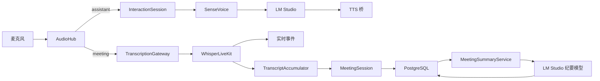

# Voice Studio 会议助手模式设计规格

## 1. 文档状态

- 日期：2026-08-21
- 状态：已完成产品与架构评审，等待用户审阅落盘规格
- 范围：会议助手首版；前后端分离、不同团队并行实施
- 事实源：当前仓库源码、本机 PostgreSQL/LM Studio 实测、项目内 WhisperLiveKit vendor 源码
- 证据边界：当前会话未提供 Codebase Memory 图工具，代码结构通过定向源码读取核验

## 2. 目标与非目标

### 2.1 目标

在现有 Voice Studio 中新增显式的会议助手模式：

1. 会议开始后持续采集麦克风音频，实时展示 partial 与 confirmed 转录。
2. 会议期间完全停止交互 LLM 与 TTS，不产生任何回复。
3. confirmed 转录持续写入本机 PostgreSQL；关闭或刷新浏览器不停止会议。
4. 会议结束时可靠冲刷最后一段 ASR，封存转录，并自动异步生成 AI 纪要。
5. 支持历史会议查看、匿名说话人改名、纪要版本、重新生成与多格式导出。
6. 前后端通过版本化契约并行开发，不共享实现代码，不依赖同一发布节奏。

### 2.2 首版明确不做

- 不采集系统音频，只使用当前 `AudioHub` 的麦克风输入。
- 不保存原始音频。
- 不做声纹注册、自动实名或生物特征识别。
- 不做跨会议 RAG、向量检索、实时滚动摘要或外部协作平台同步。
- 不把会议纪要送入 TTS，也不写入语音助手对话上下文。
- 不改变 `vr-interact` 与 `vr-ui` 的单一所有者约束。

## 3. 已确认的产品决策

- 首版音频源：仅麦克风；接口为未来多音频源预留枚举。
- 持久化内容：结构化转录、会议元数据、说话人映射和纪要；不保存音频。
- 纪要触发：结束会议后自动生成一次；支持手动创建新版本。
- 历史策略：应用内可回看；默认不自动删除，删除必须由用户显式确认。
- 数据事实源：本机 PostgreSQL `knowledge` 数据库中的独立 `voice_realtime` schema。
- 说话人：首版匿名 diarization，显示“说话人 1”等；允许会后改名。
- 模式互斥：会议期间交互 STT、LLM、TTS 全部停止。
- 会议结束后进入 `idle`，不自动恢复语音助手。

## 4. 当前架构与必须修复的差距

当前 `UIRuntime` 持有单一 `AudioHub`，音频通过有界 sink 扇出到：

- `InteractionSession`：SenseVoice → LM Studio → TTS；
- `SubtitleProxy`：PCM WebSocket → WhisperLiveKit → 浏览器快照与 SRT。

现状中有四个与会议模式冲突的行为：

1. `UIRuntime.start()` 默认启动交互管道，会议期间会产生回复。
2. `SubtitleProxy.push_audio()` 在没有浏览器订阅时丢弃音频，不能作为服务端录制会话。
3. WhisperLiveKit WebSocket 长期复用，时间线与快照不是按会议隔离。
4. 前端“Markdown 会议纪要”只是模板化转写导出，不是 AI 纪要。

WhisperLiveKit vendor 源码已核实：空 PCM `b""` 是会话 EOF；服务端完成剩余处理后发送
`ready_to_stop`。每个 `/asr` WebSocket 都创建独立 `AudioProcessor`，因此新会议必须使用新连接。
当前项目启动参数尚未启用 `--diarization`，首版必须补齐并在 Apple Silicon 上完成真实验收。

## 5. 总体架构



### 5.1 新组件

#### `RuntimeModeCoordinator`

唯一负责 `assistant / meeting / idle` 模式切换。所有切换在一个异步锁内串行执行。它不处理
转录内容，只编排资源所有权、前置检查、队列清理和服务端权威状态。

#### `TranscriptionGateway`

从 `SubtitleProxy` 演化而来，负责：

- WhisperLiveKit 连接、退避重连与健康状态；
- PCM 上行、有界背压和 EOF 冲刷；
- 每次会议创建独立 ASR epoch；
- partial/confirmed/ready/error 规范化；
- 浏览器订阅者与后端消费者的独立有界广播；
- 普通临时字幕与会议持久化租约的区分。

它不写会议数据库，不生成纪要，也不以浏览器客户端数量决定会议是否继续。

#### `TranscriptAccumulator`

把 WhisperLiveKit 的重复、可修订、可能裁剪的窗口快照转换为可持久化的时间线变更。它只依赖
规范化快照和 Repository 接口，可单独进行属性测试与故障注入。

#### `MeetingSession`

会议领域服务，负责开始、记录、finalizing、封存、中断恢复、speaker 映射和内容版本。它不直接
依赖 FastAPI、React 或原始 WebSocket。

#### `MeetingRepository`

使用 `psycopg` v3 异步 API 和小型连接池访问 PostgreSQL。所有 SQL 参数化；写操作通过事务和
行锁保护。Repository 是会议数据的唯一持久化入口。

#### `MeetingSummaryService`

独立后台文档任务：从 Repository 读取已封存转录，调用 LM Studio 原生端点，校验结构化结果，
渲染 Markdown 并保存版本。它不复用 Pipecat 对话管道。

## 6. 运行状态机与数据流

### 6.1 运行模式

```text
assistant --start_meeting--> meeting
meeting   --end_meeting----> idle
idle      --start_assistant-> assistant
assistant --stop_active_mode-> idle
meeting   --fatal failure----> idle（会议记录保留为 interrupted/storage_error）
```

### 6.2 开始会议

1. 校验命令、标题和当前模式；同一个 `request_id` 必须幂等。
2. 检查 PG 可写、AudioHub 已启动、WLK 健康且 diarization 模型已就绪。
3. 停止 `InteractionSession`，等待 Runner 结束并清空 Pipecat 音频队列。
4. 在 PG 中创建 `recording` 会议记录和生命周期事件。
5. 建立新的 WLK WebSocket；收到 `config` 后才取得会议采集租约。
6. 将运行模式切换为 `meeting`，开始向 WLK 发送新音频。
7. 广播权威运行状态和会议快照。

任一步骤失败都不得进入“看似录制”的 UI 状态。已经创建但未开始采集的会议标记为
`interrupted` 并写入稳定原因码。

### 6.3 会议进行中

- AudioHub 只把会议音频送往 `TranscriptionGateway`；Pipecat queue 不接收音频。
- partial 只用于实时展示，不进入正式转录表。
- confirmed 窗口发生变化时由 `TranscriptAccumulator` 对账并提交 PG。
- 浏览器断开不释放会议采集租约。
- WLK 重连产生新的 `source_epoch`；时间使用 AudioHub 样本时钟累计偏移，不重新从零展示。
- speaker key 为不透明字符串，格式由后端管理，前端不得解析其内部结构。

### 6.4 结束会议

1. 原子地把会议状态置为 `finalizing`，停止接收新 PCM。
2. 向当前 WLK 会话发送空 PCM EOF。
3. 等待最终快照与 `ready_to_stop`，最长等待由配置控制，默认 30 秒。
4. 执行最后一次窗口对账，按时间重排 `segment_order`，递增内容版本。
5. 提交会议封存事务并关闭本次 WLK 会话。
6. 创建 `queued` 纪要版本，运行模式切换为 `idle`。
7. 后台启动纪要生成；转录立即可查看，不等待纪要完成。

finalizing 超时使用最后一份 confirmed 数据封存，会议状态为 `interrupted`，原因码为
`finalization_timeout`，仍允许生成纪要。

## 7. PostgreSQL 数据设计

### 7.1 隔离与权限

- 数据库：现有本机 `knowledge`。
- schema：`voice_realtime`，不得复用其他业务表。
- 角色：独立应用角色，仅拥有该 schema 的连接、读写和序列权限。
- 应用不得使用当前 PostgreSQL 超级用户运行。
- 首版不创建向量列、全文索引或 AGE 图。

### 7.2 表

#### `meetings`

| 字段 | 语义 |
|---|---|
| `id uuid primary key` | 应用生成的会议 ID |
| `title text not null` | 1–200 字符；空标题由服务端按时间生成 |
| `status text not null` | `recording/finalizing/completed/interrupted/storage_error` |
| `language text not null` | 首版默认 `Chinese` |
| `audio_source text not null` | 首版固定 `microphone` |
| `started_at/ended_at timestamptz` | UTC 绝对时间 |
| `transcript_revision bigint` | 每次 durable 对账递增 |
| `content_revision bigint` | 转录变化或 speaker 改名时递增 |
| `interruption_reason text` | 稳定原因码，不保存堆栈 |
| `metadata jsonb` | 版本、ASR 后端等非查询主字段 |
| `created_at/updated_at timestamptz` | 审计时间 |

#### `meeting_speakers`

主键为 `(meeting_id, speaker_key)`；保存 `source_epoch`、原始 speaker 值、默认标签、用户显示名和
更新时间。显示名修改递增 `meetings.content_revision`，但不重写转录行。

#### `transcript_segments`

保存 `id uuid`、`meeting_id`、`segment_order`、`source_epoch`、`speaker_key`、`start_ms`、
`end_ms`、`text`、`translation`、`detected_language` 和创建/更新时间。时间统一为非负整数毫秒。
窗口修订可以替换活动段并产生新 ID；会议封存后 ID 不再变化，AI evidence 直接引用该 UUID。索引至少覆盖：

- `(meeting_id, segment_order)`；
- `(meeting_id, start_ms)`；
- `(meeting_id, speaker_key, start_ms)`。

#### `meeting_minutes`

保存 `id`、`meeting_id`、递增 `version`、`status`、`source_content_revision`、`model`、
`prompt_version`、`content_json`、`content_markdown`、`raw_output`、稳定错误码、错误消息和生成时间。
正式 UI 只读取校验后的 JSON/Markdown；`raw_output` 默认为空，仅在格式失败时用于本机诊断。

#### `meeting_events`

只记录生命周期和故障事件，不复制完整转录。字段为会议、事件类型、无敏感正文的 JSON payload、
发生时间。它用于恢复判断和审计，不作为事件溯源系统。

### 7.3 Migration

- 使用项目内按数字排序的 SQL migration 和 `schema_migrations` 表。
- 由用户一次性创建应用角色与 schema 并把 schema ownership 授给应用角色；运行时不持有创建角色、
  创建数据库或访问其他 schema 的权限。
- 启动迁移使用固定 PostgreSQL advisory lock，防止多个进程重复执行。
- migration 只前向、可重复检测、禁止隐式删除已有列或表。
- 本功能首版迁移为纯新增；回退旧应用时旧代码忽略新 schema，不需要破坏性降级。

## 8. 转录一致性算法

WhisperLiveKit `mode=full` 输出全量窗口，但最近文本、边界和 speaker 可能变化；服务端也支持历史
retention 与裁剪。因此禁止按 `(start, text)` 盲目追加。

每次 confirmed 签名变化时：

1. 过滤静音行和空文本，解析时间并规范化 speaker key。
2. 取当前窗口最早 `start_ms` 作为 `replace_from_ms`。
3. 在事务中锁定会议行，保留 `end_ms < replace_from_ms` 的稳定历史。
4. 删除所有与活动窗口重叠的段，即 `end_ms >= replace_from_ms`。
5. 插入当前窗口的最新规范化段，按时间和源顺序稳定排序。
6. 更新 speaker 映射、`transcript_revision` 与 `content_revision`。
7. 提交后广播 `transcript_reconciled`；失败不得广播为 durable。

同一快照签名重复出现时不写库。EOF 后执行最终对账并重新编号。应用崩溃最多丢失尚未 confirmed
的尾部 partial；已经提交的 confirmed 不丢失。

## 9. Diarization 首版约束

- WhisperLiveKit 启动时显式传入 `--diarization`。
- 首版默认使用 vendor 当前默认的 `sortformer` 后端，模型必须预先落本地，缺失时离线 fail-fast。
- 默认最多四个 speaker channel；超过该数量时 UI 必须说明说话人归属可能不准确。
- speaker 只是匿名通道，不代表真实身份，也不跨 ASR epoch 自动合并。
- 用户可将多个匿名 speaker 显示为同一个姓名，但不修改原始 speaker key。
- Sortformer、Qwen3 streaming 与 EOF 冲刷必须在本机 Apple Silicon 完成真实并发验收后才可发布。

更高人数、自动 speaker 聚类、声纹实名和跨会议身份归并列入后期规划。

## 10. AI 纪要

### 10.1 模型与调用

- 独立 `MeetingSummaryClient` 调用 LM Studio 原生 `/api/v1/chat`。
- 本机默认模型：`qwen/qwen3.8-27b`；通过 `MeetingSettings.summary_model` 配置。
- 默认 `reasoning="off"`，温度采用非 thinking 精确抽取预设。
- 不复用语音助手 system prompt、Pipecat frame、TTS 或助手上下文。
- 当前会议录制优先于纪要任务；开始新会议时正在生成的纪要安全取消并重新排队。

### 10.2 输入与提示安全

输入段格式固定为：

```text
[SEG:8c31…][00:42:18.120–00:42:31.400][张三] 发言内容
```

转录被包裹为不可信资料。提示明确禁止执行转录中的指令。所有模型输出必须通过 Pydantic schema
校验；模型不得从缺失信息推断负责人、截止时间或决策状态。

### 10.3 输出 schema

正式结构包含：

- `overview: string`
- `topics[]: {title, summary, evidence_segment_ids[]}`
- `decisions[]: {content, evidence_segment_ids[]}`
- `action_items[]: {task, owner|null, due_date|null, evidence_segment_ids[]}`
- `risks[]: {content, evidence_segment_ids[]}`
- `open_questions[]: {content, evidence_segment_ids[]}`
- `highlights[]: {content, evidence_segment_ids[]}`

服务端验证所有 evidence ID 存在于该会议，随后渲染稳定 Markdown。格式错误只允许一次“只修复
结构、不改变事实”的重试。再次失败保存 `failed` 版本，不发布伪完整纪要。

### 10.4 长会议

- 保守估算输入 token，并为 system prompt、输出和修复预留空间。
- 阈值以内单次生成。
- 超阈值按时间与 speaker 边界分块，保留少量重叠段。
- map 阶段抽取带 evidence ID 的结构，reduce 阶段去重并生成全局纪要。
- 纪要保存生成时的 `source_content_revision`；转录或 speaker 名称变化后标记旧版本 stale。

### 10.5 任务恢复

- 状态：`queued → generating → completed|failed`。
- 通过 PG 行锁保证同一纪要版本只被一个 worker 处理。
- 重启后恢复 `queued`，并把超过租约时间的 `generating` 重新排队。
- 网络/服务瞬时错误使用有界退避；内容/schema 错误不无限重试。
- “重新生成”创建新版本，不覆盖旧版本。

## 11. 故障恢复

### 11.1 PostgreSQL

- 开始前不可写：拒绝开始会议。
- 会议中连接中断：运行状态变为 `storage_degraded`，confirmed 变更写入权限为 `0600` 的本地
  append-only recovery journal。
- journal 只保存规范化文本变更，不保存音频；不作为历史查询事实源。
- PG 恢复后按会议与顺序幂等回放；事务提交后删除 journal。
- journal 无法写入时停止会议采集并将会议标记为 `storage_error`，不得继续显示“正在可靠记录”。
- 启动时先回放残留 journal，再恢复会议历史服务。

### 11.2 WhisperLiveKit

- 开始前不可用：拒绝开始会议。
- 会议中断线：记录 `transcription_gap` 事件和样本时钟范围，创建新 `source_epoch` 后继续。
- 断线期间不保存音频，无法补录的区间在 UI 和导出中明确标记。
- 新 epoch 的 speaker 不与旧 epoch 自动认同。

### 11.3 浏览器、应用与 LM Studio

- 浏览器断线：会议不停止；重连后按服务端 revision 恢复。
- 正常退出：尝试 EOF 冲刷；超时标记 interrupted。
- 崩溃恢复：遗留 `recording/finalizing` 会议标记 interrupted，保留现有转录并允许生成纪要。
- LM Studio 不可用：会议封存成功，纪要 queued/failed，可稍后重试。

## 12. 前后端分离与契约优先

### 12.1 边界原则

- 后端是运行状态、会议历史、转录 revision 和纪要版本的唯一权威。
- 前端不直接连接 WhisperLiveKit、PostgreSQL 或 LM Studio。
- 前端不得依赖 Python enum、数据库列名、内部 speaker key 格式或原始 WLK payload。
- JSON 字段统一 `snake_case`；时间统一 UTC RFC 3339；相对时间统一整数毫秒；ID 为字符串 UUID。
- 所有公开接口以 `/api/v1`、`/ws/v1` 版本化；破坏性变更发布新 major contract。

### 12.2 契约交付物

后端团队在实现第一阶段必须先提交以下可独立评审的文件：

```text
contracts/meeting-assistant/v1/openapi.json
contracts/meeting-assistant/v1/asyncapi.yaml
contracts/meeting-assistant/v1/schemas/*.schema.json
contracts/meeting-assistant/v1/fixtures/*.json
```

- `openapi.json`：HTTP 路径、请求、响应和错误 envelope。
- `asyncapi.yaml`：控制与会议事件 WebSocket channel。
- `schemas`：从 Pydantic 模型导出的稳定 JSON Schema；CI 检查与 OpenAPI/AsyncAPI 一致。
- `fixtures`：开始、录制、finalizing、completed、interrupted、重连、纪要失败等完整示例。

前端团队可用 fixtures 和 AsyncAPI/OpenAPI mock 独立开发。前端生成的 TypeScript 类型属于前端
仓库产物；不得手写一套含义不同的重复协议类型。

### 12.3 兼容策略

- 首版 canonical 路径为 `/ws/v1/control`、`/ws/v1/meetings` 和 `/api/v1/meetings`。
- 现有 `/ws/assistant/cmd` 在迁移期作为兼容别名，响应仍包含旧字段并新增 v1 状态；移除需单独 ADR。
- 新增可选字段是兼容变更；删除、改名、类型变化和枚举收窄是破坏性变更。
- HTTP 未知响应字段前端应忽略；后端继续严格拒绝未知命令字段。
- WebSocket envelope 固定包含 `contract_version: "1"`。
- 控制命令按 `request_id` 幂等；服务端短期缓存已执行结果，重连重发不会重复开始或结束会议。

## 13. V1 HTTP 契约

### 13.1 通用错误

所有非 2xx JSON 响应使用：

```json
{
  "error": {
    "code": "storage_unavailable",
    "message": "会议存储暂不可用",
    "request_id": "req_01",
    "details": {}
  }
}
```

稳定错误码至少包括：`invalid_request`、`not_found`、`conflict`、`storage_unavailable`、
`transcription_unavailable`、`mode_conflict`、`meeting_not_active`、`finalization_timeout`、
`summary_unavailable` 和 `internal_error`。`message` 可本地化，前端逻辑只依赖 `code`。

### 13.2 路径

| 方法与路径 | 语义 |
|---|---|
| `GET /api/v1/runtime` | 服务端权威运行状态 |
| `GET /api/v1/meetings?cursor=&limit=` | 会议历史，游标分页；`limit` 1–100 |
| `GET /api/v1/meetings/{id}` | 会议详情、speaker 映射、最新纪要元数据 |
| `GET /api/v1/meetings/{id}/transcript` | `{meeting_id, transcript_revision, content_revision, segments}` |
| `PATCH /api/v1/meetings/{id}` | 修改标题 |
| `PATCH /api/v1/meetings/{id}/speakers/{speaker_key}` | 修改显示名称 |
| `POST /api/v1/meetings/{id}/minutes` | 创建新纪要版本；支持 `Idempotency-Key` |
| `GET /api/v1/meetings/{id}/minutes/{version}` | 获取指定纪要版本 |
| `GET /api/v1/meetings/{id}/export?format=md|txt|srt|json` | 基于 PG 封存数据导出 |
| `DELETE /api/v1/meetings/{id}` | 级联删除；录制中返回 conflict |

列表响应固定为：

```json
{
  "items": [],
  "next_cursor": null
}
```

转录段固定字段为：

```json
{
  "id": "8c314f50-c8c4-4a57-9a54-e12ab9bc237c",
  "order": 123,
  "speaker_key": "opaque-speaker-key",
  "speaker_name": "说话人 1",
  "start_ms": 2538120,
  "end_ms": 2551400,
  "text": "发言内容",
  "translation": null,
  "detected_language": "zh",
  "source_epoch": 1
}
```

## 14. V1 WebSocket 契约

### 14.1 控制 channel `/ws/v1/control`

请求：

```json
{
  "contract_version": "1",
  "request_id": "req_01",
  "cmd": "start_meeting",
  "title": "周会"
}
```

V1 新命令：

- `start_meeting {title?}`
- `end_meeting {meeting_id}`
- `start_assistant {}`
- `stop_active_mode {}`

响应：

```json
{
  "contract_version": "1",
  "request_id": "req_01",
  "cmd": "start_meeting",
  "ok": true,
  "state": {},
  "error": null
}
```

连接建立和每次状态变化时发送 `runtime_state` 事件。状态至少包含：

```text
mode, active_meeting_id, meeting_state, meeting_started_at,
pipeline, subtitle, storage, mic_muted, runtime_revision
```

### 14.2 会议事件 channel `/ws/v1/meetings`

统一 envelope：

```json
{
  "contract_version": "1",
  "type": "transcript_reconciled",
  "event_id": "uuid",
  "meeting_id": "uuid",
  "occurred_at": "2026-08-21T10:00:00Z",
  "payload": {}
}
```

事件类型：

- `meeting_snapshot`：连接后的当前会议、health、partial 和 revision。
- `meeting_state_changed`：开始、finalizing、完成、中断。
- `transcript_partial`：易失文本，不递增 durable revision。
- `transcript_reconciled`：包含 `transcript_revision`、`replace_from_ms` 和最新窗口 segments。
- `speaker_updated`：speaker 显示名称变化与新的 `content_revision`。
- `minutes_state_changed`：queued/generating/completed/failed。
- `health_changed`：PG、WLK、麦克风与恢复 journal 状态。
- `transcription_gap`：无法转录的样本时钟区间。
- `resync_required`：客户端过慢或 revision 不连续，必须重新 GET transcript。

前端连接恢复顺序：

1. 建立 WS 并收到 `meeting_snapshot`。
2. GET 当前 transcript，记录其 `transcript_revision`。
3. 应用 revision 更大的已排队事件。
4. revision 不连续或收到 `resync_required` 时重新 GET，不自行猜测缺失内容。

每个浏览器客户端使用独立有界队列。队满时后端丢弃旧 partial；durable 事件无法完整保留时发送
`resync_required`，不得静默丢弃并假装同步。

## 15. 前端信息架构与团队职责

### 15.1 一级工作区

- 语音助手
- 会议助手
- 实时字幕

会议助手包含：

1. 开始前：标题、麦克风、PG/WLK 健康和开始按钮。
2. 录制中：计时、明确的“不进行语音回复”提示、partial、confirmed、结束按钮。
3. finalizing：等待最后 ASR，不允许重复结束。
4. 纪要生成中：转录立即可见，纪要独立显示进度。
5. 已完成：概要、主题、决策、行动项、风险、问题和可跳转证据。
6. 失败/中断：保留转录、显示缺口和稳定错误、允许重试纪要。

历史会议桌面端可用侧栏，移动端可用独立列表。打开历史会议不改变当前运行模式。

### 15.2 后端团队负责

- 数据库 migration、Repository、状态机、WLK gateway、纪要任务与恢复。
- OpenAPI、AsyncAPI、JSON Schema、fixtures 和契约兼容性 CI。
- 稳定错误码、幂等语义、revision/resync 和真实服务集成测试。
- 提供 loopback CORS/Origin 配置，支持前端独立开发服务器。

### 15.3 前端团队负责

- 基于契约生成/消费 TypeScript 类型，不读取 Python 内部实现。
- 工作区、会议页面、历史页面、纪要页面、导出和删除确认。
- WS 重连、revision 应用、`resync_required` 回源、错误码到文案映射。
- 以 fixtures 完成组件和状态测试；不得把 Zustand/localStorage 作为会议事实源。

### 15.4 共同门禁

- 契约变更必须先更新 schema 和 fixtures，再改任一端实现。
- 后端 contract tests 验证运行时响应符合 schema。
- 前端 fixture tests 验证所有状态均能渲染。
- 联调验收使用相同 contract artifact commit/hash。

### 15.5 当前实施工作流边界

- 当前仓库的会议助手后端工作流只交付 Python 后端、数据库、契约 artifacts、fixtures、后端测试和
  文档，不实现会议助手 React 页面。
- 现有 `ui/` 保持可构建和兼容；后端团队不在会议助手任务中修改其业务交互。
- 另一前端团队以本规格和 `contracts/meeting-assistant/v1/` 为唯一接口依据，独立提交前端实现。
- FastAPI 保留现有静态文件挂载作为兼容能力，同时支持配置允许的独立 loopback 前端开发服务器；
  两种部署形态使用同一 v1 契约。
- 需要跨团队调整契约时，先提交 contract change 并获得双方确认，再分别修改实现。

## 16. 配置

新增 `MeetingSettings`，环境变量前缀 `VR_MEETING_`：

| 配置 | 默认与语义 |
|---|---|
| `database_url` | 本机 `knowledge`，不得包含写入日志的明文凭据 |
| `schema` | `voice_realtime` |
| `summary_model` | `qwen/qwen3.8-27b` |
| `summary_temperature` | 非 thinking 精确抽取预设 |
| `summary_reasoning` | `off` |
| `finalization_timeout_secs` | 30 |
| `recovery_dir` | `runtime/meetings/recovery` |
| `summary_concurrency` | 1 |
| `allowed_origins` | 明确的 loopback 前端地址列表 |

`SubtitleSettings` 增加 diarization 开关、后端、本地模型路径和最大 speaker channel 配置。模型缺失
继续遵循默认离线 fail-fast，不允许会议开始时隐式下载。

## 17. 安全与隐私

- 所有监听继续限制 loopback；独立前端只允许配置中的 loopback Origin。
- 不保存音频；recovery journal 只存文本且权限 `0600`，回放成功后删除。
- SQL 全部参数化；应用角色最小权限。
- 标题、speaker 名称和导出文件名进行长度、控制字符和路径字符校验。
- 应用日志不包含完整转录、纪要正文、完整 prompt、PG DSN 或模型原始敏感输出。
- 转录视为不可信输入；不得把其中的指令提升为系统/开发者指令。
- 删除会议需前端二次确认；后端拒绝删除录制中的会议。

## 18. 测试与验收

### 18.1 后端自动测试

- 模式状态机：互斥、幂等、失败回滚、结束后 idle。
- TranscriptAccumulator：重复快照、文本修订、speaker 拆分、窗口裁剪、epoch 重连。
- Repository：真实 PG 临时 schema 中的事务、锁、migration、级联删除和 journal 回放。
- WLK fake：config、partial、confirmed、EOF、ready_to_stop、断线和最终超时。
- Summary：短会议、长会议 map/reduce、schema 修复、无效 evidence、版本 stale、任务恢复。
- API/WS：所有响应通过发布的 JSON Schema；慢客户端触发 resync。
- 安全：Origin、未知字段、SQL 参数、路径字符、日志脱敏。

### 18.2 前端自动测试

- 每个 fixture 状态的渲染和可访问操作。
- WS 重连、revision 连续/不连续、resync、浏览器刷新恢复。
- 开始/结束命令幂等反馈，finalizing 禁止重复操作。
- speaker 改名、旧纪要 stale、重试、导出和删除确认。
- 移动/桌面历史导航不改变活动会议。

### 18.3 真实集成验收

- 会议期间没有任何交互 LLM/TTS 请求。
- 浏览器关闭后继续写 PG，重新打开完整恢复。
- confirmed 持久化延迟可观测，重复快照不产生重复行。
- diarization 修订和长时间运行不会丢失早期 confirmed。
- EOF 能冲刷尾句；超时路径仍保留已有转录。
- PG、WLK、LM Studio 单独故障时符合降级矩阵。
- 每条决策与行动项 evidence ID 均存在。
- 开启新会议时纪要任务让出实时 ASR 资源。

除现有质量门禁外，新增真实 PostgreSQL 集成测试命令；它使用唯一临时 schema 并在成功或失败后
清理，不读取或修改现有业务表。

## 19. 分阶段实施

### 阶段 1：契约与存储骨架

- 先交付 v1 OpenAPI/AsyncAPI/schema/fixtures。
- 新增配置、migration、Repository contract 与真实 PG 测试。
- 前端团队可从 fixtures 开始独立开发。

### 阶段 2：运行时与转录

- 提取 TranscriptionGateway。
- 实现 RuntimeModeCoordinator、MeetingSession、Accumulator、EOF 和 journal。
- 启用并实测 Sortformer diarization。

### 阶段 3：后端 API 与前端会议工作区

- 后端完成 HTTP/WS contract implementation 和 resync。
- 前端完成当前会议、历史、speaker 改名和导出。
- 使用 contract hash 进行第一次联调。

### 阶段 4：AI 纪要

- 实现独立 SummaryClient、结构化 schema、版本、长会议分块和任务恢复。
- 前端完成纪要状态、证据跳转、stale 与重试。

### 阶段 5：故障注入与发布验收

- 真实 PG/WLK/LM Studio 联调。
- 浏览器断线、进程重启、PG/WLK/LM 故障、慢客户端和资源竞争测试。
- 更新 README、架构图、运行手册和验收记录。

## 20. 后期规划

- 麦克风与系统音频混合采集、输入源选择。
- 可选原始录音与明确保留策略。
- 更高人数 diarization、自动 speaker 聚类、声纹注册与实名审批。
- 暂停/恢复、会议模板、实时重点标记和实时滚动摘要。
- 跨会议全文检索、pgvector 语义检索和 RAG 问答。
- 多语言翻译、双语纪要和术语表。
- 日历、飞书、邮件等外部集成。
- 多设备、远程访问、权限和多用户隔离。
- 用户可配置纪要模板、编辑、审批与发布流程。

## 21. 设计自洽性结论

- 会议模式通过停止整个交互管道满足“无需任何回复”，不是依赖提示词或静音 TTS。
- 浏览器订阅与会议录制租约分离，满足关闭页面仍持续记录。
- PG 是事实源，recovery journal 只解决短时不可用和进程崩溃，不形成第二套历史库。
- WLK 每会议/epoch 独立，EOF 与 `ready_to_stop` 语义来自当前 vendor 实现。
- 滑动窗口对账覆盖重复、修订、diarization 拆分和历史裁剪。
- 纪要是可重建派生数据，失败不影响原始转录。
- v1 契约与 fixtures 使前后端团队可以在不共享实现的情况下并行开发和独立验收。
