# 本地物理输出设备音频采集设计

## 1. 文档状态

本方案已完成产品方向与架构决策确认，作为后续实施计划的输入；当前代码尚未实现物理输出采集，因此状态保持为 `under_review`，不得将本文中的目标能力表述为已上线能力。

对应决策记录：[ADR-010：本地物理输出音频采用设备绑定的 Core Audio Tap 原生采集](../../decisions/0010-physical-output-audio-capture.md)。

原生主路径要求 **macOS 14.2+**。项目其余能力仍可维持既有 macOS 基线；较低系统版本不隐式安装驱动，后续仅通过显式启用的虚拟音频设备方案降级。

## 2. 终版结论

项目新增通用的 `PhysicalOutputCapture` 子系统，主路径采用：

> **绑定目标输出设备 UID 的 Core Audio 全局 Tap + 独立签名原生 Helper + 本机 Unix Domain Socket + Python 音频源路由层。**

该能力不识别或依赖腾讯会议、Zoom、Teams、浏览器等上层应用。只要应用音频被 macOS 路由到用户选定的本地输出端点，并且 Core Audio 允许捕获，就可以作为字幕或会议助手的输入。

会议助手默认提供三种采集配置：

| 配置 | 输入内容 | 适用场景 |
|---|---|---|
| `microphone` | 当前麦克风 | 线下会议、既有行为 |
| `physical_output` | 选定输出端点上的数字程序音频 | 只需要远端参会人或本机媒体音频 |
| `dual` | 麦克风近端音频 + 物理输出远端音频，混合成一个推理流 | 同时覆盖本机发言人与远端参会人 |

`dual` 仍只向 WhisperLiveKit / ASR 提交一个合成 PCM 流，因而不破坏既有“单 PCM 推理所有者”约束。这里的“单所有者”约束的是重型推理工作负载，不是硬件输入源数量。

## 3. 产品承诺与能力边界

### 3.1 “物理输出音频”的可验收定义

本产品中的“物理输出音频”定义为：

> 在采集有效期内，所有被 macOS 混音并路由到指定输出端点、且由 Core Audio Tap 暴露的数字 PCM 程序音频；采集点位于数模转换或无线编码之前。

该定义使产品可以稳定回答“能否接收腾讯会议进行中的全部远端会议音频”：**能，前提是这些声音实际从所选本机输出端点播放，且没有被操作系统或内容保护机制禁止捕获。**

### 3.2 纳入范围

- 桌面会议客户端、浏览器会议页面、媒体播放器和系统提示音等第三方程序的输出。
- 内建扬声器、有线耳机、USB 声卡、HDMI / 显示器音频、蓝牙耳机等可被 Core Audio 枚举并验证的输出端点。
- 运行期间切换默认输出设备；默认采用“跟随系统默认输出”，也允许锁定一个指定设备。
- 设备输出独立用于实时字幕，或与麦克风组成会议助手双源输入。

### 3.3 明确不承诺

- 本机麦克风输入。远端会议音频与本机发言要同时覆盖时必须选择 `dual`。
- 其他未选输出端点、其他电脑或手机上的声音。
- 扬声器之后的空气传播、模拟线路或设备内部 DSP 结果。
- DRM、受保护媒体路径或操作系统不向 Tap 暴露的内容。
- 会议软件内部尚未渲染到本机输出设备的独立音轨、参会人身份或原始网络媒体包。
- 对本产品自身 TTS、提示音的默认采集。它们必须被排除，避免形成回声与自触发闭环。

### 3.4 会议场景的关键解释

- `physical_output` 可以获得远端参会人、共享视频和会议内播放媒体，但通常不会包含本机用户自己的麦克风上行，因为会议软件一般不会把本机麦克风原样回放。
- `dual` 才是“本机发言 + 所有远端声音”的完整会议助手输入形态。
- 首个 `dual` 版本推荐使用耳机。外放时，远端声音会同时出现在数字输出和麦克风声学回采中；在回声消除落地前可能产生重复转写。

## 4. 当前基线与差距

截至 2026-08-31，项目的真实基线为：

- `AudioHub` 通过 PyAudio 独占单路麦克风，输出固定为 16 kHz、单声道、16-bit PCM。
- `RuntimeModeCoordinator` 已提供模式互斥、两阶段切换和单 PCM 推理所有者，可继续作为资源仲裁中心。
- `MeetingSession`、数据库迁移与接口模型仍将 `audio_source` 固定为 `microphone`。
- 音频链路以裸 `bytes` 传递，缺少来源、序号、设备代次和单调时钟时间戳，无法可靠完成双源对齐和丢帧诊断。
- 前端波形仍调用浏览器 `getUserMedia` 形成第二路麦克风采集，与“浏览器只做控制面”的设计原则不一致。
- 仓库内没有 Swift / Core Audio 原生工程，也没有稳定签名、系统音频权限和设备热切换承载体。

因此，不能通过简单修改 PyAudio 的输入设备参数完成本需求；必须先建立通用音频帧和原生系统输出采集边界。

## 5. 目标、非目标与核心不变量

### 5.1 目标

1. 从用户选定的本机输出端点采集应用混音，且不要求改变会议软件或系统输出路由。
2. 支持 `microphone`、`physical_output`、`dual` 三类配置，并向既有实时字幕与会议链路输出统一 PCM。
3. 权限拒绝、设备拔出、默认设备变化、Helper 崩溃和 IPC 中断均可观察、可恢复、不可静默降级。
4. 保持离线、无原始音频落盘、PostgreSQL 只保存文本和结构化事件的既有隐私边界。
5. 保留既有麦克风路径作为功能开关关闭时的稳定回退路径。

### 5.2 非目标

- 不注入、劫持或解析任何会议软件进程、SDK、网络协议或私有接口。
- 不将 ScreenCaptureKit 的屏幕录制授权作为主采集模型。
- 不在首版实现应用级音轨分离、每位远端参会人的独立声道或身份映射。
- 不在首版承诺外放场景的全双工声学回声消除。
- 不把虚拟音频驱动作为默认安装依赖。

### 5.3 核心不变量

1. **一个推理所有者**：同一时刻最多一个重型 PCM 消费者拥有 WhisperLiveKit / ASR。
2. **多源先合成、后推理**：`dual` 在进入推理链前完成对齐和混音，不并行启动第二套 ASR。
3. **权限先行**：采集预检成功后才创建持久化会议记录。
4. **无静默回退**：任何来源丢失都产生明确状态和事件；新启用麦克风必须由用户授权。
5. **原始音频不落盘**：环形缓冲、IPC 与有界内存队列是 PCM 的唯一暂存位置。
6. **设备范围不扩大**：设备绑定失败时 fail closed，不退化为跨设备的全局采集。
7. **实时回调最小化**：Core Audio I/O 回调不得执行分配、日志、锁等待、格式转换或 IPC。

## 6. 方案选择

| 路线 | 结论 | 主要理由 |
|---|---|---|
| Core Audio Tap 原生 Helper | **主路径** | 与目标输出设备直接绑定，不改变系统路由；系统原生授权；延迟与设备语义最可控 |
| Python 直接绑定 Core Audio | 不采用 | TCC 身份、签名、Swift / Objective-C 桥接、实时线程安全和崩溃隔离均不适合由主 Python 进程承担 |
| ScreenCaptureKit | 不作为主路径 | 授权与产品语义偏向屏幕/内容捕获，不能自然表达“选定物理输出端点”，权限范围大于本需求 |
| BlackHole / 虚拟音频设备 | 仅后备 | 需要安装驱动并改变输出路由或创建 Multi-Output Device；运维、用户教育、升级兼容和授权成本更高 |

## 7. 目标架构

```mermaid
flowchart LR
    Apps[任意本机应用音频] --> Device[选定输出端点]
    Device --> Tap["vr-audio-capture.app<br/>设备绑定 Core Audio Tap"]
    Tap --> Ring[预分配 SPSC Ring]
    Ring --> Convert["AVAudioConverter<br/>16 kHz / mono / s16le"]
    Convert --> UDS[Unix Domain Socket]

    Mic[AudioHub / 麦克风] --> Router[AudioSourceRouter]
    UDS --> Router
    Router --> Select{CaptureProfile}
    Select -->|single| Owner["RuntimeModeCoordinator<br/>单 PCM 推理所有者"]
    Select -->|dual| Mixer["DualSourceMixer<br/>时钟对齐 / 补静音 / 限幅"]
    Mixer --> Owner

    Owner --> WLKit[WhisperLiveKit / ASR]
    WLKit --> Subtitles[实时字幕]
    WLKit --> Meeting[MeetingSession]
    Meeting --> DB[("PostgreSQL<br/>仅文本与结构化事件")]
```



边界划分：

- **原生 Helper** 只负责系统权限、设备枚举、Tap 生命周期、实时采集、格式归一化和本机 IPC。
- **Python 音频域** 负责来源抽象、配置、队列、时钟对齐、混音、健康状态和运行时仲裁。
- **业务域** 只接收归一化的单路 PCM 和结构化来源事件，不感知 Core Audio 对象。
- **浏览器 UI** 只负责选择、授权引导、状态展示与服务端能量可视化，不自行采集麦克风或系统音频。

## 8. 音频领域模型

### 8.1 `AudioFrame`

所有来源进入路由层前统一为带元数据的帧：

| 字段 | 含义 |
|---|---|
| `capture_id` | 一次 prepare/commit 采集事务的随机标识 |
| `source_id` | 本次会话内的匿名来源标识，不使用设备 UID |
| `source_kind` | `microphone` 或 `physical_output` |
| `source_role` | `near_end` 或 `far_end` |
| `device_generation` | 设备重绑或格式重建后递增的代次 |
| `sequence` | 来源内单调递增序号，用于检测丢帧与乱序 |
| `host_time_ns` | 基于 macOS monotonic host time 的首采样时间 |
| `sample_rate` | 路由边界固定为 `16000` |
| `channels` | 路由边界固定为 `1` |
| `sample_format` | 路由边界固定为 `s16le` |
| `samples_per_channel` | 默认 `512`，即 32 ms |
| `flags` | discontinuity、silence-fill、end-of-stream 等位标记 |
| `pcm` | 帧负载，仅驻留内存 |

麦克风和物理输出都必须在最接近采集回调的位置记录 host time。既有 `source_epoch` 继续表示 WhisperLiveKit / WebSocket 重连代次，不复用为设备或音频来源标识。

### 8.2 `CaptureProfile v2`

```json
{
  "mode": "dual",
  "follow_default_output": true,
  "exclude_own_audio": true,
  "sources": [
    {"kind": "microphone", "role": "near_end"},
    {"kind": "physical_output", "role": "far_end"}
  ]
}
```

约束：

- `mode=single` 时只能有一个来源；`mode=dual` 时必须恰好包含一个 near-end 麦克风和一个 far-end 物理输出。
- 锁定设备时通过本机配置引用设备 UID，但对 API、会议记录与日志只暴露清洗后的标签和会话级匿名 ID。
- v1 客户端未提供配置时继续解释为 `microphone`，保持兼容。

### 8.3 来源状态机

```text
stopped
  └─ prepare ─► preparing ─► ready ── commit ─► active
                    │           │                  │
                    └─ fail ───► failed            ├─ transient ─► recovering ─► active
                                                   ├─ partial ───► degraded
                                                   └─ stop ──────► stopped
```

- `ready` 表示权限、设备、Tap、格式转换器和 IPC 均已准备，但尚未向业务提交 PCM。
- `active` 后才允许推进 PCM 与转录窗口；meeting row 可以在 `ready` 与 `commit` 之间创建。
- `degraded` 必须包含仍可用来源、丢失来源、开始时间和恢复动作，不能仅表现为通用错误。

## 9. 原生采集 Helper

### 9.1 进程与分发形态

- 新增独立的 `vr-audio-capture.app`，使用稳定 Bundle ID、稳定代码签名和 `NSAudioCaptureUsageDescription`。
- 发布构建启用 Hardened Runtime 并完成签名/公证；开发构建也应保持固定签名身份，避免权限记录随构建漂移。
- Helper 作为无 Dock 主窗口的后台附件应用运行，但必须能够展示首次授权与“打开系统设置”引导。
- 仅当用户显式选择物理输出来源或执行设备测试时启动并请求系统音频权限；空闲态不保持 Tap。
- Python 主进程负责启动、版本握手、有限次数退避重启和退出清理，Helper 崩溃不得带走会议持久化进程。

### 9.2 Tap 与 Aggregate Device

1. 枚举可用输出设备，使用 Core Audio 持久 UID 作为本机绑定键。
2. 创建绑定目标 `deviceUID` 的全局 Tap，捕获该端点上的程序混音。
3. Tap 默认排除 Helper 与明确注册的本产品音频渲染进程；不得因为会议运行在浏览器中而排除整个浏览器 Bundle。
4. Tap 使用 unmuted 行为，绝不改变用户听到的声音。
5. 将 Tap 加入私有 Aggregate Device，用其输入流启动 I/O。
6. 停止时按 I/O、Tap、Aggregate Device 的逆序释放；异常退出后的遗留对象由下次启动进行有界清理。

设备绑定是隐私边界：如果某一输出类型无法通过设备 UID 可靠约束，Helper 必须返回 `unsupported_device_scope`，不能改用捕获所有输出端点的宽泛 Tap。

### 9.3 实时线程规则

Core Audio I/O 回调只允许：

1. 读取 `AudioTimeStamp` 并转换为统一 host time；
2. 将 PCM 和最小头信息复制到预分配的单生产者/单消费者环形缓冲；
3. 更新无锁计数器。

回调内禁止日志、动态内存分配、文件或 Socket I/O、格式转换、锁等待、Python 调用和状态机迁移。缓冲满时优先丢弃最旧的未消费帧以维持实时性，同时保留连续序号缺口供下游计量。

### 9.4 格式归一化

- Tap 保留设备原始格式进入工作线程。
- 工作线程使用 `AVAudioConverter` 完成立体声/多声道下混、采样率转换和交错格式转换。
- Helper 对 Python 的稳定输出契约为 16 kHz、单声道、signed 16-bit little-endian、512 samples/frame。
- 格式变化必须递增 `device_generation`，重建 converter，并在首个新格式帧上标记 discontinuity。
- PCM 值域转换前使用浮点中间表示，执行有限幅保护；不在 Helper 内做降噪、AGC 或语音增强。

### 9.5 设备监听与重绑定

Helper 至少监听：

- 系统默认输出设备变化；
- 目标设备 alive / gone；
- 设备 nominal sample rate 与 stream format 变化；
- Tap / Aggregate Device / I/O callback 运行状态。

“跟随默认输出”采用两阶段重绑定：

1. 保持旧来源工作并准备新设备 Tap；
2. 新来源收到首个有效回调后发送 `device_ready`；
3. Python 提交新 `device_generation`，此后只接受新来源帧；
4. 销毁旧 Tap，重叠区由 generation 去重。

“锁定设备”在设备消失时进入 `recovering` 并等待同 UID 设备恢复，不自动切换到默认设备。恢复时间超过运行时阈值后进入 `degraded` 或暂停，交由用户决定。

## 10. 本机 IPC 契约

### 10.1 传输与访问控制

- 使用 Unix Domain Socket，不开放 TCP 端口。
- Socket 位于用户私有运行目录；父目录权限 `0700`，Socket 权限 `0600`。
- Helper 校验对端有效 UID，并拒绝协议版本、用户身份或 capture token 不匹配的连接。
- 日志只记录状态、计数和匿名标识，不记录 PCM、原始设备 UID、应用音频内容或完整进程清单。

### 10.2 消息类型

双向协议采用长度前缀帧，至少包含：

- `hello` / `hello_ack`：协议版本、Helper 构建版本、能力位；
- `list_devices`：经过清洗的设备标签、类型、默认状态和匿名本机引用；
- `prepare_capture` / `ready`：权限、设备和资源预检；
- `commit_capture` / `abort_capture` / `stop_capture`：两阶段生命周期；
- `pcm`：固定二进制头 + PCM payload；
- `event`：权限、设备、格式、间隙、重连和错误事件；
- `health`：callback cadence、队列水位、丢帧和转换耗时快照。

`pcm` 固定头必须携带 magic、`header_length`、`protocol_version`、`capture_id`、`source_id`、`device_generation`、`sequence`、`host_time_ns`、格式、flags 和 `payload_length`。未知主版本直接拒绝，未知次版本字段按 `header_length` 安全跳过。

### 10.3 背压与断线

- Helper Ring、Socket 写队列和 Python 接收队列全部有界；任何一层不得无限堆积。
- 发生溢出时以低延迟为优先，丢弃最旧未消费帧，并以 sequence gap 和累计指标显式报告。
- IPC 断开后立即停止提交 PCM，释放或暂停 Tap，并由主进程按有界指数退避重连；不得在无消费者时持续捕获。

## 11. Python 音频路由与双源混音

### 11.1 组件边界

- `AudioFrame`：统一帧与时间语义。
- `AudioSource`：`prepare()`、`commit()`、`abort()`、`frames()`、`health()`、`stop()` 的异步契约。
- `MicrophoneSource`：包装既有 `AudioHub`，保持麦克风设备所有权与静音语义。
- `PhysicalOutputSource`：管理 Helper 生命周期、UDS 协议和来源事件。
- `AudioSourceRouter`：执行配置校验、来源状态、owner gate、有界队列、sequence gap、能量与健康事件。
- `DualSourceMixer`：将 near-end 与 far-end 对齐后生成单一 16 kHz mono 输出。

`AudioHub` 继续保持麦克风专用，不向其中塞入系统输出分支，避免破坏已经验证的麦克风所有权模型。

### 11.2 单源路径

`microphone` 与 `physical_output` 都以零业务感知方式通过 Router 进入现有字幕代理。能量、来源名称与健康状态由服务端事件推送到 UI，浏览器不再开启任何音频设备。

### 11.3 双源时间对齐

1. 两个来源都使用同一 macOS monotonic host clock；麦克风回调需补齐准确的首采样时间。
2. Mixer 以 32 ms 帧为网格，选择时间最接近的 near-end / far-end 帧。
3. 默认最多等待两个帧周期，硬上限三个帧周期；超时来源以等长静音补位并打 `silence-fill` 标记。
4. 设备重绑、回调中断和队列丢弃形成 discontinuity，不通过伸长队列追赶历史音频。
5. 每个来源先转换为浮点、应用独立增益，再求和并限幅，最后量化为 int16。

首版不执行盲目降噪或自动增益，避免改变说话人特征并影响 Sortformer / 声纹聚类。增益只提供有界、可观测的静态配置。

### 11.4 回声与重复转写

- `physical_output` 是 far-end 参考，`microphone` 是 near-end。
- 既有交互助手的 `EchoSuppressionProcessor` 与 `SelfEchoFilter` 继续只服务助手 TTS 回声，不可直接套用到会议数字输出。
- 首个双源版本以耳机为推荐路径，并提供“外放可能重复转写”的明确提示。
- 后续采用 WebRTC Audio Processing Module：far-end 调用 reverse stream，near-end 调用 capture stream，在靠近采集边界的 10 ms 子帧上完成 AEC，再进入 32 ms Mixer。

## 12. 运行时仲裁与会议事务

### 12.1 模式矩阵

| 运行模式 | 允许配置 | 约束 |
|---|---|---|
| `assistant` | `microphone` | 保持现有 TTS 与双层回声防线，不引入系统输出采集 |
| `subtitles` | `microphone` / `physical_output` | 仅一个来源直接进入字幕推理 |
| `meeting` | `microphone` / `physical_output` / `dual` | 单源或混音后仅一个推理 owner |
| `idle` | 无 active source | Helper 不保留 Tap，麦克风不采集 |

### 12.2 两阶段启动顺序

会议开始必须调整为：

1. 校验 `CaptureProfile`；
2. `RuntimeModeCoordinator.prepare` 释放冲突工作负载；
3. 所有来源 `prepare`，完成权限、设备、Helper、Tap、格式与 IPC 预检，但不提交业务 PCM；
4. 预检全部成功后创建数据库 meeting row；
5. 提交来源和推理 owner，开始 PCM 与转录窗口；
6. 任一步失败则逆序 abort，且预检失败不得产生一条 `interrupted` 会议记录。

数据库创建失败时必须停止已准备的采集资源；采集提交失败但 meeting row 已创建时，才允许按既有中断语义封存。

### 12.3 运行时故障策略

| 故障 | 行为 |
|---|---|
| 系统音频权限拒绝 | prepare 失败，提供系统设置入口，不创建会议 |
| 默认输出切换 | 两阶段重绑，成功后递增 generation 并记录事件 |
| 锁定设备拔出 | 等待原设备恢复；不切到其他设备，不扩大采集范围 |
| Helper 崩溃 / IPC 断开 | 停止来源提交，有界退避重启；记录 gap 与恢复事件 |
| `dual` 的输出来源丢失 | 剩余 microphone 可继续提交，但状态立即进入显式 `degraded`，并在 UI 与 meeting event 中可见 |
| `dual` 的麦克风丢失 | 剩余 physical-output 可继续提交，但状态立即进入显式 `degraded`，且不请求新的权限 |
| output-only 来源丢失 | 暂停或中断采集并提示恢复，不自动启用麦克风 |
| callback 停止 | 判定硬故障并完整重建 Tap / Aggregate Device |
| callback 持续全零 | 只提示可疑静音并提供“重新连接”，不能单凭零值自动重建 |

合法静音与失效后的零 PCM 在信号层不可可靠区分。自动恢复必须依据 callback cadence、设备 alive、I/O 状态、格式事件或用户触发的诊断，而不是“连续 N 秒为零”这一条条件。

## 13. API、契约与持久化演进

### 13.1 v2 业务契约

- 在 `contracts/meeting-assistant/v2/` 定义 `CaptureProfile`、来源状态、设备状态和 capture events。
- 会议创建请求接受 `capture_profile`；v1 请求默认映射为 microphone-only。
- `audio_source` 保留为兼容投影，值域扩展为 `microphone | physical_output | mixed`。
- PostgreSQL 新增类型化 `capture_profile` JSONB 或等价结构化列，并迁移当前只允许 `microphone` 的 CHECK 约束。

### 13.2 隐私数据边界

- 原始设备 UID 只保存于当前用户的本机配置，不写入 meeting row、转录段、journal、遥测或日志。
- meeting row 可保存来源种类、follow/locked 模式和经清洗的设备类别；如需稳定诊断标识，只允许使用本机加盐哈希。
- `meeting_events` 记录来源 ready、设备代次变化、sequence gap、降级、恢复和用户决策，不包含 PCM。
- 故障恢复 journal 仍只保存 confirmed 文本操作，不保存采集配置中的敏感设备标识。

### 13.3 转录语义

- 初始版本的 `dual` 是混音后单路 ASR，不能证明某一转录段来自 near-end 或 far-end。
- 不得为混合转录伪造 `source_id`；转录段的 speaker 仍由 Sortformer / 声纹聚类决定。
- 来源能量与时间窗可以作为后续“来源辅助说话人标注”的弱证据，但必须与 speaker identity 分开建模。

## 14. 前端产品形态

浏览器是控制面和可视化层，必须移除 `getUserMedia` 能量采集，改为消费服务端统一事件。

会议/字幕启动区提供：

- 输入配置：麦克风、物理输出、双源；
- 输出目标：跟随系统默认、锁定指定设备；
- 权限状态：未请求、待授权、已授权、拒绝、系统限制；
- 双路能量：near-end mic、far-end output，以及最终 mixed；
- 链路状态：device、tap、helper、IPC、mixer、inference owner；
- 运行提示：当前捕获范围、本产品音频排除、耳机建议、DRM 边界；
- 故障动作：打开系统设置、重试、重新连接、切换为 mic-only / output-only、停止会议；
- 明确且持续可见的“正在采集系统输出”指示，不提供隐蔽录制模式。

用户选择显式降级时，控制面必须写入 meeting event；不能把来源变化伪装成一次普通重连。

## 15. 可观测性、安全与隐私

### 15.1 核心指标

- `audio_capture_frames_total{source_kind}`
- `audio_capture_dropped_frames_total{stage,source_kind}`
- `audio_capture_sequence_gaps_total{source_kind}`
- `audio_capture_callback_interval_ms{source_kind}`
- `audio_capture_converter_latency_ms`
- `audio_capture_router_latency_ms{source_kind}`
- `audio_capture_queue_depth{stage,source_kind}`
- `audio_capture_device_rebind_total{result}`
- `audio_capture_recovery_seconds{reason}`
- `audio_capture_zero_signal_seconds{source_kind}`，仅诊断，不直接触发重建
- `audio_mixer_skew_ms` 与 `audio_mixer_silence_fill_total{source_kind}`

所有指标禁止以原始设备 UID、应用标题或进程名作为高基数标签。

### 15.2 安全与隐私约束

- 权限文案清楚说明采集的是本机程序输出；首次启动与每次 active 状态均有可见提示。
- Helper 不监听网络，不接受跨用户连接，不执行从 IPC 下发的任意路径或命令。
- IPC parser 对长度、版本、payload 上限、枚举值和整数溢出做严格校验。
- PCM 永不进入日志、异常栈、数据库、SRT、journal 或临时文件。
- 停止、崩溃和退出路径都要清零环形缓冲并释放 Tap；不依赖进程最终退出回收隐私资源。

## 16. 产品迭代路线

| 阶段 | 交付范围 | 阶段门禁 |
|---|---|---|
| **P0：音频源基础设施** | `AudioFrame` / `AudioSource` / `CaptureProfile`；麦克风时间戳；Router；服务端能量；移除浏览器 `getUserMedia`；两阶段 preflight | 既有 mic-only 全量测试不回退；UI 不再请求浏览器麦克风；模拟来源可完成丢帧与时钟测试 |
| **P1：原生物理输出采集** | Swift Helper；签名与权限；设备枚举；Tap / Aggregate Device；AVAudioConverter；UDS；设备热切换；故障恢复 | 在基准 Mac 上通过内建、有线、蓝牙、USB、HDMI 输出捕获；权限拒绝和设备切换可恢复；无 PCM 落盘 |
| **P2：输出独立字幕** | `physical_output` 接入字幕模式；设备选择与状态 UI；端到端时延指标；应用兼容矩阵 | 腾讯会议等会议客户端、主流浏览器和媒体播放器均按“端点实际播放”原则转写；连续 2 小时无持续静默失效 |
| **P3：双源会议助手** | DualSourceMixer；会议 v2 契约和数据库迁移；降级/恢复事件；单推理 owner；双路能量 UI | 本机 + 远端语音均进入会议转录；skew、gap、EOF 与崩溃恢复达标；耳机场景无系统性重复转写 |
| **P4：外放质量与兼容兜底** | WebRTC AEC；来源辅助标注；长期全零异常诊断；手动完整重建；可选 BlackHole fallback | 外放场景重复率达到专项基准；旧系统或不兼容设备有明确、可撤销的后备路径，且不默认安装驱动 |

每一阶段独立受功能开关控制；P1 未通过设备级验收前，不进入会议持久化主路径。P4 的虚拟设备后备必须作为独立安装包和显式用户选择，不成为原生路径的隐式依赖。

## 17. 验收标准

### 17.1 功能验收

1. 选定一个物理输出端点后，同端点上的多个第三方应用可同时进入 output meter 和 ASR。
2. 未选端点上的测试音频不进入 PCM、能量指标或转录。
3. 腾讯会议桌面端在会议进行中，远端人声、共享媒体等实际播放音频可进入会议助手；本机发言在 `dual` 下同时进入。
4. 系统默认设备变化后自动重绑；锁定模式下不跟随其他设备。
5. 权限拒绝、Helper 崩溃、设备拔出、IPC 断开和格式变化均产生明确状态并按策略恢复。
6. 结束会议时继续执行 WhisperLiveKit EOF / `ready_to_stop` 冲刷，不因来源类型改变而丢失尾段。
7. 数据库、journal、日志和运行目录中不存在原始音频文件。
8. 浏览器不再请求麦克风权限，波形与状态来自服务端。

### 17.2 性能与稳定性 SLO

在本机基准环境 Apple M5 Max、macOS 26.5.1 上：

| 指标 | 门禁 |
|---|---|
| output tap 到 Router 的新增采集延迟 | p95 ≤ 100 ms |
| active 状态下的 PCM 丢帧率 | < 0.1% |
| 跟随默认输出的设备切换恢复 | ≤ 3 s |
| `dual` 两源对齐偏差 | p95 ≤ 1 个 32 ms 帧 |
| 连续运行 | 2 h 内无无界队列、持续内存增长或未告警的持续静默失效 |
| 隐私范围 | 0 个未选设备帧；0 个 PCM 持久化制品 |

丢帧率以来源 sequence gap 计算，合法静音帧不计为丢帧。持续静默失效必须同时参考 callback、设备与 I/O 状态，不能以音频振幅单独判定。

### 17.3 兼容矩阵

输出设备至少覆盖：

- Mac 内建扬声器；
- 3.5 mm / USB 有线耳机或声卡；
- AirPods / 通用蓝牙耳机；
- HDMI / USB-C 显示器音频。

应用至少覆盖：

- 腾讯会议桌面端；
- 另一款桌面会议客户端；
- Chrome 与 Safari 中的 Web 会议或媒体；
- 系统媒体播放器；
- 两个应用同时播放的混音场景。

每个组合记录：授权结果、设备作用域、格式、首帧时间、p95 延迟、丢帧、重绑定、长稳结果和已知限制。

## 18. 预期代码边界

后续实施计划应优先落在以下边界，最终文件名可在计划阶段微调：

```text
native/vr-audio-capture/                 # Swift Helper、签名配置与原生测试
src/voice_realtime/audio/frame.py        # AudioFrame 与统一格式
src/voice_realtime/audio/source.py       # AudioSource 契约
src/voice_realtime/audio/router.py       # 来源路由、状态、健康与 owner gate
src/voice_realtime/audio/output_source.py # Helper / UDS 适配器
src/voice_realtime/audio/mixer.py        # 双源对齐与混音
src/voice_realtime/audio/hub.py          # 仅补时间戳与 source adapter，不改为通用 Hub
src/voice_realtime/config/config.py      # Capture / Helper / Mixer 配置
src/voice_realtime/meeting/              # preflight、事件、模型与迁移
src/voice_realtime/ui/                   # 控制协议、状态事件与服务端能量
contracts/meeting-assistant/v2/          # CaptureProfile 与事件契约
ui/src/                                  # 来源选择、权限、状态、双路波形
```

## 19. 回滚与兼容策略

- 总开关关闭时完全不启动 Helper，运行路径等价于当前 mic-only 架构。
- v1 API、既有 meeting row 和历史数据继续按 `microphone` 解释。
- 每个新来源与 Mixer 可独立关闭；`dual` 故障不应迫使 output-only 一并回滚。
- 原生 Tap 发生系统版本兼容问题时，先关闭 physical-output feature；BlackHole 仅作为用户显式安装的后备，不自动修改系统音频路由。
- 数据库迁移必须可在新代码关闭功能时继续读取，不通过删除新列回滚。

## 20. 权威技术依据与已知风险

- Apple [Capturing system audio with Core Audio taps](https://developer.apple.com/documentation/CoreAudio/capturing-system-audio-with-core-audio-taps)：Tap、私有 Aggregate Device 与进程混音采集的主路径。
- Apple [`CATapDescription`](https://developer.apple.com/documentation/coreaudio/catapdescription) 与 [`deviceUID`](https://developer.apple.com/documentation/coreaudio/catapdescription/deviceuid)：全局 Tap、进程排除和目标设备约束。
- Apple [`AudioHardwareAggregateDevice`](https://developer.apple.com/documentation/coreaudio/audiohardwareaggregatedevice)：真实设备与 Tap 的组合及同步。
- Apple [`defaultOutputDevice`](https://developer.apple.com/documentation/coreaudio/audiohardwaresystem/defaultoutputdevice)、[`AudioObjectAddPropertyListener`](https://developer.apple.com/documentation/coreaudio/audioobjectaddpropertylistener%28_%3A_%3A_%3A_%3A%29) 与 [Core Audio UID](https://developer.apple.com/documentation/coreaudio/audiohardwareclock/uid)：默认设备、属性监听和本机稳定标识。
- Apple [`AVAudioConverter`](https://developer.apple.com/documentation/avfaudio/avaudioconverter) 与 [TN3136](https://developer.apple.com/documentation/technotes/tn3136-avaudioconverter-performing-sample-rate-conversions)：下混与采样率转换。
- Apple [`NSAudioCaptureUsageDescription`](https://developer.apple.com/documentation/bundleresources/information-property-list/nsaudiocaptureusagedescription)：系统音频采集权限用途说明。
- WebRTC [Audio Processing Module API](https://webrtc.googlesource.com/src/+/refs/heads/main/api/audio/audio_processing.h)：near-end / far-end 与 10 ms AEC 处理边界。
- [BlackHole](https://github.com/ExistentialAudio/BlackHole)：仅作为需要安装和路由配置的后备方案，并在采用前单独完成许可证评估。

当前残余风险：Apple Developer Forums 有关于 macOS 26.5 beta 长会话中 process tap 返回持续全零 buffer 的[社区报告](https://developer.apple.com/forums/thread/825780)。这不是 Apple 已确认缺陷，不能据此改变主方案；但必须纳入 2 小时长稳、callback/零信号分离监控和“完整重建 Tap”人工恢复验收。
