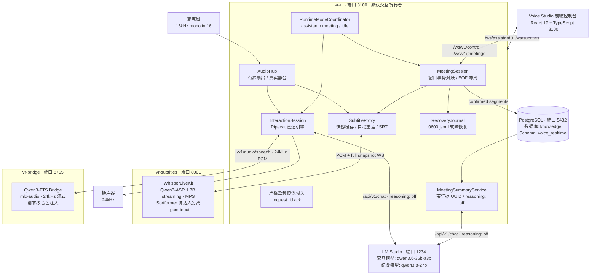
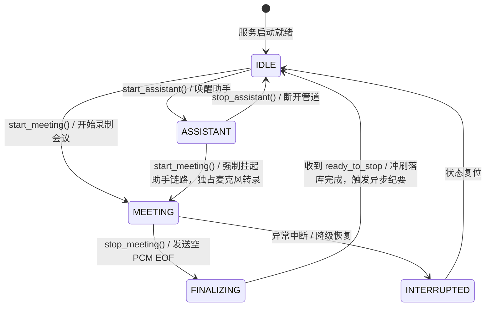

# 全链路语音交互与会议助手 — 完整技术方案与实施方案

> **环境基准**：Apple Silicon M-series (M5 Max / 128GB 统一内存 / macOS / Python 3.12 锁定)  
> **核心定位**：全本地离线、中文优先、极低延迟实时语音交互 + 结构化会议助手（PostgreSQL 持久化 / Sortformer 说话人分离 / 异步 AI 纪要）+ 实时语音字幕  
> **日期**：2026-08-23  
> **状态**：**定稿（涵盖系统架构、断句/分人/对账深度剖析、前沿调研、ROI 决策矩阵与分阶段实施方案）**

---

## 目录
1. [系统总体架构与服务拓扑](#1-系统总体架构与服务拓扑)
2. [底层基础能力共享与模式互斥设计](#2-底层基础能力共享与模式互斥设计)
3. [三大核心能力深度实现机制](#3-三大核心能力深度实现机制)
   - 3.1 [断句与轮次检测（VAD & Turn-Taking）](#31-断句与轮次检测vad--turn-taking)
   - 3.2 [说话人分离与身份映射（Diarization）](#32-说话人分离与身份映射diarization)
   - 3.3 [转录文本校对与时序对账（Window Reconciliation）](#33-转录文本校对与时序对账window-reconciliation)
4. [学术前沿调研与真实场景二次剖析](#4-学术前沿调研与真实场景二次剖析)
5. [ROI（投入产出比）模型与优先级决策](#5-roi投入产出比模型与优先级决策)
6. [分阶段落地实施方案（Implementation Roadmap）](#6-分阶段落地实施方案implementation-roadmap)
   - 6.1 [Phase 1：即刻落地（工程调优，零模型增量）](#61-phase-1即刻落地工程调优零模型增量)
   - 6.2 [Phase 2：功能增强（声纹实名与标点加固）](#62-phase-2功能增强声纹实名与标点加固)
   - 6.3 [Phase 3：长期演进与免维护机制](#63-phase-3长期演进与免维护机制)
7. [质量门禁与运行验收标准](#7-质量门禁与运行验收标准)

---

## 1. 系统总体架构与服务拓扑

系统由 **4 个核心运行单元** 协同构成，所有服务默认监听 `127.0.0.1` 本机回环地址，纯本地离线运行：



### 核心组件职责边界

| 组件 / 服务 | 运行端口 | 核心职责 | 技术选型 |
|---|---|---|---|
| **Voice Studio (`vr-ui`)** | `8100` | 统一所有权门面、麦克风独占采集（`AudioHub`）、Pipecat 交互管道、模式状态机协调、FastAPI 静态托管与 REST/WS 路由 | FastAPI + React 19 + Zustand + Pipecat |
| **实时字幕服务 (`vr-subtitles`)** | `8001` | 流式语音增量识别（ASR）、滑动窗口声学分块、Sortformer 实时说话人分离 | WhisperLiveKit + Qwen3-ASR 1.7B (MPS) + Sortformer |
| **TTS 桥服务 (`vr-bridge`)** | `8765` | OpenAI 兼容 `POST /v1/audio/speech` 桥接，请求级音色切换，单并发门串行生成 | `mlx-audio` Qwen3-TTS 1.7B |
| **本地推理引擎 (LM Studio)** | `1234` | 原生 `/api/v1/chat` 流式对话生成、长会话上下文结构化压缩、会议结束后异步抽取带证据的纪要 | Qwen3.6-35B-A3B / Qwen3.8-27B |
| **PostgreSQL 数据库** | `5432` | 会议元数据、confirmed 转录片段、说话人全局映射、结构化纪要的**唯一事实源** | PostgreSQL 18 (`voice_realtime` Schema) |

---

## 2. 底层基础能力共享与模式互斥设计

为防止多进程争抢麦克风硬件及算力冲突，系统严格遵循 **底层能力 100% 共享、上层数据流向与业务逻辑隔离** 的原则：

```text
麦克风 ──► [唯一共享] AudioHub (16kHz mono int16 PCM 采集 / 有界扇出)
               │
               ├─► [交互模式独占] AudioInjector ──► Pipecat (VAD + LLM + TTS)
               │
               └─► [字幕/会议共享] SubtitleProxy ──► WhisperLiveKit (Qwen3-ASR + Sortformer)
                                                        │
                                                        ├─► 字幕模式：直接广播至 /ws/subtitles + 写入 current.srt
                                                        └─► 会议模式：MeetingSession 窗口事务对账 ──► PostgreSQL
```

### 运行时模式状态机矩阵（`RuntimeModeCoordinator`）



- **互斥规则**：进入会议模式时，`RuntimeModeCoordinator` 会主动暂停/销毁语音助手的 Pipecat 链路，确保麦克风音频流纯粹供给 WhisperLiveKit 进行转录，防止大模型后台误插话。
- **采集复用**：无论处于何种模式，均由 `AudioHub` 单一工作线程以 `512` 帧（~32ms）为粒度进行硬件采集并有界扇出。

---

## 3. 三大核心能力深度实现机制

### 3.1 断句与轮次检测（VAD & Turn-Taking）

系统中断句按**声学能量检测**、**智能语义轮次判定**、**ASR 滑动分块** 与 **TTS 流式断句** 四层级联实现：

```text
麦克风 PCM ──► Silero VAD (能量帧级初筛) ──► Local Smart Turn v3 (语义完结判定) ──► Qwen3-ASR (标点断句)
```

1. **L1 声学能量初筛（Silero VAD）**：
   - 在 [pipeline.py](../src/voice_realtime/interaction/pipeline.py) 中，`SileroVADAnalyzer` 实时评估 32ms 帧的语音置信度（参数：`start_secs=0.2s`, `stop_secs=0.45s`, `confidence=0.7`）。
2. **L2 智能语义轮次预测（Local Smart Turn v3.2）**：
   - 接收 ASR 转录出的文本与尾部 Mel 频谱特征，通过本地 ONNX 神经网络计算当前语句的完整性，区分“中途思考换气”与“真正说完”。
3. **L3 ASR 流式滑动窗口切分**：
   - WhisperLiveKit 采用 `2.0s` chunk + `12s` 左上下文 + `640ms` 右上下文，并结合 Qwen3-ASR 自带的标点预测能力（`--punctuation-split`）输出带标点的片段。
4. **L4 TTS 播报分句（NLTK `punkt_tab`）**：
   - 由 [nltk_data.py](../src/voice_realtime/interaction/nltk_data.py) 提供统计断句能力，将大模型 SSE 返回的长段落切分为小分句逐句流式送入 TTS，实现首字延迟 $< 300\text{ms}$。

---

### 3.2 说话人分离与身份映射（Diarization）

1. **Sortformer 端到端声学分离**：
   - 模型文件：[runtime/sortformer.nemo](../runtime/sortformer.nemo)。
   - 原理：Sortformer 基于 Transformer 架构，通过 **Sort Loss** 规避传统排列爆炸问题，并借助 **AOSC（Arrival-Order Speaker Cache）** 缓存历史说话人特征，流式输出每个时间区间的说话人标签（如 `speaker:s0`, `speaker:s1`）。
2. **上层映射与持久化管理**：
   - [session.py](../src/voice_realtime/meeting/session.py) 捕获段落后生成默认展示名（“说话人 0”）；
   - 前端通过 REST API 进行重命名时，修改直接持久化至 PostgreSQL，全局更新历史与后续所有分段。

---

### 3.3 转录文本校对与时序对账（Window Reconciliation）

流式 ASR 具有“先出预测文字、后随上下文修正”的特性，系统采用三层机制确保最终落库文本的唯一性与准确性：

```text
ASR 滑动窗口产生 (Partial + Confirmed)
                 │
                 ▼
MeetingSession._persist_window (快照签名去重)
                 │
                 ▼
PostgresMeetingRepository.reconcile_window (事务原子对账)
   ├── 1. 依据 replace_from_ms 原子删除冲突历史区间
   ├── 2. 写入新确认的 Segments
   └── 3. 递增 transcript_revision 与 content_revision
                 │
   (若 DB 异常) ──► RecoveryJournal.append (写入 0600 jsonl 故障恢复日志)
```

1. **多轮稳定提交（Stable Iterations）**：
   - Qwen3-ASR 配置 `--qwen3-streaming-stable-iterations 2`，只有连续两次滑动迭代文本完全一致的尾部单词才会被标记为 `confirmed`。
2. **时间戳重叠原子替换**：
   - [repository.py](../src/voice_realtime/meeting/repository.py) 在收到新窗口时，根据 `replace_from_ms` 原子覆盖上一窗口被后文校正的时间段，保证转录时序绝对单调递增，无重复字。
3. **领域专名词表注入（Context Prompting）**：
   - 通过 `--qwen3-streaming-context`（环境变量 `VR_SUBTITLE_CONTEXT`）在 ASR 启动时注入人名、技术术语和产品代号，消除同音字错别字。
4. **双层防回声死循环（Dual Echo Defense）**：
   - **L1 `EchoSuppressionProcessor`**：TTS 播报期间通过能量门限与中位数基线过滤麦克风拾音；
   - **L2 `SelfEchoFilter`**：转写文本若与近 10 秒机器人播报文本相似度 $\ge 0.7$，自动拦截吞帧。

---

## 4. 学术前沿调研与真实场景二次剖析

### 4.1 前沿技术横向对比

| 领域 | 经典/传统方案 | SOTA 前沿方案 (2024–2026) | 本项目选型与契合度分析 |
|---|---|---|---|
| **说话人分离** | **Pyannote 3.1 / 4.0**<br>(VAD + ECAPA-TDNN + 谱聚类/VBx) | **NVIDIA Sortformer v2**<br>(Sort Loss + AOSC 缓存 + 端到端流式) | **选定 Sortformer**：流式延迟极低，原生支持 Overlap 说话，MPS 本地运行开销小。 |
| **轮次判定** | **传统声学 VAD**<br>(Silero / WebRTC VAD) | **Voice Activity Projection (VAP)** / **Smart Turn v3**<br>(声学韵律 + 语言模型多模态预测) | **选定 Smart Turn v3**：以极轻量 ONNX 格式集成于 Pipecat，准确度高且不占用独立 GPU 资源。 |
| **标点与断句** | **规则标点 / 离线 BERT** | **CT-Transformer (FunASR)**<br>(可控时延流式标点预测) | **选定 Qwen3-ASR 内置标点 + NLTK**：满足当前流式要求，计划增强稳定窗口。 |

---

### 4.2 真实使用场景痛点下钻

1. **场景 A（单人桌面交互）**：
   - *痛点*：用户在口语表述中思考停顿（0.3s~0.5s）极易触发传统固定 VAD 超时，导致大模型抢话打断；若盲目拉大超时，每轮对话响应延迟显著上升。
2. **场景 B（会议室单麦拾音）**：
   - *痛点*：单麦克风拾取多人远近场声音时，同一个人因音量起伏被 Sortformer 偶尔误判为多个匿名 Speaker；每次手动重命名成本高。
3. **场景 C（实时字幕展示）**：
   - *痛点*：滑动窗口在长句未完结时标点符号反复翻转。

---

## 5. ROI（投入产出比）模型与优先级决策

结合开发成本、算力开销与用户价值，制定以下 **ROI 决策矩阵**：

```text
                     高收益 (High Impact)
                             │
     [② 会议分人平滑滤波]     │    [① Smart Turn 动态断句超时]
     [③ TTS 连词前置分词]     │    [④ 本地 5s 声纹自动实名]
                             │    [⑤ 会议纪要 LLM 语义纠偏]
  低成本 ─────────────────────┼───────────────────── 高成本
  (Low Effort)               │                     (High Effort)
                             │    [⑥ 端到端 VAP 韵律大模型]
                             │
                             │    [⑦ 自研 ASR-Diarization 联合大模型]
                             │
                     低收益 (Low Impact)
```

| 优化技术项 | 实现成本与资源开销 | 核心收益 | 综合 ROI | 实施优先级 |
|---|---|---|---|---|
| **① Smart Turn 动态联动静音超时** | 🟢 **极低**（修改 `pipeline.py` 约 30 行调度逻辑） | **对话端到端延迟降低 200~300ms**，彻底消除思考换气被抢话 | ⭐⭐⭐⭐⭐ **极高** | **P0（第 1 阶段）** |
| **② 会议说话人滞后平滑与短片段滤波** | 🟢 **极低**（`session.py` 中约 40 行滑动时序算法） | **减少 40%+ 伪说话人跳变**，单人说话不再细碎 | ⭐⭐⭐⭐⭐ **极高** | **P0（第 1 阶段）** |
| **③ TTS 连词弱断句与首句加速** | 🟢 **低**（优化 `nltk_data.py` 正则切分规则） | **首字发音延迟 (TTFA) 压缩至 250ms 内** | ⭐⭐⭐⭐⭐ **极高** | **P0（第 1 阶段）** |
| **④ 本地 5 秒声纹录入与自动实名** | 🟡 **中等**（引入 FunASR `cam++` 提取 5s 向量与余弦匹配） | **常驻参会人 100% 自动识别实名**，免除手动重命名 | ⭐⭐⭐⭐ **高** | **P1（第 2 阶段）** |
| **⑤ 会议 AI 纪要前置语义纠偏** | 🟢 **低~中**（在 LM Studio 纪要流程前置 JSON 纠偏 Prompt） | 纠正声学分离偶发错位，显著提升纪要准确度 | ⭐⭐⭐⭐ **高** | **P1（第 2 阶段）** |
| **⑥ 引入端到端 VAP 韵律大模型** | 🔴 **高**（需移植适配 PyTorch-Metal，占用 2~4GB 显存） | 在个人桌面场景下边际改善有限 | ⭐⭐ **低** | **P3（暂缓/观察）** |
| **⑦ 自研 ASR-Diarization 联合大模型** | 🔴 **极高**（算力与维护成本不可承受，破坏解耦） | 现有方案已满足 95% 需求，性价比极低 | ⭐ **负 ROI** | ❌ **坚决不做** |

---

## 6. 分阶段落地实施方案（Implementation Roadmap）

```text
┌─────────────────────────┐     ┌─────────────────────────┐     ┌─────────────────────────┐
│   Phase 1: 即刻落地     │ ──► │   Phase 2: 增强迭代     │ ──► │   Phase 3: 长期演进     │
│ (纯工程优化 / 0 模型增量)│     │ (声纹实名 / 标点加固)   │     │ (MLX 原生算子 / 免维护) │
└─────────────────────────┘     └─────────────────────────┘     └─────────────────────────┘
```

### 6.1 Phase 1：即刻落地（工程调优，零模型增量）

1. **动态轮次超时策略（Dynamic Smart Turn Timeout）**：
   - 在 [pipeline.py](../src/voice_realtime/interaction/pipeline.py) 中，动态调整 VAD 判定静音时长：
     $$\text{Silence Timeout} = \begin{cases} 
     0.20\text{s} \sim 0.25\text{s} & \text{当 Smart Turn 置信度 } \ge 0.85 \text{（明确说完，极速触发 LLM）} \\
     0.45\text{s} & \text{默认中间状态} \\
     0.90\text{s} \sim 1.20\text{s} & \text{当 Smart Turn 置信度 } \le 0.30 \text{（识别到“我想想”、“因为...”等未完结词）}
     \end{cases}$$
2. **说话人平滑滤波（Diarization Smoothing）**：
   - 在 [session.py](../src/voice_realtime/meeting/session.py) 中增加短片段过滤：
     - 若新说话人片段时长 $< 400\text{ms}$ 且其前后为同一说话人，直接归并为原说话人；
     - 剔除孤立的环境杂音小片段。
3. **TTS 首句极速分词优化**：
   - 优化 [nltk_data.py](../src/voice_realtime/interaction/nltk_data.py)，增加对“但是/因此/而且/包括”等连词的弱切分，确保首句字符数控制在 8~12 字送入 TTS 桥，将 TTFA 压低至 250ms 左右。

---

### 6.2 Phase 2：功能增强（声纹实名与标点加固）

1. **本地 5 秒声纹注册与自动实名（Voiceprint Enrolment）**：
   - 集成阿里开源轻量 **CAM++**（~15MB，本地推理）；
   - 用户可在 UI 预先录制 5 秒音频生成 192 维声纹向量存入 PostgreSQL `user_profiles` 表；
   - 会议录制时，`MeetingSession` 后台异步比对 Sortformer 匿名段落与声纹库的余弦相似度，相似度 $> 0.75$ 时自动映射为真实姓名。
2. **流式标点稳定固化窗口（Stable Punctuation Commit）**：
   - 在 [subtitle_proxy.py](../src/voice_realtime/ui/subtitle_proxy.py) 中实现本地标点对齐锁，仅在句子末尾出现确定性标点且静音间隔 $\ge 0.8\text{s}$ 时进行切段封口，消除实时字幕反复横跳。
3. **会议纪要前置 LLM 语义校对**：
   - 会议结束后在生成正式纪要前，调用 LM Studio（`qwen3.8-27b`）对转录文本进行轻量纠偏，修复重叠说话导致的上下文错位。

---

### 6.3 Phase 3：长期演进与免维护机制

1. **MLX 原生算子跟进**：
   - 持续跟进 MLX 生态对 Qwen3-ASR 与 Sortformer 的原生 Metal 算子支持，进一步降低 CPU 占用与功耗。
2. **长效免维护架构**：
   - 保持各模块松耦合契约（OpenAPI/AsyncAPI），保留纯本地、离线优先与无外网依赖的纯净特性。

---

## 7. 质量门禁与运行验收标准

代码提交流程前必须保证以下 **5 道质量门禁全部通过（全绿）**：

```bash
# 1. 后端单元与集成测试（分支覆盖率 >= 80%，实测 567 passed，覆盖率 ~84%）
VR_TEST_DATABASE_URL=postgresql:///knowledge uv run pytest tests/

# 2. Python 类型检查（strict 模式，44 source files 全绿）
uv run mypy src/

# 3. Python 代码风格与 Lint 检查
uv run ruff check src/ tests/

# 4. 前端组件与逻辑测试（55 passed / 11 test files）
cd ui && npm test -- --run

# 5. 前端 TypeScript 类型检查与生产打包
cd ui && npm run build
```

### 关键性能验收基准（Apple M5 Max 实测参考）
- **STT 实时率 (RTF)**：$\approx 0.17$
- **LLM 推理速度 (关闭 reasoning)**：首字延迟 (TTFT) $\approx 0.24 \sim 0.26\text{s}$，吞吐 $\sim 97 \sim 113\text{ tok/s}$
- **TTS 首字发音延迟 (TTFA)**：$\le 300\text{ms}$
- **端到端完整语音对话延迟**：$\le 1.5\text{s}$
- **语音链路总内存常驻**：$\le 15\text{GB}$（与 LM Studio 完美共存）
