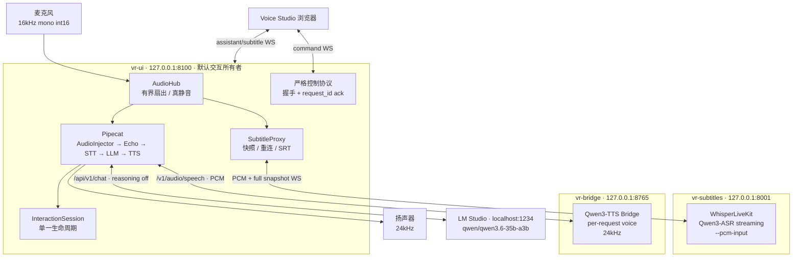
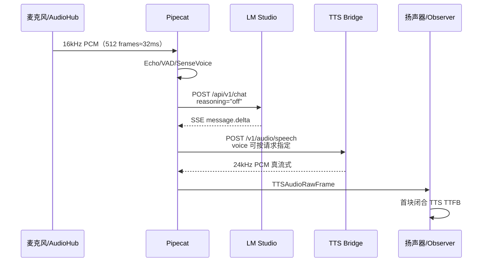
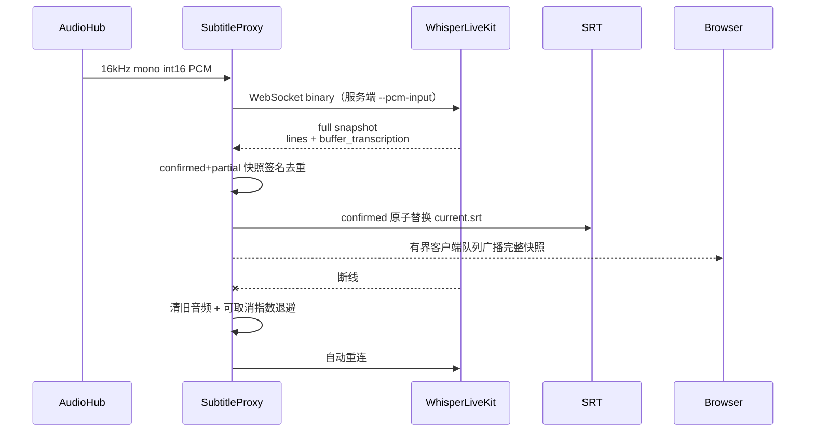
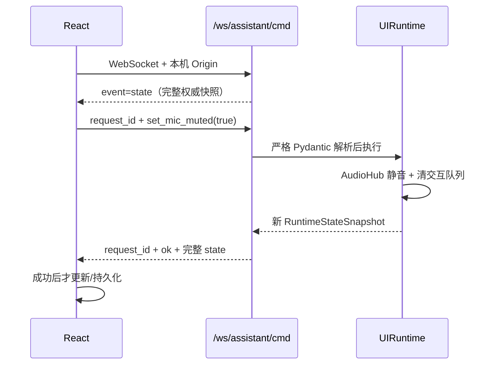

# voice-realtime 架构图与端到端流程图

> 更新：2026-08-21。当前权威拓扑为四个运行单元；`vr-interact` 是 `vr-ui` 的互斥替代入口。

## 1. 运行拓扑

所有监听地址均为 loopback。默认离线运行；字幕模型目录缺失时 fail-fast，不隐式联网。

## 2. 交互模块

```mermaid
flowchart LR
    OWNER[InteractionOwnership<br/>flock 非阻塞] --> SESSION[InteractionSession]
    SESSION --> WORKER[PipelineWorker / WorkerRunner]
    WORKER --> IN[AudioInjector 或 LocalAudioTransport input]
    IN --> ECHO[EchoSuppressionProcessor]
    ECHO --> STT[FunASR SenseVoice<br/>本地 HF snapshot]
    STT --> FILTER[SelfEchoFilter]
    FILTER --> USER[LLMUserAggregator + Silero VAD]
    USER --> LLM[LmStudioNativeLLMService]
    LLM --> REC[BotTextRecorder]
    REC --> TTS[OpenAITTSService]
    TTS --> OBS[TTSStateObserver<br/>EchoState 唯一写者]
    OBS --> OUT[LocalAudioTransport output]
    OUT --> ASSIST[LLMAssistantAggregator]
```

UI 模式用 `AudioInjector`，headless 模式用本地 transport 输入。两种入口复用同一会话状态机；
停止顺序为 `runner.end()` → 限时等待 → 必要时取消 → 清空旧音频 → 释放所有权。

## 3. 交互时序

LM 原生 payload 不含 `role` 和 `max_tokens`。LLM 客户端在 stop/cancel/cleanup 时显式关闭。
TTS 模型访问由单并发门串行化，线程到 async 队列有界；WAV 仅用于需完整长度头的聚合响应。

## 4. 字幕时序

稳定身份由时间、speaker 和文本共同构成；已有 confirmed 行不会遮蔽后续 partial。停止时把
`current.srt` 归档为带时间戳文件。

## 5. 控制与状态时序

控制失败只返回 `invalid_command`、`invalid_payload`、`command_failed` 或
`service_unavailable` 等稳定错误码，不返回内部异常文本。

## 6. 关键格式

| 链路 | 协议 | 格式 |
|---|---|---|
| AudioHub → Pipecat | `asyncio.Queue` | 16kHz / mono / int16 / 512 frames |
| SubtitleProxy → WLK | WebSocket binary | 同上，WLK `--pcm-input` |
| Pipecat → LM Studio | HTTP SSE | 原生 `/api/v1/chat`，`message.delta` |
| Pipecat → TTS Bridge | HTTP | `/v1/audio/speech`，`pcm` 或 `wav` |
| TTS Bridge → Pipecat | streaming body | 24kHz / mono / int16 PCM |
| WLK → SubtitleProxy | WebSocket JSON | full snapshot：confirmed `lines` + partial buffer |
| Browser → Control | WebSocket JSON | `request_id` + discriminated command |
