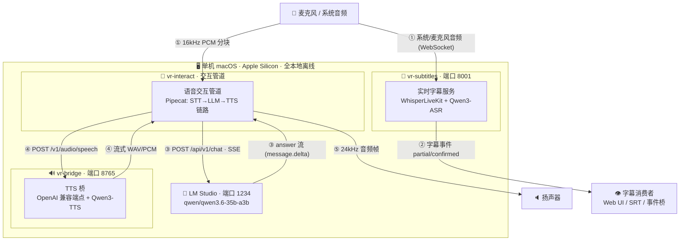
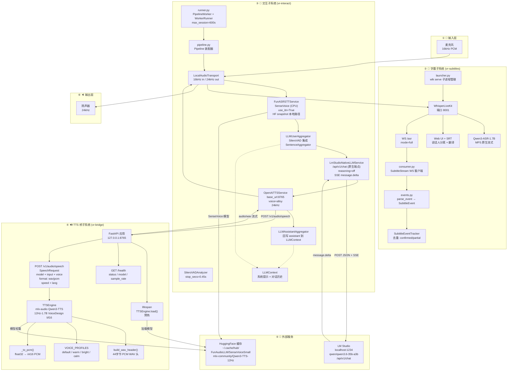
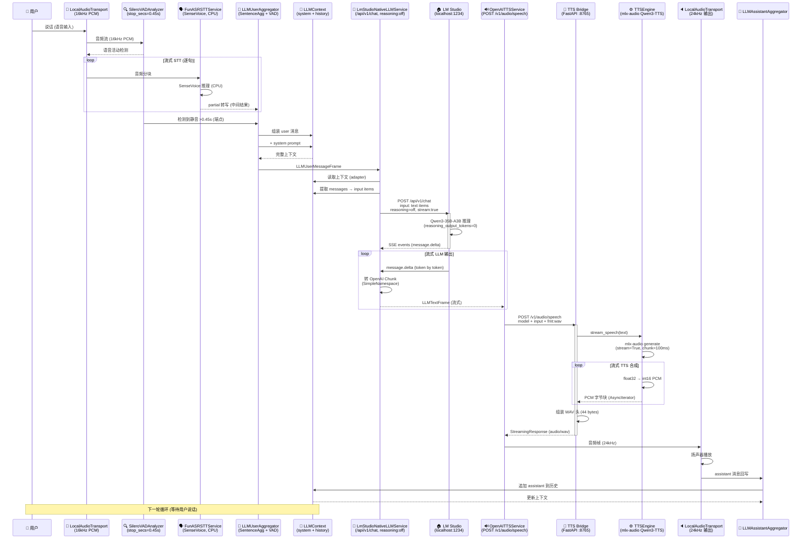
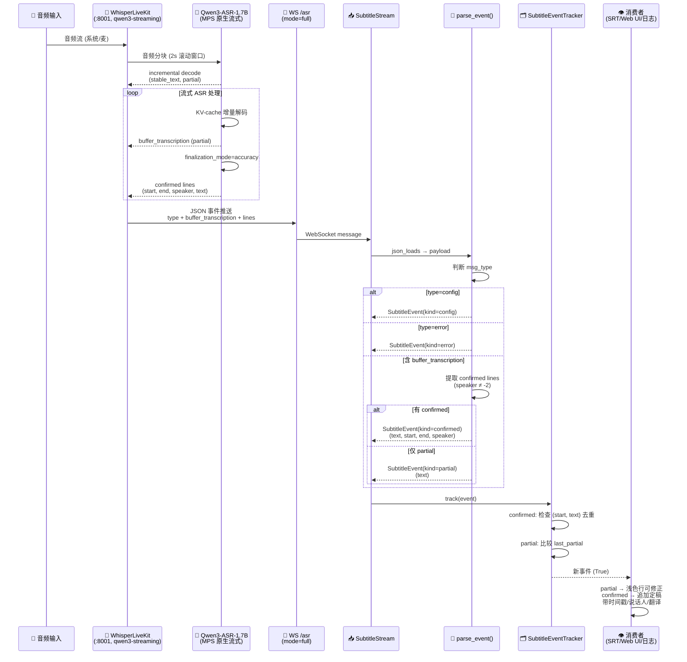

# voice-realtime — 架构图与端到端流程图

> 生成日期:2026-08-18
> 关联:方案与最佳实践见 [`实时语音交互与字幕-方案与最佳实践.md`](实时语音交互与字幕-方案与最佳实践.md)
> 图例:本文件使用 Mermaid(兼容 GitHub / Typora / Obsidian / VS Code 渲染)

---

## 1. 高阶架构图(总体视图)

> 三大进程 + 一个外部服务,单机离线闭环;链路编号见下图注。

> **图 1 · 高阶架构说明(链路编号 ①–⑤)**
> 1. ① **音频输入分流** — 同一声源两路:系统/麦克风音频经 WebSocket 送字幕 ASR;16kHz PCM 分块送交互管道。
> 2. ② **字幕事件** — partial/confirmed 推送 Web UI / SRT / 事件桥。
> 3. ③ **LLM 对话** — 交互管道经 LM Studio 原生 `/api/v1/chat` 请求并流式接收回复(SSE,`reasoning=off`)。
> 4. ④ **TTS 往返** — 助手文本经 OpenAI 兼容 `POST /v1/audio/speech` 送 TTS 桥,流式 WAV/PCM 返回。
> 5. ⑤ **播放** — 24kHz 音频帧输出到扬声器。
>
> 全部进程与模型均在本机,无外网依赖。

---

## 2. 系统架构图(模块视图)

> **图 2 · 系统架构说明(组件编号 ①–⑥)**
> 1. ① **输入层** — 麦克风/系统音频进入(16kHz PCM)。
> 2. ② **字幕子系统** — WhisperLiveKit 为 vendor 复用(UI/SRT/说话人分离);`events.py` / `consumer.py` 为自研事件桥。
> 3. ③ **交互子系统** — `interaction/` 自研组装(Pipecat 框架),含 VAD / STT / LLM 服务。
> 4. ④ **TTS 桥** — `tts_bridge/` 唯一自研核心,封装 mlx-audio Qwen3-TTS,开放 OpenAI 兼容端点。
> 5. ⑤ **外部服务** — LM Studio 推理 + HF 模型缓存;SenseVoice / Qwen3-TTS 均经 `snapshot_download` 落本地路径(规避 modelscope SSRF 拦截)。
> 6. ⑥ **输出层** — 扬声器 24kHz 播放。
>
> 虚线为两个聚合器对 `LLMContext` 的共享读写。

---

## 3. 端到端详细流程图

### 3.1 交互链路(说话 → 转写 → LLM → TTS → 播放)

> **图 3 · 交互链路流程说明(步骤编号 ①–⑧)**
> 1. ① **采集** — 用户说话,麦克风采集 16kHz PCM。
> 2. ② **VAD** — Silero 持续检测语音活动。
> 3. ③ **STT** — SenseVoice 流式转写,产出 partial 中间结果。
> 4. ④ **端点与上下文** — 静音 >0.45s 判定端点,聚合器组装 user 消息并入上下文。
> 5. ⑤ **LLM** — `LmStudioNativeLLMService` 走原生 `/api/v1/chat` 且 `reasoning=off`(OpenAI 兼容端点忽略该参数),SSE `message.delta` 流式接收。
> 6. ⑥ **TTS 请求** — OpenAITTSService 流式请求 TTS 桥。
> 7. ⑦ **合成与播放** — TTSEngine 按 100ms 分块合成 int16 PCM(24kHz),桥拼接 44 字节 WAV 头后返回,扬声器播放。
> 8. ⑧ **上下文回写** — 末尾 assistant 聚合器把回复写回 `LLMContext`,支撑多轮对话。

### 3.2 字幕链路(音频 → WhisperLiveKit → 事件消费)

> **图 4 · 字幕链路流程说明(步骤编号 ①–⑤)**
> 1. ① **音频上报** — 音频流经 WebSocket 推送给 WhisperLiveKit。
> 2. ② **ASR 解码** — Qwen3-ASR 增量解码(2s 滚动窗口),周期性产出整份 FrontData 快照。
> 3. ③ **事件解析** — `parse_event` 按类型归一化:partial 取自 `buffer_transcription`(浅色、可修正),confirmed 取 `lines` 中最后一个定稿段(带 start/end/speaker),另有 config / error / ready_to_stop。
> 4. ④ **去重** — `SubtitleEventTracker` 以「confirmed:(start, text) 元组」与「partial:当前文本」双重去重。
> 5. ⑤ **消费** — 只对外发出新事件,渲染为 Web UI / SRT / 日志。

---

## 4. 关键数据流速查

| 连接 | 协议 | 方向 | 数据格式 |
|---|---|---|---|
| 麦克风 → Pipecat | LocalAudioTransport | 输入 | 16kHz PCM |
| Pipecat → 扬声器 | LocalAudioTransport | 输出 | 24kHz PCM |
| LLMService → LM Studio | HTTP POST `/api/v1/chat` | 请求 | JSON: `{model, input, reasoning, stream}` |
| LM Studio → LLMService | SSE | 响应 | `data: {"type":"message.delta","content":"..."}` |
| TTSService → TTS Bridge | HTTP POST `/v1/audio/speech` | 请求 | JSON: `{model, input, response_format, voice, speed}` |
| TTS Bridge → TTSService | HTTP StreamingResponse | 响应 | `audio/wav` (PCM int16 + 44B WAV header) |
| WhisperLiveKit → 事件 | WebSocket `/asr` | 双向 | JSON: `{type, buffer_transcription, lines}` |