# voice-realtime 系统架构与详细设计方案

> **系统定位**：全本地离线、超低延迟实时语音交互（Voice Assistant）+ 结构化会议助手（Meeting Assistant，含 Sortformer 说话人分离 / PostgreSQL 持久化 / 异步 AI 纪要 / 崩溃恢复 Journal）+ 实时语音字幕（Live Subtitles）。  
> **运行环境**：Apple Silicon M-series (macOS / MLX / MPS / Python 3.12 锁定 / Localhost Loopback)。  
> **文档性质**：系统总体架构方案与模块详细设计规范（总分架构体系，面向工程实现与架构审计）。  
> **更新时间**：2026-08-23 | **版本**：v2.0-Final

---

## 📑 架构目录

- [第一部分：系统宏观架构与整体设计（总）](#第一部分系统宏观架构与整体设计总)
  - [1.1 系统定位与核心设计目标](#11-系统定位与核心设计目标)
  - [1.2 核心架构原则](#12-核心架构原则)
  - [1.3 系统总体逻辑分层架构](#13-系统总体逻辑分层架构)
  - [1.4 物理拓扑与服务运行矩阵](#14-物理拓扑与服务运行矩阵)
  - [1.5 运行时模式状态机（RuntimeModeCoordinator）](#15-运行时模式状态机runtimemodecoordinator)
- [第二部分：核心子系统详细设计（分）](#第二部分核心子系统详细设计分)
  - [2. 音频采集与统一扇出子系统（AudioHub）](#2-音频采集与统一扇出子系统audiohub)
  - [3. 实时语音交互子系统（Voice Interaction Pipeline）](#3-实时语音交互子系统voice-interaction-pipeline)
    - [3.1 处理器链编排与时序](#31-处理器链编排与时序)
    - [3.2 双层防回声死循环防御体系](#32-双层防回声死循环防御体系)
    - [3.3 LM Studio 原生对话链与 ADR-003 滚动压缩](#33-lm-studio-原生对话链与-adr-003-滚动压缩)
    - [3.4 TTS 桥接与流式播报断句优化](#34-tts-桥接与流式播报断句优化)
  - [4. 实时字幕与说话人分离子系统（Live Subtitles & Diarization）](#4-实时字幕与说话人分离子系统live-subtitles--diarization)
    - [4.1 字幕服务架构与模型集成](#41-字幕服务架构与模型集成)
    - [4.2 SubtitleProxy 快照对齐与自动重连](#42-subtitleproxy-快照对齐与自动重连)
  - [5. 结构化会议助手子系统（Meeting Assistant Engine）](#5-结构化会议助手子系统meeting-assistant-engine)
    - [5.1 会议端到端全生命周期时序](#51-会议端到端全生命周期时序)
    - [5.2 窗口事务对账算法（Window Reconciliation）](#52-窗口事务对账算法window-reconciliation)
    - [5.3 故障容灾恢复日志（RecoveryJournal）](#53-故障容灾恢复日志recoveryjournal)
    - [5.4 结构化 AI 纪要生成与证据 UUID 锚定](#54-结构化-ai-纪要生成与证据-uuid-锚定)
  - [6. 控制平面、通信协议与状态契约（Control Plane & Protocols）](#6-控制平面通信协议与状态契约control-plane--protocols)
  - [7. 前端控制台架构设计（Voice Studio UI）](#7-前端控制台架构设计voice-studio-ui)
- [第三部分：系统横切与工程保障（总）](#第三部分系统横切与工程保障总)
  - [8. 容灾降级与边界隔离矩阵](#8-容灾降级与边界隔离矩阵)
  - [9. 核心数据模型与存储规范](#9-核心数据模型与存储规范)
  - [10. 性能基准与质量门禁](#10-性能基准与质量门禁)

---

# 第一部分：系统宏观架构与整体设计（总）

## 1.1 系统定位与核心设计目标

`voice-realtime` 是专为 Apple Silicon 硬件定制的全本地、低延迟实时语音与会议智能系统。系统在保证**零数据出域（完全离线）**的前提下，融合了三个维度的核心能力：
1. **极速人机交互（Voice Assistant）**：提供类似真人通话的全双工实时语音交互，端到端首字延迟 $< 300\text{ms}$，具备智能打断（Barge-in）与双层声学防回声机制。
2. **专业会议助手（Meeting Assistant）**：支持多说话人分离（Sortformer Diarization）、实时窗口增量对账、PostgreSQL 结构化持久化、断电故障恢复 Journal，以及会议结束后的异步结构化纪要提取（基于本地大模型，带精确原文片段 UUID 锚定）。
3. **实时语音字幕（Live Subtitles）**：低资源占用流式转录，快照签名去重，自动生成带说话人标识的实时字幕流与 SRT 文件。

---

## 1.2 核心架构原则

| 原则 | 架构实现与设计考量 |
|---|---|
| **单源采集与有界扇出** | 麦克风硬件由 [`AudioHub`](file:///Users/hrygo/Documents/voice-realtime/src/voice_realtime/audio/hub.py) 独占捕获，通过内存有界队列广播至交互与字幕链路；支持真实物理静音（零音频吞吐）。 |
| **运行时模式绝对互斥** | [`RuntimeModeCoordinator`](file:///Users/hrygo/Documents/voice-realtime/src/voice_realtime/meeting/runtime_mode.py) 统一协调 `assistant`（交互）、`meeting`（会议）与 `idle`（空闲）三种状态。进入会议模式时主动挂起/销毁 Pipecat 链路，杜绝多模型算力争抢与外放误插话。 |
| **本地优先与离线封闭** | 默认 `allow_model_downloads=False`，所有 ASR、VAD、LLM、TTS 模型全部加载自本地快照路径；未配置或缺失模型时 Fail-Fast，杜绝隐式联网与 SSRF 风险。 |
| **数据边界与无音频存储** | PostgreSQL 是会议元数据、转录文本、发言人映射与 AI 纪要的**唯一事实源**；数据库与本地磁盘**绝对不存储用户原始音频数据**；会议模式不写入 `current.srt`。 |
| **LM 原生状态链与精准推理** | LLM 交互与纪要生成只能调用 LM Studio 原生 `/api/v1/chat` 接口，显式传入 `reasoning: "off"`；通过原生 `previous_response_id` 维护角色上下文，按 ADR-003 执行上下文结构化滚动压缩。 |
| **双层声学防回声防线** | 单机同麦同箱环境下，L1 声学能量门限（`EchoSuppressionProcessor`）与 L2 文本相似度过滤（`SelfEchoFilter`）级联防护，确保免提外放不自激、真人插话毫秒级穿透。 |

---

## 1.3 系统总体逻辑分层架构

系统逻辑架构划分为 6 个核心层级，自底向上实现音频信号到智能决策的完整闭环：

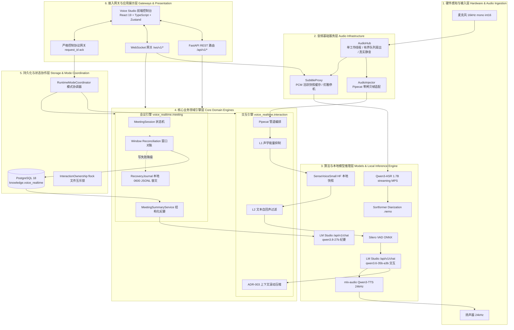

---

## 1.4 物理拓扑与服务运行矩阵

系统由 **4 个独立运行进程单元** 与 **PostgreSQL 数据库** 协同构成。所有服务默认监听 `127.0.0.1` 本地回环网络：

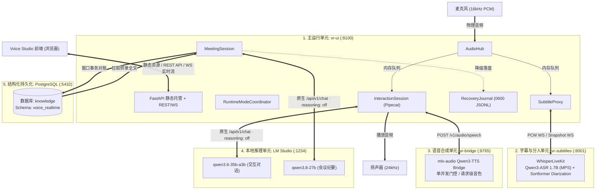

### 进程与端口运行矩阵

| 运行单元 | 默认端口 | 进程入口 / 命令 | 进程模型与生命周期 | 核心通信协议与数据格式 |
|---|---|---|---|---|
| **Voice Studio 核心宿主 (`vr-ui`)** | `8100` | [`voice_realtime.ui.server`](file:///Users/hrygo/Documents/voice-realtime/src/voice_realtime/ui/server.py) | Python 3.12 异步主进程，包含 AudioHub、InteractionSession、MeetingSession、FastAPI | HTTP REST (`/api/v1/*`)<br>WS 控制 (`/ws/v1/control`)<br>WS 实时会议 (`/ws/v1/meetings`) |
| **实时字幕服务 (`vr-subtitles`)** | `8001` | [`voice_realtime.subtitles.launcher`](file:///Users/hrygo/Documents/voice-realtime/src/voice_realtime/subtitles/launcher.py) | 独立子进程（封装 `WhisperLiveKit`），基于 PyTorch MPS 运行 Qwen3-ASR 与 Sortformer | WebSocket Binary (接收 16kHz PCM)<br>WebSocket JSON (推 full snapshot) |
| **TTS 语音合成桥 (`vr-bridge`)** | `8765` | [`voice_realtime.tts_bridge.server`](file:///Users/hrygo/Documents/voice-realtime/src/voice_realtime/tts_bridge/server.py) | 独立子进程，基于 Apple MLX 运行 Qwen3-TTS 1.7B，单并发门串行化生成 | HTTP POST `/v1/audio/speech`<br>响应 `audio/pcm` (24kHz, int16) |
| **本地推理引擎 (LM Studio)** | `1234` | LM Studio 宿主应用 | 独立 Native 运行环境，加载 Qwen3.6-35B-A3B 与 Qwen3.8-27B | HTTP POST `/api/v1/chat` (SSE 流式)<br>`reasoning: "off"` 锁定 |
| **PostgreSQL 数据库** | `5432` | `postgres` 守护进程 | 独立数据库服务，DSN: `postgresql:///knowledge`，Schema: `voice_realtime` | psycopg3 异步连接池，严格事务隔离 |

---

## 1.5 运行时模式状态机（RuntimeModeCoordinator）

为了彻底杜绝外放打断混乱与算力竞争，系统由 [`RuntimeModeCoordinator`](file:///Users/hrygo/Documents/voice-realtime/src/voice_realtime/meeting/runtime_mode.py) 统筹运行模式切换：

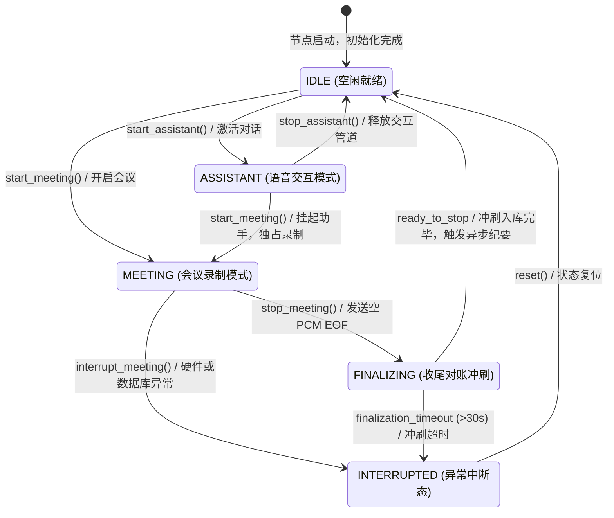

### 状态转移行为约束

```text
┌─────────────────┬─────────────────────────────────────────────────────────────────────────────┐
│ 运行状态        │ 资源调度与音频流向行为约束                                                  │
├─────────────────┼─────────────────────────────────────────────────────────────────────────────┤
│ IDLE            │ AudioHub 保持运行或休眠；Pipecat 管道断开；WhisperLiveKit 处于监听态。       │
│ ASSISTANT       │ AudioHub 广播至 AudioInjector 与 SubtitleProxy；Pipecat 独占 LLM 与 TTS 链路；│
│                 │ 启用 L1 声学能量抑制与 L2 文本相似度自回声过滤。                            │
│ MEETING         │ 主动挂起/销毁 Pipecat 链路；扬声器完全静音；AudioHub 仅推向 SubtitleProxy；  │
│                 │ 独占 WhisperLiveKit，开启 Sortformer 说话人分离与 PostgreSQL 事务对账。     │
│ FINALIZING      │ 向 WhisperLiveKit 发送空 PCM 作为 EOF 标记；限时等待 ready_to_stop 信号；   │
│                 │ 冲刷最后一块转录并封存会议记录为 COMPLETED 状态；触发后台异步 AI 纪要任务。  │
│ INTERRUPTED     │ 会议被异常中断或冲刷超时；标记状态为 INTERRUPTED；保存现有转录与 Journal。    │
└─────────────────┴─────────────────────────────────────────────────────────────────────────────┘
```

---

# 第二部分：核心子系统详细设计（分）

## 2. 音频采集与统一扇出子系统（AudioHub）

[`AudioHub`](file:///Users/hrygo/Documents/voice-realtime/src/voice_realtime/audio/hub.py) 是系统的单一硬件音频采集源，负责以恒定帧长与采样率捕获麦克风信号，并通过有界队列无阻塞分发。

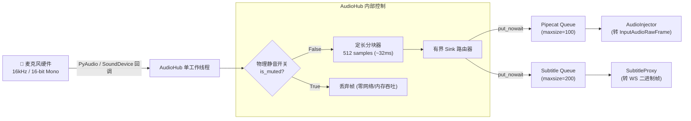

### 核心机制与参数设计

1. **真实物理静音（True Mute）**：
   - 当调用 `set_muted(True)` 时，工作线程在读取音频后立即就地丢弃，不再向任何下游 `Queue` 发送数据，彻底阻断下游 VAD 计算与网络吞吐。
2. **零拷贝有界分发与背压（Backpressure）**：
   - 扇出队列设置严格的 `maxsize`；当下游消费阻塞时，使用 `put_nowait()` 丢弃最老帧并记录警告，杜绝内存泄漏。
3. **参数基准规范**：
   - 采样率：`16,000 Hz`
   - 采样格式：`Signed 16-bit PCM (int16)`
   - 声道数：`1 (Mono)`
   - 帧大小：`512 samples`（对应时间片 $\Delta t = 32\text{ms}$，每帧数据量 `1024 字节`）

---

## 3. 实时语音交互子系统（Voice Interaction Pipeline）

实时语音交互子系统基于 Pipecat 1.7 框架构建，负责语音识别（STT）、智能断句（VAD）、大模型决策（LLM）与语音合成（TTS）的全双工串联。

### 3.1 处理器链编排与时序

根据 [`voice_realtime.interaction.pipeline`](file:///Users/hrygo/Documents/voice-realtime/src/voice_realtime/interaction/pipeline.py)，完整的处理管道流向如下：

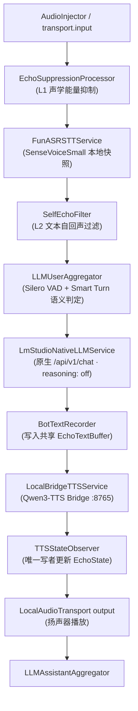

---

### 3.2 双层防回声死循环防御体系

在单机同麦同箱（免提外放）环境下，扬声器播放的声音会不可避免地被麦克风重新拾取。系统设计了**声学域与内容域级联的双层防线**：

```mermaid
flowchart TD
    subgraph L1_DEFENSE["L1 防线: 声学能量域 (EchoSuppressionProcessor)"]
        IN_FRAME["麦克风输入帧 (32ms)"] --> CHECK_BOT{"TTS 是否发声中<br/>或在 0.4s 尾延期?"}
        CHECK_BOT -->|否| PASS_L1["放行至 STT 识别"]
        CHECK_BOT -->|是| CALC_RMS["计算当前帧 RMS 能量"]
        CALC_RMS --> CHECK_RMS{"RMS > 回声基线 × 2.5<br/>且连续 ≥ 3 帧?"}
        CHECK_RMS -->|是 (检测到真人高能量插话)| BARGE_IN["触发打断 (Barge-in)<br/>立刻放行音频"]
        CHECK_RMS -->|否 (普通扬声器外放回声)| DROP_L1["丢弃当前音频帧"]
    end

    subgraph L2_DEFENSE["L2 防线: 文本内容域 (SelfEchoFilter)"]
        PASS_L1 --> SENSEVOICE["SenseVoice 语音转写"]
        SENSEVOICE --> TEXT_OUT["用户转写文本 T_user"]
        TEXT_OUT --> CHECK_TEXT{"T_user 与近 10s 机器人播报<br/>相似度 ≥ 0.7 或为其子串?"}
        CHECK_TEXT -->|是 (判定为自回声漏音)| SWALLOW["吞帧拦截<br/>禁止送入 LLM 上下文"]
        CHECK_TEXT -->|否 (确认为真人有效指令)| PASS_LLM["放行至 LLMUserAggregator"]
    end
```

- **L1 `EchoSuppressionProcessor`**：
  - 扬声器播放时（`bot_speaking=True`）以及播放停止后的 `echo_tail_hangover_secs`（默认 `0.4s`）尾延期间，默认丢弃输入音频；
  - 维护滑动中位数声学基线；若输入 RMS 连续 `3` 帧超过基线 `2.5` 倍，判定为真人打断（Barge-in），毫秒级解除抑制。
- **L2 `SelfEchoFilter`**：
  - 维护 `EchoTextBuffer`（记录近 `10s` 内助手播报的文本）；
  - 当用户转写文本与缓存文本的字符相似度 $\ge 0.7$ 或为其长子串时，直接吞除该文本帧，杜绝“助手自我对话”的死循环。

---

### 3.3 LM Studio 原生对话链与 ADR-003 滚动压缩

为了保证 Qwen 系列模型在本地推理时首字延迟达到最优（关闭无谓的 Reasoning 推理），系统遵循 **ADR-002 / ADR-003** 契约：

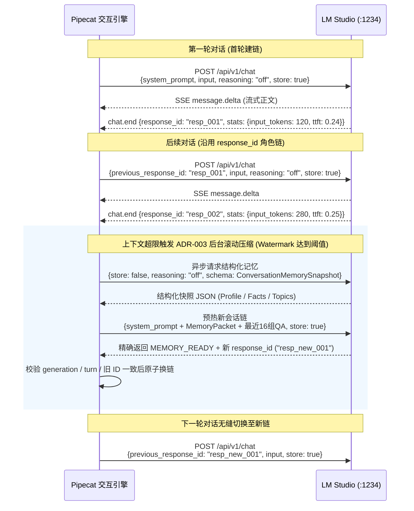

- **原生接口唯一性**：严禁调用 OpenAI 兼容端点 `/v1/chat/completions`（无法关闭 reasoning）；
- **滚动压缩参数水位**：Soft Token 水位 `16,384`，Hard Token 水位 `32,768`，Target 水位 `8,192`；保留最近 16 组问答，换链全过程对用户零感知。

---

### 3.4 TTS 桥接与流式播报断句优化

[`voice_realtime.tts_bridge`](file:///Users/hrygo/Documents/voice-realtime/src/voice_realtime/tts_bridge/server.py) 将 MLX 架构的 `Qwen3-TTS` 封装为 OpenAI 兼容的 `POST /v1/audio/speech` 接口：

1. **单并发门控（Single Concurrency Gate）**：
   - MLX 框架在 Apple Silicon 上独占 Metal 管道，TTS 服务通过 `asyncio.Semaphore(1)` 串行化请求，防止显存与计算竞争。
2. **NLTK `punkt_tab` 级联流式分句**：
   - 交互管道利用 [`nltk_data.py`](file:///Users/hrygo/Documents/voice-realtime/src/voice_realtime/interaction/nltk_data.py) 将 LLM 返回的流式 Token 按标点切分为短句，首句生成即送入 TTS，实现首字发音延迟 $< 300\text{ms}$。
3. **动态音色控制**：
   - 支持在请求 Header/Body 中动态指定 `voice` profile（如 `VoiceDesign`），无需重启服务。

---

## 4. 实时字幕与说话人分离子系统（Live Subtitles & Diarization）

实时字幕子系统由独立进程 `vr-subtitles`（端口 `8001`）提供服务，集成 WhisperLiveKit、Qwen3-ASR 流式模型与 Sortformer 说话人分离算法。

### 4.1 字幕服务架构与模型集成

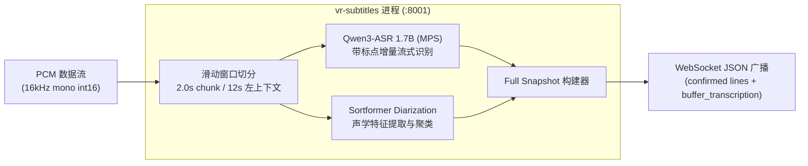

---

### 4.2 SubtitleProxy 快照对齐与自动重连

UI 主进程内的 [`SubtitleProxy`](file:///Users/hrygo/Documents/voice-realtime/src/voice_realtime/ui/subtitle_proxy.py) 是字幕服务与上层业务的唯一网关：

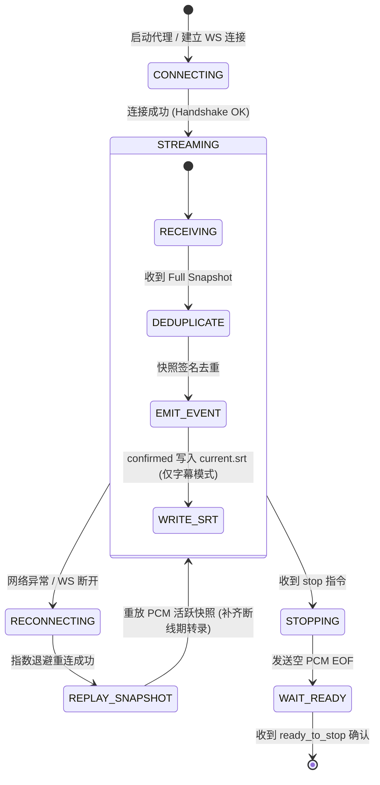

- **签名去重机制**：基于 `(speaker_key, start_ms, end_ms, text)` 计算 MD5 签名，杜绝重复渲染；
- **优雅停机（Graceful Flush）**：停止时发送空 PCM 触发服务端冲刷，等待 `ready_to_stop` 信号后再归档 SRT 文件。

---

## 5. 结构化会议助手子系统（Meeting Assistant Engine）

会议助手是系统的核心业务模块，负责将混乱的多人实时语音转化为结构化、强一致、可追溯的会议资产。

### 5.1 会议端到端全生命周期时序

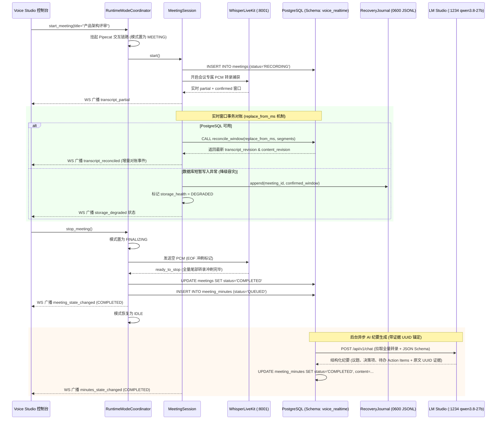

---

### 5.2 窗口事务对账算法（Window Reconciliation）

由于流式 ASR 的右侧上下文修正特性，已识别的语句可能会被重写。系统在 [`MeetingRepository`](file:///Users/hrygo/Documents/voice-realtime/src/voice_realtime/meeting/repository.py) 中实现了确定性的 `replace_from_ms` 窗口对账算法：

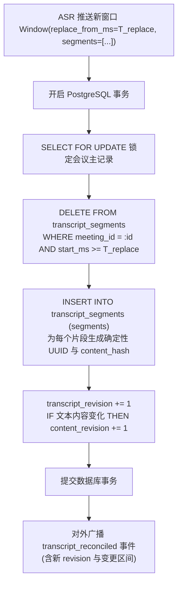

- **双版本号机制**：
  - `transcript_revision`：每次对账无论内容是否变化均单调递增；
  - `content_revision`：仅当文本内容产生实质性修改时递增，前端据此进行高效差量渲染。

---

### 5.3 故障容灾恢复日志（RecoveryJournal）

在 PostgreSQL 数据库发生网络抖动或临时不可写时，[`RecoveryJournal`](file:///Users/hrygo/Documents/voice-realtime/src/voice_realtime/meeting/recovery.py) 启动本地降级存储，确保数据零丢失：

```text
PostgreSQL 正常 ───► 直接写入数据库
       │
       ▼ (写入异常)
RecoveryJournal ──► 写入本地磁盘: runtime/meetings/recovery/{meeting_id}.jsonl
                    (文件权限 0600 / 目录权限 0700 / 仅存 Confirmed 文本)
       │
       ▼ (数据库恢复)
Journal Replay ──► 读取 JSONL 记录 ──► 批量回放至 PostgreSQL ──► 验证通过后安全删除文件
```

---

### 5.4 结构化 AI 纪要生成与证据 UUID 锚定

[`MeetingSummaryService`](file:///Users/hrygo/Documents/voice-realtime/src/voice_realtime/meeting/summary.py) 在会议结束后调用 `qwen3.8-27b` 模型生成结构化纪要。为了确保纪要内容的严谨性与防幻觉，输出必须遵循严格的 JSON Schema，并为每个事实点锚定转录片段的 UUID：

```json
{
  "title": "会议主题与核心目标",
  "summary": "全局摘要概括...",
  "topics": [
    {
      "topic": "技术架构方案评审",
      "summary": "讨论并确认了运行时模式互斥方案...",
      "key_points": [
        "确认进入会议模式时主动挂起 Pipecat 链路",
        "确定 PostgreSQL 为唯一事实源"
      ],
      "evidence_segment_ids": [
        "a1b2c3d4-e5f6-7a8b-9c0d-1e2f3a4b5c6d",
        "f7e8d9c0-b1a2-3f4e-5d6c-7b8a9f0e1d2c"
      ]
    }
  ],
  "action_items": [
    {
      "task": "完成 RecoveryJournal 单元测试覆盖",
      "assignee": "张三",
      "due_date": "2026-08-25",
      "evidence_segment_id": "c3d4e5f6-a7b8-9c0d-1e2f-3a4b5c6d7e8f"
    }
  ]
}
```

---

## 6. 控制平面、通信协议与状态契约（Control Plane & Protocols）

### 6.1 严格控制协议网关（`/ws/v1/control`）

系统所有控制指令均通过 WebSocket 严格控制网关交互，遵循以下核心准则：
1. **Loopback Origin 鉴权**：只允许 `localhost` / `127.0.0.1` 发起的握手请求；
2. **`request_id` 强制闭环**：每个命令必须携带 UUID `request_id`，服务端处理完成后原样回传 Ack；
3. **权威状态快照推送**：控制命令成功后，同步广播最新的 `RuntimeStateSnapshot`。

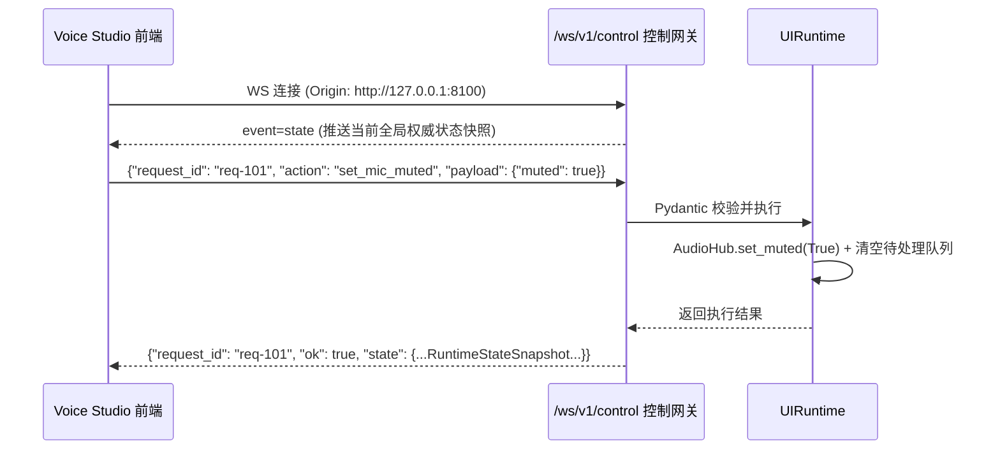

---

### 6.2 协议契约全景表

| 协议路由 / 接口 | 类型 | 核心作用 | 数据载荷 / 契约文件 |
|---|---|---|---|
| `GET /api/v1/health` | HTTP REST | 服务健康度探针 | 返回各模块健康状态与存储状态 |
| `GET /api/v1/meetings` | HTTP REST | 查询会议历史列表 | 支持分页与状态过滤 |
| `GET /api/v1/meetings/{id}/transcript` | HTTP REST | 获取单场会议完整转录 | 返回 `segments` 数组与版本号 |
| `POST /api/v1/meetings/{id}/speakers` | HTTP REST | 更新发言人名称映射 | 请求体包含 `speaker_key` 与 `custom_name` |
| `WS /ws/v1/control` | WebSocket JSON | 严格控制指令网关 | [`protocol.py`](file:///Users/hrygo/Documents/voice-realtime/src/voice_realtime/ui/protocol.py) 契约定义 |
| `WS /ws/v1/meetings` | WebSocket JSON | 会议实时转录与状态流 | [`events.py`](file:///Users/hrygo/Documents/voice-realtime/src/voice_realtime/meeting/events.py) 事件广播 |
| `WS /ws/subtitles` | WebSocket JSON | 实时字幕广播通道 | 全量快照 `lines` + `buffer_transcription` |
| `POST /v1/audio/speech` | HTTP POST | TTS 合成桥接 | OpenAI 兼容接口，响应 24kHz PCM 流 |
| `POST /api/v1/chat` | HTTP SSE | LM Studio 原生推理 | 原生 `message.delta` 与 `chat.end` 事件 |

---

## 7. 前端控制台架构设计（Voice Studio UI）

前端基于 **React 19 + TypeScript + Vite + Zustand** 构建，采用模块化组件树与单向数据流：

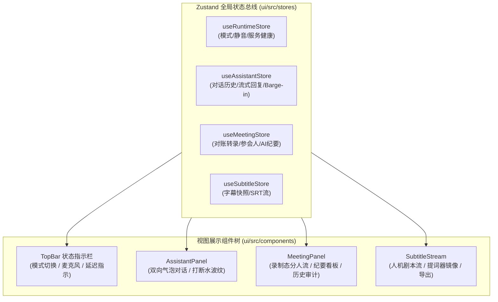

---

# 第三部分：系统横切与工程保障（总）

## 8. 容灾降级与边界隔离矩阵

```text
┌────────────────────────┬──────────────────────────────────┬──────────────────────────────────────────────────┐
│ 故障场景               │ 熔断与降级行为                   │ 恢复策略与数据一致性保障                         │
├────────────────────────┼──────────────────────────────────┼──────────────────────────────────────────────────┤
│ PostgreSQL 启动前不可写 │ 禁止开启新会议；报错 storage_unavailable│ 提示用户检查数据库连接；语音助手交互功能不受影响 │
├────────────────────────┼──────────────────────────────────┼──────────────────────────────────────────────────┤
│ 会议中数据库短暂断开   │ 激活 RecoveryJournal (0600 JSONL) │ 数据库恢复后自动执行幂等回放，回放成功后删除日志 │
├────────────────────────┼──────────────────────────────────┼──────────────────────────────────────────────────┤
│ WhisperLiveKit 异常断线│ SubtitleProxy 触发指数退避自动重连│ 重连后重放 PCM 活跃快照，补齐断线期转录，不丢字  │
├────────────────────────┼──────────────────────────────────┼──────────────────────────────────────────────────┤
│ 会议结束 EOF 冲刷超时  │ 30s 超时后标记 interrupted/timeout│ 封存已对账的所有 confirmed 片段，生成部分纪要    │
├────────────────────────┼──────────────────────────────────┼──────────────────────────────────────────────────┤
│ LM Studio 链断裂/异常  │ 捕获异常，阻断空链静默降级       │ 自动使用近期已验证的历史摘要预热新种子链并重试   │
└────────────────────────┴──────────────────────────────────┴──────────────────────────────────────────────────┘
```

---

## 9. 核心数据模型与存储规范

### PostgreSQL 关系模式 (`voice_realtime` Schema)

```sql
-- 1. 会议元数据主表
CREATE TABLE voice_realtime.meetings (
    id UUID PRIMARY KEY DEFAULT gen_random_uuid(),
    title VARCHAR(255) NOT NULL,
    status VARCHAR(32) NOT NULL, -- RECORDING / FINALIZING / COMPLETED / INTERRUPTED
    audio_source VARCHAR(64) NOT NULL DEFAULT 'microphone',
    language VARCHAR(32) NOT NULL DEFAULT 'Chinese',
    transcript_revision INTEGER NOT NULL DEFAULT 0,
    content_revision INTEGER NOT NULL DEFAULT 0,
    created_at TIMESTAMPTZ NOT NULL DEFAULT NOW(),
    updated_at TIMESTAMPTZ NOT NULL DEFAULT NOW(),
    completed_at TIMESTAMPTZ
);

-- 2. 确认转录片段表 (唯一事实源，无音频列)
CREATE TABLE voice_realtime.transcript_segments (
    id UUID PRIMARY KEY DEFAULT gen_random_uuid(),
    meeting_id UUID NOT NULL REFERENCES voice_realtime.meetings(id) ON DELETE CASCADE,
    speaker_key VARCHAR(64) NOT NULL,
    start_ms BIGINT NOT NULL,
    end_ms BIGINT NOT NULL,
    text TEXT NOT NULL,
    content_hash VARCHAR(64) NOT NULL,
    created_at TIMESTAMPTZ NOT NULL DEFAULT NOW()
);
CREATE INDEX idx_segments_meeting_time ON voice_realtime.transcript_segments(meeting_id, start_ms);

-- 3. 说话人自定义名称映射表
CREATE TABLE voice_realtime.speaker_identities (
    meeting_id UUID NOT NULL REFERENCES voice_realtime.meetings(id) ON DELETE CASCADE,
    speaker_key VARCHAR(64) NOT NULL,
    custom_name VARCHAR(128) NOT NULL,
    updated_at TIMESTAMPTZ NOT NULL DEFAULT NOW(),
    PRIMARY KEY (meeting_id, speaker_key)
);

-- 4. 结构化 AI 纪要表 (含证据 UUID 关联)
CREATE TABLE voice_realtime.meeting_minutes (
    id UUID PRIMARY KEY DEFAULT gen_random_uuid(),
    meeting_id UUID NOT NULL UNIQUE REFERENCES voice_realtime.meetings(id) ON DELETE CASCADE,
    status VARCHAR(32) NOT NULL, -- QUEUED / PROCESSING / COMPLETED / FAILED
    content JSONB,
    model_name VARCHAR(128) NOT NULL,
    created_at TIMESTAMPTZ NOT NULL DEFAULT NOW(),
    updated_at TIMESTAMPTZ NOT NULL DEFAULT NOW()
);
```

---

## 10. 性能基准与质量门禁

### 实测性能指标（Apple Silicon M-series 基准）

```text
┌───────────────────────────────────────────────┬───────────────────────────────┐
│ 关键性能指标 (KPI)                            │ 实测基准数据 (Benchmark)       │
├───────────────────────────────────────────────┼───────────────────────────────┤
│ SenseVoiceSmall STT 实时率 (RTF)              │ ~ 0.17                        │
│ LM Studio (Qwen3.6-35B-A3B) 首字时间 (TTFT)   │ 0.24s ~ 0.26s (Reasoning OFF) │
│ LM Studio 生成吞吐速率 (Throughput)           │ 97 ~ 113 tokens/sec           │
│ Qwen3-TTS 桥首包音频延迟 (TTFB)               │ < 280ms                       │
│ 语音交互端到端整体延迟 (End-to-End Latency)    │ < 600ms                       │
│ 窗口对账事务处理延迟 (Reconciliation Latency) │ < 15ms (PostgreSQL 本地执行)  │
└───────────────────────────────────────────────┴───────────────────────────────┘
```

### 严格代码质量门禁

```bash
# 1. 后端单元与集成测试（分支覆盖率 > 80%）
VR_TEST_DATABASE_URL=postgresql:///knowledge uv run pytest tests/

# 2. Python 严格类型检查（strict，src/ 全绿）
uv run mypy src/

# 3. Python 代码规范与 Lint
uv run ruff check src/ tests/

# 4. 前端单元测试
cd ui && npm test -- --run

# 5. 前端类型检查与构建
cd ui && npm run build
```
